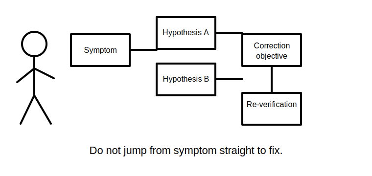
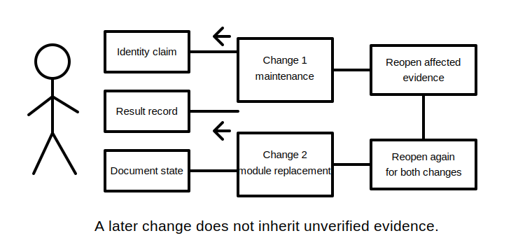
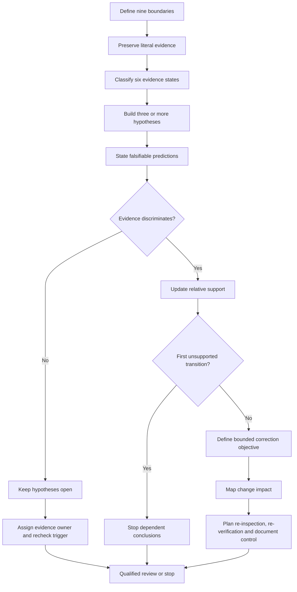
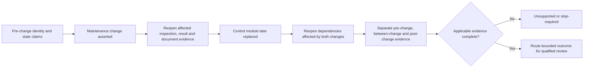

# Day 74 — Fault Diagnosis, Correction Reasoning and Re-Verification Planning

> **Scope boundary:** This module uses fictional supplied records to plan diagnosis, correction review and re-verification at a reasoning level. It does not teach or authorise site access, opening, switching, isolation, proving de-energised, testing, measurement, alteration, repair, energisation, commissioning, acceptance, certification or field fault finding.

## 1. Outcome and entry check

By the end, the learner can:

1. define the installation, equipment, circuit, source, operating-state, time, evidence, change and authority boundaries for a diagnostic brief;
2. classify each claim as a stated fact, derived fact, supported inference, assumption, contradiction or evidence gap;
3. keep symptom, observation, hypothesis, predicted evidence, cause claim, correction objective, correction claim and verified outcome distinct;
4. build at least three materially different hypotheses and state a falsifiable prediction for each;
5. identify the first unsupported transition in each diagnostic claim chain and stop dependent conclusions there;
6. rank evidence by its ability to discriminate between hypotheses rather than by familiarity or volume;
7. map a proposed correction objective to every affected design claim, identity, source state, record and dependency;
8. reopen the complete affected dependency set after each material change, including two sequential changes;
9. assign unresolved blockers an evidence owner and a specific recheck trigger; and
10. give independent `secure`, `developing`, `unsupported` or `stop-required` readiness states without claiming technical approval.

### Entry check

Without using a practical method, explain why all three statements can be true at once:

- a hypothesis is plausible;
- a proposed correction could remove the reported symptom; and
- the root cause, correction suitability and post-change acceptability remain unproven.

Record confidence separately as **guessing**, **unsure**, **reasonably confident** or **certain**. Confidence is a metacognitive judgement, not evidence.

## 2. Why it matters

Fault work is vulnerable to **premature closure**: a familiar symptom is matched to a familiar cause, a change is called a correction, and pre-change evidence is carried forward without checking what the change invalidated. This can produce a persuasive narrative that is not traceable.

Capstone-level reasoning therefore treats diagnosis and recovery as linked but separate evidence problems:

1. What was observed, where, when and under which operating state?
2. Which hypotheses remain possible, and what evidence would distinguish them?
3. What condition should a correction restore or establish?
4. Which claims and records become stale when a change occurs?
5. What must be re-inspected, re-verified or escalated before any qualified conclusion?

*The cards show why symptom, diagnosis, correction objective and re-verification must remain separate and traceable.*

*Each material change reopens affected claims; a second change does not inherit the first change's unverified assumptions.*

## 3. Core concepts and terminology

### Nine boundaries

- **Installation boundary:** the installation or defined part of it covered by the brief.
- **Equipment boundary:** the specific equipment, assembly or component identity under discussion.
- **Circuit boundary:** the conductors, protective device, control path and endpoints claimed to belong together.
- **Source boundary:** every normal, alternative, embedded, stored or control source relevant to the supplied evidence.
- **Operating-state boundary:** the configuration, load condition, control state and source state in which an observation was made.
- **Time boundary:** when evidence was created relative to symptoms, alterations and later changes.
- **Evidence boundary:** what an item directly establishes and what it does not establish.
- **Change boundary:** the physical, identification, configuration and documentary scope affected by a proposed or completed change.
- **Authority boundary:** what the learner may analyse versus what requires authorised practical action or qualified judgement.

### Six evidence states

- **Stated fact:** a literal statement preserved from a supplied item without adding interpretation.
- **Derived fact:** a result obtained transparently from supplied facts using a stated relationship.
- **Supported inference:** an interpretation supported by applicable evidence but still identified as an inference.
- **Assumption:** an unverified proposition temporarily used to organise reasoning.
- **Contradiction:** two applicable items or claims that cannot both be accepted without resolution.
- **Evidence gap:** information required for a claim but absent, unusable, stale or outside the stated boundary.

### Diagnostic and recovery terms

- **Symptom:** reported behaviour or condition that prompted investigation; it may be incomplete or second-hand.
- **Observation:** directly recorded information tied to an identity, state, time and source.
- **Hypothesis:** a provisional explanation capable of being supported, weakened or contradicted.
- **Prediction:** evidence expected if a hypothesis is true and, where possible, evidence expected not to occur.
- **Falsifiable:** capable of being contradicted by a possible observation or record.
- **Discriminating evidence:** evidence that changes the relative support for competing hypotheses.
- **Root-cause claim:** a conclusion that a particular causal mechanism explains the relevant events; it requires stronger support than plausibility.
- **Correction objective:** the condition a proposed change is intended to restore or establish, stated without assuming a field method.
- **Correction claim:** a statement that a change occurred or a symptom changed; it is not proof that the objective was achieved.
- **Verified outcome:** an outcome supported by applicable post-change evidence and qualified review within a stated boundary.
- **First unsupported transition:** the earliest unsupported link between evidence and conclusion; every dependent claim remains unsupported.
- **Change impact:** the identities, claims, records, states and dependencies affected by a material change.
- **Re-verification scope:** the evidence purposes and claims that must be reconsidered after change.
- **Evidence owner:** the authorised person, record custodian or source responsible for resolving a blocker.
- **Recheck trigger:** the exact evidence event that permits a blocked claim to be reconsidered.
- **Non-compensatory blocker:** a failure that cannot be averaged away by stronger performance elsewhere.

## 4. Rule-finding workflow

Use **R-E-C-O-V-E-R-Y**:

1. **R — Record boundaries and literal evidence.** State all nine boundaries. Preserve witness wording, labels, dates, revisions, source states and limitations without silently correcting them.
2. **E — Establish evidence states.** Classify facts, derived facts, inferences, assumptions, contradictions and gaps. Record provenance and applicability.
3. **C — Construct competing hypotheses.** Create at least three materially distinct hypotheses, each with a causal statement and falsifiable predictions.
4. **O — Order evidence by discrimination.** Prefer evidence that separates hypotheses. Do not count repeated versions of one weak assertion as independent support.
5. **V — Verify the correction objective.** Check the intended condition against design intent and current authorised sources; mark exact requirements `reference_check_required` until verified.
6. **E — Evaluate change impact.** Map affected identities, source states, design claims, inspection records, result records, documents and dependencies.
7. **R — Reopen and route dependencies.** After every material change, reopen all affected claims. If a second material change follows, propagate both changes through the dependency map rather than assuming the first review remains valid.
8. **Y — Yield bounded conclusions.** Stop at the first unsupported transition, assign blockers to evidence owners, define recheck triggers and state authority limits.

The diagram is an evidence-control workflow. It does not specify a practical test, repair or energisation sequence.

### Claim-chain discipline

Write each important conclusion as:

`evidence item → interpretation → hypothesis update → correction objective → change-impact decision → re-verification need`

Mark the first arrow lacking applicable support. Do not continue the chain as though later arrows were proven.

## 5. Visual model or worked example

### Fictional staged dossier

A training dossier concerns intermittent operation of a fixed extract fan. It contains:

- a current floor plan identifying the fan as **EF-2**;
- an older circuit schedule listing **EXF-1** on Circuit 12;
- a photograph showing a local label **EF-2 / C14**, with no date or photographer;
- a result sheet for Circuit 12 created before a switchboard alteration;
- an event log showing three interruptions, but only two include source-state information;
- a witness email saying “it stopped whenever the backup supply was running,” without identifying which two events were observed;
- a maintenance note stating “loose connection corrected,” with no location, authorisation, date or post-change evidence;
- a later control-module replacement recorded after the maintenance note; and
- a message saying the symptom has not been reported since, without a defined observation period.

### Boundary and evidence analysis

1. **Identity contradiction:** EF-2, EXF-1, Circuit 12 and C14 are not automatically the same equipment/circuit chain.
2. **Source-state gap:** one event lacks source-state evidence; conclusions must remain event-specific.
3. **Historical-evidence limit:** the Circuit 12 result sheet predates a material switchboard alteration.
4. **Weak correction claim:** “loose connection corrected” states an assertion, not a verified location, cause or outcome.
5. **Second-change effect:** the later control-module replacement reopens hypotheses and evidence affected by both changes.
6. **Observation-period gap:** absence of a later report is not equivalent to a defined, applicable verification outcome.

### Competing hypotheses

| Hypothesis | Falsifiable prediction | Current support | Current limitation |
|---|---|---|---|
| H1 — identity or documentation mismatch caused evidence to be assigned to the wrong circuit/equipment | independently controlled identity evidence will show at least one record belongs to a different boundary | conflicting labels and schedule | no controlled identity reconciliation |
| H2 — a connection-integrity issue contributed to one or more interruptions | applicable evidence tied to the relevant point, time and state will distinguish this from control or source causes | maintenance assertion | location, provenance and post-change evidence absent |
| H3 — control-module behaviour contributed to one or more interruptions | event-specific evidence will correlate the relevant control state with affected events and distinguish pre/post replacement behaviour | later module replacement | no complete event/control-state record |
| H4 — source configuration contributed to some but not all interruptions | complete event-specific source-state evidence will separate source-associated and non-source-associated events | partial log and witness assertion | event coverage and witness scope incomplete |

None is promoted to root cause. The available evidence supports further bounded review, not closure.

### Change-propagation model

The diagram shows why evidence must be partitioned by configuration period. A result from before either change cannot be silently transferred to the final configuration.

### Worked-example fading

Without copying the table above, produce a fresh analysis that:

1. defines all nine boundaries;
2. classifies at least ten claims across all six evidence states;
3. creates three competing hypotheses with falsifiable predictions;
4. identifies the first unsupported transition in each chain;
5. maps both sequential changes to affected evidence; and
6. assigns every unresolved blocker an evidence owner and recheck trigger.

## 6. Practical application

Prepare a **diagnostic recovery pack** containing:

1. a nine-boundary statement;
2. a literal symptom-and-observation ledger;
3. a six-state evidence ledger with provenance, date, revision, identity and applicability;
4. a competing-hypothesis matrix with predictions and disconfirming evidence;
5. a first-unsupported-transition register;
6. a correction-objective statement that does not prescribe a field method;
7. a two-change impact and dependency map;
8. a re-inspection, re-verification and document-control purpose map;
9. an evidence-owner and recheck-trigger register;
10. separate confidence and evidence-quality judgements; and
11. a bounded handover for qualified review.

### Independent readiness criteria

Evaluate each criterion separately:

| Criterion | `secure` | `developing` | `unsupported` | `stop-required` |
|---|---|---|---|---|
| Boundary control | all nine boundaries are explicit and internally consistent | minor omissions do not alter reasoning | a material identity, state, time or change boundary is unresolved | boundaries are invented, concealed or used to authorise practical action |
| Evidence-state control | literal evidence and all six states remain distinct | occasional imprecision is corrected | assumptions, contradictions or gaps materially contaminate a claim | evidence is altered, fabricated or deliberately misrepresented |
| Hypothesis control | three or more distinct hypotheses use falsifiable predictions and discriminating evidence | alternatives exist but predictions or ranking need refinement | one familiar explanation dominates without adequate comparison | root cause is declared from weak, contradictory or inapplicable evidence |
| Correction-objective control | objective is bounded and checked against design intent and authorised sources | objective is useful but a source or dependency remains open | a method is guessed before the required condition is established | unsafe practical instructions or unauthorised correction approval are given |
| Change and re-verification control | both sequential changes propagate through every affected claim and record | most impacts are found but one dependency needs correction | stale evidence is carried forward or change periods are mixed | correction is treated as verified acceptance or re-energisation authority |
| Safety and conclusion control | blockers, owners, triggers, uncertainty and authority limits are explicit | caveats exist but one conclusion is too broad | unsupported acceptance or competency language remains | compliance, certification, technical approval or practical authority is claimed |

A criterion is not improved by performance in another criterion. Any `stop-required` state blocks progression. An `unsupported` state in boundary, evidence, hypothesis, change/re-verification or safety control also blocks progression until remediated. These are educational planning states, not official grades, competency findings or technical-review outcomes.

## 7. Common errors and safety checkpoint

### Common errors

- converting a witness report into a technical observation;
- treating equipment or circuit labels as reconciled because they look similar;
- building several wordings of the same hypothesis rather than materially different alternatives;
- collecting confirming evidence without seeking discriminating or disconfirming evidence;
- equating symptom disappearance with root-cause proof;
- defining a correction by a guessed method instead of the required condition;
- transferring pre-change evidence into a post-change configuration;
- reopening only the most recent change while ignoring an earlier unresolved change;
- using confidence as a substitute for evidence quality; and
- hiding residual uncertainty in a fluent summary.

### Critical errors and stop conditions

Stop and remediate if the learner:

- invents, edits or silently reconciles evidence;
- prescribes site access, opening, switching, isolation, proving de-energised, testing, measurement, repair, alteration or energisation;
- invents exact acceptance values, official sequences, mandatory methods or assessor requirements;
- claims root cause beyond the first unsupported transition;
- treats a correction assertion or symptom absence as successful re-verification;
- fails to reopen evidence affected by either sequential material change;
- omits a material contradiction, source state or authority boundary; or
- claims compliance, certification, competency, acceptance or technical approval.

Exact diagnostic, correction, verification and acceptance duties, methods, sequences, instrument requirements, values, criteria, role permissions and official assessment expectations require current authorised standards, jurisdictional requirements, approved procedures and qualified technical review.

## 8. Retrieval and next links

1. Why is a symptom not an observation or a cause?
2. What makes two hypotheses materially different?
3. What makes a prediction falsifiable?
4. Why can repeated weak assertions fail to add independent support?
5. What is the first unsupported transition?
6. Why define a correction objective before selecting a method?
7. What evidence can a material change invalidate?
8. What must happen when a second material change follows the first?
9. What is the difference between a correction claim and a verified outcome?
10. Why are confidence and evidence quality recorded separately?

- **Plan:** [Twelve-Week Capstone Learning Plan](../MASTER_PLAN.md)
- **Knowledge note:** [[12-Week Day 74 - Fault Diagnosis, Correction Reasoning and Re-Verification Planning]]
- **Previous:** [Day 73 — Inspection, Testing and Documentation Integration](day-73-inspection-testing-and-documentation-integration.md)
- **Next:** [Day 75 — Rest, Retrieval and Weak-Domain Triage](day-75-rest-retrieval-and-weak-domain-triage.md)

This module remains `review-required`, `reference_check_required`, safety-critical and not `technically-reviewed`.