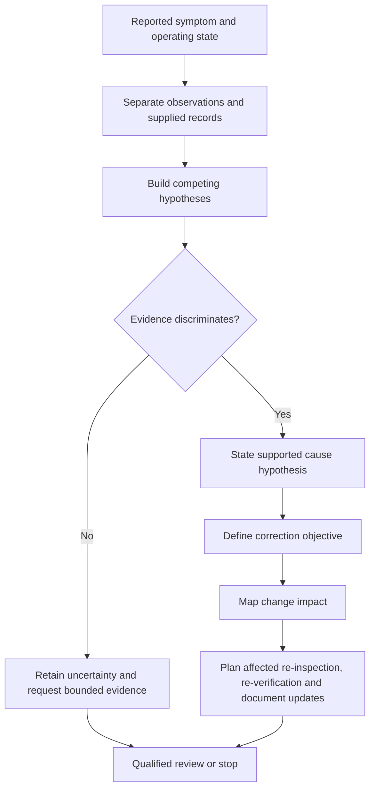

# Day 74 — Fault Diagnosis, Correction Reasoning and Re-Verification Planning

> **Scope boundary:** This module uses supplied records to plan diagnosis, correction review and re-verification at a reasoning level. It does not teach or authorise access, live work, testing, alteration, repair, energisation or certification.

## 1. Outcome and entry check

By the end, the learner can:

1. separate symptom, observation, evidence, hypothesis, likely cause, proposed correction and verified outcome;
2. rank competing hypotheses by explanatory power and evidence quality;
3. define a correction objective without prescribing an unsafe field method;
4. map each proposed correction to affected design claims, records and operating states;
5. identify evidence invalidated by the correction;
6. plan bounded re-inspection, re-verification and document-control needs;
7. retain unresolved contradictions and escalation points; and
8. produce a traceable diagnostic-and-recovery brief for qualified review.

### Entry check

Explain why finding a plausible cause does not prove that a proposed correction is appropriate or that the installation is acceptable afterward.

## 2. Why it matters

Fault work is often weakened by premature closure: one symptom is matched to one familiar cause, a correction is assumed, and earlier evidence is treated as still valid. Capstone-level reasoning must preserve the chain from evidence to hypothesis, correction objective and affected re-verification scope.

## 3. Core concepts and terminology

- **Symptom:** the reported behaviour or condition that prompted investigation.
- **Observation:** a directly recorded fact within a stated boundary.
- **Hypothesis:** a provisional explanation that can be supported, weakened or contradicted.
- **Discriminating evidence:** evidence that changes the relative likelihood of competing hypotheses.
- **Premature closure:** accepting one explanation before material alternatives and contradictions are addressed.
- **Correction objective:** the condition a correction is intended to restore or establish, stated without assuming a method.
- **Change impact:** the set of design claims, physical boundaries, documents and evidence affected by a proposed correction.
- **Re-verification scope:** the claims and evidence purposes that must be reconsidered after change.
- **Residual uncertainty:** uncertainty that remains after available evidence is reviewed.
- **Recovery brief:** a controlled summary of diagnosis, proposed objective, affected evidence, review needs and stop conditions.

## 4. Rule-finding workflow

Use **R-E-C-O-V-E-R-Y**:

1. **R — Record the symptom, context and operating state without interpretation.**
2. **E — Extract observations, records, contradictions and evidence limitations.**
3. **C — Compare at least two plausible hypotheses and their predictions.**
4. **O — Order hypotheses by discriminating evidence, not familiarity.**
5. **V — Verify the correction objective against design intent and authorised sources.**
6. **E — Establish the change impact on claims, records and dependencies.**
7. **R — Route affected claims into bounded re-inspection and re-verification planning.**
8. **Y — Yield unresolved uncertainty, authority limits and escalation points explicitly.**

The diagram is a reasoning and evidence-control model, not a practical fault-finding or repair procedure.

## 5. Visual model or worked example

### Fictional scenario

A supplied evidence pack reports intermittent operation of a fixed load. It contains an outdated circuit schedule, a photograph showing altered identification, a result record tied to an earlier source state and a note suggesting a loose connection without provenance.

Apply **R-E-C-O-V-E-R-Y**:

1. Record the intermittent symptom and stated operating state.
2. Treat the photograph and records as separate evidence items with different dates and limitations.
3. Compare at least two hypotheses: an identity/document mismatch and a connection-integrity problem.
4. The unproven note does not close the diagnosis.
5. Define the correction objective as restoring a traceable, correctly identified and evidenced arrangement—not “tighten the connection.”
6. Any physical correction or identification change may invalidate earlier inspection and result records.
7. Map the affected claims and route them for qualified re-inspection, re-verification and document update.
8. Preserve uncertainty where the source state or physical boundary cannot be established.

### Worked-example fading

A later record shows the symptom disappeared after an undocumented alteration. Independently explain why symptom disappearance is not proof of root cause, compliant correction or complete re-verification. Identify which records are now stale and what must be escalated.

## 6. Practical application

Prepare a **diagnostic recovery pack** containing:

1. symptom-and-context statement;
2. evidence ledger with provenance and limitations;
3. competing-hypothesis table;
4. contradiction register;
5. correction-objective statement;
6. change-impact map;
7. affected re-verification and document-control plan; and
8. bounded handover for qualified review.

### Assessment rubric

| Category | 0 | 1 | 2 |
|---|---|---|---|
| Evidence separation | Symptom treated as cause | Some separation | Symptom, observation, record and interpretation distinct |
| Hypothesis control | One familiar cause assumed | Alternatives listed | Competing hypotheses ranked by discriminating evidence |
| Correction reasoning | Method guessed | Objective partly stated | Objective tied to design intent and source checks |
| Change impact | Earlier evidence retained automatically | Some impacts found | Claims, states, records and dependencies reopened |
| Re-verification plan | “Retest” stated vaguely | Some purposes identified | Bounded purposes, records and escalation points mapped |
| Safety and conclusion | Practical authority or acceptance claimed | General caveat | Explicit stop conditions, uncertainty and qualified review |

A score of **10/12 or higher**, with no critical error, indicates readiness for Day 75. This is an educational progression threshold, not an official competency decision.

## 7. Common errors and safety checkpoint

### Common errors

- treating a reported symptom as an observed cause;
- selecting a familiar fault without competing hypotheses;
- describing a repair method before the correction objective is verified;
- assuming symptom disappearance proves successful correction;
- retaining pre-change evidence without impact review;
- using “retest everything” instead of mapping affected evidence purposes; and
- hiding residual uncertainty in a confident summary.

### Critical errors and stop conditions

Stop and remediate if the learner:

- prescribes practical access, live work, testing, repair or energisation;
- invents acceptance values, official sequences or mandatory methods;
- claims root cause from weak or contradictory evidence;
- treats an undocumented alteration as successful correction;
- fails to reopen evidence affected by change; or
- claims compliance, certification or technical approval.

This module grants no authority for practical diagnosis, correction, testing, energisation, certification or verification.

## 8. Retrieval and next links

1. What distinguishes a symptom from a hypothesis?
2. What makes evidence discriminating?
3. Why define a correction objective before a method?
4. What is change impact?
5. Why can a correction invalidate earlier evidence?
6. What belongs in a recovery brief?

- **Plan:** [Twelve-Week Capstone Learning Plan](../MASTER_PLAN.md)
- **Knowledge note:** [[12-Week Day 74 - Fault Diagnosis, Correction Reasoning and Re-Verification Planning]]
- **Previous:** [Day 73 — Inspection, Testing and Documentation Integration](day-73-inspection-testing-and-documentation-integration.md)
- **Next:** [Day 75 — Rest, Retrieval and Weak-Domain Triage](day-75-rest-retrieval-and-weak-domain-triage.md)

This module remains `review-required`, `reference_check_required`, safety-critical and not `technically-reviewed`.