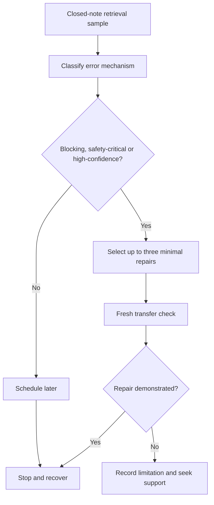

# Day 75 — Rest, Retrieval and Weak-Domain Triage

> **Scope boundary:** This is a deliberate recovery and remediation block. It adds no new electrical theory and authorises no practical electrical work.

## 1. Outcome and entry check

By the end, the learner can:

1. complete a 20–30 minute closed-note retrieval sample across recent domains;
2. distinguish knowledge gaps from reading, sequencing, confidence and fatigue errors;
3. rank weak domains by safety consequence, recurrence and prerequisite impact;
4. select no more than three targeted repairs;
5. define a stop condition for each repair;
6. avoid compensatory over-study before timed practice; and
7. record readiness for Day 76 without claiming competency.

### Entry check

State your current energy level, available time and the two domains most likely to disrupt an integrated response.

## 2. Why it matters

The day before independent timed work should reduce noise, not add content. Effective triage protects recovery while repairing the smallest number of weaknesses that could block safe, coherent performance.

## 3. Core concepts and terminology

- **Weak domain:** a topic or process whose retrieval is unreliable enough to disrupt later work.
- **Blocking error:** an error that prevents safe or coherent continuation.
- **High-confidence error:** an incorrect response given with strong confidence.
- **Error mechanism:** the reason an error occurred, such as missing knowledge, misread evidence, sequence loss or fatigue.
- **Triage:** prioritising limited repair effort by consequence and dependency.
- **Repair dose:** the smallest explanation and fresh retrieval task likely to correct the error.
- **Stop condition:** the point at which study ends to protect recovery.
- **Readiness note:** a bounded statement of strengths, open risks and next-day controls.

## 4. Rule-finding workflow

Use **T-R-I-A-G-E**:

1. **T — Time-box the session to 20–30 minutes.**
2. **R — Retrieve from memory before reopening notes.**
3. **I — Identify error mechanisms and confidence mismatches.**
4. **A — Arrange weaknesses by safety, recurrence and prerequisite impact.**
5. **G — Give no more than three weaknesses a minimal repair dose.**
6. **E — End at the stop condition and record readiness.**

The diagram controls study effort; it is not an electrical procedure.

## 5. Visual model or worked example

A learner misses four items: one due to a misread source state, one low-confidence terminology lapse, one repeated high-confidence evidence-transfer error and one calculation transcription slip.

Triage outcome:

1. repair the repeated high-confidence transfer error first;
2. repair the source-state reading error because it affects multiple workstreams;
3. use one short check for the transcription mechanism;
4. schedule the low-confidence terminology lapse later if time expires; and
5. stop when the time box ends, even if the notes are not “finished.”

### Worked-example fading

Classify your own recent errors without notes. For each selected repair, write the mechanism, one minimal explanation, one changed-context retrieval prompt and the stop condition.

## 6. Practical application

Produce a one-page **weak-domain triage sheet** containing:

1. retrieval sample score by domain;
2. confidence beside each response;
3. error-mechanism labels;
4. ranked risks;
5. no more than three repair cards;
6. fresh transfer results;
7. fatigue and time check; and
8. Day 76 readiness note.

### Assessment rubric

| Category | 0 | 1 | 2 |
|---|---|---|---|
| Retrieval honesty | Notes used immediately | Mixed closed/open recall | Closed-note sample completed first |
| Error diagnosis | Errors counted only | Some causes identified | Mechanisms and confidence calibrated |
| Prioritisation | Repairs everything | Partial ranking | Safety, recurrence and dependency drive triage |
| Repair quality | Rereads broadly | Some targeted work | Minimal repair plus fresh transfer |
| Recovery control | No limit | Limit stated | Time, fatigue and stop conditions followed |
| Readiness | Competency claimed | General reflection | Strengths, risks and controls bounded |

A score of **10/12 or higher**, with no critical error, indicates readiness for Day 76. This is not an official competency decision.

## 7. Common errors and safety checkpoint

### Common errors

- adding new theory because retrieval feels uncomfortable;
- repairing low-impact items before blocking errors;
- rereading instead of retrieving;
- treating every incorrect answer as a knowledge gap;
- continuing beyond the stop condition; and
- claiming readiness because confidence is high.

### Critical errors and stop conditions

Stop the session if fatigue is increasing errors, the time box expires, a safety-critical misconception remains unresolved, or the learner starts inventing technical values or procedures. Record the limitation and seek qualified support where required.

## 8. Retrieval and next links

1. What makes an error blocking?
2. Why are high-confidence errors prioritised?
3. What is a repair dose?
4. Why limit repairs to three?
5. What should a readiness note contain?

- **Plan:** [Twelve-Week Capstone Learning Plan](../MASTER_PLAN.md)
- **Knowledge note:** [[12-Week Day 75 - Rest, Retrieval and Weak-Domain Triage]]
- **Previous:** [Day 74 — Fault Diagnosis, Correction Reasoning and Re-Verification Planning](day-74-fault-diagnosis-correction-reasoning-and-re-verification-planning.md)
- **Next:** [Day 76 — Timed Integrated Scenario with Worked-Example Fading Removed](day-76-timed-integrated-scenario-with-worked-example-fading-removed.md)

This module remains `review-required`, `reference_check_required`, safety-critical and not `technically-reviewed`.