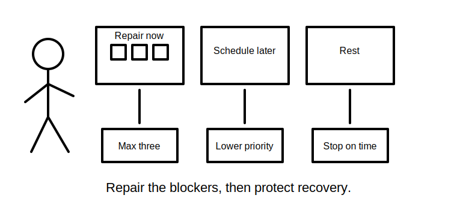
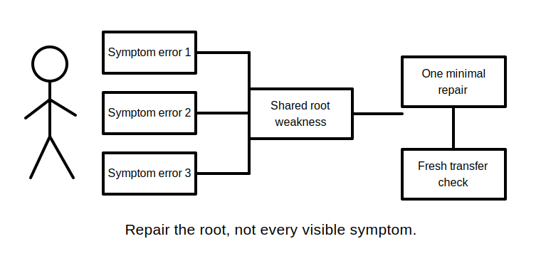
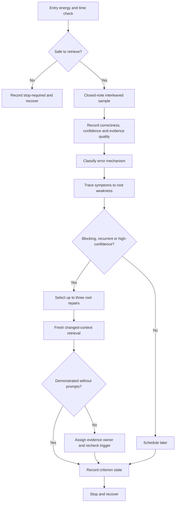
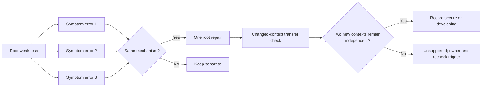

# Day 75 — Rest, Retrieval and Weak-Domain Triage

> **Scope boundary:** This is a deliberate recovery and remediation block. It adds no new electrical theory and authorises no practical electrical work.

## 1. Outcome and entry check

By the end, the learner can:

1. complete a closed-note retrieval sample within a fixed recovery-safe time box;
2. classify each miss as a knowledge, evidence-reading, sequencing, confidence, transcription or fatigue mechanism;
3. separate a root weakness from errors that merely depend on it;
4. rank weak domains using safety consequence, recurrence, prerequisite reach and evidence quality;
5. select no more than three minimal repairs without introducing new theory;
6. define an evidence owner, recheck trigger and stop condition for every unresolved blocker;
7. record confidence separately from correctness and evidence quality;
8. make independent `secure`, `developing`, `unsupported` or `stop-required` readiness decisions; and
9. produce a bounded Day 76 readiness note without claiming competency or technical approval.

### Entry check

Before starting, record:

- current energy as **steady**, **reduced** or **depleted**;
- the maximum available study time;
- any headache, agitation, repeated rereading or loss of concentration;
- the two domains most likely to disrupt an integrated response; and
- whether a safety-critical misconception is already known to be unresolved.

Use a **30-minute maximum** when energy is steady. Reduce the block to **15 minutes** when energy is reduced. When energy is depleted, or errors increase during the entry check, use `stop-required`: record the limitation and recover rather than testing endurance.

## 2. Why it matters

The day before independent timed work should reduce noise, not add content. Broad rereading can feel productive while concealing weak retrieval, and an aggregate score can hide one blocking misconception behind several easy successes. Effective triage protects recovery while repairing the smallest number of root weaknesses that could disrupt a safe, coherent response.

*The learner limits repair effort to the few errors with the greatest safety or dependency effect, then stops for recovery.*

*Several mistakes may share one root weakness; repairing the root avoids spending the recovery block on repeated symptoms.*

## 3. Core concepts and terminology

- **Weak domain:** a topic or reasoning process whose retrieval is unreliable enough to disrupt later work.
- **Root weakness:** the earliest misconception, missing distinction or process failure that generates later errors.
- **Symptom error:** a downstream mistake produced by a root weakness.
- **Blocking error:** an error that prevents safe or coherent continuation and cannot be averaged away.
- **High-confidence error:** an incorrect response given with strong confidence.
- **Error mechanism:** the reason an error occurred: missing knowledge, evidence misreading, sequence loss, confidence mismatch, transcription or fatigue.
- **Retrieval strength:** the ability to produce a usable answer without prompts or notes.
- **Evidence quality:** how well the available material supports a correction, including provenance, currency, applicability and completeness.
- **Repair dose:** the smallest existing explanation plus a fresh changed-context retrieval task likely to correct the root weakness.
- **Evidence owner:** the authorised person or source responsible for resolving an unresolved blocker.
- **Recheck trigger:** the specific evidence event that permits the blocker to be reconsidered.
- **Stop condition:** the point at which study ends to protect recovery or prevent unsupported reasoning.
- **Non-compensatory blocker:** a safety, identity, source-state, authority or evidence weakness that stronger performance elsewhere cannot offset.
- **Readiness note:** a bounded statement of demonstrated strengths, open risks, controls and next-day limits.
- **Educational readiness states:**
  - `secure`: the criterion is demonstrated independently with adequate evidence;
  - `developing`: the criterion is partly demonstrated and has a bounded repair;
  - `unsupported`: the available evidence does not support the criterion;
  - `stop-required`: fatigue, safety, authority or evidence conditions prohibit continuation.

Confidence is not correctness, and correctness is not evidence quality. Record all three separately.

## 4. Rule-finding workflow

Use **T-R-I-A-G-E**:

1. **T — Time-box and check fatigue.** Set 30 minutes maximum, reduce to 15 minutes when energy is reduced, and stop immediately when errors or rereading increase.
2. **R — Retrieve before reviewing.** Complete a short interleaved sample without notes; recognition after reopening notes does not count as retrieval.
3. **I — Identify mechanisms and evidence states.** Label each response as correct or incorrect, record confidence, then classify the mechanism and supporting evidence.
4. **A — Arrange roots before symptoms.** Trace dependent errors to the first root weakness and rank roots by safety consequence, recurrence and prerequisite reach.
5. **G — Give up to three minimal repairs.** Use only previously taught explanations, then require a fresh changed-context retrieval check.
6. **E — End, escalate and record readiness.** Stop at the time or fatigue boundary; assign unresolved blockers an evidence owner and recheck trigger.

The diagram controls learning effort only. It does not describe an electrical test, field procedure or competency decision.

A second check prevents downstream errors from being repaired repeatedly:

This model prevents a learner from treating several visible mistakes as unrelated when one prerequisite distinction is failing. Two changed contexts provide stronger educational evidence than repeating the original question, but they do not establish official competency.

## 5. Visual model or worked example

A learner completes a fictional closed-note sample and records six misses:

1. two responses silently assume the same source state;
2. one response confuses an observation with a conclusion;
3. one calculation contains a transcription slip;
4. one terminology item is missed with low confidence; and
5. one response invents an exact requirement because the learner cannot recall the authorised source.

### Step 1 — Preserve the misses

Do not immediately correct the answers. First record the literal response, confidence and available evidence. This avoids rewriting the learner's reasoning after seeing the correction.

### Step 2 — Find roots

The two source-state misses share one root weakness: the learner is not defining operating conditions before transferring evidence. The invented exact requirement is a separate non-compensatory blocker because unsupported exactness cannot be offset by correct answers elsewhere.

### Step 3 — Rank repairs

1. repair the unsupported exactness by restoring the authorised-source lookup boundary;
2. repair source-state definition because it affects multiple workstreams;
3. use one short transcription-control check;
4. schedule the low-confidence terminology lapse later; and
5. treat the observation/conclusion distinction as a fourth candidate only if one of the first three is resolved without exceeding the time box.

### Step 4 — Apply minimal doses

Each selected repair uses one already-taught explanation and one new prompt. No new electrical theory is introduced.

### Step 5 — Decide independently

- **Source-state control:** `developing` if one new context succeeds but a second still needs prompting.
- **Unsupported exactness control:** `secure` only when the learner refuses to invent the value and identifies the authorised evidence need.
- **Transcription control:** `secure` when the learner uses the check independently in a new example.
- **Overall continuation:** `stop-required` if fatigue rises, even when the three repairs appear successful.

No total score is calculated. One unresolved non-compensatory blocker prevents a readiness claim.

## 6. Practical application

Produce a one-page **weak-domain triage sheet** containing:

1. energy, time and stop-condition record;
2. a closed-note interleaved retrieval sample;
3. literal responses before correction;
4. correctness, confidence and evidence-quality fields;
5. error-mechanism labels;
6. root-to-symptom links;
7. ranked weak domains;
8. no more than three repair cards;
9. changed-context transfer results;
10. evidence owners and recheck triggers for unresolved blockers;
11. independent criterion states; and
12. a bounded Day 76 readiness note.

### Criterion-level readiness record

| Criterion | `secure` | `developing` | `unsupported` | `stop-required` |
|---|---|---|---|---|
| Recovery control | Time and fatigue limits followed independently | Limits stated but one prompt needed | No reliable limit evidence | Depleted energy or worsening errors |
| Retrieval honesty | Closed-note sample preserved before review | Minor prompting or one contaminated item | Recognition substituted for retrieval | Continued despite fatigue or unsafe invention |
| Mechanism diagnosis | Roots, symptoms and confidence mismatches distinguished | Most mechanisms distinguished | Errors merely counted | Safety-critical misconception concealed or normalised |
| Prioritisation | Safety, recurrence and prerequisite reach drive selection | Ranking partly justified | Repairs chosen by comfort or recency | Non-compensatory blocker ignored |
| Repair quality | Minimal existing explanation plus two changed contexts | One changed context succeeds | Broad rereading or original question repeated | New theory or unsupported procedure introduced |
| Readiness boundary | Strengths, risks, owners, triggers and limits recorded | One boundary incomplete | Competency inferred from confidence or score | Unsupported technical approval or practical authority claimed |

These states are educational planning labels, not official grades, competency determinations or technical findings.

### Non-compensatory blockers

Progress to Day 76 is not supported when any of the following remains:

- an unresolved safety-critical misconception;
- invented exact values, procedures or official requirements;
- hidden source-state, identity or authority assumptions;
- reasoning beyond the first unsupported transition;
- escalating fatigue or repeated rereading;
- a high-confidence error without a fresh transfer check; or
- a readiness claim based on an aggregate score.

## 7. Common errors and safety checkpoint

### Common errors

- adding new theory because retrieval feels uncomfortable;
- using the original question as the repair check;
- repairing several symptom errors instead of their shared root;
- treating confidence as evidence;
- treating one correct retry as mastery;
- prioritising easy or recent items over blocking weaknesses;
- broad rereading instead of minimal repair;
- exceeding three repairs;
- continuing beyond the time or fatigue boundary; and
- converting an educational readiness state into a competency claim.

### Safety checkpoint

Stop the session and record `stop-required` when fatigue is increasing errors, the time box expires, a safety-critical misconception remains unresolved, the learner begins inventing technical values or procedures, or an authority boundary is unclear.

The module authorises no site access, opening, switching, isolation, proving de-energised, testing, measurement, instrument use, alteration, repair, energisation, commissioning, acceptance, certification, verification or field fault finding.

Any technical correction still requires current authorised sources and qualified review. Recovery is part of safe preparation; continuing while depleted is not evidence of readiness.

## 8. Retrieval and next links

Answer without notes:

1. What distinguishes a root weakness from a symptom error?
2. Why can a non-compensatory blocker not be averaged away?
3. Why must confidence, correctness and evidence quality be recorded separately?
4. What makes a repair dose minimal?
5. Why use changed-context checks rather than repeating the original item?
6. What is an evidence owner?
7. What event should a recheck trigger describe?
8. When must the block become `stop-required`?
9. What can a readiness note claim, and what must it not claim?

- **Plan:** [Twelve-Week Capstone Learning Plan](../MASTER_PLAN.md)
- **Knowledge note:** [[12-Week Day 75 - Rest, Retrieval and Weak-Domain Triage]]
- **Previous:** [Day 74 — Fault Diagnosis, Correction Reasoning and Re-Verification Planning](day-74-fault-diagnosis-correction-reasoning-and-re-verification-planning.md)
- **Next:** [Day 76 — Timed Integrated Scenario with Worked-Example Fading Removed](day-76-timed-integrated-scenario-with-worked-example-fading-removed.md)

This module remains `review-required`, `reference_check_required`, safety-critical and not `technically-reviewed`.
