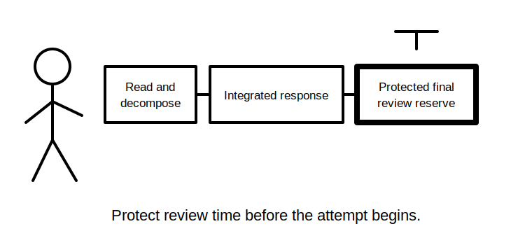
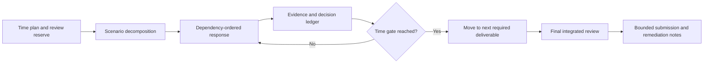

# Day 76 — Timed Integrated Scenario with Worked-Example Fading Removed

> **Scope boundary:** This module assesses independent document-based reasoning under a controlled time limit. It does not simulate or authorise field work, practical testing, repair, energisation, certification or formal assessment.

## 1. Outcome and entry check

By the end, the learner can:

1. allocate time across scenario reading, planning, response production and review;
2. independently decompose an integrated scenario without worked prompts;
3. produce a traceable design, inspection, verification and fault-reasoning response;
4. preserve assumptions, evidence gaps, contradictions and authority boundaries;
5. use authorised-source placeholders rather than inventing exact requirements;
6. apply stop rules when evidence or authority is insufficient;
7. complete a structured final review; and
8. identify the smallest remediation needs for Day 77.

### Entry check

Before starting, write the total time limit, review reserve, stop rules and the evidence artefacts you must produce.

## 2. Why it matters

Integrated assessment performance requires more than topic knowledge. The learner must control time, sequence, evidence and uncertainty without relying on a worked-example scaffold. Removing the scaffold reveals whether the underlying workflow can be reconstructed independently.

## 3. Core concepts and terminology

- **Time allocation:** a planned distribution of the available time across work stages.
- **Review reserve:** time protected for checking scope, traceability, contradictions and safety boundaries.
- **Independent reconstruction:** rebuilding the required workflow without step-by-step prompts.
- **Integrated response:** one coherent submission connecting design, inspection, verification, fault and documentation reasoning.
- **Decision ledger:** a record of significant decisions, evidence, assumptions and reopening triggers.
- **Source placeholder:** a marked location where an exact authorised requirement must be checked rather than invented.
- **Stop rule:** a condition that prevents an unsupported or unsafe conclusion.
- **Completion discipline:** ending each required deliverable at an adequate, reviewable level rather than overworking one section.

## 4. Rule-finding workflow

Use **P-E-R-F-O-R-M**:

1. **P — Protect a final review reserve before beginning.**
2. **E — Extract tasks, facts, constraints, states and evidence gaps.**
3. **R — Route work into dependency-ordered streams.**
4. **F — Form bounded decisions using traceable evidence and source placeholders.**
5. **O — Observe time gates and move on when a section is adequate.**
6. **R — Reconcile contradictions, changes and re-verification triggers.**
7. **M — Make the final scope, safety and completeness review.**

The diagram is a study and assessment-management model, not an official assessment format or electrical work sequence.

## 5. Visual model or worked example

### Independent fictional scenario

Use an original scenario pack containing:

- a small installation extension with a fixed load and motor load;
- an alternate supply shown on one revised drawing but omitted from an older schedule;
- environmental and access constraints;
- supplied design calculations with one provenance gap;
- inspection observations and test-purpose records from different dates;
- an intermittent symptom reported after an undocumented change; and
- a request for a design response, evidence review, fault hypothesis and re-verification plan.

No worked solution or mnemonic prompts are displayed during the attempt. The learner must produce:

1. scenario brief and assumptions register;
2. dependency map;
3. design-decision ledger;
4. evidence coverage matrix;
5. contradiction register;
6. competing-hypothesis table;
7. correction objective and change-impact map;
8. bounded re-verification plan; and
9. final limitations and escalation summary.

### Fading removed

The learner receives only the scenario, deliverables, time limit and safety boundary. After submission, compare the response against the workflow names from Days 71–74 and identify omitted stages without rewriting the attempt.

## 6. Practical application

Run a **90-minute educational simulation**:

- 10 minutes: read, decompose and allocate time;
- 60 minutes: complete the required response artefacts;
- 10 minutes: reconcile contradictions and dependencies;
- 10 minutes: protected final review.

These times are an original study design, not an official RTO assessment duration.

### Assessment rubric

| Category | 0 | 1 | 2 |
|---|---|---|---|
| Scope and time control | Scope missed or no review | Partial control | All deliverables planned with protected review |
| Independent workflow | Waits for prompts | Some stages reconstructed | Coherent dependency-ordered workflow rebuilt |
| Technical reasoning | Unsupported answers | Mixed traceability | Decisions bounded by evidence and source checks |
| Evidence integration | Records accepted at face value | Some gaps found | Provenance, state, contradictions and coverage controlled |
| Fault and recovery reasoning | Cause or fix guessed | Alternatives considered | Hypotheses, objective, impact and re-verification linked |
| Safety and communication | Authority or compliance claimed | General caveat | Stop rules, limitations and escalation explicit |

A score of **10/12 or higher**, with no critical error, supports progression to the Day 77 conference. It is not an official pass mark or competency determination.

## 7. Common errors and safety checkpoint

### Common errors

- spending too long on the first calculation or design choice;
- beginning technical solving before scenario decomposition;
- inventing exact values when an authorised-source check is missing;
- treating supplied records as mutually consistent;
- collapsing symptom, hypothesis, correction and verified outcome;
- sacrificing the review reserve; and
- hiding unfinished work instead of marking a limitation.

### Critical errors and stop conditions

Stop or mark the response blocked if the scenario requires unavailable authorised information, an operating state cannot be established, evidence identity is materially uncertain, or practical authority would be required. Do not invent procedures, values, acceptance decisions or practical actions to complete the paper.

## 8. Retrieval and next links

1. Why protect review time before starting?
2. What does independent reconstruction test?
3. When should a source placeholder be used?
4. What is completion discipline?
5. Which contradictions must survive into the final response?
6. What evidence should guide Day 77 remediation?

- **Plan:** [Twelve-Week Capstone Learning Plan](../MASTER_PLAN.md)
- **Knowledge note:** [[12-Week Day 76 - Timed Integrated Scenario with Worked-Example Fading Removed]]
- **Previous:** [Day 75 — Rest, Retrieval and Weak-Domain Triage](day-75-rest-retrieval-and-weak-domain-triage.md)
- **Next:** [Day 77 — Week 11 Competency Conference and Targeted Remediation](day-77-week-11-competency-conference-and-targeted-remediation.md)

This module remains `review-required`, `reference_check_required`, safety-critical and not `technically-reviewed`.
