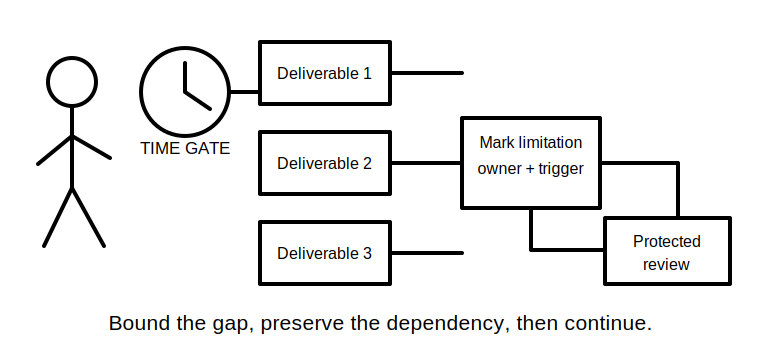
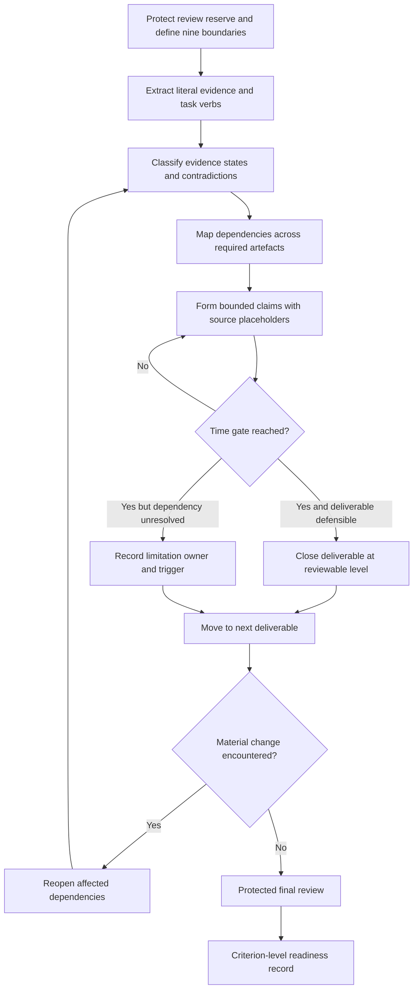
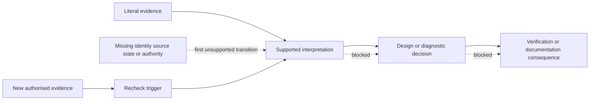

# Day 76 — Timed Integrated Scenario with Worked-Example Fading Removed

> **Scope boundary:** This module assesses independent document-based reasoning under an original educational time limit. It does not simulate, instruct or authorise site access, opening, switching, isolation, proving de-energised, testing, measurement, instrument use, alteration, repair, energisation, commissioning, acceptance, certification, verification or field fault finding.

## 1. Outcome and entry check

By the end, the learner can:

1. define the installation, equipment, circuit, source, operating-state, time, evidence, authority and requested-decision boundaries before solving;
2. allocate the available time across decomposition, dependency planning, response production, contradiction control and protected review;
3. reconstruct the integrated workflow without worked prompts, hidden hints or mnemonic headings in the scenario pack;
4. preserve literal facts, derived facts, supported inferences, assumptions, contradictions and evidence gaps as separate claim types;
5. produce a traceable set of design, inspection, verification, fault-reasoning and documentation artefacts;
6. stop each dependent claim at its first unsupported transition and assign an evidence owner plus recheck trigger;
7. reopen affected conclusions after each material scenario change rather than carrying stale reasoning forward;
8. finish every required deliverable at a bounded reviewable level instead of overworking one section; and
9. record criterion-level readiness for Day 77 without claiming competency, technical approval or compliance.

### Entry check

Before opening the fictional scenario pack, write:

- the total educational time limit;
- the protected review reserve;
- the nine boundaries listed above;
- the required response artefacts;
- the conditions that force `stop-required`; and
- the rule that confidence, correctness and evidence quality are recorded separately.

Do not begin technical reasoning until these controls are visible.

## 2. Why it matters

Integrated performance can appear strong while still containing one decisive weakness: an unidentified source, a stale record, an unsupported interpretation, an omitted dependency or an authority assumption. A total score can hide that weakness. This module therefore tests whether the learner can manage time **and** preserve evidence discipline when the worked-example scaffold is removed.

*The existing original cartoon shows that review time is reserved before solving begins, not taken from whatever time happens to remain.*

*The second original cartoon reinforces bounded completion: mark the limitation, preserve the dependency and continue rather than silently abandoning later deliverables.*

## 3. Core concepts and terminology

- **Scenario boundary:** the defined edge of the installation, equipment, circuit, source, operating state, time period, evidence set, authority and decision being considered.
- **Time allocation:** a planned distribution of the available time across required work stages.
- **Review reserve:** time protected from the start for checking scope, traceability, contradictions, changes, safety boundaries and unfinished work.
- **Independent reconstruction:** rebuilding a known reasoning workflow without step-by-step prompts.
- **Integrated response:** one coherent submission connecting design, inspection, verification, fault, change-impact and documentation reasoning.
- **Literal fact:** information stated directly in the supplied scenario evidence.
- **Derived fact:** a result produced transparently from identified inputs and a stated method.
- **Supported inference:** an interpretation that follows from identified evidence but is not stated directly.
- **Assumption:** a temporary proposition used because required evidence is missing; it must be labelled and bounded.
- **Contradiction:** two or more items that cannot all describe the same boundary and state without further explanation.
- **Evidence gap:** information needed for a claim but absent, incomplete, stale, ambiguous or inapplicable.
- **Decision ledger:** a record of each significant decision, its evidence, claim type, confidence, dependencies and reopening trigger.
- **Evidence owner:** the authorised person, record or source responsible for resolving an open gap.
- **Recheck trigger:** the specific new evidence or clarification that permits reconsideration of a blocked claim.
- **First unsupported transition:** the earliest step in a claim chain that is not adequately supported; every dependent conclusion after that point remains blocked.
- **Material change:** a change to identity, configuration, source, operating state, route, environment, protective arrangement, equipment or evidence that could alter a conclusion.
- **Source placeholder:** a marked location where an exact authorised requirement must be checked rather than invented.
- **Time gate:** a pre-planned point when the learner either closes a deliverable at a reviewable level or records its limitation and moves on.
- **Bounded completion:** finishing the defensible portion of a deliverable while clearly marking unresolved dependencies.
- **Non-compensatory blocker:** a safety, identity, source-state, authority or evidence weakness that cannot be offset by stronger work elsewhere.
- **Educational readiness states:** `secure`, `developing`, `unsupported` and `stop-required`; these are planning states, not official grades or competency decisions.

### Evidence states

Classify each material claim as one of the following:

1. **verified for this scenario boundary** — identity, state, time and provenance are sufficiently established for the educational claim;
2. **supported but limited** — useful evidence exists, but one or more limitations must remain visible;
3. **conflicting** — relevant evidence disagrees and the conflict is unresolved;
4. **stale or superseded** — the evidence predates a material change or has been replaced;
5. **not applicable** — the evidence concerns a different installation, circuit, source, state, time or decision; or
6. **missing** — the required evidence is absent.

These labels describe evidence handling only. They are not technical findings or compliance decisions.

## 4. Rule-finding workflow

Use **P-E-R-F-O-R-M**:

1. **P — Protect the review reserve and define boundaries.** Record the nine scenario boundaries, required artefacts, time gates and stop conditions before solving.
2. **E — Extract literal evidence.** Separate task verbs, deliverables, constraints, facts, dates, identifiers, source states, changes, contradictions and gaps without interpretation.
3. **R — Route dependencies.** Map which design, inspection, verification, diagnostic and documentation claims depend on which evidence.
4. **F — Form bounded claims.** Label each claim type, preserve source placeholders and stop at the first unsupported transition.
5. **O — Observe time gates.** Close an adequate deliverable, or mark its unresolved limitation and move on; do not consume the review reserve.
6. **R — Reopen after change.** For every material change, identify and reassess all dependent calculations, interpretations, hypotheses, correction claims and verification plans.
7. **M — Make the final integrated review.** Check coverage, contradictions, evidence states, owners, triggers, authority boundaries, unfinished work and readiness states.

The diagram shows a timed reasoning loop. A time gate does not authorise guessing: it requires either bounded completion or an explicit limitation. A material change returns the learner to evidence classification and dependency review.

This claim-chain model shows why later sections cannot repair an earlier unsupported transition. New evidence may reopen the chain, but stronger wording or higher confidence cannot.

## 5. Visual model or worked example

### Independent fictional scenario pack

The learner receives an original document pack about a small workshop extension. It contains:

- a fixed heating load and a motor-driven extraction load;
- drawing `REV-C` showing an alternate supply connection, while an older schedule omits that source;
- two circuit identifiers used for what may or may not be the same final subcircuit;
- environmental and access constraints described differently in a site note and design brief;
- supplied calculations with one missing author/date record and one input that cannot be tied to the current route;
- inspection observations from before a later equipment relocation;
- test-purpose and result records from different dates and incompletely stated operating states;
- an intermittent symptom reported after an undocumented control change;
- a later note saying the control module was replaced, without a complete post-change evidence set; and
- a request for a design response, evidence review, competing fault hypotheses, change-impact map and bounded re-verification plan.

The scenario does **not** provide an official solution, clause list, acceptance value, practical procedure or assessment marking guide.

### Required artefacts

Produce all nine artefacts:

1. **scenario brief and boundary register** — requested decisions, exclusions and the nine boundaries;
2. **literal evidence table** — source, date, identifier, operating state and evidence state;
3. **dependency map** — which conclusions rely on which evidence;
4. **design-decision ledger** — options, selected bounded position, assumptions and source placeholders;
5. **inspection and verification coverage matrix** — what each record can and cannot support;
6. **contradiction and change register** — conflict, affected claims, owner and trigger;
7. **competing-hypothesis table** — at least three materially distinct hypotheses with predictions and discriminating evidence;
8. **correction-objective and re-verification map** — objective, proposed evidence need, changed dependencies and limitations; and
9. **final limitations, escalation and readiness summary** — criterion states without a competency claim.

### Worked-example fading removed

During the attempt, the learner sees only:

- the fictional evidence pack;
- the nine deliverables;
- the educational time limit;
- the scope and safety boundary; and
- blank response templates without workflow mnemonics or guiding questions.

After submission, compare the attempt against Days 71–74. Do not rewrite the timed attempt. Mark omissions, unsupported transitions and time-control failures in a separate Day 77 conference record so the evidence of independent performance remains intact.

### Two-change propagation check

The scenario contains two sequential material changes: an equipment relocation and a later control-module replacement. The learner must show which earlier observations, calculations, hypotheses and verification claims become stale or require reopening after each change. Treating the second change as isolated from the first is an integration error.

## 6. Practical application

Run one **90-minute educational simulation**:

- **10 minutes — control and decomposition:** define boundaries, protect review time, list deliverables and extract literal evidence;
- **15 minutes — evidence and dependency map:** classify evidence, contradictions, changes and claim dependencies;
- **45 minutes — response production:** complete all nine artefacts to a bounded reviewable level;
- **10 minutes — change and contradiction reconciliation:** reopen dependencies after both material changes; and
- **10 minutes — protected final review:** check coverage, unsupported transitions, owners, triggers, authority and readiness states.

These times are an original study design, not an official RTO or regulator assessment duration.

### Time-gate rules

At each gate:

1. state what is complete;
2. state what remains unresolved;
3. identify the earliest unsupported transition;
4. assign an evidence owner and recheck trigger where needed;
5. preserve any affected dependency in later artefacts; and
6. move on without consuming the protected final review.

Do not hide missing work, invent exactness or convert an assumption into a fact merely to make a section look complete.

### Criterion-level review

Assess each criterion independently:

| Criterion | `secure` | `developing` | `unsupported` | `stop-required` |
|---|---|---|---|---|
| Boundary and task control | All requested decisions and nine boundaries are explicit | Minor omissions do not change the reasoning boundary | Material boundary remains ambiguous | Identity, source, state, authority or requested decision is unsafe or unknowable |
| Time and completion control | Review reserve protected; every artefact bounded and reviewable | One gate slipped but coverage and review survived | Multiple artefacts unfinished or limitations hidden | Review reserve lost and a non-compensatory blocker was guessed through |
| Evidence discipline | Literal evidence, claim types and six evidence states are consistently separated | Isolated classification errors are visible and correctable | Provenance, applicability or contradiction control is materially incomplete | Evidence is fabricated, silently transferred or treated as current despite a known material change |
| Dependency and change control | First unsupported transitions and both change propagations are explicit | Most dependencies are mapped; one secondary link is incomplete | Dependent claims continue beyond unsupported transitions | A safety-critical or authority-dependent conclusion is carried forward after its basis fails |
| Integrated technical reasoning | Design, inspection, verification and diagnostic claims remain bounded and traceable | Reasoning is mostly coherent but needs targeted remediation | Multiple streams are disconnected or based on unresolved assumptions | Exact requirements, procedures, values, acceptance or compliance are invented |
| Communication and escalation | Owners, triggers, limitations and escalation are precise | Escalation is present but not consistently linked to blockers | Open gaps lack owners or recheck triggers | The response claims competency, technical approval, successful correction or compliance |

### Readiness rule

Day 77 preparation may proceed only when:

- no criterion is `stop-required`;
- no non-compensatory blocker is `unsupported`;
- every unresolved material claim has an owner and recheck trigger; and
- the attempt is preserved for review rather than rewritten.

A `developing` state creates a targeted remediation item. An `unsupported` non-blocking item creates an evidence task. These states are not official grades, pass marks or competency decisions.

## 7. Common errors and safety checkpoint

### Common errors

- solving before defining installation, circuit, source, operating-state and authority boundaries;
- reading task verbs as background rather than deliverables;
- treating two similar identifiers as proof of one circuit;
- using a historical result after a material change without reopening its applicability;
- confusing confidence with correctness or evidence quality;
- spending excessive time perfecting one calculation while later artefacts remain blank;
- sacrificing the protected review reserve;
- converting assumptions into facts to make the response appear complete;
- listing hypotheses that make the same prediction and therefore do not discriminate;
- claiming a correction succeeded because a symptom was not reported for an undefined period;
- omitting evidence owners and recheck triggers; and
- averaging a safety or authority blocker into an overall score.

### Critical errors and stop conditions

Set `stop-required` and preserve the blocked response when any of the following occurs:

- the installation, circuit, equipment, source or operating state cannot be identified sufficiently for the requested claim;
- the evidence pack requires practical authority, testing or access that the exercise does not grant;
- an exact clause, limit, value, sequence, instrument requirement, acceptance criterion or official assessment condition is unavailable;
- a dependent conclusion continues beyond the first unsupported transition;
- evidence is fabricated, silently altered or transferred between different boundaries;
- a known material change is ignored;
- a safety-critical limitation is hidden to complete the paper; or
- the response claims compliance, competency, certification, successful correction or qualified technical approval.

Use a source placeholder, evidence owner, recheck trigger or escalation note instead. Do not invent practical actions or authoritative conclusions.

## 8. Retrieval and next links

1. Why must the nine boundaries be recorded before technical solving?
2. What is the difference between bounded completion and unfinished work hidden by confident wording?
3. How does a time gate protect coverage without authorising a guess?
4. What is the first unsupported transition in a claim chain?
5. Why must both sequential material changes reopen dependent reasoning?
6. Which evidence states prevent stale or inapplicable records from being treated as current?
7. Why can a non-compensatory blocker not be offset by stronger performance elsewhere?
8. What evidence should be carried unchanged into the Day 77 conference?

- **Plan:** [Twelve-Week Capstone Learning Plan](../MASTER_PLAN.md)
- **Knowledge note:** [[12-Week Day 76 - Timed Integrated Scenario with Worked-Example Fading Removed]]
- **Previous:** [Day 75 — Rest, Retrieval and Weak-Domain Triage](day-75-rest-retrieval-and-weak-domain-triage.md)
- **Next:** [Day 77 — Week 11 Competency Conference and Targeted Remediation](day-77-week-11-competency-conference-and-targeted-remediation.md)

This module remains `review-required`, `reference_check_required`, safety-critical and not `technically-reviewed`. Exact technical requirements and official assessment conditions require current authorised sources and qualified review.