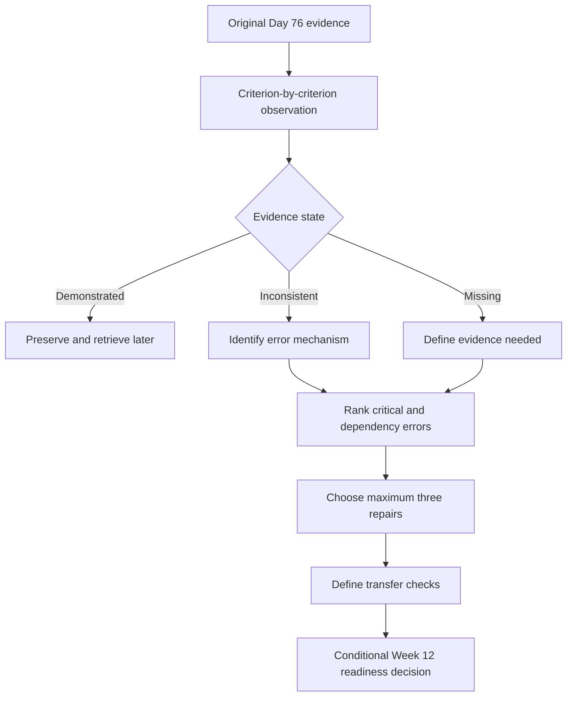

# Day 77 — Week 11 Competency Conference and Targeted Remediation

> **Scope boundary:** This is an educational evidence conference and remediation-planning block. It does not determine formal competency, authorise electrical work, replace an RTO assessment, or provide technical approval.

## 1. Outcome and entry check

By the end, the learner can:

1. present the Day 76 attempt as evidence rather than defend it as a finished product;
2. distinguish demonstrated capability, inconsistent capability and missing evidence;
3. identify critical errors, dependency errors and lower-priority presentation errors;
4. calibrate confidence against observable performance;
5. select no more than three remediation targets;
6. define a measurable repair task and transfer check for each target;
7. preserve technical-review and authorised-source boundaries; and
8. produce a Week 12 readiness decision with explicit conditions.

### Entry check

Bring the untouched Day 76 submission, its rubric, time record, contradiction register, source placeholders and error log. Do not revise the attempt before the conference.

## 2. Why it matters

A timed attempt is useful only when its evidence is interpreted accurately. A conference prevents two common distortions: treating one strong answer as proof of broad readiness, or treating one poor section as proof that nothing was learned. The purpose is to convert performance evidence into a small, testable remediation plan.

## 3. Core concepts and terminology

- **Evidence conference:** a structured discussion that interprets submitted work against stated criteria.
- **Demonstrated capability:** a skill shown clearly, independently and with traceable reasoning.
- **Inconsistent capability:** a skill shown correctly in some places but omitted, contradicted or weakly applied elsewhere.
- **Missing evidence:** a criterion for which the submission does not provide enough information to judge performance.
- **Critical error:** an error that breaches a safety boundary, invents an exact requirement, exceeds authority or invalidates a major conclusion.
- **Dependency error:** an upstream mistake that causes several later errors.
- **Confidence calibration:** aligning self-rated certainty with the quality of observable evidence.
- **Remediation target:** a defined weakness selected for focused repair.
- **Transfer check:** a changed-context task used to show that the repair generalises beyond the original question.
- **Conditional readiness:** progression permitted only when stated repair or review conditions are met.

## 4. Rule-finding workflow

Use **C-O-N-F-E-R**:

1. **C — Collect** the original attempt, rubric, timing record and evidence artefacts.
2. **O — Observe** what is actually present without inferring hidden knowledge.
3. **N — Name** each criterion as demonstrated, inconsistent or missing.
4. **F — Find** critical and dependency errors before cosmetic weaknesses.
5. **E — Establish** up to three measurable remediation targets and transfer checks.
6. **R — Record** the readiness decision, conditions, review flags and next action.

The diagram shows an educational evidence-review process. It is not an official competency-assessment model.

## 5. Visual model or worked example

### Fictional conference extract

A learner completed most Day 76 artefacts but:

- used one exact technical value without an authorised source;
- identified an alternate-supply contradiction but did not reopen affected conclusions;
- produced a strong competing-hypothesis table; and
- omitted the final limitations summary after exceeding the time gate.

Classify the evidence:

| Observation | Evidence state | Reason |
|---|---|---|
| Competing hypotheses are distinct and evidence-linked | Demonstrated | Independent and traceable across the submission |
| Change-impact reasoning appears once but is not propagated | Inconsistent | The skill is present but not applied reliably |
| Final limitations summary absent | Missing evidence | The required artefact is unavailable for judgement |
| Exact unsourced value used | Critical error | It crosses the source and technical-review boundary |

Select three repairs only:

1. replace unsupported exactness with a source placeholder and bounded statement;
2. practise propagating one changed fact through every affected decision;
3. rehearse a five-minute final limitations review under a short time limit.

Each repair ends with a changed-context transfer check. Rewriting the original answer alone is not sufficient.

## 6. Practical application

Run a **45–60 minute educational conference**:

1. **10 minutes — learner evidence summary:** state what was attempted, unfinished and uncertain.
2. **15 minutes — criterion review:** classify evidence without changing the submission.
3. **10 minutes — error hierarchy:** identify critical, dependency and presentation errors.
4. **10 minutes — remediation design:** define up to three repair tasks and transfer checks.
5. **5–15 minutes — readiness record:** document progression conditions and the Day 78 focus.

### Conference record

For each target, record:

- observed evidence;
- error mechanism;
- consequence;
- minimal repair task;
- authorised source or reviewer needed;
- transfer check;
- completion evidence; and
- deadline or next scheduled block.

### Assessment rubric

| Category | 0 | 1 | 2 |
|---|---|---|---|
| Evidence use | Claims ability without evidence | Refers generally to the attempt | Uses specific artefacts and criteria |
| Classification | Pass/fail judgement only | Some distinctions made | Demonstrated, inconsistent and missing evidence separated |
| Error hierarchy | Cosmetic issues dominate | Some prioritisation | Critical and dependency errors addressed first |
| Remediation | Vague study intention | Repair task defined | Maximum three measurable repairs with transfer checks |
| Confidence | Uncalibrated certainty | Partial reflection | Confidence matched to evidence quality |
| Safety and review boundary | Competency or authority claimed | General caveat | Conditional readiness and review needs explicit |

A score is a learning indicator only. It is not a formal competency result or official pass mark.

## 7. Common errors and safety checkpoint

### Common errors

- editing the original attempt before evidence classification;
- rewarding fluent explanations that are absent from the submitted work;
- treating missing evidence as automatic proof of incompetence;
- selecting too many remediation targets;
- repairing surface wording while leaving the dependency error intact;
- using confidence as a substitute for traceability; and
- describing Week 12 progression as qualified approval.

### Critical errors and stop conditions

Stop the conference and record a blocker if the evidence depends on an unavailable authorised source, the learner proposes practical activity outside authority or supervision, a safety-critical claim cannot be bounded, or a reviewer is being asked to approve content outside their competence. Do not convert automated educational material into a technical sign-off.

## 8. Retrieval and next links

1. What distinguishes inconsistent capability from missing evidence?
2. Why are dependency errors prioritised before presentation errors?
3. What makes a remediation target measurable?
4. Why must the original attempt remain unchanged during classification?
5. What does a transfer check demonstrate?
6. When should Week 12 readiness remain conditional?

- **Plan:** [Twelve-Week Capstone Learning Plan](../MASTER_PLAN.md)
- **Knowledge note:** [[12-Week Day 77 - Week 11 Competency Conference and Targeted Remediation]]
- **Previous:** [Day 76 — Timed Integrated Scenario with Worked-Example Fading Removed](day-76-timed-integrated-scenario-with-worked-example-fading-removed.md)
- **Next:** Day 78 — Mock Preparation, Time Allocation and Stop-Rule Rehearsal

This module remains `review-required`, `reference_check_required`, safety-critical and not `technically-reviewed`.