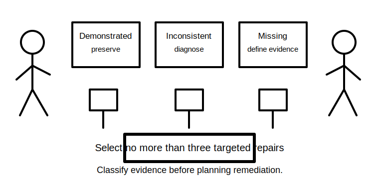
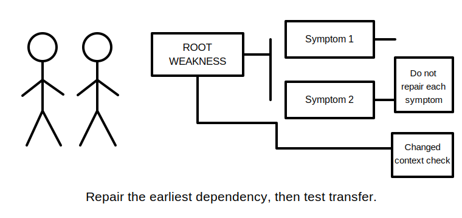
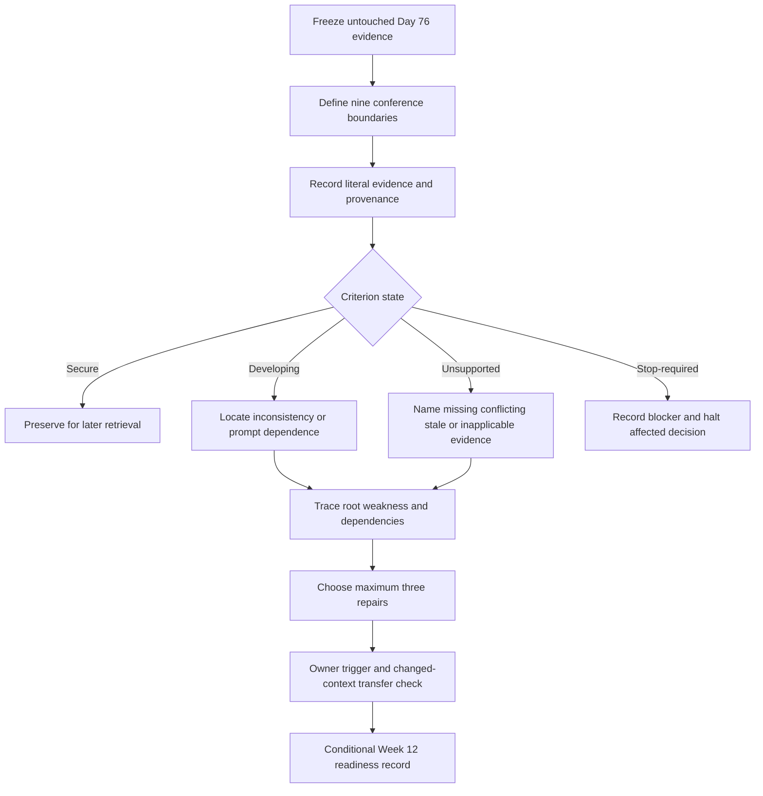
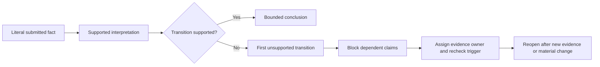

# Day 77 — Week 11 Competency Conference and Targeted Remediation

> **Scope boundary:** This is an educational evidence conference and remediation-planning block. It does not determine formal competency, authorise electrical work, replace an RTO assessment, or provide technical approval.

## 1. Outcome and entry check

By the end, the learner can:

1. preserve the untouched Day 76 attempt and identify the evidence boundary for the conference;
2. classify criterion-level evidence as `secure`, `developing`, `unsupported` or `stop-required` without averaging away blockers;
3. distinguish correctness, confidence and evidence quality;
4. locate the first unsupported transition in a claim or dependency chain;
5. separate root weaknesses from downstream symptom errors;
6. select no more than three remediation targets using risk, dependency and transfer value;
7. assign an evidence owner, recheck trigger and changed-context transfer check to each target;
8. reopen affected conclusions after each material change; and
9. record a bounded Week 12 readiness state without claiming competency or technical approval.

### Entry check

Bring the untouched Day 76 submission, time record, artefact checklist, contradiction register, source placeholders and error log. Record whether each item is present, dated and attributable. Do not revise the attempt before classification. If the evidence set is incomplete, mark the affected criteria `unsupported`; do not infer hidden knowledge from discussion fluency.

## 2. Why it matters

A timed attempt becomes useful only when its evidence is interpreted without hindsight. Conferences often fail in two opposite ways: a fluent learner talks around missing work, or one visible error dominates the whole judgement. Both distort the evidence. This block converts the Day 76 attempt into a small, testable remediation plan while preserving safety, authority and source boundaries.

*Caption: Sort the submitted evidence before discussing causes or choosing repairs; spoken explanation cannot silently replace missing artefacts.*

*Caption: Repair the earliest unsupported dependency, then test the repair in a changed context instead of polishing each symptom separately.*

## 3. Core concepts and terminology

- **Evidence boundary:** the fixed set of submitted artefacts, timing records and source records available for this conference.
- **Criterion:** one observable capability reviewed independently from other capabilities.
- **Literal evidence:** what the submitted artefact actually states or shows, preserved before interpretation.
- **Evidence provenance:** who created an item, when it was created, and the scenario or state to which it applies.
- **Secure:** the criterion is demonstrated independently, consistently and with traceable evidence, with no unresolved blocker.
- **Developing:** relevant capability is present but inconsistent, incomplete or dependent on prompts.
- **Unsupported:** the evidence is absent, conflicting, stale, inapplicable or insufficient for the proposed conclusion.
- **Stop-required:** a safety, authority, identity, source-state or fabricated-evidence issue blocks progression on the affected decision.
- **Non-compensatory blocker:** a weakness that cannot be offset by stronger performance on unrelated criteria.
- **Correctness:** whether a response is accurate within the evidence and source boundary.
- **Confidence:** the learner’s stated certainty.
- **Evidence quality:** the provenance, completeness, currency, applicability and consistency of supporting information.
- **First unsupported transition:** the earliest step in a reasoning chain that is not adequately supported; dependent later claims remain blocked.
- **Root weakness:** the earliest knowledge, evidence or process failure that creates multiple downstream errors.
- **Symptom error:** a later visible error caused partly or wholly by an upstream weakness.
- **Remediation target:** one bounded weakness selected for focused repair.
- **Transfer check:** a changed-context task used to determine whether a repair generalises beyond the original prompt.
- **Evidence owner:** the authorised person, source or record responsible for resolving an open evidence gap.
- **Recheck trigger:** the specific new evidence or completed repair that permits reconsideration.
- **Material change:** a change to identity, source, operating state, route, equipment, environment, evidence or authority that can alter earlier reasoning.
- **Conditional readiness:** permission to enter the next educational block only under stated learning and review conditions; it is not qualified approval.

Use six evidence conditions while classifying source material: **verified**, **supported but limited**, **conflicting**, **stale or superseded**, **not applicable**, and **missing**. These describe the evidence, not the learner’s worth or formal competence.

## 4. Rule-finding workflow

Use **C-O-N-F-E-R**:

1. **C — Capture boundaries:** freeze the evidence set and record installation, equipment, circuit, source, operating-state, time, evidence, authority and requested-decision boundaries.
2. **O — Observe literally:** record what each artefact contains, its provenance and its applicable state before interpretation.
3. **N — Name criterion states:** classify each criterion independently as `secure`, `developing`, `unsupported` or `stop-required`; record confidence and evidence quality separately.
4. **F — Find the first unsupported transition:** trace dependencies upstream, distinguish root weaknesses from symptoms, and identify non-compensatory blockers.
5. **E — Engineer bounded repairs:** select no more than three targets; assign the minimal repair, evidence owner, recheck trigger and changed-context transfer check.
6. **R — Record and reopen:** document the readiness state and conditions, then reopen affected dependencies after every material change.

The diagram prevents a conference from jumping directly from a visible error to a study recommendation. Evidence is classified first; root dependencies and blockers then determine the smallest defensible repair set.

This model separates an incomplete claim chain from a wrong final answer. The conference repairs the earliest unsupported transition because later wording changes cannot restore a broken dependency.

## 5. Visual model or worked example

### Fictional conference dossier

The untouched Day 76 submission concerns a workshop ventilation system. The dossier contains:

- a response that uses circuit label `F-12`, while a later schedule uses `EF-2`;
- a strong three-hypothesis table linked to specific observations;
- a result record dated before the fan was relocated;
- an alternate-source note that applies to only one reported event;
- a photograph without a confirmed date or viewpoint;
- one exact technical value with no authorised source placeholder;
- a five-minute time-gate note stating that the limitations summary was unfinished; and
- a later message claiming that a control-module replacement “fixed everything,” without re-verification evidence.

### Preserve literal evidence

| Submitted item | Literal evidence | Evidence condition | Boundary consequence |
|---|---|---|---|
| Hypothesis table | Three distinct explanations and predicted observations | Verified for the submitted scenario | Diagnostic-structure criterion may be secure |
| Circuit references | `F-12` and `EF-2` both appear | Conflicting | Circuit-dependent conclusions remain unsupported |
| Historical result record | Predates relocation | Stale or superseded for current configuration | It cannot silently establish current state |
| Alternate-source note | Covers one event only | Supported but limited | Conclusions must remain event-specific |
| Undated photograph | Equipment visible; date and viewpoint unknown | Supported but limited | It cannot confirm current configuration alone |
| Exact value | Number present without source | Missing source support | `stop-required` for any dependent compliance claim |
| “Fixed everything” message | Assertion only | Unsupported | Successful correction cannot be claimed |

### Trace the first unsupported transition

One claim chain reads:

> `F-12` identifies the fan circuit → the historical result belongs to the current relocated fan → the current arrangement is satisfactory.

The first transition is unsupported because circuit identity is conflicting. The second transition is also unsupported because the record predates relocation. The final conclusion remains blocked regardless of how confidently it is written.

### Select a maximum of three targets

1. **Identity and applicability control**
   - Root weakness: conflicting circuit identity was not resolved before dependent reasoning.
   - Minimal repair: construct an identity-and-state boundary table from a new fictional dossier.
   - Evidence owner: authorised current drawing or qualified reviewer.
   - Recheck trigger: reconciled identifier and applicable configuration evidence.
   - Transfer check: a different scenario with equipment renamed after a modification.

2. **Source-bound exactness**
   - Root weakness: an exact value was inserted without an authorised source.
   - Minimal repair: replace unsupported exactness with a bounded placeholder and source-verification record.
   - Evidence owner: current authorised source and qualified reviewer.
   - Recheck trigger: source edition, topic location, applicability and reviewer confirmation recorded.
   - Transfer check: a new question requiring the learner to stop rather than invent a limit.

3. **Change propagation and completion control**
   - Root weakness: relocation and later replacement did not reopen all affected evidence.
   - Minimal repair: propagate two sequential material changes through identity, inspection, verification, diagnosis and documentation dependencies.
   - Evidence owner: scenario change record.
   - Recheck trigger: completed dependency map plus bounded final limitations summary.
   - Transfer check: a new scenario with a source change followed by an equipment change.

Do not add a fourth target for presentation polish. The missing summary is addressed within completion control; the other surface errors are downstream of the selected roots.

## 6. Practical application

Run a **45–60 minute educational conference**. The duration is an original pacing control, not an official assessment condition.

1. **Evidence freeze and boundary check — 5–10 minutes:** inventory submitted items and define the nine boundaries.
2. **Literal criterion review — 15 minutes:** capture artefact evidence and provenance without editing or supplementing the attempt.
3. **Dependency and blocker review — 10–15 minutes:** locate first unsupported transitions, root weaknesses and non-compensatory blockers.
4. **Remediation design — 10–15 minutes:** select up to three targets with owners, triggers and transfer checks.
5. **Readiness record — 5 minutes:** record independent criterion states, conditions and exactly one next learning block.

### Conference record

For each criterion, record:

- observable submitted evidence;
- evidence condition and provenance;
- criterion state: `secure`, `developing`, `unsupported` or `stop-required`;
- learner confidence and whether it is calibrated;
- first unsupported transition, where present;
- root weakness and affected dependencies;
- non-compensatory blocker, where present; and
- whether a material change requires reopening.

For each selected remediation target, record:

- target statement and priority reason;
- minimal repair task;
- evidence owner;
- recheck trigger;
- changed-context transfer check;
- completion evidence; and
- next scheduled block.

### Independent readiness criteria

- **Secure:** evidence is independent, consistent, traceable and free of unresolved blockers.
- **Developing:** the learner shows relevant capability, but application is inconsistent or prompt-dependent.
- **Unsupported:** the available evidence cannot sustain the conclusion.
- **Stop-required:** safety, authority, identity, source-state, fabricated evidence or technical-approval overreach blocks progression on the affected decision.

There is no aggregate score. Strong performance in hypothesis generation cannot compensate for an unresolved identity boundary, fabricated source support or unsafe authority claim.

A bounded Week 12 record may state:

- **ready for the next educational block**, with retrieval conditions;
- **conditionally ready**, with named remediation and review conditions; or
- **not ready for the next mock block**, with one bounded repair sequence.

These are program-planning states only, not official pass, competency, licensing or technical-review decisions.

## 7. Common errors and safety checkpoint

### Common errors

- editing or explaining away the original attempt before evidence classification;
- treating fluent discussion as replacement evidence;
- confusing missing evidence with proof that a capability is absent;
- using one total score that averages away a blocker;
- merging confidence, correctness and evidence quality;
- selecting many symptom repairs instead of a small root-focused set;
- allowing stale evidence to remain current after a material change;
- failing to reopen dependencies after a second sequential change;
- writing “competent,” “compliant,” “verified,” “safe” or “successfully corrected” without qualified authority and current authorised evidence; and
- copying exact standards wording, tables or assessment claims into the conference record.

### Critical errors and stop conditions

Record `stop-required` and halt the affected decision when:

- installation, equipment, circuit, source or operating-state identity is unresolved for a safety-critical conclusion;
- a learner proposes site access, opening, switching, isolation, proving de-energised, testing, measurement, instrument use, alteration, repair, energisation or commissioning outside authority and supervision;
- an exact clause, value, sequence, acceptance criterion or official assessment claim lacks current authorised verification;
- evidence is fabricated, silently transferred between states, or treated as current after a material change;
- a dependent conclusion continues beyond the first unsupported transition; or
- a reviewer is asked to provide technical approval outside competence or evidence.

This module authorises no practical electrical activity. Exact duties, procedures, values, limits, test methods, instrument requirements, acceptance criteria, role permissions and official assessment expectations require current authorised sources and qualified review.

## 8. Retrieval and next links

1. Why is spoken fluency not replacement evidence for a missing artefact?
2. How do `unsupported` and `stop-required` differ?
3. Why must correctness, confidence and evidence quality be recorded separately?
4. What is the first unsupported transition in a claim chain?
5. How does a root weakness differ from a symptom error?
6. Why can a non-compensatory blocker not be averaged away?
7. What information makes a remediation target testable?
8. When must dependencies be reopened after a material change?
9. What can a bounded Week 12 readiness record say without claiming competency?

- **Plan:** [Twelve-Week Capstone Learning Plan](../MASTER_PLAN.md)
- **Knowledge note:** [[12-Week Day 77 - Week 11 Competency Conference and Targeted Remediation]]
- **Previous:** [Day 76 — Timed Integrated Scenario with Worked-Example Fading Removed](day-76-timed-integrated-scenario-with-worked-example-fading-removed.md)
- **Next:** [Day 78 — Mock Preparation, Time Allocation and Stop-Rule Rehearsal](day-78-mock-preparation-time-allocation-and-stop-rule-rehearsal.md)

This module remains `review-required`, `reference_check_required`, safety-critical and not `technically-reviewed`.
