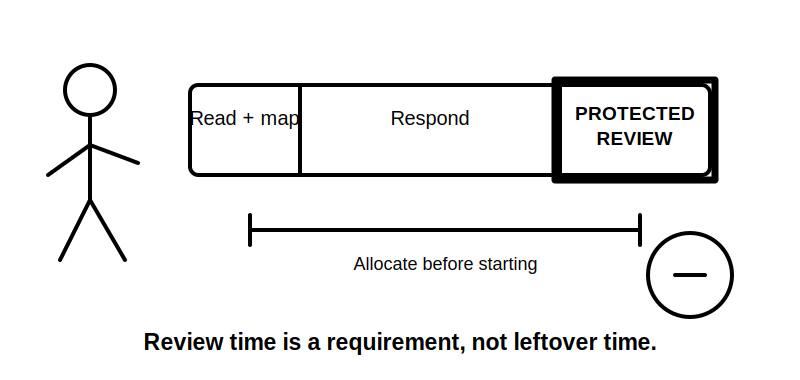
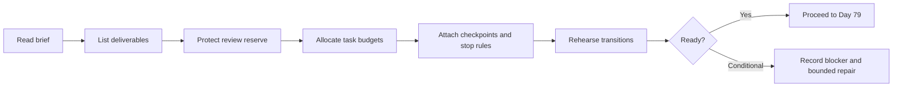

# Day 78 — Mock Preparation, Time Allocation and Stop-Rule Rehearsal

> **Scope boundary:** This is an educational preparation block. It does not reproduce an official assessment, set an official pass mark, authorise electrical work or replace instructions issued by an RTO or assessor.

## 1. Outcome and entry check

By the end, the learner can:

1. convert a mock brief into timed work phases and required deliverables;
2. reserve review time before beginning substantive work;
3. define stop rules for blocked, unsafe or unverified questions;
4. separate recall, source-navigation, calculation and written-response demands;
5. choose a bounded response when an exact requirement cannot be verified;
6. rehearse transitions without starting the full mock;
7. prepare permitted materials and evidence templates; and
8. record readiness conditions for Day 79.

### Entry check

Bring the Day 77 remediation record, an error log, a blank source register, a timer and only the materials permitted for the planned educational mock. Any unresolved critical remediation target remains a progression condition.

## 2. Why it matters

Mock performance can fail because of poor control rather than missing knowledge. Starting immediately, spending too long on one uncertain item, or leaving no review reserve can hide otherwise adequate capability. Preparation makes the learner's choices observable and reduces avoidable time-pressure errors.

## 3. Core concepts and terminology

- **Mock assessment:** an original educational simulation used to practise performance under stated conditions.
- **Deliverable:** a specific output required by the brief, such as a response, source trail, calculation record or limitations statement.
- **Time budget:** the planned maximum time for a phase or task.
- **Review reserve:** time protected for checking completeness, traceability, contradictions and boundaries.
- **Stop rule:** a pre-agreed condition that ends or defers work rather than encouraging unsafe guessing or uncontrolled time use.
- **Progression condition:** evidence that must exist before moving to the next block.
- **Source placeholder:** a visible marker identifying an exact claim that still requires an authorised current source.
- **Bounded response:** an answer that states what can be concluded, what cannot, and what evidence is missing.
- **Transition rehearsal:** practising movement between phases without completing the assessment content.

## 4. Rule-finding workflow

Use **P-R-E-P-A-R-E**:

1. **P — Parse** the brief into tasks, deliverables and constraints.
2. **R — Reserve** final review time before allocating the remainder.
3. **E — Estimate** effort by task type and evidence burden.
4. **P — Place** checkpoints, transitions and source-recording moments.
5. **A — Assign** stop rules for blocked, unsafe and unverifiable items.
6. **R — Rehearse** the opening, one transition and the final review.
7. **E — Establish** Day 79 readiness and unresolved conditions.

The diagram shows time control as a sequence of decisions made before the mock. The review reserve is protected before task time is distributed.

## 5. Visual model or worked example

### Fictional 75-minute written mock plan

The learner receives an original brief containing four short responses, two source-navigation tasks and one synthesis response. A defensible preparation record might be:

| Phase | Time | Required output |
|---|---:|---|
| Brief scan and deliverable map | 7 min | task list and constraints |
| Short responses | 20 min | four bounded answers |
| Source navigation | 18 min | search trail and applicability notes |
| Synthesis response | 18 min | structured conclusion with limitations |
| Protected review | 12 min | completeness, source, contradiction and boundary check |

Example stop rule: after three minutes without a productive source path, mark the item, record the attempted route, write a bounded response and continue. This is an educational control, not an official assessment instruction.

## 6. Practical application

Run a **30–40 minute rehearsal** without answering the full mock:

1. parse one original brief and list every deliverable;
2. create a time budget with at least a 10% review reserve;
3. define one stop rule for source blockage, one for uncertain exactness and one for fatigue or loss of concentration;
4. rehearse the first three minutes, one task transition and the final five-minute review;
5. inspect whether the plan leaves enough evidence of reasoning; and
6. record one adjustment for Day 79.

### Readiness rubric

| Category | 0 | 1 | 2 |
|---|---|---|---|
| Deliverables | Tasks missed | Most identified | All outputs and constraints mapped |
| Time allocation | No budget | Broad phases | Task budgets plus protected review |
| Stop rules | Guessing encouraged | General caution | Clear blocked, unsafe and unverifiable conditions |
| Source control | No record | Sources noted | Search trail and placeholders prepared |
| Transitions | Unrehearsed | One transition considered | Opening, transition and review rehearsed |
| Readiness | Assumed | General confidence | Conditions and blockers explicitly recorded |

This rubric is a learning aid only and is not an official pass standard.

## 7. Common errors and safety checkpoint

### Common errors

- treating all tasks as equal effort;
- allocating review time only if work finishes early;
- rehearsing answers instead of the control process;
- using a stop rule as permission to omit required evidence silently;
- creating an unrealistic schedule with no transition cost;
- carrying unsupported exact values into the mock; and
- treating a preparation score as formal readiness approval.

### Critical errors and stop conditions

Do not proceed to the mock when a critical Day 77 remediation condition remains unresolved, required permitted materials are unavailable, the learner intends to invent exact requirements, or the scenario would require practical electrical activity outside authority and supervision. Record the blocker and the evidence needed to resume.

## 8. Retrieval and next links

1. Why is the review reserve allocated before task budgets?
2. What distinguishes a stop rule from abandoning a task?
3. When should a source placeholder be used?
4. What evidence shows that a time plan is realistic?
5. Which progression condition would prevent Day 79 from starting?

- **Plan:** [Twelve-Week Capstone Learning Plan](../MASTER_PLAN.md)
- **Knowledge note:** [[12-Week Day 78 - Mock Preparation, Time Allocation and Stop-Rule Rehearsal]]
- **Previous:** [Day 77 — Week 11 Competency Conference and Targeted Remediation](day-77-week-11-competency-conference-and-targeted-remediation.md)
- **Next:** [Day 79 — Staged Written and Rule-Navigation Mock Assessment](day-79-staged-written-and-rule-navigation-mock-assessment.md)

This module remains `review-required`, `reference_check_required`, safety-critical and not `technically-reviewed`.