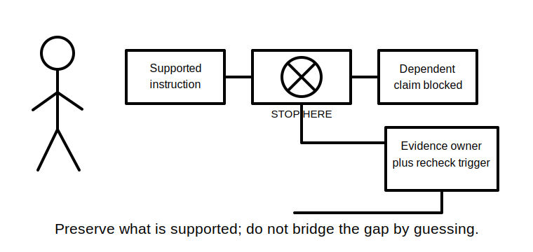
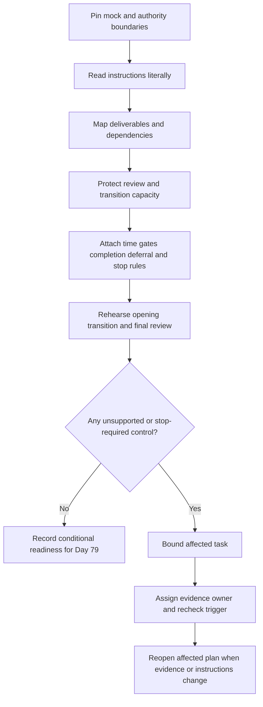
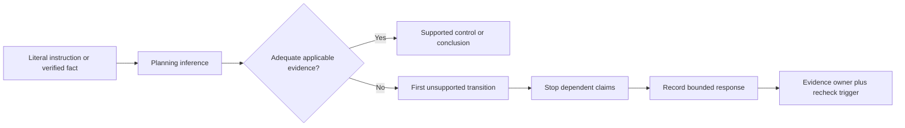

# Day 78 — Mock Preparation, Time Allocation and Stop-Rule Rehearsal

> **Scope boundary:** This is an original educational preparation block. It does not reproduce an official assessment, set an official time limit or pass mark, authorise electrical work, or replace instructions issued by an RTO, assessor, regulator, employer or supervisor.

## 1. Outcome and entry check

By the end, the learner can:

1. define the assessment, evidence, authority, time and decision boundaries for an educational mock;
2. convert a brief into observable deliverables, constraints and dependencies;
3. create a learner-selected time plan that protects review and transition capacity without presenting it as an official condition;
4. distinguish a time gate, stop rule, deferral rule and completion rule;
5. classify blocked work as `secure`, `developing`, `unsupported` or `stop-required` without averaging away critical gaps;
6. record the first unsupported transition in a response chain and prevent dependent claims from progressing;
7. assign an evidence owner and recheck trigger to each unresolved blocker;
8. reopen affected planning decisions after a material change; and
9. state one bounded readiness decision for Day 79 without claiming competency or technical approval.

### Entry check

Bring the untouched Day 77 conference record, its maximum-three remediation plan, the error log, a blank source register, a timer and only materials confirmed as permitted for the educational mock. Before planning, state:

- the mock version and date;
- who issued the instructions;
- which materials are permitted;
- which timing conditions are official, learner-selected or unknown;
- which Day 77 conditions remain open; and
- who has authority to decide whether the mock may proceed.

A critical unresolved Day 77 condition is not converted into readiness by confidence, speed or stronger performance elsewhere.

## 2. Why it matters

A learner can know the content and still produce weak evidence by beginning before the task is decomposed, spending uncontrolled time on one uncertainty, silently inventing an exact requirement, or leaving no capacity to review contradictions and limitations. Preparation should make these controls visible before the mock begins.

The purpose is not to optimise every minute. It is to prevent one blocked item, ambiguous instruction or material change from contaminating the whole response.

*Protect review and transition capacity before allocating the remaining time; the proportions are learner-selected unless current authorised instructions specify otherwise.*

*Stopping at the first unsupported transition preserves the valid part of the response and creates a traceable path to reconsideration.*

## 3. Core concepts and terminology

- **Mock assessment:** an original educational simulation used to practise evidence production under stated conditions.
- **Boundary:** a limit defining what installation, equipment, circuit, source state, time period, evidence set, authority or decision the response covers.
- **Deliverable:** a named output required by the brief, such as a bounded answer, source trail, calculation record, diagram, assumptions register or limitations statement.
- **Dependency:** an earlier fact, decision or evidence item that a later conclusion relies on.
- **Time budget:** a learner-selected maximum for a phase or task. It is not official unless an authorised instruction explicitly makes it so.
- **Review reserve:** protected capacity for checking completeness, traceability, contradictions, unsupported transitions and boundaries.
- **Transition cost:** the time and attention needed to close one task, preserve its evidence state and begin the next.
- **Time gate:** a planned decision point at which the learner checks progress and either continues, bounds, defers or stops the affected work.
- **Stop rule:** a pre-agreed condition requiring the affected task or decision to stop because proceeding would involve unsafe activity, authority overreach, invented evidence or an unsupported critical dependency.
- **Deferral rule:** a condition allowing a non-critical item to be marked, bounded and revisited later without pretending it is complete.
- **Completion rule:** the minimum evidence that must exist before a deliverable is treated as complete for this educational exercise.
- **Bounded response:** a response that states what is supported, what remains unsupported, why the boundary matters and what evidence could change the conclusion.
- **First unsupported transition:** the earliest step in a reasoning chain that lacks adequate applicable evidence; later dependent claims remain blocked.
- **Evidence owner:** the authorised person, source or record responsible for closing an evidence gap.
- **Recheck trigger:** the specific new evidence or authorised decision that permits reconsideration.
- **Material change:** a change to identity, configuration, source state, assumptions, evidence provenance or instructions that may invalidate earlier planning.
- **Non-compensatory blocker:** a critical weakness that stronger unrelated performance cannot offset.
- **Secure:** the planning control is explicit, internally consistent and supported by applicable evidence.
- **Developing:** a relevant control exists but is incomplete, inconsistent or prompt-dependent.
- **Unsupported:** required evidence is absent, conflicting, stale, inapplicable or insufficient.
- **Stop-required:** a safety, authority, identity, source-state, instruction or fabricated-evidence issue blocks the affected decision.

## 4. Rule-finding workflow

Use **P-R-E-P-A-R-E**:

1. **P — Pin the boundaries.** Record the mock version, task scope, permitted materials, source state, evidence set, authority and requested decision.
2. **R — Read literally.** Separate explicit instructions from assumptions, habits and learner-selected pacing choices.
3. **E — Extract deliverables and dependencies.** Map each requested output to its prerequisite facts, sources and completion evidence.
4. **P — Protect review and transitions.** Reserve capacity before distributing the remaining time; label all proportions as official, learner-selected or unknown.
5. **A — Attach controls.** Give each task a time gate, completion rule, deferral rule and any applicable stop rule.
6. **R — Rehearse and record.** Rehearse the opening, one transition and the final review while preserving an evidence trail rather than drafting answers.
7. **E — Evaluate readiness and reopen after change.** Classify each control independently, assign owners and triggers, and reopen affected dependencies after material change.

The workflow makes timing subordinate to evidence and authority. A fast plan is not a good plan when it allows unsupported claims or ignores a blocker.

The second diagram shows that a useful partial response is preserved up to the first unsupported transition. The gap is made visible rather than filled with invented exactness.

## 5. Visual model or worked example

### Fictional educational mock-planning dossier

A learner receives an original written mock labelled **Workshop Extension — Version B**. The cover page states that the exercise is written-only and that no practical activity is authorised. The instruction sheet lists four short responses, two source-navigation records and one synthesis response. The following evidence is also present:

- a calendar entry describes the session as 75 minutes, but the instruction sheet does not state a duration;
- an older preparation note uses a 10% review reserve without identifying its source;
- the source-navigation template refers to Version A of the scenario;
- one task asks for an exact requirement but provides no authorised reference set;
- the learner's Day 77 record still lists an unresolved source-state boundary;
- a later email says permitted materials changed, but it does not identify who authorised the change; and
- a peer says the assessor “usually allows extra time,” but the claim has no decision authority.

### Boundary and evidence register

| Item | Evidence condition | Planning effect |
|---|---|---|
| Written-only scope | verified in current cover page | practical activity remains outside scope |
| 75-minute duration | conflicting or unsupported | do not present it as an official condition; seek authorised confirmation |
| 10% reserve | learner-selected historical convention | may be used as a planning choice only when labelled as such |
| Version A template | stale for Version B | adapt structure cautiously; do not transfer scenario facts |
| Exact-requirement task | authorised source missing | use a source placeholder and bounded response |
| Source-state boundary | unresolved critical dependency | Day 79 progression is blocked for affected decisions |
| Changed permitted materials | authority unclear | assign the issuer or authorised assessor as evidence owner |
| Peer timing claim | unsupported | exclude from the official-condition record |

### Example claim chain

1. “The educational mock is written-only” is supported by the current cover page.
2. “The learner must finish in 75 minutes” depends on the calendar entry being an authorised instruction.
3. That authority is not established.
4. The second step is therefore the first unsupported transition.
5. The learner may rehearse a self-selected 75-minute plan, but must label it as learner-selected and must not claim it is official.

### Two sequential changes

After the initial plan, two changes arrive:

1. an authorised assessor confirms an 80-minute session and identifies the permitted reference set; then
2. a revised task sheet removes one source-navigation task and adds a limitations statement.

The learner must not merely adjust the final task times. The learner reopens the deliverable map, dependencies, time gates, review reserve, source register, stop rules and completion rules after each material change.

## 6. Practical application

Run a **learner-selected rehearsal of up to 40 minutes**, or a shorter period when fatigue, concentration or accessibility needs require it. The duration is an educational pacing control, not an official assessment condition.

Produce these nine artefacts without answering the full mock:

1. a boundary card naming mock version, evidence set, authority, permitted materials, timing status and requested decision;
2. a literal deliverable-and-constraint map;
3. a dependency map showing which tasks rely on exact sources, identities or source states;
4. a time plan that labels every figure as official, learner-selected or unknown;
5. a protected review-and-transition reserve;
6. a control table containing time gate, completion rule, deferral rule and stop rule for each task;
7. a source register with placeholders for unverified exact claims;
8. an unresolved-items register with evidence owner and recheck trigger; and
9. a Day 79 readiness record using the independent states below.

### Independent readiness states

Assess each criterion separately; do not calculate a total score.

| Criterion | Secure | Developing | Unsupported | Stop-required |
|---|---|---|---|---|
| Boundaries | version, scope, evidence and authority are explicit | most boundaries are stated but one is incomplete | key boundary evidence is absent or conflicting | safety, authority, identity or source-state boundary blocks progression |
| Deliverables | every output, constraint and dependency is mapped | most outputs are mapped but one link is incomplete | required outputs cannot be established | proceeding would silently omit a critical required output |
| Timing control | figures are realistic and labelled by status | plan exists but transition or review capacity is weak | timing conditions or workload basis are unknown | official timing is invented or conflicting instructions are ignored |
| Stop and deferral control | affected tasks have distinct, usable controls | controls exist but are vague or overlap | no defensible controls are recorded | the plan permits unsafe action, authority overreach or fabricated evidence |
| Source control | exact claims have applicable sources or visible placeholders | source trails exist but provenance or applicability is incomplete | critical sources are missing, stale or conflicting | unsupported exactness is presented as verified |
| Change reopening | material changes reopen all affected dependencies | some affected controls are revisited | change impact is not traced | stale decisions are retained after a critical change |
| Readiness record | blockers, owners, triggers and next decision are explicit | readiness is conditional but incompletely recorded | readiness rests mainly on confidence | competency, compliance or technical approval is claimed without authority |

### Non-compensatory blockers

Day 79 is not ready for the affected decision when any of these remains unresolved:

- a critical Day 77 remediation condition;
- uncertain authority for the mock instructions or permitted materials;
- an unresolved installation, equipment, circuit or source-state identity needed by a task;
- fabricated, silently transferred or stale evidence;
- an exact requirement presented without an applicable authorised source;
- a plan that authorises practical electrical activity;
- a conclusion extending beyond the first unsupported transition; or
- a competency, compliance or technical-approval claim without qualified authority.

Stronger performance in timing, presentation or unrelated tasks cannot offset these blockers.

## 7. Common errors and safety checkpoint

### Common errors

- treating calendar entries, peer advice or old templates as current authorised instructions;
- presenting learner-selected timings as official conditions;
- allocating review capacity only if other work finishes early;
- confusing a deferral rule with a safety or authority stop rule;
- using a stop rule to omit a required deliverable without recording the limitation;
- rehearsing answers instead of the evidence-control process;
- transferring Version A facts into Version B;
- retaining the original plan after changed instructions;
- treating confidence or an aggregate score as readiness; and
- allowing a strong task to compensate for a critical blocker elsewhere.

### Safety checkpoint

This module authorises no site access, opening, switching, isolation, proving de-energised, testing, measurement, instrument use, alteration, repair, energisation, commissioning, acceptance, certification, verification or field fault finding.

Stop and record a blocker when a task would require practical activity, evidence fabrication, authority overreach, an invented exact requirement, a conclusion beyond the first unsupported transition, or use of stale evidence after material change. Resume only when the named evidence owner provides the stated recheck trigger and the affected dependencies are reopened.

Exact assessment conditions, permitted materials, timing rules, technical duties, procedures, values, acceptance criteria and role permissions require current authorised sources and qualified review.

## 8. Retrieval and next links

1. What makes a learner-selected time budget different from an official assessment condition?
2. How do a time gate, deferral rule, completion rule and stop rule differ?
3. Why can stronger timing performance not offset a critical source-state blocker?
4. Where does a response chain stop when an inference lacks applicable evidence?
5. What must be reopened after two sequential material changes?
6. Who is the evidence owner for an unclear permitted-material instruction?
7. Which criterion would be `stop-required` if the plan authorises practical electrical activity?
8. What bounded readiness statement can be made without claiming competency?

- **Plan:** [Twelve-Week Capstone Learning Plan](../MASTER_PLAN.md)
- **Knowledge note:** [[12-Week Day 78 - Mock Preparation, Time Allocation and Stop-Rule Rehearsal]]
- **Previous:** [Day 77 — Week 11 Competency Conference and Targeted Remediation](day-77-week-11-competency-conference-and-targeted-remediation.md)
- **Next:** [Day 79 — Staged Written and Rule-Navigation Mock Assessment](day-79-staged-written-and-rule-navigation-mock-assessment.md)

This module remains `review-required`, `reference_check_required`, safety-critical and not `technically-reviewed`.