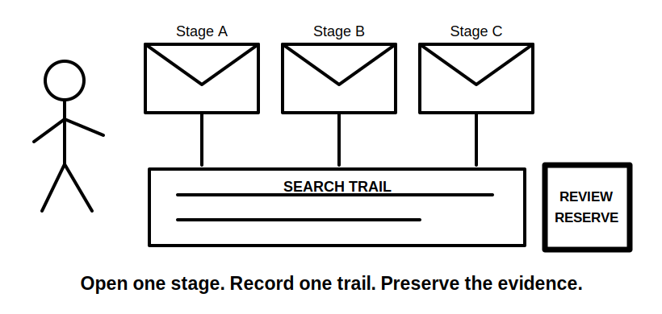
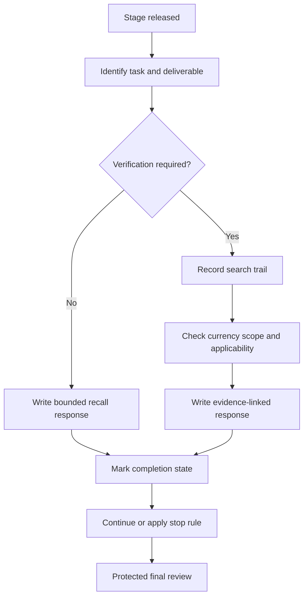

# Day 79 — Staged Written and Rule-Navigation Mock Assessment

> **Scope boundary:** This original educational mock develops written reasoning and authorised-source navigation. It is not an official RTO assessment and does not reproduce standards questions, tables, figures or systematic clause wording.

## 1. Outcome and entry check

By the end, the learner can:

1. execute the Day 78 time plan under staged release conditions;
2. distinguish direct recall from claims requiring source verification;
3. record a reproducible source-navigation trail;
4. test source scope, currency and applicability before relying on it;
5. write concise answers that separate fact, interpretation and limitation;
6. use stop rules without silently abandoning deliverables;
7. preserve a protected final review; and
8. produce an untouched submission and evidence log for later review.

### Entry check

Proceed only when Day 78 readiness conditions are met. Prepare a timer, blank response sheet, source register and the permitted authorised materials. Do not pre-read later stages.

## 2. Why it matters

Capstone responses often require both knowledge and disciplined navigation. A correct-looking statement is weak when its source cannot be retraced, its scope is wrong or an exact requirement is invented. Staged release tests whether the learner can control evidence and time as new demands appear.

## 3. Core concepts and terminology

- **Staged release:** providing sections sequentially so later information cannot influence earlier responses prematurely.
- **Rule-navigation task:** a task requiring the learner to locate, assess and apply an authorised source rather than rely only on memory.
- **Search trail:** the recorded sequence of index terms, headings, cross-references and scope checks used to locate evidence.
- **Applicability:** whether a source actually governs the installation, condition or question being considered.
- **Source currency:** whether the referenced edition, amendment or document status is current for the task.
- **Claim boundary:** the limit beyond which the available evidence does not support a conclusion.
- **Untouched submission:** the work exactly as completed when time expires, retained for valid review.
- **Completion marker:** a visible note showing an item was bounded, deferred or left incomplete rather than accidentally omitted.

## 4. Rule-finding workflow

Use **N-A-V-I-G-A-T-E**:

1. **N — Name** the question type and required deliverable.
2. **A — Assess** whether recall is sufficient or verification is required.
3. **V — Verify** source identity, currency, scope and applicability.
4. **I — Isolate** the evidence that supports the specific claim.
5. **G — Generate** a concise response separating fact and interpretation.
6. **A — Add** limitations, assumptions and source placeholders.
7. **T — Track** time, completion markers and unresolved items.
8. **E — Examine** the whole submission during protected review.

The diagram emphasises that navigation is not complete when a relevant phrase is found. The source must be checked before the response is written.

## 5. Visual model or worked example

### Original staged mock structure

**Stage A — 20 minutes:** four concept distinctions. For each, define both terms, state the practical reasoning difference and identify one common confusion.

**Stage B — 25 minutes:** three source-navigation prompts using fictional installation facts. Record search terms, document location, scope check, applicability decision and bounded conclusion. Do not copy extended source wording.

**Stage C — 20 minutes:** one synthesis response that reconciles a design note, inspection observation and changed operating condition. State contradictions and evidence gaps.

**Protected review — 10 minutes:** check every deliverable, exact claim, source trail, assumption, contradiction and completion marker.

A strong response does not need to quote an authorised source extensively. It identifies the governing topic, records how it was found and paraphrases only what is necessary for the original reasoning task.

## 6. Practical application

Complete the **75-minute staged mock**:

1. open only Stage A and lock the response when its time expires;
2. open Stage B, preserving all search-trail evidence;
3. open Stage C without changing earlier answers;
4. apply the rehearsed stop rules when blocked;
5. use the final 10 minutes only for review and completion markers; and
6. save the untouched submission, timing record and source register.

### Assessment rubric

| Category | 0 | 1 | 2 |
|---|---|---|---|
| Task control | Deliverables missed | Most addressed | Every item has a response or completion marker |
| Concept distinction | Terms conflated | Partial distinction | Definitions, consequence and confusion separated |
| Navigation trail | Source asserted | Location recorded | Reproducible trail with scope and applicability checks |
| Written reasoning | Unsupported conclusion | Some evidence links | Fact, interpretation and limitation explicit |
| Time control | Review lost | Some phase control | Stage limits and protected review maintained |
| Safety and copyright | Exactness invented or copied | General caution | Bounded paraphrase and review flags used correctly |

The rubric is an educational indicator, not an official result.

## 7. Common errors and safety checkpoint

### Common errors

- searching by remembered clause number without checking topic or currency;
- copying source wording instead of showing reasoning;
- treating a search result as applicable evidence;
- changing Stage A after seeing Stage C;
- hiding an unfinished item;
- spending the review reserve on one blocked question; and
- interpreting fluent writing as technical approval.

### Critical errors and stop conditions

Stop and record a blocker if an exact safety-critical claim cannot be verified, authorised sources are unavailable, the task appears to require copied protected material, or the scenario prompts practical activity beyond authority or supervision. Submit the bounded work; do not invent a requirement to make the response look complete.

## 8. Retrieval and next links

1. What makes a source trail reproducible?
2. Why must scope and applicability be checked separately?
3. What is the purpose of an untouched submission?
4. How does a completion marker differ from silent omission?
5. Which review checks protect against unsupported exactness?

- **Plan:** [Twelve-Week Capstone Learning Plan](../MASTER_PLAN.md)
- **Knowledge note:** [[12-Week Day 79 - Staged Written and Rule-Navigation Mock Assessment]]
- **Previous:** [Day 78 — Mock Preparation, Time Allocation and Stop-Rule Rehearsal](day-78-mock-preparation-time-allocation-and-stop-rule-rehearsal.md)
- **Next:** [Day 80 — Staged Design and Calculation Mock Assessment](day-80-staged-design-and-calculation-mock-assessment.md)

This module remains `review-required`, `reference_check_required`, safety-critical and not `technically-reviewed`.