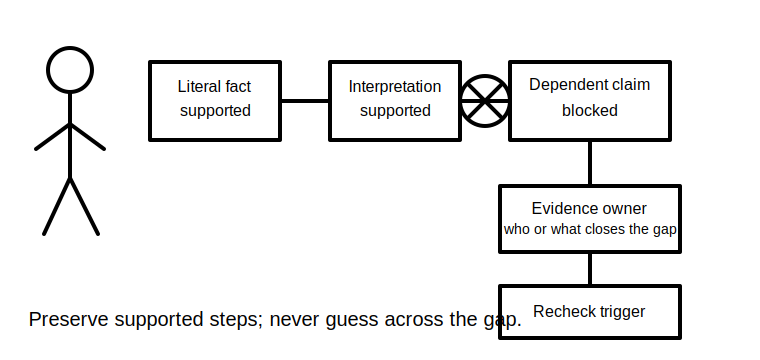
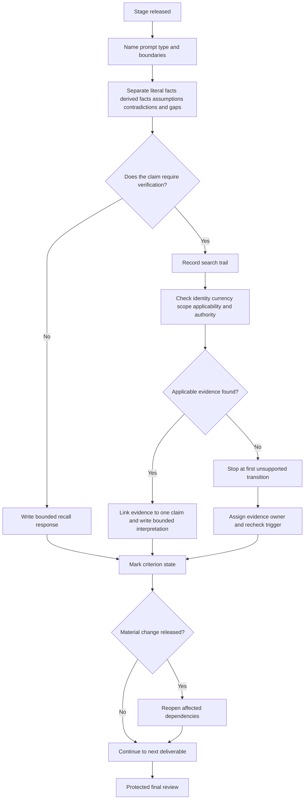
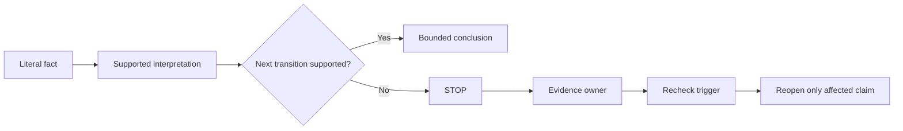

# Day 79 — Staged Written and Rule-Navigation Mock Assessment

> **Scope boundary:** This original educational mock develops written reasoning, rule navigation and evidence control. It is not an official RTO assessment, does not determine competency and does not reproduce standards questions, tables, figures or systematic clause wording.

## 1. Outcome and entry check

By the end, the learner can:

1. define the mock's installation, circuit, source-state, time, evidence, authority and requested-decision boundaries before answering;
2. classify each prompt as recall, source-navigation, interpretation or synthesis;
3. preserve literal scenario facts separately from derived facts, assumptions and conclusions;
4. produce a reproducible search trail that records source identity, currency, scope, applicability and the exact claim supported;
5. stop a claim at its first unsupported transition and assign an evidence owner plus recheck trigger;
6. complete each deliverable with a bounded answer, explicit limitation, deferral marker or stop-required record;
7. classify each criterion independently as `secure`, `developing`, `unsupported` or `stop-required`;
8. reopen affected answers when a material change alters their evidence basis; and
9. preserve an untouched submission, timing record and source register for later review.

### Entry check

Proceed only when Day 78 preparation is complete and the current mock version, permitted materials and learner-selected timing controls are recorded. The learner must have a blank response sheet, source register, timer and authorised materials. Later stages remain closed until released.

Do not proceed when the mock instructions are ambiguous about source access, the available source edition cannot be identified, or fatigue prevents careful evidence control. Record the blocker instead of improvising conditions.

## 2. Why it matters

A fluent written answer can still be unsafe or technically weak when it relies on a stale source, applies a rule outside its scope or bridges a missing fact by guesswork. This mock therefore evaluates the **traceability of reasoning**, not merely whether the final wording sounds plausible.

The staged format also exposes whether new information is being allowed to rewrite earlier evidence silently. Earlier answers may be reopened only through an explicit change record.

*Instructional caption: Open only the current stage, record the evidence trail as you work and preserve the final review reserve.*

*Instructional caption: A dependent conclusion remains blocked until the named evidence owner supplies the stated recheck evidence.*

## 3. Core concepts and terminology

- **Staged release:** providing sections sequentially so later information cannot influence earlier work before the intended point.
- **Literal scenario fact:** information stated directly in the mock without interpretation.
- **Derived fact:** a result obtained transparently from stated information using a shown reasoning step.
- **Assumption:** an unverified proposition used temporarily; it must be labelled and may not support a safety-critical conclusion.
- **Rule-navigation task:** a task requiring the learner to locate, assess and apply an authorised source rather than rely on memory alone.
- **Search trail:** the recorded sequence of index terms, headings, cross-references and scope checks used to locate evidence.
- **Source identity:** the document title, edition, amendment state and issuing authority.
- **Source currency:** whether that source status is current for the mock's stated context.
- **Scope:** the installations, equipment, conditions or decisions covered by the source.
- **Applicability:** whether the source governs the specific bounded facts in the prompt.
- **Claim-evidence link:** an explicit record of which evidence supports one particular statement.
- **First unsupported transition:** the earliest step in a reasoning chain that lacks adequate applicable evidence.
- **Evidence owner:** the authorised person, source or record responsible for closing a defined evidence gap.
- **Recheck trigger:** the specific evidence event that permits the blocked reasoning to be reconsidered.
- **Material change:** new information that may invalidate an earlier boundary, assumption, source choice or conclusion.
- **Untouched submission:** the work exactly as it stood when the mock ended, retained before later review or correction.
- **Non-compensatory blocker:** a critical gap that cannot be offset by stronger performance elsewhere.
- **`secure`:** the criterion is complete, traceable and bounded for this educational exercise.
- **`developing`:** the criterion is substantially addressed but has a non-critical weakness requiring remediation.
- **`unsupported`:** the criterion contains a material claim without adequate applicable evidence.
- **`stop-required`:** authority, identity, source-state, safety or evidence conditions require the affected decision to stop.

These are educational review states, not official grades, competency decisions, technical findings or approvals.

## 4. Rule-finding workflow

Use **N-A-V-I-G-A-T-E**:

1. **N — Name** the prompt type, requested deliverable and governing boundaries.
2. **A — Arrange** literal facts, derived facts, assumptions, contradictions and gaps in separate fields.
3. **V — Verify** source identity, currency, scope, applicability and authority before reliance.
4. **I — Isolate** the smallest evidence passage or principle needed for the specific claim; paraphrase rather than copy extended wording.
5. **G — Generate** a bounded response separating evidence, interpretation, limitation and decision.
6. **A — Audit** the claim chain and stop at the first unsupported transition.
7. **T — Track** time, completion state, evidence owner, recheck trigger and any material change.
8. **E — Examine** all deliverables during protected review without disguising unresolved gaps.

The workflow keeps source discovery separate from source applicability. Finding a relevant phrase is not enough; the learner must show why it supports the bounded claim.

The second diagram shows that unsupported reasoning does not invalidate everything already established. The learner preserves supported steps, blocks dependent claims and records exactly what would permit reopening.

## 5. Visual model or worked example

### Original staged dossier

The fictional dossier concerns a workshop ventilation circuit described across several records:

- the current mock brief names circuit `EF-4`;
- an older schedule names `FAN-2`;
- a maintenance note says the fan operated from normal supply during one event;
- a later email says an alternate source was “probably available” but provides no configuration record;
- a photograph shows a label but has no date or confirmed location;
- the authorised source register contains two editions, but only one is marked current;
- Stage C later reveals that a control module was replaced after the earlier records were created.

### Worked evidence record

| Field | Bounded record |
|---|---|
| Requested claim | Identify the applicable rule topic for source identification |
| Literal facts | `EF-4` appears in the current brief; `FAN-2` appears in an older schedule |
| Contradiction | Circuit identity is not reconciled |
| Search trail | Index term → source-identification topic → scope statement → cross-reference |
| Source check | Current edition identified; exact applicability remains conditional on circuit identity |
| First unsupported transition | Treating `EF-4` and `FAN-2` as the same circuit |
| Evidence owner | Current authorised circuit schedule or person authorised to confirm identity |
| Recheck trigger | Reconciled identifier record with date and scope |
| Bounded response | State the rule topic and explain that circuit-specific application remains blocked |

The response is stronger because it distinguishes what can be stated now from what remains blocked. It does not invent a clause number or convert a likely identity match into fact.

### Material-change example

When Stage C reveals the control-module replacement, reopen every earlier answer that depended on the historical configuration. Do not reopen unrelated definitions or source-currency checks.

## 6. Practical application

Complete the staged mock using learner-selected controls from Day 78 unless current authorised instructions specify otherwise:

1. **Stage A — concept control:** define four paired concepts, state the practical reasoning difference and identify one common confusion for each.
2. **Stage B — source navigation:** answer three original prompts. For each, record source identity, search trail, scope, applicability, claim-evidence link and limitation.
3. **Stage C — synthesis and change:** reconcile a design note, inspection observation and changed operating condition. Record contradictions, evidence gaps and every reopened dependency.
4. **Protected review:** inspect all deliverables, exact claims, source trails, assumptions, completion states, evidence owners and recheck triggers.
5. Save the untouched submission before adding any later reviewer annotations.

### Required artefacts

The submission contains:

- a boundary statement;
- a prompt-classification table;
- a fact/assumption/contradiction register;
- three reproducible search trails;
- claim-evidence links;
- a first-unsupported-transition record for each blocked claim;
- evidence-owner and recheck-trigger entries;
- a material-change reopening log;
- independent criterion states; and
- the untouched submission plus timing record.

### Independent review criteria

| Criterion | `secure` | `developing` | `unsupported` | `stop-required` |
|---|---|---|---|---|
| Boundary control | All material boundaries explicit | Minor non-critical boundary gap | Material boundary inferred | Authority, source-state or identity boundary prevents decision |
| Source navigation | Reproducible trail and applicability check | Trail present with one weak check | Source asserted without adequate trail | Authorised source unavailable or status indeterminate |
| Claim control | Evidence, interpretation and limitation separated | Mostly separated | Material unsupported transition | Safety-critical exactness would need invention |
| Change control | Affected dependencies reopened and logged | One non-critical dependency missed | Earlier conclusion retained despite change | Change invalidates the basis for a safety-critical decision |
| Completion control | Every deliverable bounded or explicitly marked | Minor accidental omission | Material silent omission | Required safe boundary cannot be established |

Do not total these states. A `stop-required` condition or non-compensatory blocker remains decisive regardless of strengths elsewhere.

## 7. Common errors and safety checkpoint

### Common errors

- searching from a remembered clause number without first confirming the topic and current source;
- treating a search hit as applicable evidence;
- copying extended source wording instead of showing original reasoning;
- collapsing a literal fact, interpretation and conclusion into one sentence;
- converting an assumption into a fact later in the answer;
- changing Stage A after seeing Stage C without a reopening record;
- hiding an unfinished item rather than using a completion marker;
- spending protected review time on one blocked question;
- averaging a critical blocker against stronger unrelated work; and
- treating fluent writing or an educational `secure` state as technical approval.

### Safety checkpoint and stop conditions

Stop the affected claim and record a blocker when:

- an exact safety-critical requirement cannot be verified;
- source identity, currency, scope or applicability is indeterminate;
- circuit, equipment or source-state identity is unresolved;
- the task appears to require copied protected material;
- a practical action would exceed authority, supervision or the educational scope; or
- a material change invalidates the evidence basis and the dependency cannot be re-established.

This module authorises no site access, opening, switching, isolation, proving de-energised, testing, measurement, instrument use, alteration, repair, energisation, commissioning, acceptance, certification, verification or field fault finding.

Exact assessment conditions, technical duties, methods, sequences, values, acceptance criteria, permissions and official expectations require current authorised sources and qualified review.

## 8. Retrieval and next links

1. What makes a source trail reproducible rather than merely plausible?
2. Why must source scope and scenario applicability be checked separately?
3. What is the first unsupported transition in the worked example?
4. What evidence event would permit that claim to reopen?
5. Why are `secure`, `developing`, `unsupported` and `stop-required` not totalled?
6. Which dependencies must reopen after a material change?
7. What is preserved in an untouched submission?

- **Plan:** [Twelve-Week Capstone Learning Plan](../MASTER_PLAN.md)
- **Knowledge note:** [[12-Week Day 79 - Staged Written and Rule-Navigation Mock Assessment]]
- **Previous:** [Day 78 — Mock Preparation, Time Allocation and Stop-Rule Rehearsal](day-78-mock-preparation-time-allocation-and-stop-rule-rehearsal.md)
- **Next:** [Day 80 — Staged Design and Calculation Mock Assessment](day-80-staged-design-and-calculation-mock-assessment.md)

This module remains `review-required`, `reference_check_required`, safety-critical and not `technically-reviewed`.
