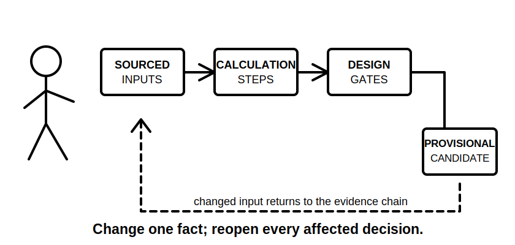
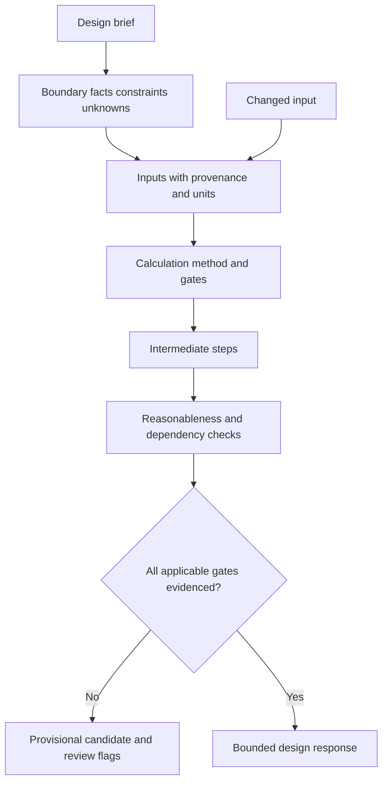

# Day 80 — Staged Design and Calculation Mock Assessment

> **Scope boundary:** This is an original educational mock focused on design reasoning, calculation structure and evidence traceability. It does not provide an approved design, prescribe field work, reproduce standards tables or establish official assessment requirements.

## 1. Outcome and entry check

By the end, the learner can:

1. decompose a fictional design brief into linked decisions and calculation gates;
2. identify input provenance, units, assumptions and unresolved dependencies;
3. select a calculation approach without inventing exact technical data;
4. show intermediate steps and reasonableness checks;
5. treat a candidate result as provisional until all applicable gates are addressed;
6. propagate a changed input through affected decisions;
7. preserve source placeholders and review flags; and
8. submit an untouched timed design record for later analysis.

### Entry check

Bring the Day 79 timing and error record, a blank design-basis sheet, a calculation template and only permitted authorised references. Any unresolved unsupported exactness from Day 79 must be identified before beginning.

## 2. Why it matters

A final number can look precise while hiding a wrong boundary, stale input or omitted design condition. This mock assesses whether the learner can make the reasoning chain visible: what was assumed, where each input came from, which checks remain open and how one changed fact affects the whole design.

## 3. Core concepts and terminology

- **Design basis:** the recorded facts, constraints, sources, assumptions and criteria used to develop a design response.
- **Input provenance:** evidence showing where a quantity or condition came from and whether it is current and applicable.
- **Calculation gate:** a required reasoning check that must be satisfied before a candidate design conclusion can progress.
- **Intermediate step:** a visible calculation stage that allows error tracing and unit checking.
- **Reasonableness check:** a separate test of whether a result is plausible in context; it is not a substitute for authorised acceptance criteria.
- **Provisional candidate:** an option retained for further checks rather than presented as approved.
- **Change propagation:** reopening every affected decision when an input, constraint or operating state changes.
- **Dependency register:** a list of unresolved facts or reviews that could alter the conclusion.

## 4. Rule-finding workflow

Use **C-A-L-C-U-L-A-T-E**:

1. **C — Clarify** the design boundary and required outputs.
2. **A — Assemble** facts, constraints, sources and unknowns.
3. **L — Label** every input with provenance, units and status.
4. **C — Choose** the calculation method and applicable gates.
5. **U — Unfold** intermediate steps so the reasoning can be checked.
6. **L — Look** for unit, magnitude and dependency errors.
7. **A — Apply** the result only within its evidence boundary.
8. **T — Trace** changed inputs through every affected decision.
9. **E — Escalate** exact or safety-critical uncertainty for authorised review.

The changed-input arrow returns to the input stage because downstream calculations and conclusions cannot remain automatically valid.

## 5. Visual model or worked example

### Original staged scenario

A fictional workshop extension requires a documented design response for a new distribution path and final load. The brief provides invented load data, route descriptions and equipment constraints but deliberately omits one environmental condition and one authorised-source value.

**Stage A — Design basis:** identify boundary, loads, operating assumptions, protective purpose, route conditions, unknowns and source placeholders.

**Stage B — Calculation chain:** perform only calculations supported by the provided fictional inputs. Show formula selection rationale, units, intermediate steps and a reasonableness check. Do not supply a missing official value from memory.

**Stage C — Coordination and evidence gates:** state which conductor, protection, voltage, fault, environmental and documentation checks are complete, incomplete or dependent on review.

**Stage D — Changed fact:** a route condition changes. Mark every calculation, candidate and conclusion that must be reopened.

A strong submission may finish with a provisional candidate and unresolved dependency. Inventing the missing value is a weaker outcome than recording a bounded hold point.

## 6. Practical application

Complete the **90-minute staged mock**:

1. **15 minutes:** create the design basis and dependency register;
2. **35 minutes:** complete the supported calculation chain;
3. **20 minutes:** assess interacting design gates and evidence status;
4. **10 minutes:** process the changed fact and reopen affected work; and
5. **10 minutes:** perform a protected final review.

### Assessment rubric

| Category | 0 | 1 | 2 |
|---|---|---|---|
| Design boundary | Undefined | Partly stated | Scope, outputs and exclusions explicit |
| Input control | Values used without origin | Some provenance | Every input has source, units and status |
| Calculation trace | Final number only | Partial working | Method, intermediate steps and units visible |
| Design gates | Single-factor choice | Several checks | Interacting gates and dependencies mapped |
| Change propagation | Original answer retained | Some updates | Every affected step and conclusion reopened |
| Safety and review boundary | Missing exactness invented | Caveat added | Hold points, placeholders and escalation explicit |

The rubric supports learning review only and is not an official pass mark or design approval.

## 7. Common errors and safety checkpoint

### Common errors

- beginning calculations before defining the design boundary;
- using a remembered table value without an authorised source;
- hiding unit conversions or intermediate steps;
- treating reasonableness as proof of compliance;
- selecting a candidate from one successful calculation;
- updating only the final number after a changed input; and
- presenting a provisional candidate as technically reviewed.

### Critical errors and stop conditions

Stop and record a hold point when a required exact value, installation condition, source state or acceptance criterion is unavailable; when the task would require practical verification outside authority; or when a changed fact invalidates prior work that cannot be recomputed safely within the block. Do not fill evidence gaps with assumed compliance.

## 8. Retrieval and next links

1. Why must every input include provenance and units?
2. What distinguishes a reasonableness check from an acceptance decision?
3. When should a candidate remain provisional?
4. What does change propagation require?
5. Which missing facts create a hold point rather than a guess?

- **Plan:** [Twelve-Week Capstone Learning Plan](../MASTER_PLAN.md)
- **Knowledge note:** [[12-Week Day 80 - Staged Design and Calculation Mock Assessment]]
- **Previous:** [Day 79 — Staged Written and Rule-Navigation Mock Assessment](day-79-staged-written-and-rule-navigation-mock-assessment.md)
- **Next:** [Day 81 — Staged Inspection, Verification and Fault-Reasoning Mock Assessment](day-81-staged-inspection-verification-and-fault-reasoning-mock-assessment.md)

This module remains `review-required`, `reference_check_required`, safety-critical and not `technically-reviewed`.
