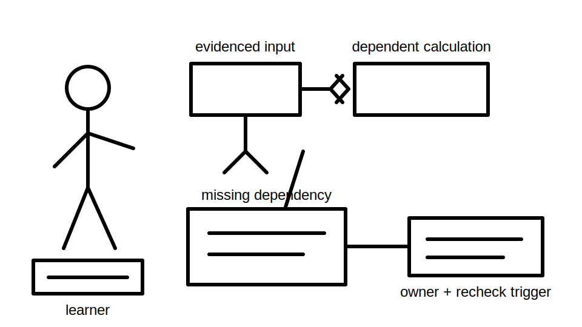
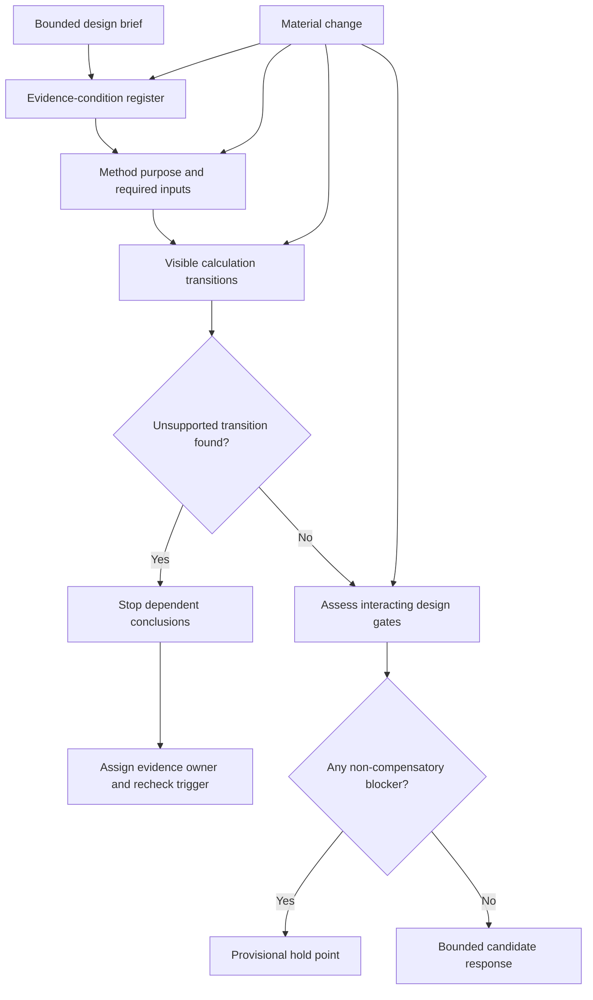
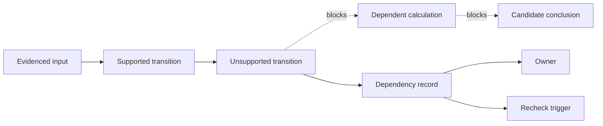

# Day 80 — Staged Design and Calculation Mock Assessment

> **Scope boundary:** This original educational mock assesses design reasoning, calculation traceability and evidence control. It does not provide an approved design, prescribe field work, reproduce standards tables or establish official assessment conditions.

## 1. Outcome and entry check

By the end, the learner can:

1. define installation, circuit, load, source-state, route, time, evidence, authority and requested-decision boundaries before calculating;
2. classify each design input as evidenced, derived, assumed, contradictory, missing or review-dependent;
3. construct a calculation chain in which every transition identifies its formula purpose, inputs, units and dependency;
4. stop a dependent conclusion at the first unsupported transition instead of carrying false precision forward;
5. test at least two materially different candidate interpretations where the design brief conflicts;
6. distinguish a plausibility check from an authorised acceptance decision;
7. reopen every affected calculation, gate and conclusion after two sequential material changes;
8. assign an evidence owner and recheck trigger to every unresolved dependency;
9. submit an untouched timed record that permits later error analysis; and
10. classify each assessment criterion independently as `secure`, `developing`, `unsupported` or `stop-required`.

### Entry check

Bring the untouched Day 79 submission, its timing and error record, a blank design-basis sheet, a dependency register, a calculation template and only references expressly permitted for this educational mock. Before starting, list any unresolved source-identity, applicability or unsupported-exactness issue carried forward from Day 79.

## 2. Why it matters

A numerically tidy answer can still be unsafe or indefensible when the wrong circuit, source state, environmental condition or acceptance basis was used. Design competence is therefore not demonstrated by arithmetic alone. It requires a visible chain from bounded evidence to method selection, calculation, interacting design gates, limitations and review ownership.

*Caption: Stop where the evidence chain breaks; record the missing dependency rather than extending false precision.*

## 3. Core concepts and terminology

- **Design basis:** the recorded facts, constraints, sources, assumptions, exclusions and decision boundaries used to develop a response.
- **Installation boundary:** the physical installation or fictional area included in the mock.
- **Circuit boundary:** the conductors, protective devices, loads and interfaces included in one reasoning chain.
- **Load boundary:** the operating duties and demand conditions treated as relevant to the candidate design.
- **Source-state boundary:** the supply configuration and operating state to which an input or conclusion applies.
- **Route boundary:** the physical path and environmental conditions assumed for a wiring system.
- **Evidence boundary:** the documents, observations and fictional data that may support a claim.
- **Authority boundary:** the limit between educational reasoning and decisions reserved for authorised or qualified people.
- **Requested-decision boundary:** the exact output requested, excluding unrequested approval or compliance declarations.
- **Input provenance:** evidence showing where a quantity or condition came from, when it applied and whether it is current.
- **Derived input:** a value calculated from evidenced inputs using a visible method.
- **Assumption:** a provisional proposition used only when explicitly labelled and prevented from supporting a final approval claim.
- **Contradiction:** two items that cannot both be treated as true within the same boundary.
- **Calculation transition:** one reasoning step that converts identified inputs into an intermediate or candidate result.
- **First unsupported transition:** the earliest calculation or reasoning step whose method, input, applicability or authority is not evidenced.
- **Calculation gate:** a required check that must be addressed before a candidate conclusion can progress.
- **Plausibility check:** an independent magnitude, unit or relationship check; it is not proof of compliance.
- **Non-compensatory blocker:** a missing or contradictory condition that cannot be offset by stronger performance elsewhere.
- **Evidence owner:** the person or role responsible for resolving a dependency.
- **Recheck trigger:** the event or evidence that requires the affected reasoning chain to be reopened.
- **Material change:** a changed fact capable of altering one or more calculations, gates or conclusions.
- **Untouched submission:** the learner's preserved timed work before later correction.

### Evidence conditions

Use one condition for every important input or claim:

- `evidenced` — directly supported and applicable within the stated boundary;
- `derived` — calculated from evidenced inputs with visible working;
- `assumed` — explicitly provisional and barred from supporting approval;
- `contradictory` — conflicts with another relevant item;
- `missing` — required evidence is absent; or
- `review-dependent` — requires current authorised material or qualified judgement.

## 4. Rule-finding workflow

Use **C-A-L-C-U-L-A-T-E**:

1. **C — Constrain** the installation, circuit, load, source-state, route, time, evidence, authority and requested-decision boundaries.
2. **A — Assemble** literal facts, derived facts, assumptions, contradictions, missing inputs and review-dependent items without silently reconciling them.
3. **L — Label** each input with provenance, units, evidence condition, applicable boundary and date or state.
4. **C — Choose** a calculation method only after recording its purpose, required inputs and authorised-source dependency.
5. **U — Unfold** every transition, unit conversion and intermediate result so another reviewer can reproduce the chain.
6. **L — Locate** the first unsupported transition and stop all conclusions that depend on it.
7. **A — Assess** interacting design gates, plausibility, competing interpretations and non-compensatory blockers independently.
8. **T — Trace** each material change through every affected input, calculation, gate, candidate and conclusion.
9. **E — Escalate** unresolved exactness with an evidence owner, recheck trigger and bounded hold point.

The workflow prevents a missing input from being hidden by correct arithmetic. A material change returns to every affected stage rather than merely changing the final number.

This claim-chain view identifies the first point where support fails. Everything downstream remains open until the dependency is resolved and the chain is recalculated.

## 5. Visual model or worked example

### Original staged scenario

A fictional workshop extension requires a documented response for a new distribution path and final load. The dossier contains invented values and intentionally conflicting evidence:

- drawing `W-17` labels the path `SUB-3`, while the load schedule labels it `SUB-3A`;
- a current-looking equipment sheet has no issue date;
- the route sketch omits one environmental segment;
- a supervisor email proposes a protective-device characteristic but cites no authorised basis;
- the normal-source record covers the main supply only;
- a later note indicates the load may operate from an alternate source during maintenance;
- a photograph shows an added junction, but its date and circuit identity are uncertain; and
- one required exact source value is deliberately absent.

**Stage A — Boundary and evidence map:** record the nine boundaries and classify each item. Do not choose between `SUB-3` and `SUB-3A` without evidence.

**Stage B — Competing interpretations:** create at least two bounded interpretations, such as “drawing identity governs” and “load-schedule identity governs.” State what evidence would discriminate between them.

**Stage C — Supported calculation chain:** perform only calculations supported by the fictional data. For each transition record purpose, formula form, inputs, units, evidence conditions and dependency links. Do not invent the missing source value.

**Stage D — Design-gate matrix:** assess conductor, protection, voltage-condition, fault-condition, route/environment, source-state, coordination and documentation gates as separate questions. A strong result in one gate cannot compensate for a blocker in another.

**Stage E — First material change:** the omitted route segment is revealed to have a different environmental condition. Reopen every affected route assumption, input, calculation, gate and candidate.

**Stage F — Second material change:** the alternate-source arrangement is confirmed to have a materially different source condition. Reopen the complete affected dependency chain again, including work already revised after Stage E.

A strong submission may end with two provisional candidates and a hold point. Inventing the missing exact value or collapsing conflicting identities into one answer is weaker than a bounded unresolved conclusion.

## 6. Practical application

Complete this **learner-selected 90-minute educational mock**. The timing is a study control, not an official assessment condition.

1. **15 minutes — Boundary and evidence map:** produce the nine-boundary record and evidence-condition register.
2. **15 minutes — Competing interpretations:** state at least two materially different interpretations and discriminating evidence.
3. **30 minutes — Calculation chain:** complete supported transitions with units, provenance and intermediate steps.
4. **15 minutes — Gate matrix:** classify each interacting gate and identify non-compensatory blockers.
5. **10 minutes — Sequential changes:** process both material changes and produce a reopening log.
6. **5 minutes — Protected final review:** preserve the untouched submission, limitations and next evidence actions.

### Required submission artefacts

1. boundary record;
2. evidence-condition register;
3. competing-interpretation table;
4. method-selection record;
5. visible calculation chain;
6. first-unsupported-transition marker;
7. design-gate matrix;
8. sequential-change reopening log;
9. dependency register with evidence owners and recheck triggers;
10. independent criterion review; and
11. untouched timed submission.

### Independent educational review states

Assess each criterion separately:

- `secure` — complete, reproducible and supported within the stated boundary;
- `developing` — the method is substantially sound but a bounded correction is needed;
- `unsupported` — evidence, applicability or traceability is insufficient; or
- `stop-required` — a safety, authority or non-compensatory blocker prevents progression.

Criteria:

1. boundary control;
2. input provenance and evidence classification;
3. competing-interpretation control;
4. method selection;
5. calculation trace and unit control;
6. first-unsupported-transition handling;
7. interacting gate analysis;
8. change propagation;
9. evidence ownership and recheck triggers;
10. untouched evidence preservation.

No total score is calculated. One `stop-required` criterion is not cancelled by stronger performance elsewhere.

## 7. Common errors and safety checkpoint

### Common errors

- calculating before fixing the relevant boundaries;
- treating an undated or mismatched document as current;
- silently choosing one identifier from conflicting records;
- inserting a remembered table value into a missing source field;
- hiding unit conversions or intermediate steps;
- using a plausibility check as proof of acceptance;
- carrying calculations beyond the first unsupported transition;
- selecting a design candidate because only one gate looks favourable;
- changing the final number without reopening dependencies;
- failing to reopen work already revised after a second material change;
- averaging a blocker into an overall score; and
- presenting a provisional candidate as technically reviewed.

### Critical errors and stop conditions

Apply `stop-required` and record a hold point when:

- a required exact value, acceptance basis or authorised source is unavailable;
- circuit, source-state or route identity remains materially contradictory;
- practical inspection, testing or measurement would be needed outside the learner's authority;
- a material change invalidates prior work that cannot be safely recalculated within the block;
- a candidate depends on an unsupported transition; or
- the learner cannot distinguish educational reasoning from technical approval.

This module authorises no site access, opening, switching, isolation, proving de-energised, testing, measurement, instrument use, alteration, repair, energisation, commissioning, acceptance, certification, verification or field fault finding.

## 8. Retrieval and next links

1. Name the nine boundaries that must be fixed before calculation.
2. How does a `derived` input differ from an `assumed` input?
3. What is the first unsupported transition, and what does it block?
4. Why can a plausibility check not establish acceptance?
5. What makes a blocker non-compensatory?
6. What must be reopened after two sequential material changes?
7. What information belongs in a dependency record?
8. Why must the untouched timed submission be preserved?

- **Plan:** [Twelve-Week Capstone Learning Plan](../MASTER_PLAN.md)
- **Knowledge note:** [[12-Week Day 80 - Staged Design and Calculation Mock Assessment]]
- **Previous:** [Day 79 — Staged Written and Rule-Navigation Mock Assessment](day-79-staged-written-and-rule-navigation-mock-assessment.md)
- **Next:** [Day 81 — Staged Inspection, Verification and Fault-Reasoning Mock Assessment](day-81-staged-inspection-verification-and-fault-reasoning-mock-assessment.md)

This module remains `review-required`, `reference_check_required`, safety-critical and not `technically-reviewed`.
