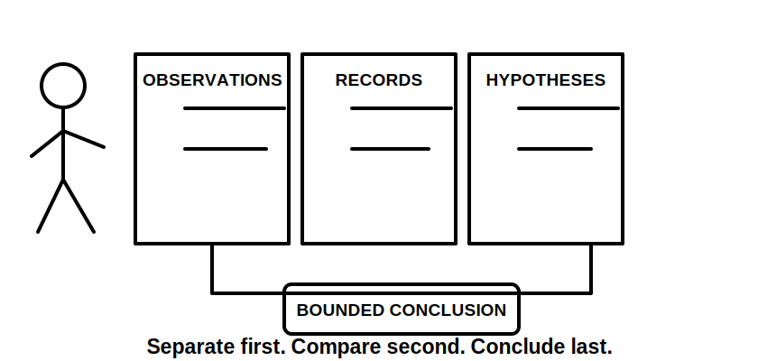
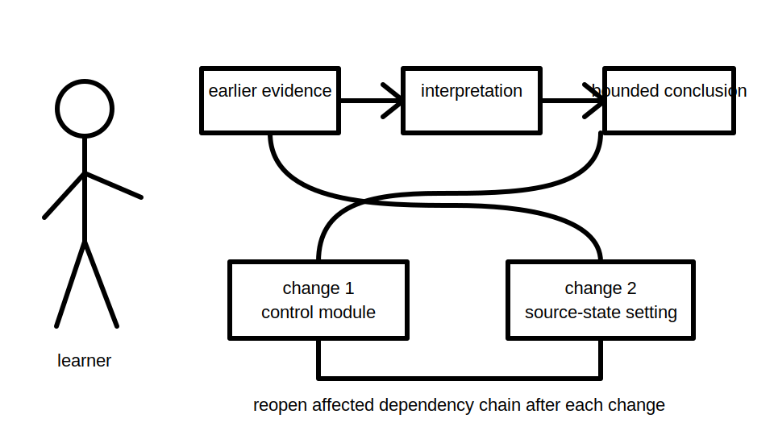
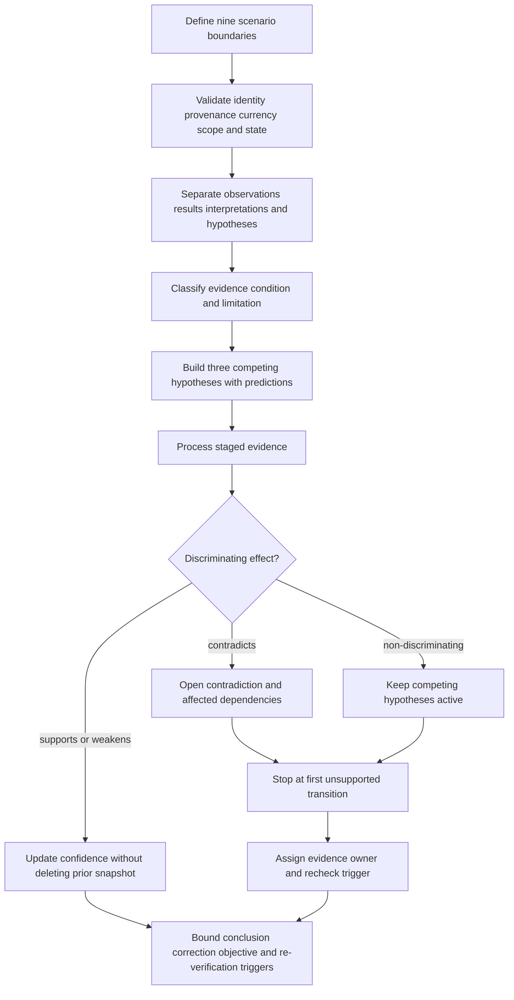
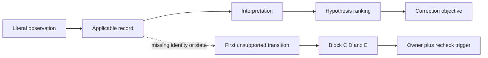

# Day 81 — Staged Inspection, Verification and Fault-Reasoning Mock Assessment

> **Scope boundary:** This original educational mock uses fictional records, identifiers, observations and staged evidence. It develops evidence reasoning only. It does not instruct field inspection or testing, prescribe instrument use or sequencing, provide acceptance values, authorise fault-finding or repair, reproduce official assessment material, or establish technical compliance.

## 1. Outcome and entry check

By the end, the learner can produce an untouched timed submission that:

1. defines the installation, equipment, circuit, source-state, operating-state, time, evidence, authority and requested-decision boundaries;
2. classifies each item as a literal observation, recorded result, derived fact, interpretation, hypothesis, contradiction, assumption or unresolved gap;
3. records evidence identity, provenance, currency, scope, applicability and limitation;
4. builds at least three materially different fault hypotheses, each with a falsifiable prediction;
5. identifies whether new evidence supports, weakens, contradicts or fails to discriminate between hypotheses;
6. stops dependent reasoning at the first unsupported transition rather than hiding the gap;
7. defines bounded correction objectives without prescribing unauthorised work;
8. reopens affected evidence and conclusions after two sequential material changes;
9. assigns an evidence owner and recheck trigger to every unresolved blocker; and
10. reviews each capability independently as `secure`, `developing`, `unsupported` or `stop-required`.

### Entry check

Bring the untouched Day 80 submission, its error record, a blank evidence ledger, hypothesis register, contradiction register, change-impact map and permitted authorised references. Before starting, record:

- current fatigue and concentration state;
- unresolved safety-critical misconceptions;
- any reference-access limitation; and
- the authority boundary for this educational exercise.

Do not begin the timed mock when fatigue, missing supervision or unclear authority would make safe reasoning unreliable. Record the stop condition instead.

## 2. Why it matters

Inspection observations, verification records and reported symptoms answer different questions. A plausible record may be genuine yet stale, correctly copied yet attached to the wrong circuit, or consistent with several hypotheses. Reliable reasoning therefore depends on evidence identity and applicability before interpretation.

A common failure pattern is to move directly from a familiar symptom to a preferred cause. Day 81 instead requires the learner to preserve literal evidence, expose uncertainty and stop at the first unsupported transition. This makes later technical review possible without pretending the automated learning material grants practical authority.

*Instructional caption: Keep observations, records and hypotheses separate so a familiar symptom cannot silently become a proven cause.*

*Instructional caption: A material change can invalidate earlier evidence; a second change requires the affected dependency chain to be checked again from its earliest changed input.*

## 3. Core concepts and terminology

### Scenario boundaries

- **Installation boundary:** the fictional installation or training-board portion covered by the evidence.
- **Equipment boundary:** the specific equipment item and configuration being discussed.
- **Circuit boundary:** the circuit identity and extent to which a record applies.
- **Source-state boundary:** the source arrangement relevant to the evidence, including whether an alternate source may have existed.
- **Operating-state boundary:** the switching, loading and installation condition under which an observation or record was obtained.
- **Time boundary:** the date, sequence and configuration period to which evidence applies.
- **Evidence boundary:** the records supplied in the staged packet; absence from the packet is not proof that an event did not occur.
- **Authority boundary:** what the learner may analyse educationally and what requires authorised practical personnel.
- **Requested-decision boundary:** the exact conclusion or planning output requested by the mock.

### Evidence and reasoning terms

- **Literal observation:** what a person or record states without added explanation.
- **Recorded result:** a value or outcome copied from a supplied fictional record, without treating it as current or valid automatically.
- **Derived fact:** a statement obtained transparently from evidenced inputs through a shown reasoning step.
- **Interpretation:** an explanation of what evidence may mean within defined boundaries.
- **Hypothesis:** a provisional cause explanation that predicts what differentiating evidence should show.
- **Falsifiable prediction:** an expected observation that could count against the hypothesis if not found.
- **Non-discriminating evidence:** evidence compatible with more than one hypothesis and therefore unable to choose between them.
- **Contradiction:** two items that cannot both support the same bounded conclusion without resolution.
- **First unsupported transition:** the earliest step where a conclusion depends on missing, stale, inapplicable, contradictory or review-dependent evidence.
- **Correction objective:** the condition that a future authorised correction would need to achieve, stated without prescribing practical work.
- **Re-verification trigger:** a change that may invalidate earlier observations, records, assumptions or conclusions.
- **Evidence owner:** the authorised person, source or process responsible for resolving a named gap.
- **Recheck trigger:** the event that requires the blocked decision to be reconsidered.
- **Non-compensatory blocker:** a critical deficiency that cannot be offset by stronger work elsewhere.

### Evidence conditions

Classify every material item as one of:

1. **evidenced-current** — identity, provenance, time, scope and applicability are adequate for the bounded claim;
2. **evidenced-limited** — genuine evidence with an explicit limitation;
3. **derived-transparent** — obtained from evidenced inputs through a visible reasoning step;
4. **assumed-declared** — necessary for exploration but not established;
5. **contradictory-unresolved** — conflicts with another material item; or
6. **review-dependent** — requires an authorised source or qualified technical judgment.

Confidence is not an evidence condition. A learner can be highly confident and still wrong or unsupported.

## 4. Rule-finding workflow

Use **E-V-I-D-E-N-C-E**:

1. **E — Establish boundaries.** Record all nine scenario boundaries and the requested deliverables.
2. **V — Validate identity and applicability.** Check record identity, provenance, currency, configuration, scope and operating state.
3. **I — Isolate literal evidence.** Separate observations and recorded results from interpretations, hypotheses and conclusions.
4. **D — Define evidence purpose.** State what each item can support, what it cannot establish and its evidence condition.
5. **E — Enumerate hypotheses.** Create at least three materially different explanations and one falsifiable prediction for each.
6. **N — Note discriminating power.** Mark each release as supporting, weakening, contradicting or non-discriminating.
7. **C — Control unsupported transitions.** Stop the affected conclusion chain at its first unsupported step; assign an owner and recheck trigger.
8. **E — Escalate and reopen.** Escalate authority-dependent decisions and reopen affected dependencies after every material change.

The diagram places evidence validation and hypothesis competition before conclusion writing. A later release changes confidence only after its identity and applicability have been checked.

### First-unsupported-transition control

The dotted path shows that an identity or operating-state gap blocks every dependent conclusion. The learner records the limitation rather than filling it with confidence or a familiar rule.

## 5. Visual model or worked example

### Original staged scenario: fictional workshop extract system

The packet concerns a fictional training-board extract system. All identifiers, dates and observations are invented.

#### Initial dossier

- An inspection sheet names circuit `EF-2`; a verification sheet names `F-2`.
- A switchboard schedule uses `EXTRACT FAN`, but its revision date predates a documented board alteration.
- A witness reports that the fan “sometimes stops after the changeover,” without defining the source state or whether the indicator remained on.
- A maintenance note says “connections checked — okay,” but does not identify the equipment, circuit extent, author, method or configuration.
- One fictional result is recorded against `EF-2`, but the page header refers to an earlier board identifier.
- A photograph shows a labelled device but has no date, location marker or chain of custody.
- The supplied source extract intentionally omits the exact acceptance value needed for a final technical conclusion.

#### Competing hypotheses

The learner must keep at least these materially different possibilities open:

- **H1 — Identity mismatch:** records concern different circuits or configurations. Prediction: authoritative identity evidence will not align all supplied records.
- **H2 — Source-state dependency:** the symptom occurs only in one source arrangement. Prediction: event-specific records will separate normal-source and alternate-source cases.
- **H3 — Control-path intermittency:** the symptom is associated with control evidence rather than the final circuit evidence. Prediction: staged observations will differ between control indication and equipment operation.
- **H4 — Historical-record contamination:** a genuine older record is being applied to the current configuration. Prediction: configuration dates will place the record before a material change.

These hypotheses are educational reasoning devices, not findings.

#### Stage releases

**Stage A — Inspection packet:** classify each item and establish the nine boundaries. Do not infer a defect merely from wording differences.

**Stage B — Verification packet:** map each record to identity, purpose, operating state, provenance, time, scope, limitation and evidence condition.

**Stage C — Event packet:** create an event-by-event matrix. Do not combine reports from different source states or dates.

**Stage D — Contradictory release:** a later label photograph supports `EF-2`, while a signed alteration record says the circuit was renumbered to `F-2`. Preserve both interpretations and identify what would discriminate between them.

**Stage E — First material change:** a fictional control module is replaced. Reopen hypotheses and records that depended on the earlier control configuration.

**Stage F — Second material change:** an alternate-source controller setting is changed. Reopen the complete affected dependency chain from source-state assumptions through event interpretation and proposed re-verification questions.

### Change-impact model

| Changed item | Earlier evidence potentially affected | Required educational response |
|---|---|---|
| control module replacement | symptom pattern, control observations, control-path hypotheses | mark earlier evidence by configuration period; do not claim successful correction |
| alternate-source setting change | source-state boundary, event grouping, source-dependent hypotheses | reopen all dependent interpretations and identify authorised re-verification questions |

## 6. Practical application

Complete the **learner-selected 90-minute staged mock**. These durations are educational pacing controls, not official assessment conditions.

1. **10 minutes — boundary map:** record all nine boundaries, deliverables and stop conditions.
2. **15 minutes — evidence ledger:** classify every supplied item and record identity, provenance, applicability and limitation.
3. **15 minutes — claim chains:** map each requested conclusion to its evidence dependencies and first unsupported transition.
4. **15 minutes — hypothesis register:** create at least three materially distinct hypotheses with falsifiable predictions.
5. **15 minutes — staged releases:** process contradiction and non-discriminating evidence without rewriting earlier snapshots.
6. **10 minutes — change propagation:** reopen dependencies after both material changes.
7. **10 minutes — protected review:** preserve the untouched submission, list blockers, owners, recheck triggers and bounded conclusions.

### Required submission artefacts

1. nine-boundary scenario map;
2. evidence ledger with six evidence conditions;
3. event-by-event operating-state matrix;
4. contradiction register;
5. claim-dependency map showing first unsupported transitions;
6. hypothesis register with predictions and discriminating evidence;
7. staged confidence snapshots;
8. correction-objective table without practical instructions;
9. two-change impact and reopening log;
10. unresolved-blocker register with owners and recheck triggers;
11. untouched timed submission; and
12. independent capability review.

### Independent capability review

Review each criterion separately:

- **secure:** complete, internally consistent and bounded by applicable evidence;
- **developing:** method is visible but one or more non-critical gaps remain;
- **unsupported:** a material claim lacks adequate evidence or contains an unresolved contradiction; or
- **stop-required:** authority, identity, operating state, safety boundary or required authorised criterion is too unclear to continue the affected decision.

| Criterion | Evidence expected | Non-compensatory blocker |
|---|---|---|
| boundary control | all nine boundaries explicit | circuit, source-state, authority or requested decision materially undefined |
| evidence identity and applicability | provenance, time, scope, configuration and limitation recorded | material record cannot be tied to the bounded circuit or state |
| evidence separation | observations, results, interpretations, hypotheses and conclusions distinct | observation converted directly into a defect or root-cause claim |
| hypothesis control | three materially different hypotheses with predictions | preferred cause asserted without a discriminating chain |
| contradiction handling | conflicts remain visible and affected claims reopen | contradiction hidden, averaged or resolved by assumption |
| unsupported-transition control | earliest unsupported step named | dependent conclusion continues beyond an unresolved material gap |
| change propagation | both material changes reopen affected dependencies | earlier evidence treated as automatically valid after change |
| safety and authority | stop conditions, owners and escalation explicit | practical testing, alteration, repair, acceptance or certification implied |

Strong timing, formatting or performance in one criterion cannot compensate for a blocker in another. These states are educational review labels, not official grades, competency findings or technical approvals.

## 7. Common errors and safety checkpoint

### Common errors

- treating similar circuit labels as automatically equivalent;
- converting witness language into a technical observation;
- treating a recorded result as current without checking identity, time and operating state;
- using non-discriminating evidence as proof of one hypothesis;
- deleting earlier confidence snapshots after contradictory evidence appears;
- proposing a correction before establishing the cause boundary;
- failing to reopen dependent conclusions after a configuration change;
- averaging a safety-critical blocker into an overall score; and
- implying practical authority through procedural wording.

### Safety checkpoint and stop conditions

Stop the affected reasoning chain when:

- evidence identity, circuit extent, source state, operating state or configuration period is materially unclear;
- a required exact criterion is unavailable from a current authorised source;
- records conflict and the requested conclusion depends on resolving that conflict;
- fatigue or cognitive overload makes reliable evidence control unlikely;
- the scenario would require site access, opening, switching, isolation, proving de-energised, testing, measurement, instrument use, alteration, repair, energisation, commissioning, acceptance, certification or field fault finding; or
- the learner is asked to make a decision reserved for an authorised or qualified person.

Record the blocked decision, first unsupported transition, evidence owner and recheck trigger. Do not invent a criterion, procedure or practical action.

## 8. Retrieval and next links

1. Name the nine boundaries used in this mock.
2. What distinguishes a literal observation from an interpretation?
3. Why can genuine evidence still be inapplicable?
4. What makes a hypothesis falsifiable?
5. What is the first unsupported transition, and what happens to dependent claims?
6. Why must non-discriminating evidence leave multiple hypotheses active?
7. What must be reopened after two sequential material changes?
8. Why is a non-compensatory blocker not averaged into an overall score?

- **Plan:** [Twelve-Week Capstone Learning Plan](../MASTER_PLAN.md)
- **Knowledge note:** [[12-Week Day 81 - Staged Inspection, Verification and Fault-Reasoning Mock Assessment]]
- **Previous:** [Day 80 — Staged Design and Calculation Mock Assessment](day-80-staged-design-and-calculation-mock-assessment.md)
- **Next:** [Day 82 — Rest and Evidence-Led Error-Log Consolidation](day-82-rest-and-evidence-led-error-log-consolidation.md)

This module remains `review-required`, `reference_check_required`, safety-critical and not `technically-reviewed`.
