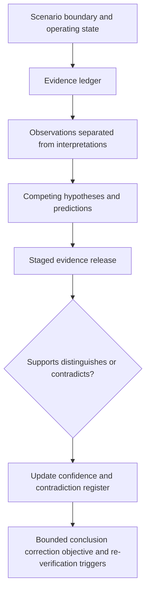

# Day 81 — Staged Inspection, Verification and Fault-Reasoning Mock Assessment

> **Scope boundary:** This original educational mock uses fictional documents and observations. It does not instruct field inspection or testing, provide acceptance values, authorise fault-finding, or reproduce official assessment material.

## 1. Outcome and entry check

By the end, the learner can:

1. separate observations, records, interpretations, hypotheses and conclusions;
2. map each verification claim to relevant evidence and operating state;
3. identify missing, stale, contradictory or non-discriminating evidence;
4. rank competing fault hypotheses without premature closure;
5. update confidence when staged evidence is released;
6. define correction objectives without prescribing unauthorised work;
7. identify evidence requiring re-verification after a change; and
8. preserve an untouched timed submission for review.

### Entry check

Bring the Day 80 error record, a blank evidence ledger, hypothesis register, contradiction register and permitted authorised references. Record any fatigue or unresolved safety-critical misconception before starting.

## 2. Why it matters

Inspection and verification records do not explain themselves. A learner must know what a record can support, what it cannot prove, and how contradictory evidence changes a diagnostic position. The mock tests disciplined interpretation rather than practical authority.

## 3. Core concepts and terminology

- **Observation:** something recorded as seen or stated, without adding an explanation.
- **Verification claim:** a bounded statement about what inspection, test or documentary evidence is intended to establish.
- **Operating state:** the source, switching and installation condition under which evidence was obtained.
- **Evidence ledger:** a traceable list of records, provenance, scope, currency and limitations.
- **Hypothesis:** a provisional explanation that predicts what further evidence should show.
- **Non-discriminating evidence:** evidence consistent with more than one hypothesis and therefore unable to distinguish them.
- **Contradiction:** evidence that conflicts with another record, assumption or expected prediction.
- **Re-verification trigger:** a change or correction that may invalidate earlier evidence.

## 4. Rule-finding workflow

Use **E-V-I-D-E-N-C-E**:

1. **E — Establish** the scenario boundary, operating state and deliverables.
2. **V — Verify** document identity, provenance, currency and scope.
3. **I — Isolate** observations from interpretations and conclusions.
4. **D — Define** the purpose and limitation of each evidence item.
5. **E — Enumerate** competing hypotheses and their predictions.
6. **N — Note** contradictions, missing evidence and non-discriminating results.
7. **C — Calibrate** confidence after each staged release.
8. **E — Escalate** unsafe, unverifiable or authority-dependent decisions.

The diagram keeps evidence handling ahead of conclusion writing so that a familiar symptom does not become an assumed cause.

## 5. Visual model or worked example

### Original staged scenario

A fictional training-board dossier contains an inspection record, equipment schedule, several verification records and a reported intermittent symptom. All identifiers and values are invented. One record refers to an earlier configuration, and one result is compatible with two different hypotheses.

**Stage A — Inspection packet:** classify each statement as observation, interpretation, defect candidate or evidence gap.

**Stage B — Verification packet:** map each record to purpose, circuit or equipment identity, operating state, provenance and limitation.

**Stage C — Symptom packet:** create at least three competing hypotheses and one prediction for each.

**Stage D — Contradictory release:** update confidence explicitly; do not erase the earlier snapshot.

**Stage E — Change notice:** identify which records become stale and what authorised re-verification questions would need resolution.

## 6. Practical application

Complete the **90-minute staged mock**:

1. **15 minutes:** map deliverables and operating state;
2. **20 minutes:** build the inspection and verification evidence ledger;
3. **20 minutes:** create and rank competing hypotheses;
4. **15 minutes:** process contradictory staged evidence;
5. **10 minutes:** map correction objectives and re-verification triggers; and
6. **10 minutes:** protected final review.

### Assessment rubric

| Category | 0 | 1 | 2 |
|---|---|---|---|
| Evidence separation | Claims mixed together | Some separation | Observation, result, interpretation, hypothesis and conclusion distinct |
| Traceability | Records unnamed | Partial identity | Provenance, scope, state and limitation recorded |
| Hypothesis control | One assumed cause | Several labels | Competing hypotheses include predictions and confidence |
| Contradiction handling | Ignored | Mentioned | Conflict logged and affected conclusions reopened |
| Re-verification | Generic retest | Some affected records | Change-to-evidence impact is explicit and bounded |
| Safety boundary | Practical action implied | Caveat present | Authority, stop rules and escalation are explicit |

This learning rubric is not an official pass mark or competency decision.

## 7. Common errors and safety checkpoint

### Common errors

- converting an observation directly into a defect conclusion;
- treating a record as current without checking configuration or operating state;
- assuming one plausible hypothesis is the root cause;
- treating non-discriminating evidence as proof;
- overwriting earlier confidence after a later release;
- proposing a correction without tracing affected evidence; and
- writing practical test or repair instructions outside authority.

### Critical errors and stop conditions

Stop when evidence identity, operating state, authority or safety conditions are unclear; when an exact acceptance criterion is unavailable; or when the scenario would require practical access, switching, isolation, testing, measurement, alteration, energisation or certification. Record the blocked decision and required authorised review.

## 8. Retrieval and next links

1. What separates an observation from an interpretation?
2. Why can a plausible result be non-discriminating?
3. What must a hypothesis predict?
4. When does a change create a re-verification trigger?
5. Why must an earlier diagnostic snapshot remain visible?

- **Plan:** [Twelve-Week Capstone Learning Plan](../MASTER_PLAN.md)
- **Knowledge note:** [[12-Week Day 81 - Staged Inspection, Verification and Fault-Reasoning Mock Assessment]]
- **Previous:** [Day 80 — Staged Design and Calculation Mock Assessment](day-80-staged-design-and-calculation-mock-assessment.md)
- **Next:** [Day 82 — Rest and Evidence-Led Error-Log Consolidation](day-82-rest-and-evidence-led-error-log-consolidation.md)

This module remains `review-required`, `reference_check_required`, safety-critical and not `technically-reviewed`.
