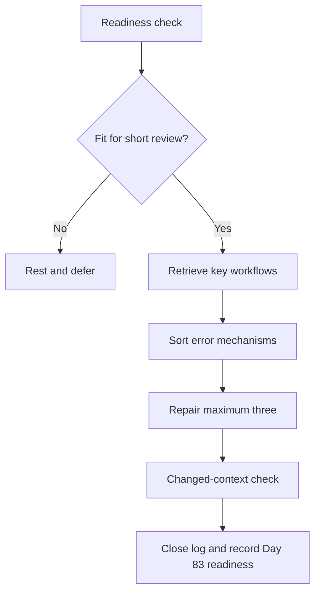

# Day 82 — Rest and Evidence-Led Error-Log Consolidation

> **Scope boundary:** This is a deliberate recovery and error-log block. It adds no new electrical theory, technical value, practical procedure or official assessment rule.

## 1. Outcome and entry check

By the end, the learner can:

1. complete a brief fatigue and readiness check;
2. retrieve the main Week 12 workflows without notes;
3. classify errors by mechanism rather than topic alone;
4. prioritise safety-critical, high-confidence and dependency errors;
5. repair no more than three errors using evidence;
6. test each repair in a changed context;
7. define a stop condition for further study; and
8. prepare a bounded Day 83 readiness note.

### Entry check

Use the untouched Day 79–81 submissions and error records. Do not begin if fatigue, distress or reduced concentration makes reliable review unlikely. This block is limited to **20–30 minutes**.

## 2. Why it matters

More study is not always better study. Immediately adding new material after several timed mocks can strengthen fatigue-driven habits and obscure the real error mechanism. This block consolidates evidence, repairs a small number of consequential errors and preserves recovery before the full mock.

## 3. Core concepts and terminology

- **Error mechanism:** the reasoning failure that produced an error, such as boundary confusion, unsupported recall or premature closure.
- **High-confidence error:** an incorrect response made with strong confidence; it may indicate a durable misconception.
- **Dependency error:** an early mistake that invalidates later work.
- **Evidence-led repair:** correction supported by an authorised source, prior module or traceable reasoning record.
- **Changed-context check:** a fresh example that tests whether the repair transfers beyond the original question.
- **Recovery limit:** a deliberate time and workload boundary that prevents remediation from becoming another full study session.
- **Readiness note:** a concise record of remaining risks, permitted supports and stop rules for the next block.

## 4. Rule-finding workflow

Use **R-E-S-E-T**:

1. **R — Rate** fatigue, focus and emotional load.
2. **E — Extract** errors from untouched submissions.
3. **S — Sort** by safety, confidence, dependency and recurrence.
4. **E — Evidence** up to three repairs and test changed contexts.
5. **T — Terminate** at the time limit or earlier stop condition.

The flow ends with closing the log because recovery is part of preparation, not unused study time.

## 5. Visual model or worked example

### Error-log example

A learner identifies six issues across the staged mocks:

- two formatting omissions;
- one unsupported remembered value;
- one high-confidence confusion between evidence and conclusion;
- one early boundary error that affected several later responses; and
- one slow but correct source search.

The learner repairs the unsupported value, the evidence/conclusion confusion and the boundary error. The remaining items are recorded but not expanded into new theory. Each repair is tested with one short changed-context prompt.

## 6. Practical application

Complete the recovery block:

1. **3 minutes:** fatigue and readiness rating;
2. **5 minutes:** closed-note retrieval of the Week 12 workflows;
3. **5 minutes:** classify error mechanisms;
4. **10 minutes:** repair up to three priority errors;
5. **5 minutes:** changed-context checks and Day 83 readiness note; and
6. stop immediately when the 30-minute maximum is reached.

### Readiness criteria

Proceed to Day 83 only when:

- no unresolved safety-critical misconception is being hidden;
- the learner can state the main stop rules;
- the three selected repairs survive changed-context checks; and
- fatigue is low enough for a full mock on the planned day.

## 7. Common errors and safety checkpoint

### Common errors

- reviewing every error instead of selecting the consequential few;
- treating a corrected answer as a repaired mechanism;
- studying new theory to avoid confronting a recurring mistake;
- repeating the original question instead of varying context;
- continuing because time remains despite reduced concentration; and
- converting the readiness note into a claim of competence.

### Critical errors and stop conditions

Stop immediately for worsening fatigue, inability to explain a safety-critical repair, repeated high-confidence error, unavailable authorised evidence or pressure to continue beyond the time limit. Rest or seek qualified support rather than forcing completion.

## 8. Retrieval and next links

1. Which error types receive priority?
2. Why is answer replacement weaker than mechanism repair?
3. What does a changed-context check test?
4. What is the maximum number of repairs?
5. Which conditions require rest rather than more study?

- **Plan:** [Twelve-Week Capstone Learning Plan](../MASTER_PLAN.md)
- **Knowledge note:** [[12-Week Day 82 - Rest and Evidence-Led Error-Log Consolidation]]
- **Previous:** [Day 81 — Staged Inspection, Verification and Fault-Reasoning Mock Assessment](day-81-staged-inspection-verification-and-fault-reasoning-mock-assessment.md)
- **Next:** [Day 83 — Full Integrated Mock Assessment](day-83-full-integrated-mock-assessment.md)

This module remains `review-required`, `reference_check_required`, safety-critical and not `technically-reviewed`.
