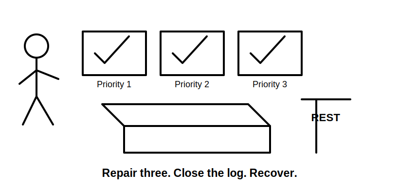
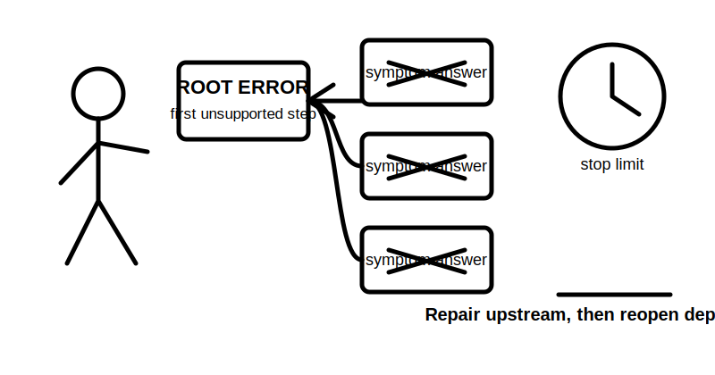
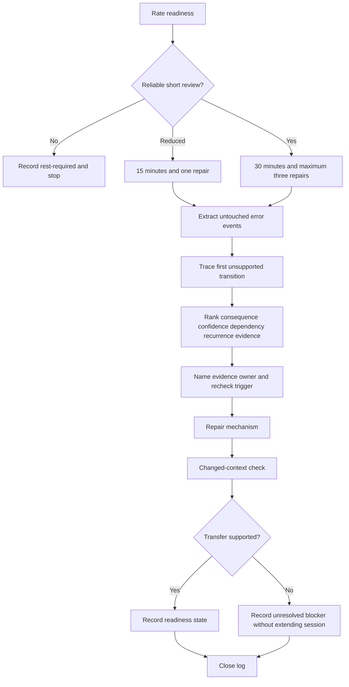
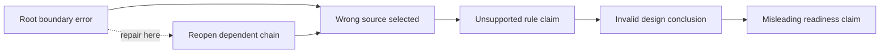

# Day 82 — Rest and Evidence-Led Error-Log Consolidation

> **Scope boundary:** This is a deliberate recovery, retrieval and error-log block. It adds no new electrical theory, technical value, practical procedure or official assessment rule. Any technical correction remains subject to current authorised sources and qualified review.

## 1. Outcome and entry check

By the end, the learner can:

1. record fatigue, concentration and emotional-load states before reviewing work;
2. retrieve the Week 12 control workflows without opening the source modules;
3. distinguish an **error event** from its underlying **error mechanism**;
4. separate root errors from downstream symptom errors;
5. rank errors using safety consequence, confidence, dependency reach, recurrence and evidence quality;
6. complete no more than three evidence-led repairs with named evidence owners and recheck triggers;
7. test each repair in a changed context without repeating the original prompt; and
8. produce a bounded Day 83 readiness note using independent readiness states.

### Entry check

Use untouched Day 79–81 submissions, confidence ratings and error records. Do not alter the original submissions. Record one of these entry states:

- **ready for short review:** concentration is stable enough for a bounded session;
- **reduced-load review:** review is limited to 15 minutes and one repair;
- **rest-required:** fatigue, distress, time pressure or reduced concentration makes reliable review unlikely.

The normal session ceiling is **30 minutes**. The reduced-load ceiling is **15 minutes**. These are learner-selected recovery controls, not official assessment conditions.

## 2. Why it matters

A corrected answer does not prove that the reasoning mechanism has changed. Repeating the same question may only strengthen recognition. Day 82 therefore uses retrieval, error classification and changed-context transfer to determine whether a misconception has actually weakened.

The block is deliberately small. After three staged mocks, unrestricted remediation can create fatigue, hide dependencies and reward superficial answer replacement. A bounded session protects the quality of the Day 83 full mock.

*Instructional caption: repair the few errors with the greatest consequence and dependency reach, then close the log.*

*Instructional caption: repair the first unsupported transition before spending time on its downstream symptoms.*

## 3. Core concepts and terminology

- **Error event:** the visible incorrect, incomplete or unsupported response recorded in a submission.
- **Error mechanism:** the reasoning failure that produced an error event, such as boundary confusion, unsupported recall, source-applicability failure or premature closure.
- **Root error:** the earliest unsupported transition that caused later dependent errors.
- **Symptom error:** a later error produced by an earlier root error; repairing it alone leaves the dependency unchanged.
- **High-confidence error:** an incorrect or unsupported response made with strong confidence; it may indicate a durable misconception.
- **Dependency reach:** the number or importance of later claims that rely on an earlier claim.
- **Evidence condition:** the present state of support for a repair. Use `supported`, `partially-supported`, `conflicted`, `missing`, `out-of-scope` or `superseded`.
- **Evidence owner:** the person or source responsible for resolving a missing, conflicted or unverified item.
- **Recheck trigger:** a defined event that requires the repair to be reviewed again, such as receiving a current authorised source or discovering a changed scenario boundary.
- **Changed-context check:** a fresh prompt that tests the same mechanism using different wording, evidence or scenario conditions.
- **Transfer:** successful use of a repaired reasoning mechanism in a materially different context.
- **Non-compensatory blocker:** a problem that cannot be offset by strong performance elsewhere, such as an unresolved safety-critical misconception.
- **Readiness state:** an educational status of `secure`, `developing`, `unsupported` or `stop-required`; it is not an official grade or competency decision.

Correctness, confidence and evidence quality are recorded separately. A correct answer with weak evidence is not equivalent to a well-supported answer, and a confident answer is not automatically reliable.

## 4. Rule-finding workflow

Use **R-E-S-T-O-R-E**:

1. **R — Rate readiness:** record fatigue, focus, emotional load and available time.
2. **E — Extract untouched evidence:** copy error events and confidence ratings without rewriting the original responses.
3. **S — Separate root from symptom:** trace each dependent chain to its first unsupported transition.
4. **T — Triage consequence:** rank by safety consequence, confidence, dependency reach, recurrence and evidence condition.
5. **O — Own the evidence gap:** name the evidence owner and recheck trigger for every unresolved item.
6. **R — Repair selectively:** repair no more than three mechanisms using current authorised evidence or clearly bounded prior learning records.
7. **E — Evaluate transfer and exit:** use a changed-context check, assign a readiness state and stop at the time or fatigue limit.

The diagram prevents two common failures: beginning remediation when concentration is unreliable and treating a corrected answer as proof of transfer.

This dependency model shows why the first unsupported transition receives priority. When a root error changes, every dependent claim must be reopened rather than left standing because its wording still looks plausible.

## 5. Visual model or worked example

### Evidence-led consolidation example

A learner records seven error events across Days 79–81:

1. an omitted document label;
2. a slow but reproducible source search;
3. an unsupported remembered value stated with high confidence;
4. a circuit-boundary assumption that affected four later answers;
5. a conclusion presented as an observation;
6. an unresolved conflict between two equipment identifiers; and
7. a formatting inconsistency.

The learner first traces dependencies. The circuit-boundary assumption is the root of four later errors, so those four are not treated as separate repair targets.

The priority set is:

| Mechanism | Reason for priority | Evidence condition | Repair outcome |
|---|---|---|---|
| Boundary assumption | High dependency reach and possible safety consequence | `conflicted` | Record competing boundaries; assign current-document owner and recheck trigger |
| Unsupported remembered value | High-confidence error | `missing` | Remove the value from the claim; mark `reference_check_required` |
| Observation/conclusion confusion | Recurs across two mocks | `supported` by prior module framework | Rewrite one claim chain and test in a new scenario |

The slow search, label omission and formatting inconsistency remain logged but do not displace the higher-consequence mechanisms.

### Independent readiness states

Assess each dimension separately:

- **secure:** the repaired mechanism transfers in a changed context and the evidence chain is traceable;
- **developing:** the mechanism is improving but needs one named follow-up after recovery;
- **unsupported:** the claim cannot presently be supported or transferred;
- **stop-required:** fatigue, a safety-critical misconception, unavailable authorised evidence or authority limits prevent reliable progression.

Do not average these states into a single score. A `stop-required` safety item remains a blocker even when other dimensions are secure.

## 6. Practical application

Complete one bounded consolidation record:

1. **Readiness record:** choose normal, reduced-load or rest-required entry state.
2. **Closed-note retrieval:** reconstruct the Day 79 source-navigation, Day 80 calculation-control and Day 81 evidence-to-conclusion workflows in keywords.
3. **Untouched extraction:** list each error event, confidence level and originating submission.
4. **Dependency map:** identify the first unsupported transition and all downstream claims it affects.
5. **Triage table:** rank no more than three root mechanisms by consequence, confidence, dependency reach, recurrence and evidence condition.
6. **Repair record:** state the previous reasoning, corrected reasoning, supporting evidence, evidence owner and recheck trigger.
7. **Changed-context check:** test each repair using altered wording, boundaries or evidence.
8. **Readiness note:** assign independent states for source navigation, design/calculation reasoning, inspection/verification reasoning, stop-rule use and fatigue readiness.
9. **Closure:** stop at 30 minutes, or 15 minutes under reduced load, even when lower-priority errors remain.

### Day 83 readiness gate

Progress is educationally reasonable only when:

- no unresolved safety-critical misconception is concealed or averaged away;
- the learner can state when to stop, qualify a claim or assign an evidence owner;
- each selected repair has a changed-context result;
- unresolved items have explicit owners and recheck triggers; and
- fatigue is compatible with scheduling a later full mock.

A learner may still proceed with `developing` items when they are bounded and non-safety-critical. `unsupported` and `stop-required` items must remain visible in the Day 83 preparation record.

## 7. Common errors and safety checkpoint

### Common errors

- repairing every visible error instead of tracing root dependencies;
- replacing an answer without changing the reasoning mechanism;
- repeating the original prompt and calling recognition transfer;
- treating confidence as evidence quality;
- using a previous module as authority for an exact current technical requirement;
- hiding unresolved items to make the readiness note look complete;
- extending the recovery session because lower-priority tasks remain; and
- converting educational readiness states into a competency or compliance claim.

### Non-compensatory blockers

Stop and record `stop-required` when any of these applies:

- worsening fatigue, distress or unreliable concentration;
- an unresolved safety-critical misconception;
- pressure to perform practical work or make a technical decision outside authority;
- unavailable current authorised evidence for an exact requirement;
- inability to separate observation, interpretation and conclusion; or
- repeated high-confidence failure of the same mechanism after a changed-context check.

This module authorises no site access, opening, switching, isolation, proving de-energised, testing, measurement, instrument use, alteration, repair, energisation, commissioning, acceptance, certification, verification or field fault finding.

## 8. Retrieval and next links

1. What distinguishes an error event from an error mechanism?
2. Why is the first unsupported transition repaired before downstream symptoms?
3. Which five factors determine triage priority?
4. What are the six evidence conditions?
5. What must an unresolved item contain besides a description?
6. Why is repeating the original prompt a weak transfer check?
7. Which readiness states cannot be averaged away?
8. What conditions require rest rather than further remediation?

- **Plan:** [Twelve-Week Capstone Learning Plan](../MASTER_PLAN.md)
- **Knowledge note:** [[12-Week Day 82 - Rest and Evidence-Led Error-Log Consolidation]]
- **Previous:** [Day 81 — Staged Inspection, Verification and Fault-Reasoning Mock Assessment](day-81-staged-inspection-verification-and-fault-reasoning-mock-assessment.md)
- **Next:** [Day 83 — Full Integrated Mock Assessment](day-83-full-integrated-mock-assessment.md)

This module remains `review-required`, `reference_check_required`, safety-critical and not `technically-reviewed`.