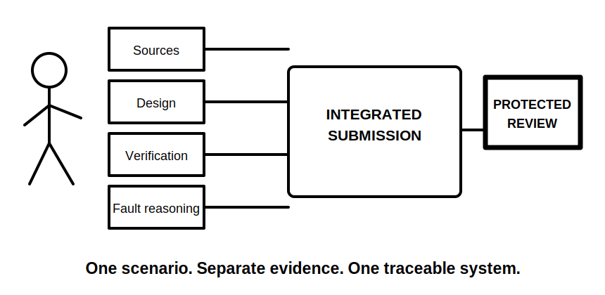
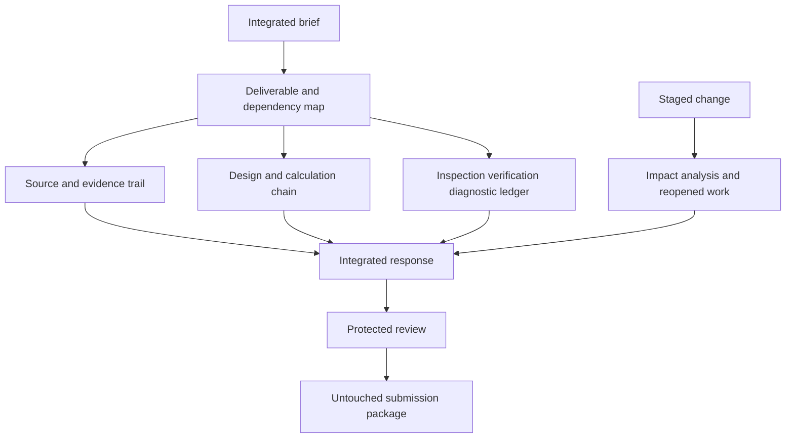

# Day 83 — Full Integrated Mock Assessment

> **Scope boundary:** This is an original educational simulation combining written reasoning, source navigation, design, calculation, inspection-record interpretation, verification planning and fault reasoning. It is not an official assessment and does not authorise practical work or establish competency.

## 1. Outcome and entry check

By the end, the learner can independently:

1. decompose a multi-domain brief into deliverables and dependencies;
2. allocate time with a protected final-review reserve;
3. distinguish facts, constraints, assumptions and evidence gaps;
4. navigate permitted sources and preserve search trails;
5. show design and calculation reasoning with provenance and units;
6. integrate inspection, verification and diagnostic evidence without overclaiming;
7. respond to a staged change by reopening affected work; and
8. submit a complete untouched evidence package for Day 84 review.

### Entry check

Proceed only with the Day 82 readiness note, permitted references, blank templates and adequate rest. Record the planned duration, review reserve and stop rules before opening the scenario.

## 2. Why it matters

Capstone performance depends on controlling an entire reasoning system, not producing isolated correct answers. The full mock tests whether the learner can maintain scope, evidence quality, source discipline, calculation traceability, diagnostic restraint and safety boundaries under sustained time pressure.

## 3. Core concepts and terminology

- **Integrated brief:** one scenario containing interacting written, design, inspection, verification and diagnostic tasks.
- **Deliverable map:** a list of required outputs, dependencies, completion criteria and exclusions.
- **Evidence system:** the connected set of sources, records, calculations, assumptions and conclusions supporting the response.
- **Critical path:** tasks whose delay or error blocks dependent work.
- **Completion marker:** an explicit indication that an output is complete, provisional, blocked or review-required.
- **Protected review reserve:** time allocated before starting that cannot be consumed by ordinary response work.
- **Staged change:** new information released later that requires impact analysis.
- **Untouched submission:** the original timed response preserved without post-hoc correction.

## 4. Rule-finding workflow

Use **I-N-T-E-G-R-A-T-E**:

1. **I — Identify** deliverables, exclusions and stop rules.
2. **N — Note** facts, constraints, assumptions and unknowns.
3. **T — Timebox** workstreams and protect final review.
4. **E — Evidence** claims with source trails and provenance.
5. **G — Generate** transparent design and calculation reasoning.
6. **R — Reconcile** inspection, verification and diagnostic records.
7. **A — Analyse** the staged change and reopen dependencies.
8. **T — Tag** every output complete, provisional, blocked or review-required.
9. **E — Export** the untouched submission and error-confidence record.

The parallel streams converge only after each retains its own evidence boundary and traceability.

## 5. Visual model or worked example

### Original full-mock scenario

A fictional community workshop plans an extension with a new distribution area, altered equipment use and an alternate operating arrangement. The scenario packet contains invented drawings, schedules, observations, verification records and a reported symptom. Several exact values are intentionally omitted and must remain source placeholders.

The learner must produce:

1. a brief and deliverable map;
2. a rule-navigation trail;
3. a bounded design basis and calculation chain;
4. an inspection and verification evidence ledger;
5. a competing-hypothesis register;
6. a staged-change impact record; and
7. a final completion and review-status summary.

No field action is required. A blocked conclusion with a precise evidence gap is preferable to invented certainty.

## 6. Practical application

Complete the **150-minute integrated mock**:

1. **20 minutes:** decompose brief, map deliverables and allocate time;
2. **30 minutes:** source navigation and written reasoning;
3. **35 minutes:** design basis and supported calculations;
4. **25 minutes:** inspection and verification evidence integration;
5. **15 minutes:** fault hypotheses and staged evidence update;
6. **10 minutes:** staged-change impact analysis; and
7. **15 minutes:** protected final review and submission packaging.

### Assessment rubric

| Category | 0 | 1 | 2 |
|---|---|---|---|
| Scope control | Deliverables missed | Partial map | Outputs, dependencies, exclusions and states explicit |
| Source discipline | Unsupported claims | Some trails | Current/applicable source paths and placeholders visible |
| Design reasoning | Results only | Partial chain | Basis, provenance, units, steps and gates traceable |
| Evidence integration | Records listed | Some interpretation | Claims, records, limitations and contradictions reconciled |
| Change response | Change ignored | Final answers edited | Every affected dependency reopened and retagged |
| Safety and completion | Overclaiming | General caveats | Stop rules, authority and completion markers explicit |

This rubric is educational and does not determine formal competency or readiness for unsupervised work.

## 7. Common errors and safety checkpoint

### Common errors

- solving before mapping deliverables and dependencies;
- consuming protected review time;
- using one source trail for claims with different applicability;
- presenting a calculation result without provenance or design gates;
- merging observations, results and conclusions;
- editing final outputs after a staged change without reopening reasoning;
- hiding blocked items to appear complete; and
- treating the mock score as technical approval.

### Critical errors and stop conditions

Stop or mark the affected task blocked when authorised evidence, operating state, scope or authority is unclear; when fatigue prevents reliable reasoning; or when the scenario appears to require practical access, switching, isolation, testing, measurement, alteration, energisation, commissioning, certification or verification. Do not invent exact values or procedures.

## 8. Retrieval and next links

1. Why must deliverables and dependencies be mapped before solving?
2. What makes a review reserve protected?
3. How should omitted exact values be handled?
4. What must happen after a staged change?
5. Why is an untouched submission required?

- **Plan:** [Twelve-Week Capstone Learning Plan](../MASTER_PLAN.md)
- **Knowledge note:** [[12-Week Day 83 - Full Integrated Mock Assessment]]
- **Previous:** [Day 82 — Rest and Evidence-Led Error-Log Consolidation](day-82-rest-and-evidence-led-error-log-consolidation.md)
- **Next:** Day 84 — Mock Review, Readiness Decision and Post-Program Study Plan

This module remains `review-required`, `reference_check_required`, safety-critical and not `technically-reviewed`.
