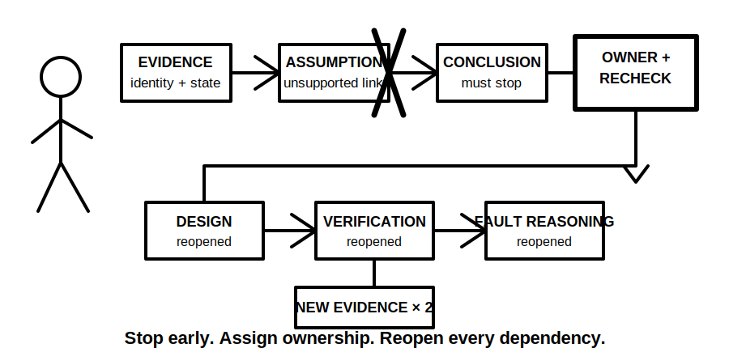
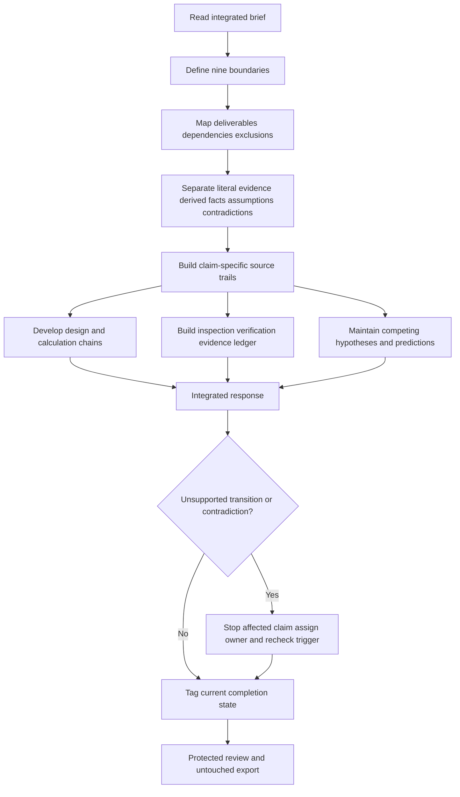
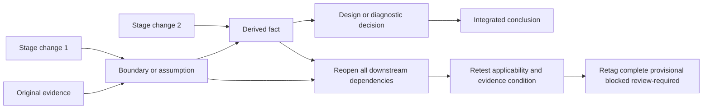

# Day 83 — Full Integrated Mock Assessment

> **Scope boundary:** This is an original educational simulation combining written reasoning, source navigation, design, calculation, inspection-record interpretation, verification planning and fault reasoning. It is not an official assessment, does not establish competency and authorises no practical electrical work.

## 1. Outcome and entry check

By the end, the learner can independently:

1. define the installation, equipment, circuit, source-state, operating-state, time, evidence, authority and requested-decision boundaries of an integrated brief;
2. convert the brief into observable deliverables, dependencies, exclusions and completion states before attempting solutions;
3. preserve literal evidence separately from derived facts, interpretations, assumptions, contradictions and conclusions;
4. build claim-specific source trails that record source identity, currency, scope and applicability;
5. show design and calculation chains with inputs, units, provenance, transformations, dependencies and unresolved gates;
6. maintain at least three materially different fault hypotheses with falsifiable predictions and discriminating evidence;
7. stop each claim chain at its first unsupported transition and assign an evidence owner plus recheck trigger;
8. respond to two sequential staged changes by reopening every affected dependency rather than editing only the final answer;
9. apply independent `secure`, `developing`, `unsupported` and `stop-required` review states without averaging away a critical weakness; and
10. preserve an untouched submission package for Day 84 review.

### Entry check

Proceed only when all of the following are true:

- the Day 82 readiness note permits a full mock rather than reduced-load recovery;
- the learner has the permitted references, blank templates and an error-confidence record;
- the planned duration, stage gates, protected review reserve and stop conditions are recorded before the scenario is opened; and
- fatigue, distraction or time pressure is not already preventing reliable evidence control.

If any condition is not met, record `stop-required` or reschedule the mock. Starting while unable to preserve evidence quality does not create useful assessment evidence.

## 2. Why it matters

Capstone performance depends on controlling an entire reasoning system, not accumulating isolated correct answers. A technically plausible result can still be unusable when its circuit identity is uncertain, its source state is different, its value lacks provenance, its evidence is historical, or a later change invalidates an upstream assumption.

The full mock therefore tests whether the learner can keep multiple workstreams distinct while showing how they interact. It also tests restraint: a bounded conclusion with a precise evidence gap is stronger than confident completion built on an unsupported transition.

*Caption: Keep source, design, verification and fault-reasoning evidence distinct until each stream is traceable enough to support the integrated response.*

*Caption: New evidence changes upstream assumptions first; every dependent output must then be reopened and retagged.*

## 3. Core concepts and terminology

- **Integrated brief:** one scenario containing interacting written, design, inspection, verification and diagnostic tasks.
- **Boundary:** the explicit limit within which a statement is intended to apply. This mock tracks installation, equipment, circuit, source state, operating state, time, evidence, authority and requested decision separately.
- **Deliverable map:** a list of required outputs, dependencies, exclusions and completion criteria.
- **Dependency:** an input, assumption, decision or evidence item that another output relies on.
- **Critical path:** the sequence of dependencies whose delay, failure or change blocks later work.
- **Literal evidence:** what a supplied record, observation or witness statement actually says before interpretation.
- **Derived fact:** a result obtained from identified inputs by a visible transformation, such as a calculation or classification.
- **Interpretation:** an explanation of what evidence may mean within stated boundaries.
- **Assumption:** a temporary proposition used because required evidence is absent; it must be visible and cannot be treated as established fact.
- **Contradiction:** two evidence items or interpretations that cannot both be accepted within the same stated boundaries.
- **Evidence condition:** the current support state of an item: `supported`, `partially-supported`, `contradicted`, `not-provided`, `not-applicable` or `authority-required`.
- **First unsupported transition:** the earliest step where a claim moves beyond what the preceding evidence supports.
- **Evidence owner:** the person, role or authorised source responsible for resolving a gap; naming an owner does not grant that person authority.
- **Recheck trigger:** the specific evidence or decision that requires the blocked work to be reconsidered.
- **Competing hypothesis:** one of several materially different explanations that could account for the same symptom.
- **Falsifiable prediction:** an expected observation that could weaken or reject a hypothesis.
- **Discriminating evidence:** evidence that separates competing hypotheses rather than merely confirming all of them.
- **Completion marker:** an explicit state applied to an output: `complete`, `provisional`, `blocked` or `review-required`.
- **Protected review reserve:** learner-selected time reserved before starting and unavailable for ordinary response work.
- **Staged change:** new information released after work has begun that may invalidate upstream evidence or assumptions.
- **Untouched submission:** the original timed response preserved without post-hoc correction so Day 84 can examine the real reasoning process.
- **Non-compensatory blocker:** a critical weakness that cannot be offset by stronger formatting, speed or unrelated correct work.

## 4. Rule-finding workflow

Use **I-N-T-E-G-R-A-T-E**:

1. **I — Identify** every deliverable, exclusion, boundary, dependency and stop condition.
2. **N — Note** literal evidence, derived facts, assumptions, contradictions and missing information in separate fields.
3. **T — Timebox** workstreams using learner-selected stage gates while protecting the final review reserve.
4. **E — Evidence** each material claim with a claim-specific trail recording source identity, currency, scope and applicability.
5. **G — Generate** design and calculation chains with visible inputs, units, provenance, transformations and unresolved gates.
6. **R — Reconcile** inspection records, verification evidence and at least three competing diagnostic hypotheses without merging observation and conclusion.
7. **A — Analyse** each staged change from the earliest affected dependency and reopen all downstream work.
8. **T — Tag** every deliverable `complete`, `provisional`, `blocked` or `review-required`, including an evidence owner and recheck trigger where unresolved.
9. **E — Export** the untouched response, source trail, change log, confidence record and review-state summary.

The diagram shows that integration occurs only after each workstream retains its own evidence boundary. A contradiction or unsupported transition blocks the affected claim; it does not justify silently borrowing certainty from another workstream.

### Six evidence conditions

Apply one condition to each material item:

1. `supported` — sufficient identified evidence supports the item within its stated boundaries;
2. `partially-supported` — some support exists, but a material limit remains;
3. `contradicted` — relevant evidence conflicts and the conflict is unresolved;
4. `not-provided` — required evidence is absent from the scenario package;
5. `not-applicable` — the item is outside the stated boundaries, with the reason recorded; or
6. `authority-required` — a qualified person, authorised source or formal decision is required before the item can progress.

These conditions describe evidence, not confidence. A learner can be highly confident in an item that remains `contradicted` or `not-provided`.

### Reopening after change

A later change must be propagated from the earliest affected point. After two sequential material changes, reopening only the final paragraph is insufficient because intermediate calculations, source applicability, hypotheses and completion markers may also have changed.

## 5. Visual model or worked example

### Original full-mock scenario

A fictional community workshop is planning an extension containing a new distribution area, changed equipment use and an alternate operating arrangement. The invented scenario packet contains:

- a current brief naming distribution board `DB-W2`;
- an older schedule referring to `DB-WEST` without proving that both identifiers describe the same board;
- a drawing marked “for coordination” whose approval status is not supplied;
- a load schedule containing one value without a stated duty basis;
- a route sketch that omits part of the environmental context;
- an inspection photograph with no confirmed date or circuit identity;
- a verification record taken under one source state while the reported symptom occurred under another;
- a witness statement saying the equipment “sometimes stops after changeover” without a timestamp or operating sequence;
- a proposed protective-device substitution with no authorised technical basis supplied; and
- exact acceptance values intentionally omitted and represented only by source placeholders.

The learner must produce twelve artefacts:

1. boundary register;
2. deliverable and dependency map;
3. literal-evidence and interpretation ledger;
4. contradiction register;
5. claim-specific rule-navigation trail;
6. bounded design basis;
7. transparent calculation chain;
8. inspection and verification evidence ledger;
9. three-hypothesis diagnostic register with predictions;
10. staged-change impact log;
11. completion-state and evidence-owner summary; and
12. untouched submission package with confidence calibration.

### Staged release A

The first release states that `DB-WEST` was renamed `DB-W2`, but it does not establish whether the historical schedule was updated after equipment changes. Reopen identity-dependent work, but do not automatically accept historical ratings, route conditions or source arrangements as current.

### Staged release B

The second release states that an alternate source controller was replaced after the supplied verification record was created. Reopen source-state applicability, affected design assumptions, verification interpretations, fault hypotheses and any conclusion dependent on the earlier configuration.

A blocked conclusion with a precise gap, evidence owner and recheck trigger is preferable to invented certainty.

## 6. Practical application

Complete the **150-minute educational mock**. These timings are learner-selected pacing controls, not official assessment conditions:

1. **20 minutes:** define boundaries, decompose the brief and map dependencies;
2. **25 minutes:** build literal-evidence, contradiction and source-navigation records;
3. **35 minutes:** produce the bounded design basis and calculation chains;
4. **25 minutes:** integrate inspection and verification evidence;
5. **15 minutes:** develop competing hypotheses, predictions and discriminating-evidence requests;
6. **15 minutes:** process both staged releases and reopen dependencies; and
7. **15 minutes:** protected final review, completion-state tagging and untouched export.

At each stage gate, either:

- complete the bounded artefact;
- mark it `provisional` with the limiting assumption;
- mark it `blocked` with the first unsupported transition, evidence owner and recheck trigger; or
- mark it `review-required` where qualified judgement is needed.

Do not consume the protected review reserve to hide incomplete work.

### Independent review states

Assign each criterion one state; do not calculate an aggregate score.

| Criterion | `secure` | `developing` | `unsupported` | `stop-required` |
|---|---|---|---|---|
| Boundary and scope control | All nine boundaries, deliverables and exclusions are explicit | Minor omissions do not change the reasoning boundary | A material boundary or deliverable is unclear | Authority or practical scope is treated as granted without evidence |
| Evidence separation | Literal evidence, derived facts, interpretations and assumptions remain distinct | Separation is mostly visible with isolated ambiguity | Conclusions are mixed with records or provenance is missing | Altered, invented or misrepresented evidence is used |
| Source discipline | Material claims have current, applicable, reproducible source trails | Trails exist but one material applicability check is incomplete | Material claims rely on unsupported or untraceable sources | Copyrighted tables, systematic clause wording or unauthorised procedures are reproduced |
| Design and calculation traceability | Inputs, units, provenance, transformations and gates are visible | Chain is mostly traceable but one dependency is weak | Result cannot be reproduced or a material input is unsupported | A safety-critical result is presented as approved despite a blocker |
| Inspection and verification integration | Records, source state, time, limitations and contradictions are reconciled | Most boundaries are controlled but one material limitation remains | Historical or different-state evidence is treated as directly applicable | Practical testing, acceptance or certification is claimed without authority |
| Diagnostic reasoning | Three distinct hypotheses, predictions and discriminating evidence are maintained | Hypotheses are distinct but ranking or prediction quality is incomplete | One preferred cause is asserted without adequate alternatives | Root cause or successful correction is declared without supporting evidence |
| Change propagation | Both changes reopen all affected dependencies and outputs | Reopening is mostly complete with one minor missed dependency | Only final answers are edited | A material change is ignored while certainty is retained |
| Completion and restraint | Every output is tagged and limitations are explicit | States are present but one recheck trigger is weak | Blocked work is hidden or completion is ambiguous | Competency, technical approval or permission for field work is claimed |

### Non-compensatory blockers

Any of the following prevents an overall `secure` learning-readiness summary regardless of strengths elsewhere:

- altered or invented evidence;
- an unresolved safety-critical contradiction presented as resolved;
- a material claim continuing beyond its first unsupported transition;
- an exact value, method or acceptance decision presented without authorised support;
- practical authority, competency, certification or technical approval being claimed;
- failure to reopen dependencies after a material staged change; or
- fatigue severe enough to prevent reliable evidence control.

## 7. Common errors and safety checkpoint

### Common errors

- solving before defining boundaries and dependencies;
- treating old and current identifiers as equivalent without proving continuity;
- using one source trail for claims with different scope or applicability;
- presenting a calculation result without input provenance or design gates;
- merging witness wording, observations, results and conclusions;
- choosing one fault hypothesis before identifying discriminating evidence;
- changing only the final answer after staged evidence arrives;
- consuming protected review time to make incomplete work appear finished;
- averaging a critical evidence failure into an otherwise strong performance;
- hiding blocked items instead of recording owners and recheck triggers; and
- treating the educational review state as a formal pass, competency decision or technical approval.

### Critical errors and stop conditions

Stop or mark the affected task `blocked` or `stop-required` when authorised evidence, source applicability, operating state, scope, identity or authority is unclear; when a contradiction cannot be resolved from the supplied packet; when fatigue prevents reliable reasoning; or when the scenario appears to require practical access, opening, switching, isolation, proving de-energised, testing, measurement, instrument use, alteration, repair, energisation, commissioning, acceptance, certification or verification.

Do not invent exact clauses, values, procedures, test sequences, instrument instructions, acceptance criteria or role permissions. Current authorised sources and qualified review are required before any safety-critical conclusion can be treated as technically accepted.

## 8. Retrieval and next links

1. Why must all nine boundaries be stated before integrated work begins?
2. How does a literal evidence item differ from an interpretation or assumption?
3. What is the first unsupported transition, and what must be recorded there?
4. Why can confidence not replace an evidence condition?
5. What makes evidence discriminating between fault hypotheses?
6. What must reopen after each staged change?
7. Why can a non-compensatory blocker not be offset by good timing or presentation?
8. Why must the timed submission remain untouched for Day 84?

- **Plan:** [Twelve-Week Capstone Learning Plan](../MASTER_PLAN.md)
- **Knowledge note:** [[12-Week Day 83 - Full Integrated Mock Assessment]]
- **Previous:** [Day 82 — Rest and Evidence-Led Error-Log Consolidation](day-82-rest-and-evidence-led-error-log-consolidation.md)
- **Next:** [Day 84 — Mock Review, Readiness Decision and Post-Program Study Plan](day-84-mock-review-readiness-decision-and-post-program-study-plan.md)

This module remains `review-required`, `reference_check_required`, safety-critical and not `technically-reviewed`.