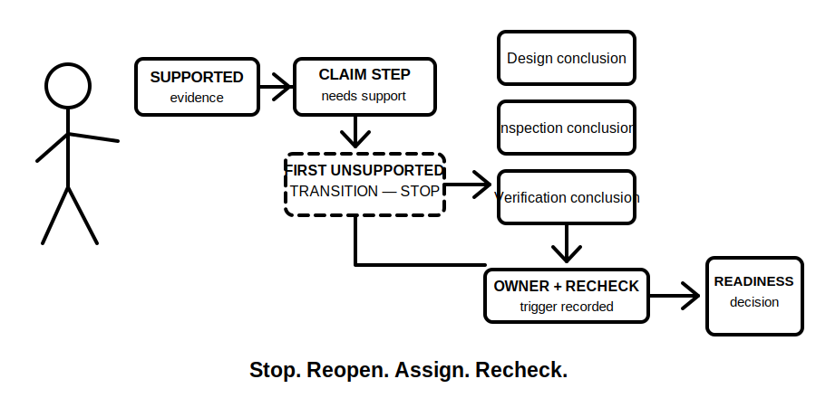
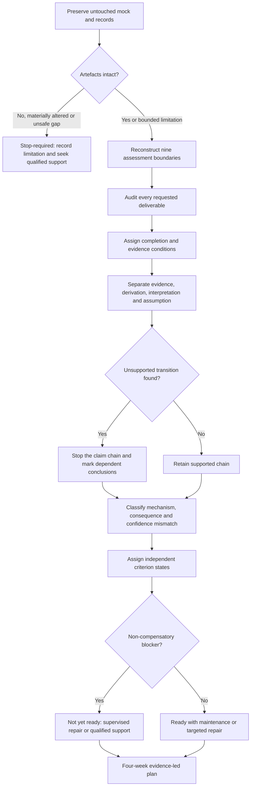
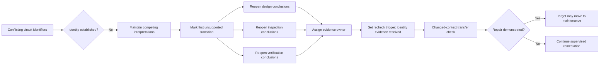

# Day 84 — Mock Review, Readiness Decision and Post-Program Study Plan

> **Scope boundary:** This module reviews an original educational mock and produces a bounded learning-readiness decision. It is not an official assessment, a declaration of competency, technical approval or authority for unsupervised electrical work.

## 1. Outcome and entry check

By the end, the learner can independently:

1. preserve the untouched Day 83 submission and its timing, confidence and source-trail records;
2. reconstruct the assessment boundary across installation, equipment, circuit, source state, operating state, time, evidence, authority and requested decision;
3. audit each required deliverable against explicit completion and evidence conditions;
4. separate literal evidence, derived facts, interpretations, assumptions, contradictions and unresolved gaps;
5. locate the first unsupported transition in each weak claim chain and trace its downstream effects;
6. classify errors by mechanism, consequence, confidence mismatch and recurrence rather than by topic alone;
7. assign independent `secure`, `developing`, `unsupported` or `stop-required` states without averaging away blockers;
8. select no more than three priority remediation targets with evidence owners and recheck triggers;
9. build a four-week post-program plan using retrieval, varied transfer, recovery and qualified escalation; and
10. distinguish learning readiness from formal competency, technical acceptance and practical authority.

### Entry check

Proceed only when the untouched Day 83 submission, original time record, confidence record, permitted source trails, staged-change notes and mock brief are available. Record any missing or altered artefact before review. Do not repair the submission during the first pass.

Use one entry state:

- **review-ready:** all core artefacts are preserved and readable;
- **review-limited:** one or more non-critical artefacts are missing, but the limitation can be stated and affected conclusions bounded; or
- **stop-required:** the original submission is materially altered, the brief cannot be reconstructed, safety-critical evidence is absent, authority is unclear or fatigue prevents reliable review.

## 2. Why it matters

A mock has limited value if it produces only a score. The useful output is a traceable explanation of what the learner could do, where the reasoning chain failed, which weaknesses propagate into later decisions, how confidence matched evidence and what remains unresolved. A bounded readiness decision prevents both false reassurance and unnecessary repetition.

A correct final number can conceal an unsafe or unsupported method. Conversely, an incomplete answer can still show a sound boundary, source trail and stop decision. Review therefore separates performance dimensions and prevents strength in presentation or timing from compensating for a safety-critical or dependency-blocking weakness.

*Caption: Preserve the original evidence, review separate performance lenses, then build a bounded study plan.*

*Caption: A readiness decision is deferred until unsupported transitions and their dependent conclusions are explicitly controlled.*

## 3. Core concepts and terminology

- **Untouched submission:** the original timed response preserved without correction so performance evidence remains valid.
- **Assessment boundary:** the defined installation, equipment, circuit, source-state, operating-state, time, evidence, authority and requested-decision limits within which a response was made.
- **Deliverable audit:** a comparison between each requested output and the evidence actually submitted.
- **Literal evidence:** information reproduced directly from the mock dossier or authorised source trail without interpretation.
- **Derived fact:** information produced by a visible calculation or transformation from stated inputs.
- **Interpretation:** a reasoned meaning assigned to evidence; it must remain distinguishable from the evidence itself.
- **Assumption:** an unstated condition temporarily adopted to continue reasoning; it must be visible, bounded and revisited.
- **Contradiction:** two evidence items that cannot both support the same claim without reconciliation.
- **Evidence condition:** the state of support for a claim: `supported`, `partially-supported`, `contradicted`, `not-provided`, `not-applicable` or `reference-check-required`.
- **First unsupported transition:** the earliest step where a claim chain moves beyond available evidence or an authorised rule.
- **Dependent conclusion:** a later conclusion whose validity relies on an earlier premise, calculation, interpretation or source decision.
- **Error mechanism:** the process that produced an error, such as source-selection failure, boundary omission, transcription error, dependency omission or premature closure.
- **Consequence rating:** the likely effect of an error on safety boundaries, later reasoning, completeness or transfer.
- **Confidence mismatch:** a gap between expressed confidence and the quality of supporting evidence.
- **Non-compensatory blocker:** a weakness that cannot be offset by unrelated strengths, timing or presentation.
- **Evidence owner:** the person or role responsible for obtaining, checking or confirming missing evidence.
- **Recheck trigger:** the event that requires a claim or readiness state to be reviewed again.
- **Learning readiness:** evidence that the learner is prepared for the next supervised learning step; it is not formal competency.
- **Transfer check:** a fresh, changed-context task used to test whether a repaired reasoning method generalises.
- **Maintenance domain:** a capability that is currently stable but still requires spaced retrieval.
- **Priority remediation target:** a specific, observable weakness selected because it is safety-critical, dependency-blocking or repeatedly demonstrated.

## 4. Rule-finding workflow

Use **R-E-V-I-E-W**:

1. **R — Retain** the untouched submission, brief, timing record, confidence record and source trails. Record any integrity limitation.
2. **E — Establish boundaries** for installation, equipment, circuit, source state, operating state, time, evidence, authority and requested decision.
3. **V — Verify deliverables and evidence** by assigning a completion state and one of the six evidence conditions to every requested output.
4. **I — Inspect claim chains** by separating literal evidence, derived facts, interpretations and assumptions, then stopping at the first unsupported transition.
5. **E — Evaluate mechanisms and readiness** using independent criterion states, non-compensatory blockers, confidence mismatch and downstream dependency effects.
6. **W — Write the recovery plan** with no more than three priorities, evidence owners, recheck triggers, transfer checks, recovery periods and qualified escalation points.

The workflow keeps evidence preservation, claim review and readiness classification separate. The decision follows the evidence; it does not precede it.

### Independent review states

Assign one state to each criterion rather than calculating a total score:

- **secure:** the criterion is complete, traceable, internally consistent and supported within the stated boundary;
- **developing:** the method is substantially sound but contains a bounded weakness that has not propagated into an unsafe or unsupported conclusion;
- **unsupported:** the conclusion or method exceeds the available evidence, omits a dependency or cannot be reproduced; or
- **stop-required:** a safety-critical, authority, evidence-integrity or prerequisite blocker prevents a defensible readiness decision.

### Non-compensatory blockers

Do not average away:

- an unresolved safety-critical misconception;
- unclear practical authority or supervision boundary;
- a materially altered or unverifiable submission;
- an unsupported source-applicability claim that controls later conclusions;
- an untraced staged change affecting dependent calculations or decisions;
- an unresolved contradiction in equipment, circuit or source identity; or
- fatigue or cognitive overload that prevents reliable review.

## 5. Visual model or worked example

### Original review example

A learner completes the Day 83 community-workshop mock within the learner-selected time limit. Several design results appear plausible. The response contains visible calculations and a generally clear report, but review identifies four issues:

1. two source trails name a relevant document but do not establish currency or applicability;
2. a later alternative-source note is acknowledged but dependent protection and verification conclusions are not reopened;
3. a circuit identifier differs between the inspection record and the design schedule, yet the response treats them as the same circuit; and
4. the learner records high confidence for both unsupported conclusions.

The review must not collapse these findings into one score.

| Review criterion | Evidence-led state | Reason |
|---|---|---|
| Deliverable coverage | developing | most outputs exist, but one change-impact record is incomplete |
| Source navigation | unsupported | applicability is not demonstrated for two controlling claims |
| Calculation traceability | secure | inputs, transformations and units are visible |
| Boundary control | unsupported | conflicting circuit identity remains unresolved |
| Change propagation | unsupported | dependent conclusions were not reopened |
| Safety and authority | developing | no practical procedure is attempted, but unsupported acceptance language must be removed |
| Confidence calibration | unsupported | high confidence is not matched by evidence quality |
| Time control | secure | the review reserve was preserved |

The first unsupported transition is the assumption that both circuit identifiers describe the same present installation. Any dependent calculation, inspection interpretation or readiness conclusion must be reopened until identity is established or competing interpretations are maintained.

The diagram shows why one upstream identity gap can invalidate several downstream conclusions. Repair is demonstrated only when the learner applies the corrected method in a fresh context.

The bounded decision is **ready with targeted repair** only when no non-compensatory blocker remains. Otherwise it is **not yet ready**. Neither label means competent, failed, technically approved or authorised for practical work.

## 6. Practical application

Complete a **60-minute educational review**. This duration is a learner-selected pacing control, not an official assessment condition.

1. **10 minutes — evidence preservation:** duplicate the untouched submission read-only, record file identity and list missing artefacts.
2. **10 minutes — boundary and deliverable audit:** reconstruct the nine boundaries and map each requested output to submitted evidence.
3. **15 minutes — claim-chain inspection:** identify literal evidence, derived facts, interpretations, assumptions, contradictions and the first unsupported transition.
4. **10 minutes — mechanism and consequence review:** classify root mechanisms, downstream effects and confidence mismatches.
5. **5 minutes — readiness states:** assign independent states and apply non-compensatory blockers.
6. **10 minutes — post-program plan:** select up to three remediation targets and define owners, recheck triggers, transfer checks and recovery periods.

### Required review artefacts

Produce:

1. an untouched-submission integrity note;
2. a nine-boundary review record;
3. a deliverable-to-evidence matrix;
4. a claim-chain log identifying first unsupported transitions;
5. an error-mechanism and consequence table;
6. a confidence-calibration note;
7. independent criterion states with blocker decisions;
8. no more than three remediation targets;
9. an evidence-owner and recheck-trigger register; and
10. a four-week post-program study plan.

### Readiness categories

- **Ready with maintenance:** every non-compensatory blocker is cleared; stable capabilities receive spaced retrieval and varied scenarios.
- **Ready with targeted repair:** progression is reasonable only with explicit remediation, supervision where required and changed-context transfer checks.
- **Not yet ready:** an unresolved prerequisite, safety-critical, authority, evidence-integrity or dependency-blocking weakness requires supervised repair or qualified support before progression.

### Four-week plan pattern

| Week | Primary purpose | Required evidence | Recovery and stop control |
|---|---|---|---|
| 1 | Repair up to three root mechanisms | corrected explanation and one fresh application per target | stop when fatigue prevents reliable comparison |
| 2 | Interleave repaired and stable domains | mixed retrieval record with separate confidence and evidence ratings | include at least one deliberate recovery block |
| 3 | Complete changed-context transfer | independent scenario, claim-chain log and error review | defer any practical or safety-critical uncertainty to qualified support |
| 4 | Reassess readiness and maintenance needs | bounded review note, updated states and next study cycle | do not infer competency or technical approval |

For each remediation target, state:

- the observable behaviour to change;
- the root error mechanism;
- the affected dependencies;
- the evidence owner;
- the recheck trigger;
- the changed-context transfer task;
- the evidence required to close or retain the target; and
- the supervision or qualified-review requirement.

This pattern is educational. Actual RTO assessment arrangements, permitted resources, timing, competency decisions and practical permissions must come from current authorised instructions and qualified people.

## 7. Common errors and safety checkpoint

### Common errors

- correcting the mock before preserving the original evidence;
- reducing review to a total score or percentage;
- treating a correct result as proof of a correct, applicable or safe process;
- treating a named source as proof of currency, scope or applicability;
- listing weak topics without identifying error mechanisms;
- repairing downstream symptoms while leaving the first unsupported transition intact;
- allowing timing or presentation strengths to compensate for a blocker;
- selecting too many remediation targets;
- repeating the same scenario instead of testing changed-context transfer;
- treating confidence as evidence of correctness;
- closing a target without an evidence owner, recheck trigger or transfer result;
- declaring competency, technical approval or authority from automated learning content; and
- omitting unresolved source, technical-review or practical-supervision requirements.

### Critical errors and stop conditions

Stop the readiness decision and seek qualified support when:

- the untouched submission or brief is materially altered or unavailable;
- a safety-critical misconception remains unresolved;
- source currency, scope or applicability cannot be established for a controlling claim;
- circuit, equipment or source identity remains contradictory and affects dependent conclusions;
- practical authority, supervision or role permission is unclear;
- a staged change has not been propagated through affected dependencies;
- the review would require a real practical procedure, test, measurement, alteration or acceptance decision; or
- fatigue prevents reliable evidence separation.

This module authorises no site access, opening, switching, isolation, proving de-energised, testing, measurement, instrument use, alteration, repair, energisation, commissioning, acceptance, certification, verification or field fault finding. Do not infer official pass criteria, technical acceptance or permission to undertake electrical work.

## 8. Retrieval and next links

1. What artefacts must remain untouched before the review begins?
2. What are the nine assessment boundaries?
3. How do the six evidence conditions differ?
4. What is the first unsupported transition, and why must dependent conclusions reopen?
5. Why are criterion states independent rather than averaged?
6. Name three non-compensatory blockers.
7. How does an error mechanism differ from a weak topic label?
8. What distinguishes learning readiness from formal competency?
9. Why must remediation targets have evidence owners, recheck triggers and changed-context transfer checks?
10. What evidence should exist at the end of the four-week post-program plan?

- **Plan:** [Twelve-Week Capstone Learning Plan](../MASTER_PLAN.md)
- **Knowledge note:** [[12-Week Day 84 - Mock Review, Readiness Decision and Post-Program Study Plan]]
- **Previous:** [Day 83 — Full Integrated Mock Assessment](day-83-full-integrated-mock-assessment.md)
- **Next:** Final program-wide completion audit

This module remains `review-required`, `reference_check_required`, safety-critical and not `technically-reviewed`.