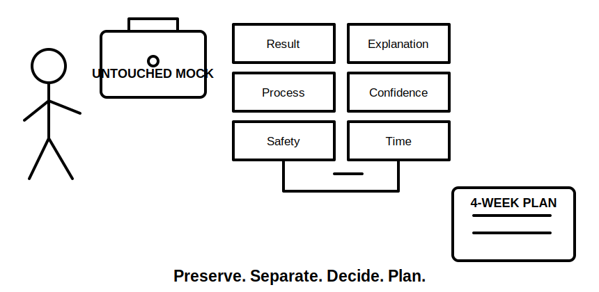
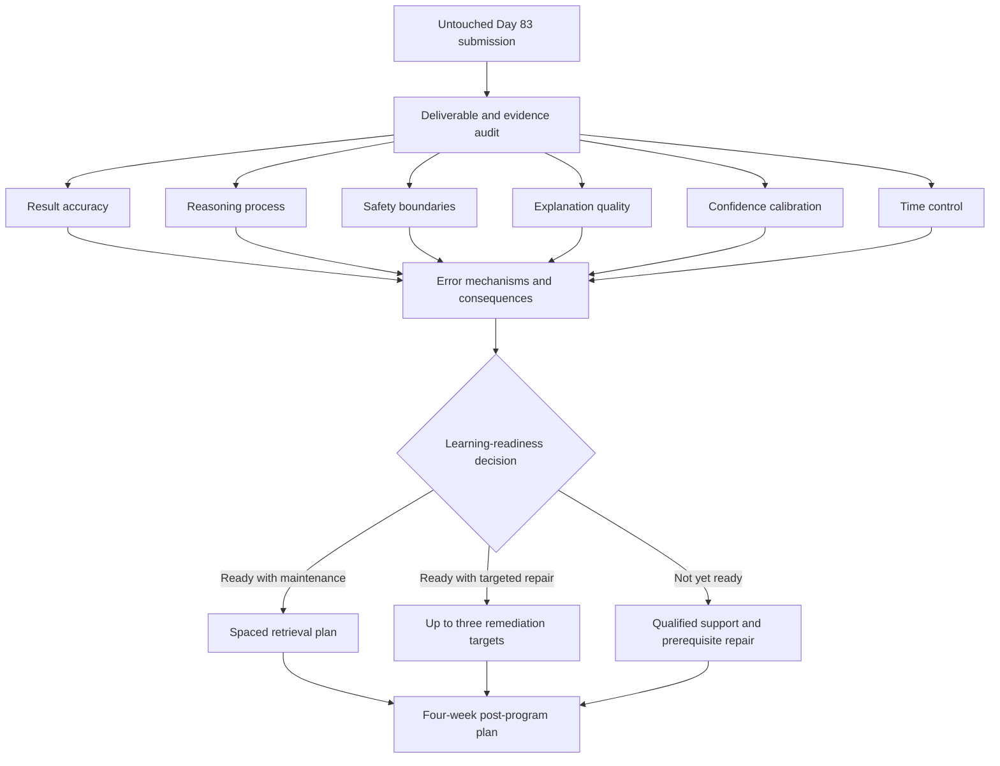

# Day 84 — Mock Review, Readiness Decision and Post-Program Study Plan

> **Scope boundary:** This module reviews an original educational mock and produces a learning-readiness decision. It is not an official assessment, a declaration of competency, technical approval or authority for unsupervised electrical work.

## 1. Outcome and entry check

By the end, the learner can independently:

1. preserve the untouched Day 83 submission before reviewing it;
2. compare required deliverables with submitted evidence;
3. separate correct results, correct reasoning, safe reasoning, explanation quality, confidence and time control;
4. classify errors by mechanism and consequence rather than topic alone;
5. distinguish learning readiness from formal competency or practical authority;
6. identify no more than three priority remediation targets;
7. build a four-week post-program study plan using retrieval, varied practice and recovery; and
8. record unresolved technical, source and safety-review requirements without concealing them.

### Entry check

Proceed only when the untouched Day 83 submission, original time record, confidence record, permitted source trails and any staged-change notes are available. Do not repair the submission before completing the first review pass.

## 2. Why it matters

A mock has limited value if it produces only a score. The useful output is a traceable explanation of what the learner could do, where the reasoning failed, how confidence matched performance and what evidence is still missing. A bounded readiness decision prevents both false reassurance and unnecessary repetition.

## 3. Core concepts and terminology

- **Untouched submission:** the original timed response preserved without correction so performance evidence remains valid.
- **Review lens:** one defined aspect of performance examined separately, such as result accuracy, process, safety, explanation, confidence or time control.
- **Error mechanism:** the reason an error occurred, for example source-selection failure, dependency omission, calculation-transcription error or premature conclusion.
- **Consequence rating:** the likely effect of an error on later reasoning, safety boundaries or completeness.
- **Learning readiness:** evidence that the learner is prepared for the next supervised learning step; it is not formal competency.
- **Transfer check:** a fresh, changed-context task used to test whether a repaired reasoning method generalises.
- **Maintenance domain:** a capability that is currently stable but still requires spaced retrieval.
- **Priority remediation target:** a specific, observable weakness selected because it is safety-critical, dependency-blocking or repeatedly demonstrated.

## 4. Rule-finding workflow

Use **R-E-V-I-E-W**:

1. **R — Retain** the untouched submission and original timing evidence.
2. **E — Extract** deliverables, completion states and source trails.
3. **V — View** performance through the six separate review lenses.
4. **I — Identify** error mechanisms, confidence mismatches and dependency effects.
5. **E — Establish** a bounded readiness decision and no more than three remediation priorities.
6. **W — Write** the post-program plan, transfer checks, review dates and escalation needs.

The diagram separates evidence review from the readiness decision. No single score, correct result or confident response is sufficient by itself.

## 5. Visual model or worked example

### Original review example

A learner completes the Day 83 mock within time and obtains several plausible design results. Review shows that the calculations are traceable, but two source trails do not establish applicability, one staged change was acknowledged without reopening a dependent conclusion, and the learner marked high confidence on both errors.

A defensible review records:

- **Result accuracy:** several results appear plausible, but acceptance remains reference-dependent.
- **Process:** calculation provenance is strong; applicability and change-impact controls are inconsistent.
- **Safety:** no practical procedure was attempted, but the unsupported conclusions require correction before progression.
- **Explanation:** most reasoning is visible; two dependency links are missing.
- **Confidence:** high-confidence errors indicate a misconception risk.
- **Time:** the protected review reserve was preserved.

The learning-readiness decision is **ready for targeted repair**, not “competent” and not “failed.” The priorities are applicability checking and staged-change dependency reopening. A fresh scenario tests both after remediation.

## 6. Practical application

Complete a **60-minute evidence-led review**:

1. **10 minutes:** preserve files and audit deliverables against the Day 83 brief;
2. **20 minutes:** review the six lenses without changing the submission;
3. **10 minutes:** classify error mechanisms, consequence and confidence mismatch;
4. **10 minutes:** select a readiness category and no more than three priorities; and
5. **10 minutes:** write a four-week study plan with retrieval dates, varied transfer tasks, recovery periods and escalation points.

### Readiness categories

- **Ready with maintenance:** no unresolved safety-critical or dependency-blocking learning error; continue spaced retrieval and varied scenarios.
- **Ready with targeted repair:** progression is reasonable only with explicit remediation and transfer checks.
- **Not yet ready:** unresolved prerequisite, safety-critical, authority or evidence-quality weakness requires supervised repair or qualified support before progression.

### Four-week plan pattern

| Week | Primary purpose | Required evidence |
|---|---|---|
| 1 | Repair priority mechanisms | corrected explanation plus one fresh application |
| 2 | Interleave repaired and stable domains | mixed retrieval record with confidence ratings |
| 3 | Complete changed-context transfer | independent scenario and error review |
| 4 | Reassess readiness and maintenance needs | bounded review note and next study cycle |

This pattern is educational. Actual RTO assessment arrangements, permitted resources, timing and competency decisions must come from current authorised instructions.

## 7. Common errors and safety checkpoint

### Common errors

- correcting the mock before preserving the original evidence;
- reducing review to a total score;
- treating a correct result as proof of a correct or safe process;
- listing weak topics without identifying error mechanisms;
- selecting too many remediation targets;
- repeating the same scenario instead of testing transfer;
- treating confidence as evidence of correctness;
- declaring competency, technical approval or authority from automated learning content; and
- omitting unresolved source, technical-review or practical-supervision requirements.

### Critical errors and stop conditions

Stop the readiness decision and seek qualified support when evidence is missing or altered, a safety-critical misconception remains unresolved, source applicability cannot be established, practical authority is unclear, or fatigue prevents reliable review. Do not infer official pass criteria, technical acceptance or permission to undertake electrical work.

## 8. Retrieval and next links

1. Why must the Day 83 submission remain untouched during the first review pass?
2. What are the six review lenses?
3. How does an error mechanism differ from a weak topic label?
4. What distinguishes learning readiness from formal competency?
5. Why are remediation priorities limited and followed by transfer checks?
6. What evidence should exist at the end of the four-week post-program plan?

- **Plan:** [Twelve-Week Capstone Learning Plan](../MASTER_PLAN.md)
- **Knowledge note:** [[12-Week Day 84 - Mock Review, Readiness Decision and Post-Program Study Plan]]
- **Previous:** [Day 83 — Full Integrated Mock Assessment](day-83-full-integrated-mock-assessment.md)
- **Next:** Quality-improvement pass — Day 1

This module remains `review-required`, `reference_check_required`, safety-critical and not `technically-reviewed`.