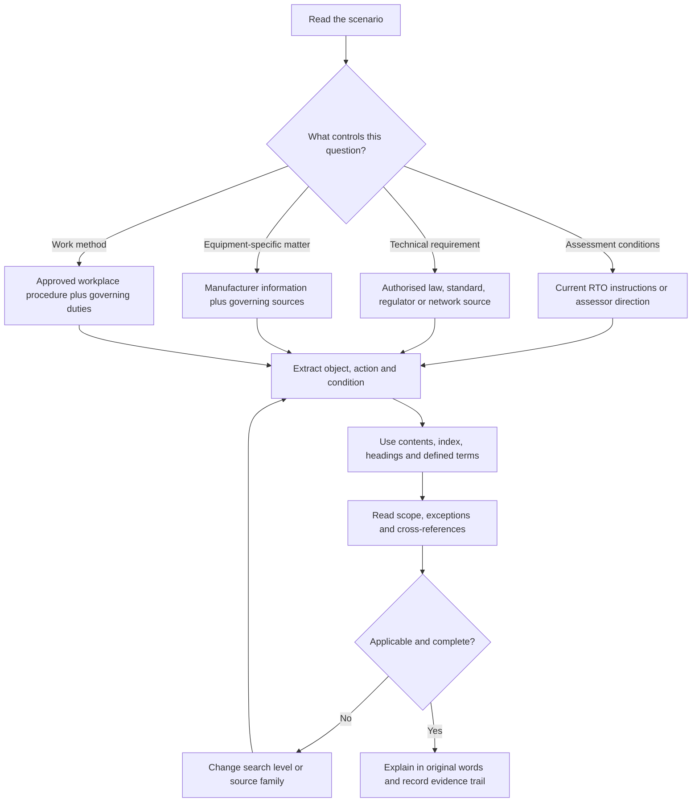
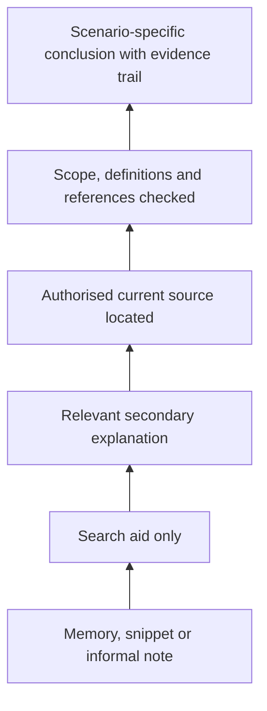
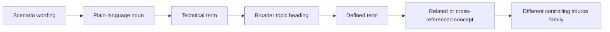
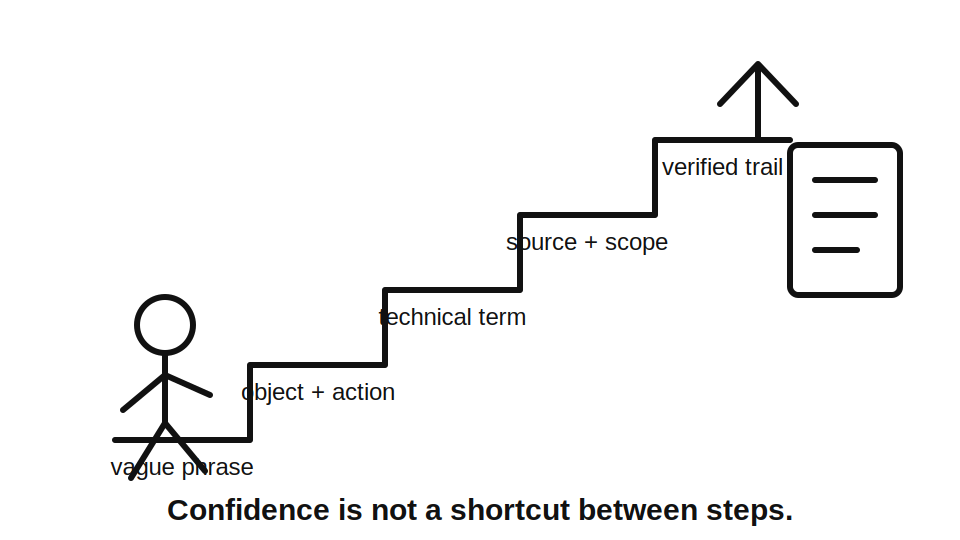

# Day 1 — Exam Orientation and Wiring Rules Navigation

> **Currency notice:** This module teaches a method for navigating authorised sources. It does not state a universal exam format, permitted-resource rule, pass mark, clause location or technical requirement. Confirm current assessment arrangements with the learner's RTO and verify technical conclusions in authorised current standards, legislation, regulator guidance, network requirements and manufacturer information as applicable.

## 1. Outcome and entry check

### Learning objectives

By the end of this block, the learner should be able to:

1. distinguish an **assessment instruction** from a **technical requirement** and identify the source that controls each;
2. convert a practical scenario into two or three useful search concepts rather than searching the scenario wording verbatim;
3. use contents, headings, index entries, defined terms and cross-references to locate relevant material efficiently;
4. test whether a located passage is operative, applicable and complete before relying on it;
5. record a defensible answer trail containing source, edition, location, reasoning and unresolved checks;
6. identify weak evidence, including remembered clauses, screenshots, summaries and inaccessible references;
7. remediate a failed search by changing the search level rather than repeatedly using the same words.

### Prerequisites

- Access to the learner's current RTO assessment instructions.
- Authorised access to the current standards and reference materials permitted by the RTO.
- Familiarity with basic electrical-installation terms from workplace and trade-school training.

### Entry check

Answer without opening a reference. Mark confidence as **guessing**, **unsure**, **reasonably confident** or **certain**.

1. Where would you verify whether a particular book is permitted in an assessment?
2. What should you identify before searching when a scenario uses everyday wording?
3. Why is a clause number remembered from an older edition not sufficient evidence?
4. What must happen when a provision points to a definition, exception or another document?
5. What makes a source relevant but still insufficient for a conclusion?

Do not score this as pass or fail. Use it to expose starting navigation habits and high-confidence misconceptions.

## 2. Why it matters

Capstone questions and workplace decisions rarely use the same wording as an index. A learner may understand the electrical concept yet still lose time by searching a whole sentence, opening the wrong source family, stopping at the first plausible paragraph or failing to follow a cross-reference.

Reliable navigation separates three questions:

- **What is the assessor asking me to demonstrate?** Use current RTO instructions, task sheets and assessor direction.
- **What technical requirement applies?** Use the authorised current source that governs the topic and jurisdiction.
- **What evidence supports my conclusion?** Record the path clearly enough that another competent person can follow and challenge it.

A fast unsupported answer is weaker than a traceable answer. The goal is not to memorise every location. It is to build a repeatable route from scenario to verified decision.


## 3. Core concepts and terminology

### Assessment instruction

An **assessment instruction** states how a particular assessment is conducted. It may identify timing, available references, evidence requirements, supervision conditions or response format. These arrangements can vary by RTO, jurisdiction, qualification pathway and assessment version. They must not be inferred from a technical standard.

### Technical requirement

A **technical requirement** governs electrical design, installation, verification or safety. The controlling source may be legislation, regulation, a mandated or adopted standard, regulator direction, network requirement, manufacturer instruction or workplace procedure. Which source controls depends on the question and jurisdiction.

### Source family

A **source family** is the category of material likely to control the question. Typical families include:

- assessment administration;
- legislation and regulation;
- installation standards;
- regulator or network requirements;
- equipment-specific manufacturer information;
- workplace procedures and approved systems of work.

Selecting the source family before searching prevents random browsing.

### Authorised current source

An **authorised current source** is legitimately accessed material whose edition, amendments, jurisdiction and applicability have been checked. A screenshot, old study note, search snippet or remembered clause may generate search terms, but it is not automatically reliable evidence.

### Operative requirement

An **operative requirement** is the part of a source that governs the decision. A heading, index entry, diagram title, note or explanatory summary may assist navigation without containing the complete requirement.

### Applicability check

An **applicability check** asks whether the material actually covers the installation, equipment, location, supply arrangement, work type and date in the scenario. Relevant wording can still be inapplicable.

### Evidence trail

Use this compact record:

```text
Question or scenario:
Assessment or technical question:
Search concepts:
Controlling source family:
Source title and edition:
Location found:
Scope, definitions, exceptions and cross-references checked:
Decision in my own words:
Evidence limitation or reference check still required:
Confidence before and after verification:
```

## 4. Rule-finding workflow

Use **S-O-U-R-C-E** whenever a scenario asks what is required, permitted, prohibited, selected, installed, inspected or tested.

1. **S — Separate the question type.** Decide whether the issue is assessment administration, law, installation design, verification, equipment information or workplace procedure.
2. **O — Object, action and condition.** Extract two or three concepts, such as `switchboard` + `access` + `location`.
3. **U — Use the controlling source family.** Open the source most likely to govern the decision before searching broadly elsewhere.
4. **R — Read structure and references.** Check headings, scope, definitions, exceptions, notes and relevant cross-references.
5. **C — Confirm applicability and completeness.** Match the material to the actual equipment, location, supply, work type and jurisdiction.
6. **E — Explain and evidence.** State the conclusion in original words and record the source trail and unresolved checks.



### Evidence-strength ladder

Do not treat all information as equal.



Moving upward requires verification. Confidence does not move evidence upward by itself.

## 5. Visual model or worked example

### Worked navigation example

**Scenario:** A plan shows a switchboard beside a narrow passage with stored materials nearby. The learner is asked whether the position is acceptable.

This module does not supply the technical answer. It demonstrates the evidence path.

| Stage | Learner action | Quality check |
|---|---|---|
| Separate | Treat it as a technical installation and access question, not an assessment-administration question. | Has the controlling question type been identified? |
| Extract | Use `switchboard`, `location`, `access`, then a related concept such as `obstruction`. | Are the terms nouns and formal concepts rather than the whole sentence? |
| Choose | Select the authorised installation source family and any applicable regulator material. | Is the source current and applicable to the jurisdiction? |
| Navigate | Use contents, headings, index entries and defined terms. | Is the learner searching structure rather than isolated words only? |
| Read | Inspect the full relevant provision, scope, exceptions and neighbouring material. | Is the passage operative rather than merely descriptive? |
| Follow | Open relevant definitions and cross-references. | Is any referenced source inaccessible or unresolved? |
| Apply | Match the material to passage width, storage, access and the actual installation context. | Does the conclusion address all material scenario facts? |
| Record | State the decision in original words and flag exact conditions requiring authorised confirmation. | Could another person reproduce the search path? |


### Search-term ladder

When a search fails, change level:



Example: `board in hallway` → `switchboard` → `switchboard location` → `access` → formal defined or referenced terminology → regulator or network source if applicability requires it.



## 6. Practical application

### Timed source-navigation drill

Use three original scenarios supplied by the RTO, trainer or practice bank. Allow ten minutes per scenario.

For each scenario:

1. identify the controlling question type;
2. write no more than three initial search concepts;
3. nominate the likely source family before opening it;
4. locate the relevant subject area and record the navigation path;
5. check at least one definition, exception or cross-reference when present;
6. state a two-sentence conclusion in original words;
7. mark exact values, clause locations or jurisdiction-specific conditions requiring authorised verification;
8. record confidence before and after checking.

### Evidence-quality rubric

| Dimension | Developing | Competent for this drill |
|---|---|---|
| Source choice | Searches several unrelated documents first. | Selects and explains the likely controlling source family. |
| Search concepts | Uses the full scenario sentence or vague verbs. | Uses concise object, action and condition concepts. |
| Context reading | Stops at the first matching line. | Checks scope, definitions, exceptions and references. |
| Applicability | Repeats source wording without matching facts. | Connects each material scenario fact to the conclusion. |
| Evidence trail | Records only a clause number or answer. | Records source, edition, location, reasoning and open checks. |
| Confidence | Treats certainty as proof. | Revises confidence when evidence contradicts memory. |

Speed is secondary on the first attempt. Correct source choice and complete evidence take priority.

## 7. Common errors and safety checkpoint

### Common errors and correction method

- **Searching the full question verbatim:** extract the object, action and condition.
- **Using the first search result as the answer:** identify whether it is a heading, definition, note or operative requirement.
- **Confusing an index with a rule:** use the index only to reach the controlling material.
- **Relying on a remembered clause:** use memory as a search hint, then verify the current edition.
- **Ignoring definitions and exceptions:** follow the complete reasoning path before concluding.
- **Treating a summary as authority:** locate the authorised source and record any access gap.
- **Copying wording without applying it:** explain the conclusion in original words against scenario facts.
- **Inventing assessment rules:** confirm current RTO instructions for the specific cohort and task.
- **Searching faster after a failed attempt:** first diagnose whether the failure was source choice, terminology, scope reading or applicability.

### Safety checkpoint

This navigation module does not authorise electrical work, approach, opening, operation, energisation, isolation, testing, reset, repair, alteration or live access. When a study scenario becomes a workplace task:

- follow applicable legislation, regulator requirements and approved workplace procedures;
- remain within licence, training and supervision limits;
- use authorised current sources;
- stop when the source, equipment state, supply arrangement or safe method is unclear;
- escalate uncertainty to the supervising licensed person, assessor or authorised competent person.

A confident memory is not a control measure.

## 8. Retrieval and next links

### Recall questions

Answer without looking, then verify against this module.

1. What does each letter in **S-O-U-R-C-E** represent?
2. What three elements usually form the initial search concepts?
3. What is the difference between relevance and applicability?
4. Why can a definition or index entry be useful but insufficient?
5. What must a defensible evidence trail record?
6. What should happen when a referenced source is unavailable?
7. Which source determines permitted assessment resources?
8. What are two signs that a located passage is not yet a complete answer?

### Varied applied retrieval

For each prompt, write the likely source family, three search concepts and one applicability question:

- whether handwritten notes are allowed in an assessment;
- equipment shown near a fixed water feature;
- a manufacturer's protective setting for a motor;
- a workplace isolation method before inspection;
- a switchboard-accessibility question;
- a supply arrangement affected by a network requirement.

### Error remediation

Choose one failed drill and classify the failure as:

- wrong question type;
- weak search concepts;
- wrong source family;
- missed definition, exception or cross-reference;
- incomplete applicability check;
- unsupported conclusion;
- poor evidence record.

Correct only that failure, then repeat with a different scenario.

### Knowledge-base links

- [[Day 01 - Exam Orientation and Wiring Rules Navigation]]
- [[AS-NZS-3000-2018-Index]]
- [[Four-Week Capstone Learning Plan]]

### Next block

**Day 2 — Fundamental Safety Principles** uses the same evidence discipline to distinguish hazard, protective measure and verification evidence.

## References and review status

- AS/NZS 3000:2018 learning index in this repository — structural metadata only.
- Current authorised edition and amendments of AS/NZS 3000 — `reference_check_required`.
- Current RTO assessment instructions — `reference_check_required` for each learner cohort.
- Applicable legislation, regulator guidance, network requirements, manufacturer information and referenced standards — verify by jurisdiction and task.

**Status:** `review-required`. This original educational module requires technical and assessment-context review before publication. It contains no reproduced standards table, figure, substantial clause wording, official assessment paper or universal RTO rule. It is not `technically-reviewed`.

<!-- sequence-navigation:start -->
### Sequence navigation

- Previous: start of the current four-week sequence
- [Four-week learning plan](../MASTER_PLAN.md)
- [Next: Day 2 — Fundamental Safety Principles →](./day-02-fundamental-safety-principles.md)
<!-- sequence-navigation:end -->
