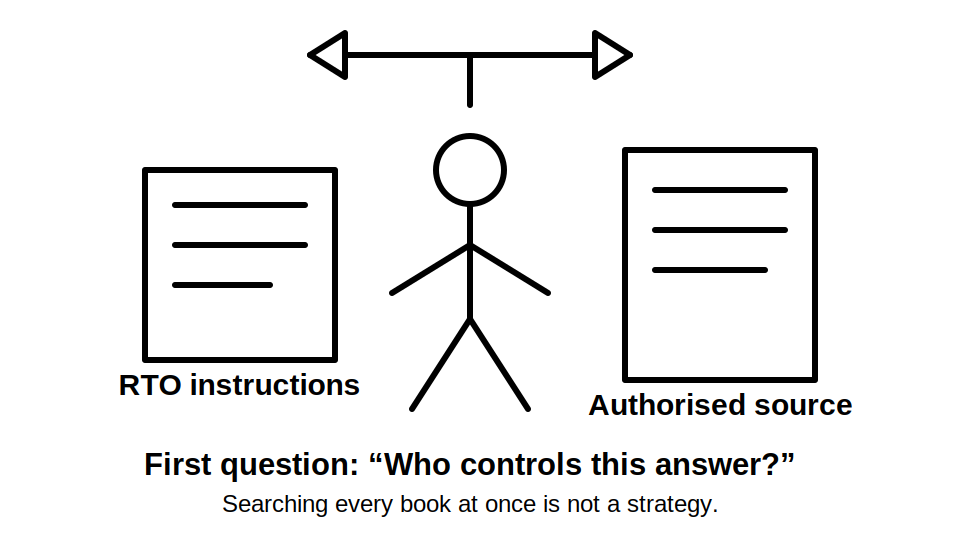
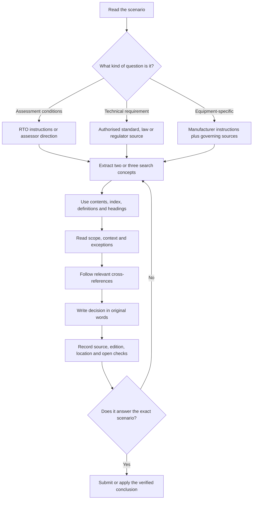
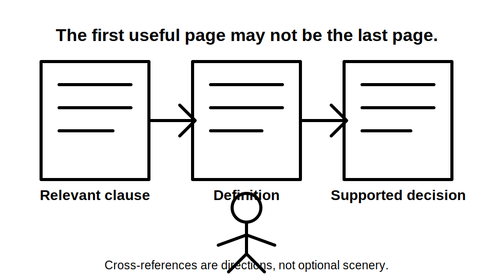
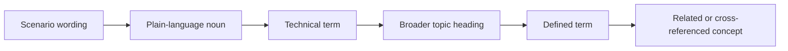

# Day 1 — Exam Orientation and Wiring Rules Navigation

> **Currency notice:** This module teaches a method for navigating authorised sources. It does not state a universal exam format, permitted-resource rule, pass mark or exact clause requirement. Confirm the current arrangements with the learner's RTO and verify technical requirements in authorised current standards, legislation and regulator guidance.

## 1. Outcome and entry check

### Learning objectives

By the end of this block, the learner should be able to:

1. distinguish an **assessment instruction** from a **technical requirement** and identify the correct source for each;
2. use the contents, index, headings, defined terms and cross-references of an authorised standard to locate a topic efficiently;
3. convert a practical scenario into two or three useful search concepts instead of searching the scenario wording verbatim;
4. record a defensible answer trail containing the source title, edition, location, decision and any unresolved verification point;
5. reject an answer that relies only on memory when the question requires source confirmation.

### Prerequisites

- Access to the learner's current RTO assessment instructions.
- Authorised access to the current standards and reference materials permitted by the RTO.
- Familiarity with basic electrical-installation terms from workplace and trade-school training.

### Entry check

Answer without opening a reference, then mark confidence as **guessing**, **unsure**, **reasonably confident** or **certain**.

1. Where would you verify whether a particular book is permitted in an assessment: the Wiring Rules or the RTO assessment instructions?
2. When a scenario uses everyday wording rather than a formal technical term, what should you identify before using an index?
3. Why is a clause number remembered from an old edition not enough evidence for a current answer?
4. What should you do when a clause sends you to a definition, another clause or another document?

Do not score this check as pass or fail. Its purpose is to expose the learner's starting navigation habits.

## 2. Why it matters

Capstone questions and workplace decisions rarely arrive in the same wording as a standard's index. A learner may understand the electrical concept but still lose time by searching for a whole sentence, opening the wrong source or stopping at the first relevant-looking paragraph.

Navigation is therefore a practical capability, not clerical work. A reliable practitioner separates three questions:

- **What is the assessor asking me to demonstrate?** Use the current RTO instructions, task sheet or assessor direction.
- **What technical rule or principle applies?** Use the authorised current standard, legislation or regulator material identified for that topic.
- **What evidence supports my conclusion?** Record the source and reasoning clearly enough that another competent person can follow it.

A fast unsupported answer is weaker than a slightly slower answer with a traceable source. The goal is not to memorise the location of every rule. The goal is to develop a repeatable route from scenario to verified decision.



## 3. Core concepts and terminology

### Assessment instruction

An **assessment instruction** states how a particular assessment is conducted. It may identify time limits, available references, required evidence, supervision conditions or response formats. These arrangements can vary by RTO, jurisdiction, qualification pathway and assessment version. They must not be inferred from a technical standard.

### Technical requirement

A **technical requirement** is a requirement governing electrical design, installation, verification or safety. The controlling source may be a standard, legislation, regulation, regulator direction, network requirement, manufacturer's instruction or another referenced document. The applicable hierarchy must be confirmed for the task and jurisdiction.

### Authorised current source

An **authorised current source** is a legitimately accessed document whose edition, amendments and applicability have been checked. A screenshot, old study note or remembered clause can help generate search terms, but it is not automatically reliable evidence.

### Defined term

A **defined term** has a specific meaning assigned by the source. Everyday meanings may be broader, narrower or different. When a rule turns on a technical term, locate its formal definition and then return to the operative requirement.

### Operative requirement

An **operative requirement** is the part of a source that actually governs the decision. A heading, index entry, diagram title or explanatory note may guide navigation but may not itself contain the requirement.

### Cross-reference

A **cross-reference** directs the reader to another clause, section, appendix, standard or document. It is part of the reasoning path. Stopping before following a relevant cross-reference can produce an incomplete answer.

### Evidence trail

An **evidence trail** is a concise record of how the answer was reached. For this course, use:

```text
Question or scenario:
Search concepts:
Source and edition:
Location found:
Relevant defined terms or cross-references:
Decision in my own words:
Reference check still required:
```

## 4. Rule-finding workflow

Use the following workflow whenever a scenario asks what is required, permitted, prohibited, selected, installed, inspected or tested.

1. **Classify the question.** Decide whether it concerns assessment administration, legislation, technical installation requirements, verification procedure, manufacturer instructions or workplace procedure.
2. **Extract concepts.** Rewrite the scenario as two or three technical concepts. Include the object, action and condition. For example: `switchboard` + `access` + `location`.
3. **Choose the source family.** Select the source most likely to control the decision. Do not begin by searching every available document.
4. **Navigate broadly first.** Use the contents, section headings or knowledge index to identify the relevant subject area.
5. **Navigate precisely.** Use the index, defined terms and internal search where permitted. Search nouns and formal terms before long phrases.
6. **Read the surrounding structure.** Check the heading, scope, exceptions, notes and neighbouring provisions needed to interpret the passage correctly.
7. **Follow references.** Open relevant definitions, cross-referenced clauses and referenced documents. Record when access to a referenced source is missing.
8. **State the decision in original words.** Explain the practical conclusion without copying substantial standards wording.
9. **Record the trail.** Capture source title, edition, location and unresolved checks.
10. **Test the answer against the scenario.** Confirm that the answer addresses the actual equipment, location, supply arrangement and task described.



The loop at the end is intentional. Finding a relevant passage is not the same as answering the scenario. Return to the search concepts when the source does not resolve the exact condition.

## 5. Visual model or worked example

### Worked navigation example

**Scenario:** A learner is asked whether a switchboard position shown on a plan is acceptable. The drawing includes a narrow passage and nearby stored materials.

This module does not provide the technical answer. It demonstrates the search path.

| Stage | Learner action | Reason |
|---|---|---|
| Classify | Treat it as a technical installation and access question, not an exam-administration question. | This selects the source family. |
| Extract concepts | `switchboard`, `location`, `access`, then possibly `clearance` or `obstruction`. | Indexes work better with formal concepts than with the full scenario sentence. |
| Navigate broadly | Start in the switchboard learning cluster or relevant section heading. | Broad navigation prevents random searching. |
| Navigate precisely | Check index entries, definitions and related headings. | The controlling requirement may use a different term from the scenario. |
| Read context | Read the complete relevant provision and its scope, not one isolated sentence. | Conditions and exceptions may change the conclusion. |
| Follow references | Open any linked definitions, fire/access provisions or referenced requirements. | The answer may be distributed across sources. |
| Record | Note the authorised source, edition, location and a plain-language conclusion. | This creates an auditable evidence trail. |
| Verify | Mark exact dimensions or conditions as `reference_check_required` until checked in the authorised current source. | This prevents invented or outdated values. |



### Search-term ladder

When a search fails, move up or down this ladder rather than repeating the same phrase:



Example progression: `board in hallway` → `switchboard` → `switchboard location` → `access` → the formal defined or referenced term used by the authorised source.

## 6. Practical application

### Timed source-navigation drill

Use three short scenarios supplied by the RTO, trainer or an original practice bank. Allow ten minutes for each scenario.

For every scenario:

1. identify whether the controlling information is an assessment instruction or technical requirement;
2. write no more than three initial search concepts;
3. identify the likely source before opening it;
4. locate the relevant subject area and record the navigation path;
5. follow at least one relevant definition or cross-reference when present;
6. write a two-sentence conclusion in original words;
7. mark any exact value, clause reference or jurisdiction-specific condition requiring authorised verification;
8. rate confidence before checking the model navigation path.

### Performance evidence

A successful drill should show:

- correct source selection;
- search terms that match technical concepts;
- an efficient path using document structure;
- recognition of scope, exceptions and cross-references;
- an original conclusion tied to the scenario;
- honest identification of unresolved evidence.

Speed is secondary on the first attempt. Record elapsed time, but remediate incorrect source choice or missed cross-references before trying to become faster.

## 7. Common errors and safety checkpoint

### Common errors

**Searching the full question verbatim**  
Standards and official sources may use different wording. Extract the equipment, action and condition instead.

**Using the first search result as the answer**  
A result may be a heading, definition, note or related provision. Read its function and surrounding context.

**Confusing the index with the requirement**  
An index directs the reader. It does not usually contain the complete controlling rule.

**Relying on a remembered clause number**  
Editions and amendments change. Use memory as a navigation hint, then verify the current source.

**Ignoring defined terms**  
A familiar word may have a narrower technical meaning. Check definitions when the decision depends on terminology.

**Failing to follow cross-references**  
A source may distribute the complete requirement across multiple locations or documents.

**Copying wording without understanding it**  
A copied sentence can still be misapplied. State the conclusion in original words and connect it to the scenario facts.

**Inventing assessment rules**  
Do not claim that all capstone assessments have the same duration, resources, structure or pass criteria. Verify the learner's current RTO instructions.

### Safety checkpoint

This navigation module does not authorise electrical work, energisation, isolation, testing or live access. When a study scenario becomes a real workplace task:

- follow applicable legislation, regulator requirements and workplace procedures;
- remain within licence, training and supervision limits;
- use current authorised sources;
- stop when the source, equipment state, supply arrangement or safe procedure is unclear;
- escalate uncertainty to the supervising licensed person, assessor or other authorised competent person.

A confident memory is not a control measure.

## 8. Retrieval and next links

### Recall questions

Answer without looking, then verify against this module.

1. What are the three questions used to separate assessment instructions, technical requirements and evidence?
2. What three elements should usually appear in initial search concepts?
3. Why should the reader inspect headings, scope and neighbouring provisions?
4. What is the difference between a defined term and an operative requirement?
5. What must an evidence trail record?
6. What should happen when a referenced source is not available?
7. Why is the first relevant-looking search result insufficient?
8. Which source should determine permitted assessment resources?

### Applied retrieval

For each prompt, write only the likely source family and three search concepts:

- a question about whether handwritten notes are allowed in an assessment;
- a plan showing an item of electrical equipment near water;
- a motor manufacturer's required protective setting;
- a workplace isolation method before inspection;
- a question about a switchboard's accessibility.

### Reflection

Record:

- the step that consumed the most time;
- one technical term that improved the search;
- one cross-reference you initially missed;
- one high-confidence answer that changed after verification;
- the navigation habit to practise tomorrow.

### Knowledge-base links

- [[Day 01 - Exam Orientation and Wiring Rules Navigation]]
- [[AS-NZS-3000-2018-Index]]
- [[Four-Week Capstone Learning Plan]]

### Next block

**Day 2 — Fundamental Safety Principles** will use the same evidence trail to distinguish hazard, protective measure and verification evidence.

## References and review status

- AS/NZS 3000:2018 learning index in this repository — structural metadata only.
- Current authorised edition and amendments of AS/NZS 3000 — `reference_check_required`.
- Current RTO assessment instructions — `reference_check_required` for every learner cohort.
- Applicable legislation, regulator guidance and other referenced standards — verify by jurisdiction and task.

**Status:** `review-required`. This original educational module requires technical and assessment-context review before publication. It contains no reproduced standards table, figure or substantial clause wording.