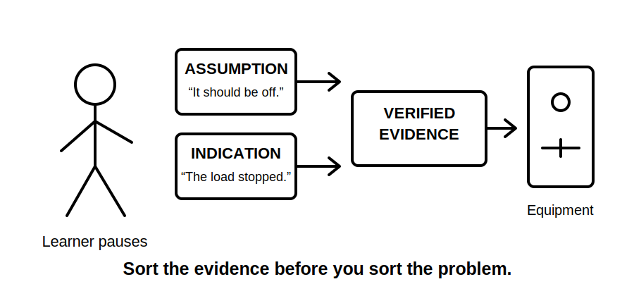
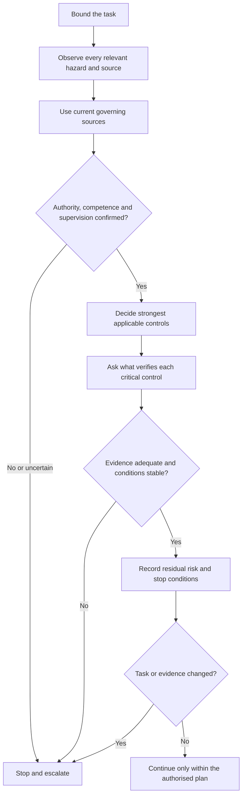
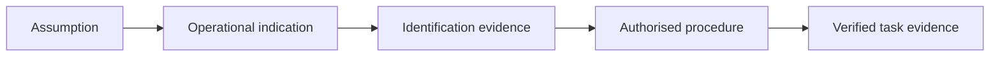

# Day 2 — Fundamental Safety Principles

> **Currency and safety notice:** This module develops safety reasoning only. It is not an isolation, testing, rescue, emergency, live-work or safe-work procedure and authorises no practical electrical activity. Exact duties, prohibited work, test methods, instruments, PPE, rescue arrangements and supervision requirements must be verified against current authorised legislation, regulator guidance, standards, manufacturer instructions, RTO procedures and site rules.

## 1. Outcome and entry check

### Learning objectives

By the end of this block, the learner should be able to:

1. classify facts in a scenario as **hazard**, **exposure pathway**, **risk**, **control**, **verification evidence**, **residual risk** or **stop condition**;
2. rank proposed controls by how directly and reliably they act on the hazard;
3. distinguish an operational indication, an assumption and verified evidence;
4. identify normal, alternative, stored, induced, mechanical, thermal and environmental hazards within a stated task boundary;
5. apply the **B-O-U-N-D-A-R-Y** safety-reasoning workflow to a written scenario;
6. stop and escalate when authority, competence, equipment state, source information, procedure or evidence is uncertain;
7. identify which conclusions require current authorised verification rather than memory.

### Prerequisites

- Complete [Day 1 — Exam Orientation and Wiring Rules Navigation](./day-01-exam-orientation-and-wiring-rules-navigation.md).
- Be familiar with basic electrical quantities and common installation equipment.
- Have access to current workplace and jurisdictional sources for later verification.

### Entry check

Answer without looking and rate confidence as **guessing**, **unsure**, **reasonably confident** or **certain**.

1. Is a hazard the same as risk?
2. Does a stopped load prove that all relevant energy is absent?
3. Name three sources of energy other than the normal incoming supply.
4. Which is generally stronger: removing exposure or relying on PPE while exposure remains?
5. What must happen when available evidence conflicts?

A high-confidence unsafe answer is more serious than a low-confidence error because it is more likely to be acted upon. Record it in the error log before practical work.

## 2. Why it matters

Electrical incidents usually arise from a chain rather than one isolated error: an unrecognised source, an assumed equipment state, a weak control, an unverified control, changed conditions or failure to stop.

A defensible Capstone response therefore needs two results:

- a technically relevant conclusion; and
- a safe, evidence-based process used to reach it.

A correct final answer reached through unsafe assumptions is not competent work. Safety reasoning must remain visible in design, installation, inspection, testing and fault-finding responses.



## 3. Core concepts and terminology

### Hazard, exposure pathway and risk

A **hazard** is a source or situation with potential to cause harm. An **exposure pathway** is how a person, asset or environment could come into contact with that hazard. **Risk** considers both the possibility of harm and the seriousness of the consequence.

Example: an energised part is the hazard; access through a missing barrier is the exposure pathway; electric shock or arc injury is the possible consequence.

### Control and critical control

A **control** eliminates a hazard or reduces risk. A **critical control** is one whose failure could directly permit a serious event. Critical controls require explicit verification rather than assumption.

### Residual risk

**Residual risk** is the risk remaining after controls are applied. Applying controls does not end the analysis. The remaining risk must be acceptable under the governing law, procedure, authority and task conditions.

### Hierarchy of controls

The hierarchy ranks broad control strategies by how directly they act on the hazard:

1. **Elimination** — remove the hazard or exposure.
2. **Substitution** — replace it with a less hazardous alternative.
3. **Engineering controls** — physically separate people from the hazard or design it out.
4. **Administrative controls** — procedures, permits, training, signs, supervision and scheduling.
5. **PPE** — equipment worn by the person to reduce likelihood or severity of injury.

The hierarchy is not a guarantee and does not replace task-specific authorised requirements. Multiple controls may be necessary.

### Operational indication, assumption and verified evidence

- An **operational indication** shows how equipment appears to be behaving, such as a stopped motor or dark indicator.
- An **assumption** is a conclusion accepted without adequate confirmation.
- **Verified evidence** is information confirmed through an authorised source or approved method suitable for the task.

An operational indication may prompt investigation, but it is not automatically proof of a safe state.

### De-energised, isolation and prove de-energised

**De-energised** describes equipment from which relevant electrical energy has been removed under an applicable verified process. **Isolation** is separation from sources using an arrangement and process suitable for the task. To **prove de-energised** is to establish the relevant state using the authorised procedure and suitable verified equipment.

This module explains why these distinctions matter. It does not prescribe the field sequence, devices, instrument use or securing method.

### Competence, authority and supervision

**Competence** is task-specific knowledge, skill, training and experience. **Authority** is permission under the applicable framework. **Supervision** is the oversight required for the person and task. One does not automatically imply the others.

### Stop condition

A **stop condition** is a fact, change or unresolved uncertainty that requires the task to pause. Examples include an unidentified source, conflicting labels, damaged equipment, unclear boundaries, unexpected indications, missing authority or work outside training limits.

## 4. Rule-finding workflow

Use **B-O-U-N-D-A-R-Y** for written safety scenarios and before any authorised practical planning:

1. **B — Bound the task.** State the equipment, circuit, location, activity and exclusions.
2. **O — Observe hazards and energy sources.** Include normal, alternative, stored, induced, mechanical, thermal and environmental sources.
3. **U — Use current governing sources.** Identify legislation, regulator guidance, standards, workplace procedures, manufacturer instructions and RTO requirements.
4. **N — Name competence and authority limits.** State who may perform, supervise, verify or approve the task.
5. **D — Decide the strongest applicable controls.** Prefer controls acting directly on the hazard.
6. **A — Ask what proves each critical control.** Separate indicators and assumptions from acceptable evidence.
7. **R — Record residual risk and stop conditions.** Make uncertainty visible before work proceeds.
8. **Y — Yield when conditions change.** Stop, reassess, communicate and escalate rather than improvising.



The workflow deliberately directs uncertainty to **stop and escalate**. Escalation is a safety control, not a failure of confidence.

## 5. Visual model or worked example

### Evidence ladder

Use this ladder to test a statement before relying on it:

| Level | Example | What it can support |
|---|---|---|
| 1. Assumption | “It should be off.” | Nothing safety-critical. |
| 2. Operational indication | Load stopped; indicator dark. | A reason to investigate, not proof of state. |
| 3. Identification evidence | Labels, drawings, schedules, equipment information. | Helps define sources and boundaries; must be current and consistent. |
| 4. Authorised procedural evidence | Applicable current procedure and responsible person confirmed. | Establishes the required method and roles. |
| 5. Verified task evidence | Critical controls confirmed using the authorised method. | Supports the task-specific decision, subject to changed conditions and residual risk. |



Higher steps do not erase contradictions below them. A conflicting label, unexpected indication or changed source arrangement remains a stop condition until resolved.

### Worked scenario

**Scenario:** Equipment has stopped, its local control is off and the site has an alternative supply.

| BOUNDARY stage | Reasoning | Required evidence or response |
|---|---|---|
| Bound | Inspection is limited to named equipment; the wider installation is not assumed safe. | Confirm identity, location, scope and responsible person. |
| Observe | Normal supply, alternative supply, control energy, stored energy, movement and environment may matter. | Review current diagrams, labels and equipment information. |
| Use sources | A generic memory of safe work is insufficient. | Locate the current authorised procedure and task-specific instructions. |
| Name limits | The learner may not be authorised to isolate, test or access the equipment. | Confirm role, supervision and responsible competent person. |
| Decide controls | A local off control is not a complete control for all sources. | Select controls through the authorised process. |
| Ask for proof | Stopped operation is only an indication. | Use only the approved verification method and suitable equipment through an authorised person. |
| Record | Conflicting labels, unidentified source or unexpected evidence are stop conditions. | Pause and escalate; do not improvise. |
| Yield | Any change in scope, people, supply or conditions invalidates unchecked assumptions. | Reassess from the task boundary. |

## 6. Practical application

### Safety-reasoning worksheet

Complete this worksheet for three fictional scenarios. It is a reasoning exercise, not permission to perform the work.

```text
Task and exclusions:
People, authority and supervision:
Hazards:
Exposure pathways:
Normal and alternative energy sources:
Stored, induced, mechanical or thermal energy:
Environmental and secondary hazards:
Applicable current authorised sources:
Proposed controls, ranked by hierarchy:
Critical controls:
Evidence required for each critical control:
Residual risk:
Explicit stop conditions:
Changed-condition triggers:
Required communication and records:
Items marked reference_check_required:
```

Use these scenarios:

1. a final subcircuit appears inactive after a protective device operates;
2. equipment has normal and alternative supply arrangements but incomplete diagrams;
3. damaged equipment is located in a wet or contaminated area.

### Performance rubric

Score each category **0, 1 or 2**.

| Category | 0 — unsafe/incomplete | 1 — developing | 2 — defensible |
|---|---|---|---|
| Boundary | Scope assumed or unclear. | Main equipment named, exclusions incomplete. | Equipment, circuit, area, activity and exclusions are explicit. |
| Sources and hazards | Only obvious supply considered. | Several sources listed, important pathway omitted. | Electrical and non-electrical sources and pathways are systematically considered. |
| Controls | PPE or procedure named without hierarchy reasoning. | Stronger control proposed but not justified. | Controls are ranked and matched to each hazard. |
| Evidence | Indicators or labels treated as proof. | Evidence requested but not tied to critical controls. | Each critical control has a stated authorised verification need. |
| Limits and escalation | Authority or competence ignored. | Limits recognised but stop point vague. | Authority, supervision and explicit stop conditions are clear. |
| Source discipline | Rules asserted from memory. | Some source checks identified. | Jurisdictional and procedural claims are marked for current authorised verification. |

A score below **2** in **Evidence** or **Limits and escalation** blocks readiness for practical activity, regardless of the total score.

## 7. Common errors and safety checkpoint

### Common errors

- **Treating hazard and risk as synonyms:** name the source, pathway and consequence separately.
- **Starting with PPE:** ask first whether exposure can be eliminated or engineered out.
- **Treating “off” as proof:** identify what the indication shows and what remains unproven.
- **Checking only the normal supply:** deliberately scan for alternative, stored and induced energy.
- **Following a procedure mechanically:** confirm it matches the actual task and current arrangement.
- **Confusing confidence with competence:** confidence is not evidence of training, authority or supervision.
- **Continuing after change:** return to the task boundary whenever scope, conditions, personnel or evidence change.
- **Using a standards citation as a complete safe-work method:** a topic reference does not replace current legal, workplace and manufacturer procedures.

### Safety checkpoint

Before any practical activity, every answer below must be **yes** and supported by appropriate evidence:

- Is the task boundary explicit?
- Have relevant energy sources and exposure pathways been considered?
- Are current governing sources and procedures available?
- Are competence, authority and supervision confirmed?
- Have controls been selected in the strongest applicable order?
- Is there an authorised method to verify every critical control?
- Are residual risks and stop conditions understood?
- Will the task stop if evidence conflicts or conditions change?

A **no**, unknown or disputed answer is a stop condition until resolved by the appropriate authorised person.

## 8. Retrieval and next links

### Recall questions

1. Distinguish hazard, exposure pathway, risk and residual risk.
2. Why is an operational indication weaker than verified evidence?
3. What does each letter in B-O-U-N-D-A-R-Y represent?
4. Why must critical controls have explicit verification evidence?
5. Name four overlooked energy sources or pathways.
6. Why are competence, authority and supervision separate questions?
7. What makes a changed condition a reason to restart the reasoning process?
8. Why can a technically correct result still be incompetent work?

### Applied retrieval

For each prompt, state the **boundary**, **hazard**, **exposure pathway**, **strongest likely control category**, **verification need**, **residual risk** and **stop condition**:

- a circuit label conflicts with the schedule;
- equipment stopped after a protective device operated;
- an alternative supply is present but diagrams are incomplete;
- a wet work area contains damaged electrical equipment;
- a learner is asked to act beyond current supervision arrangements.

### Varied re-attempt

Choose one original scenario scored below the rubric threshold. Correct it, then apply B-O-U-N-D-A-R-Y to a different scenario with one variable changed. Do not copy the corrected answer. Record whether the same error recurred.

### Knowledge-base links

- [[Day 02 - Fundamental Safety Principles]]
- [[Safety and Electrical Risk]]
- [[Wiring Rules and Design]]
- [[Inspection Testing and Verification]]
- [[Fault Finding and Commissioning]]
- [[Day 01 - Exam Orientation and Wiring Rules Navigation]]

### Next block

Continue to **Day 3 — Overcurrent Protection**, applying safety reasoning to overload, short-circuit and protective-device decisions.

### References and review status

- Current authorised electrical safety legislation and regulator guidance for the applicable jurisdiction — `reference_check_required`.
- Current workplace isolation, testing, permit, rescue and emergency procedures — `reference_check_required`.
- AS/NZS 3000:2018 and applicable amendments, used only as a topic reference — exact requirements remain `reference_check_required`.
- Manufacturer instructions for relevant equipment and instruments — `reference_check_required`.
- RTO assessment, authority and supervision requirements — `reference_check_required`.

**Content status:** `review-required`. This original educational draft must be checked by a suitably qualified reviewer. It is not a complete safe-work method and must not be labelled `technically-reviewed` without documented review against current authorised sources.

<!-- sequence-navigation:start -->
### Sequence navigation

- [← Previous: Day 1 — Exam Orientation and Wiring Rules Navigation](./day-01-exam-orientation-and-wiring-rules-navigation.md)
- [Four-week learning plan](../MASTER_PLAN.md)
- [Next: Day 3 — Overcurrent Protection →](./day-03-overcurrent-protection.md)
<!-- sequence-navigation:end -->