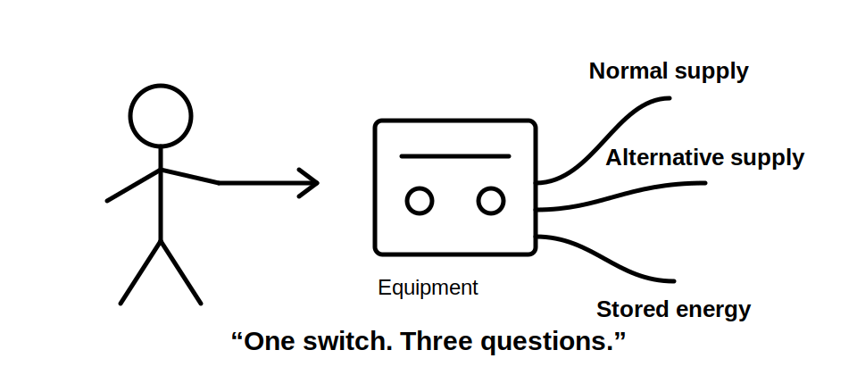
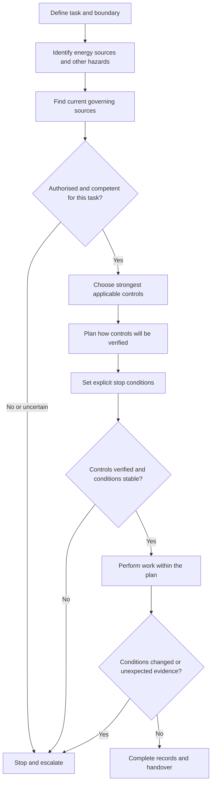
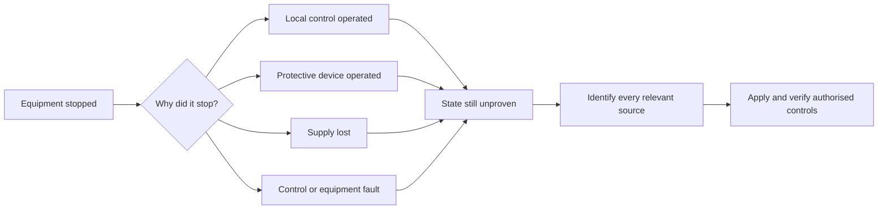
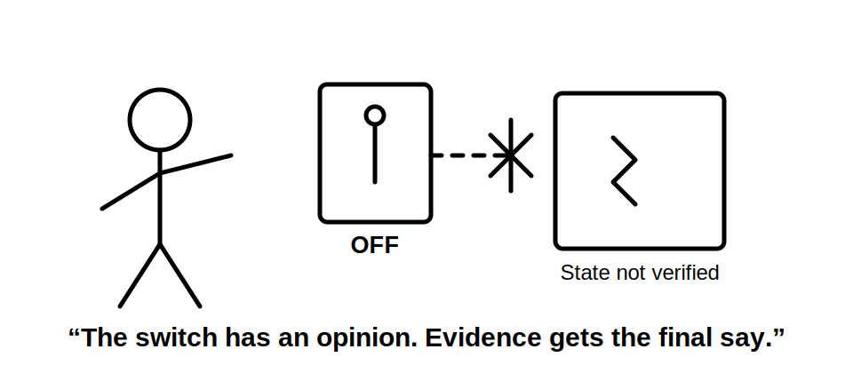

# Day 2 — Fundamental Safety Principles

> **Currency and safety notice:** This module develops safety reasoning. It does not provide a complete isolation, testing, rescue or live-work procedure. Exact legal duties, prohibited work, test methods, instrument requirements, personal protective equipment and emergency arrangements vary by jurisdiction and workplace. Verify them against current authorised legislation, regulator guidance, standards, manufacturer instructions, RTO procedures and site rules before use.

## 1. Outcome and entry check

### Learning objectives

By the end of this block, the learner should be able to:

1. distinguish **hazard**, **risk**, **control**, **residual risk** and **stop condition** in an electrical-work scenario;
2. explain why eliminating exposure to electrical energy is generally stronger than relying on behaviour or personal protective equipment;
3. identify electrical, thermal, mechanical and secondary hazards that may remain after an obvious supply is switched off;
4. apply a structured safety-decision sequence before design, inspection, testing or fault-finding work;
5. recognise when a task must stop and be escalated because the supply state, competence, authority, procedure or equipment is uncertain;
6. separate a safe principle from a jurisdiction-specific procedure that requires authorised verification.

### Prerequisites

- Completion of [Day 1 — Exam Orientation and Wiring Rules Navigation](./day-01-exam-orientation-and-wiring-rules-navigation.md).
- Familiarity with basic electrical quantities and common installation equipment.
- Access to current workplace safety procedures and authorised jurisdictional guidance for later verification.

### Entry check

Answer without looking, then rate confidence as **guessing**, **unsure**, **reasonably confident** or **certain**.

1. Is a hazard the same thing as risk?
2. Why is a switched-off control not automatically proof that equipment is safe to approach?
3. Name two energy sources other than the normal incoming supply that could affect an installation.
4. Which is normally stronger: removing the hazard or wearing protective equipment while exposed to it?
5. What should happen when the worker cannot establish the equipment state or the applicable safe procedure?

The entry check is diagnostic. A high-confidence unsafe answer requires immediate remediation before practical activity.

## 2. Why it matters

Electrical incidents rarely result from one isolated mistake. They commonly involve a chain: an unrecognised source, an assumption about equipment state, an ineffective control, a changed work condition or a failure to stop when evidence becomes uncertain.

Capstone assessment therefore requires more than naming hazards. The learner must show a defensible safety process:

- identify what can cause harm;
- determine how exposure could occur;
- choose controls that act on the hazard rather than merely on the person;
- confirm that controls are effective;
- monitor for changed conditions;
- stop when the task moves outside authority, competence or verified procedure.

The same reasoning applies in design, installation, inspection, testing and fault finding. A technically correct result reached through an unsafe process is not competent work.



## 3. Core concepts and terminology

### Hazard

A **hazard** is a source or situation with the potential to cause harm. Electrical-work hazards include accessible live parts, stored electrical energy, induced voltage, arc energy, heat, moving machinery, falling objects, confined spaces and conditions that can cause slips or loss of control.

### Risk

**Risk** combines the possibility that harm will occur with the seriousness of the possible consequence. Risk is affected by exposure, equipment condition, environment, task complexity, competence, supervision and the reliability of controls.

### Control

A **control** is a measure used to eliminate a hazard or reduce risk. Controls are not equal. A control that physically removes exposure is generally more reliable than one that depends on perfect human behaviour every time.

### Residual risk

**Residual risk** is the risk remaining after controls are applied. Applying a control does not end the reasoning process. The worker must decide whether the remaining risk is acceptable under the applicable law, procedure and authority.

### Hierarchy of controls

The **hierarchy of controls** ranks broad control strategies by how directly they act on the hazard:

1. **Elimination** — remove the hazard or exposure.
2. **Substitution** — replace the hazard with a less hazardous alternative.
3. **Engineering controls** — physically separate people from the hazard or design the hazard out.
4. **Administrative controls** — procedures, permits, training, signs, supervision and scheduling.
5. **Personal protective equipment (PPE)** — equipment worn by the person to reduce injury severity or likelihood.

The hierarchy is a decision aid, not a guarantee. Several controls may be required, and their suitability must be verified for the actual task.

### De-energised

**De-energised** describes equipment from which electrical energy has been removed under an applicable verified process. It is not established merely because a switch appears off, an indicator is dark or the connected load has stopped.

### Isolation

**Isolation** is the separation of equipment or a circuit from sources of electrical energy using an arrangement and process appropriate to the task. The exact devices, securing method, identification and verification steps are safety-critical and remain `reference_check_required` in this draft.

### Prove de-energised

To **prove de-energised** means to establish, using the authorised procedure and suitable verified test equipment, that the relevant conductors or parts are not energised. This module teaches the reasoning need for proof but does not prescribe the jurisdiction-specific test sequence.

### Competent person

A **competent person** has the combination of knowledge, skills, training, experience and authority required for the particular task under the applicable framework. Competence is task-specific; familiarity with one installation does not confer authority for every activity.

### Stop condition

A **stop condition** is a fact or uncertainty that requires work to pause. Examples include an unidentified supply, damaged test equipment, changed site conditions, missing authority, unclear conductor identification, an unexpected reading or a task outside the worker's training and supervision limits.

## 4. Rule-finding workflow

Use this workflow before any safety-critical electrical task or assessment scenario.

1. **Define the task boundary.** State exactly what equipment, circuit, area and activity are involved.
2. **Identify all energy and hazard sources.** Consider normal supply, alternative supply, backfeed, stored energy, induction, mechanical movement, heat and environmental hazards.
3. **Identify governing sources.** Locate the applicable legislation, regulator guidance, standard, workplace procedure, manufacturer instruction and RTO requirement.
4. **Confirm authority and competence.** Determine who may perform, supervise, verify or approve the task.
5. **Choose the strongest reasonably applicable controls.** Prefer elimination and separation from energy over controls that depend only on behaviour or PPE.
6. **Plan verification.** Decide how the effectiveness of each critical control will be confirmed using the authorised procedure.
7. **Define stop conditions.** Write down what unexpected condition will cause the task to pause.
8. **Perform the work only within the verified plan.** Do not improvise around a failed or missing control.
9. **Monitor change.** Reassess when the supply arrangement, work party, weather, access, equipment state or scope changes.
10. **Record and communicate.** Document the task state, controls, verification, defects and handover information required by the applicable process.



The diagram deliberately sends uncertainty to **stop and escalate**. Escalation is a control, not a failure of confidence.

## 5. Visual model or worked example

### Worked safety-reasoning example

**Scenario:** A learner is asked to inspect equipment that has stopped operating. A local control is in the off position. The equipment is connected to a switchboard, and the site also has an alternative supply system.

This example does not provide a practical isolation procedure. It demonstrates how to reason before touching or testing.

| Stage | Safety reasoning | Required evidence |
|---|---|---|
| Task boundary | Inspection of specified equipment; no assumption that the whole installation is safe. | Equipment identity, scope and responsible person confirmed. |
| Hazard identification | Normal supply, alternative supply, possible control-circuit energy, stored energy and mechanical movement. | Supply information, diagrams, labels and site knowledge checked. |
| Initial assumption check | The local off control may stop operation but may not isolate every energy source. | Governing procedure and equipment information consulted. |
| Control selection | Seek elimination or verified separation from relevant energy sources before access. | Authorised isolation arrangement and responsibility established. |
| Verification planning | Determine the approved method and suitable instrument for proving the relevant state. | Current procedure, instrument suitability and competent person confirmed. |
| Stop condition | Any unidentified source, unexpected indication, conflicting label or unclear procedure. | Work pauses; supervising or authorised competent person is engaged. |
| Residual risk | Mechanical, thermal, environmental and stored-energy hazards may remain. | Additional controls are selected and checked. |



The key lesson is that **not operating** and **safe to access** are different conclusions.



## 6. Practical application

### Safety-decision worksheet

Use an original scenario supplied by a trainer or practice bank. Complete the worksheet before discussing the answer.

```text
Task and physical boundary:
People involved and their roles:
Normal energy sources:
Alternative, stored or induced energy sources:
Non-electrical hazards:
Applicable authorised sources:
Required competence, licence, supervision or permit:
Strongest applicable control:
Additional controls:
How each critical control will be verified:
Residual risk:
Stop conditions:
Required communication, records and handover:
Reference checks still required:
```

### Scenario set

Apply the worksheet to three different contexts:

1. a final subcircuit that appears inactive after a protective device operates;
2. equipment supplied through both a normal source and an alternative source arrangement;
3. an inspection task near damaged equipment in a wet or contaminated area.

For each scenario, the learner must:

- identify at least four hazards, including one non-electrical hazard;
- distinguish the hazard from the resulting risk;
- select controls using the hierarchy rather than naming PPE first;
- identify the evidence required to verify critical controls;
- define at least two stop conditions;
- mark every procedural or jurisdiction-specific detail requiring authorised confirmation.

### Performance evidence

A competent response should show:

- no assumption that an off control, open protective device or stopped load proves safety;
- consideration of multiple and stored energy sources;
- control selection that prioritises elimination or separation;
- explicit verification rather than trust in labels or indicators alone;
- recognition of competence, authority and supervision limits;
- a clear stop-and-escalate response to uncertainty;
- original wording rather than copied regulatory or standards text.

## 7. Common errors and safety checkpoint

### Common errors

**Treating hazard and risk as synonyms**  
The hazard is the source of possible harm. Risk considers how exposure may occur and the possible consequence.

**Starting with PPE**  
PPE may be necessary, but it sits low in the hierarchy because it does not remove the hazard and depends on correct selection, condition and use.

**Assuming “off” means de-energised**  
A control position, indicator or stopped load is evidence about operation, not proof that all relevant energy has been removed.

**Considering only the normal supply**  
Alternative supplies, backfeed, stored energy, induction and control circuits can invalidate a single-source assumption.

**Following a procedure mechanically**  
A procedure must match the actual equipment, supply arrangement and task. Unexpected evidence requires reassessment, not blind continuation.

**Confusing confidence with competence**  
Confidence is a feeling. Competence and authority require demonstrable training, knowledge, experience and permission for the task.

**Continuing after the scope changes**  
A new supply arrangement, damaged component, different work area or additional person can change the risk and invalidate earlier controls.

### Safety checkpoint

Before any practical activity, the learner must be able to answer **yes** to all of the following:

- Is the task and boundary clear?
- Have all reasonably foreseeable energy sources and other hazards been considered?
- Are the current governing procedure and authorised sources available?
- Is the person authorised, competent and appropriately supervised for this task?
- Have controls been selected in the strongest reasonably applicable order?
- Is there an authorised method to verify critical controls?
- Are stop conditions understood by everyone involved?
- Will work stop if evidence conflicts with the plan?

A **no**, unknown or disputed answer is a stop condition until resolved by the appropriate authorised person.

## 8. Retrieval and next links

### Recall questions

Answer without looking, then verify against this module.

1. What is the difference between a hazard, risk and residual risk?
2. Why are elimination and engineering controls generally stronger than administrative controls and PPE?
3. Why does an off switch not prove that equipment is de-energised?
4. Name four possible energy sources or pathways that may be overlooked.
5. What makes competence task-specific?
6. What is the purpose of a stop condition?
7. At what points must risk be reassessed?
8. Why must a technically correct answer also demonstrate a safe process?

### Applied retrieval

For each prompt, state the **hazard**, **possible exposure**, **strongest likely control category**, **verification evidence** and **stop condition**:

- a circuit label conflicts with the circuit schedule;
- equipment has stopped after a protective device operated;
- a work area contains water and damaged electrical equipment;
- a site has an alternative supply and incomplete diagrams;
- a learner is asked to perform a task beyond current supervision arrangements.

### Reflection

Record:

- one assumption you previously treated as evidence;
- one hidden energy source you are now more likely to check;
- one situation in which PPE would not adequately control the hazard;
- one stop condition you would have previously ignored;
- one procedural detail requiring verification in your jurisdiction or workplace.

### Knowledge-base links

- [[Day 02 - Fundamental Safety Principles]]
- [[Safety and Electrical Risk]]
- [[Wiring Rules and Design]]
- [[Inspection Testing and Verification]]
- [[Fault Finding and Commissioning]]
- [[Day 01 - Exam Orientation and Wiring Rules Navigation]]

### Next block

Continue to **Day 3 — Overcurrent Protection**, where the safety principles are applied to conductor protection, overload conditions, short-circuit conditions and protective-device reasoning.

### References and review status

- Current authorised electrical safety legislation and regulator guidance for the applicable jurisdiction — `reference_check_required`.
- Current authorised workplace isolation, testing, permit, rescue and emergency procedures — `reference_check_required`.
- AS/NZS 3000:2018 and applicable amendments, used only as a topic reference — exact clauses and requirements are `reference_check_required`.
- Manufacturer instructions for equipment and test instruments used in practical work — `reference_check_required`.
- RTO assessment and supervision requirements — `reference_check_required`.

**Content status:** `review-required`. This original educational draft must be checked by a suitably qualified reviewer before product use. It must not be treated as a complete safe-work method or labelled `technically-reviewed` without documented review against current authorised sources.
