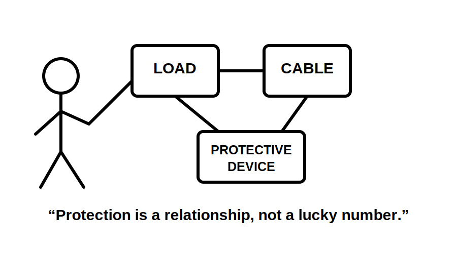
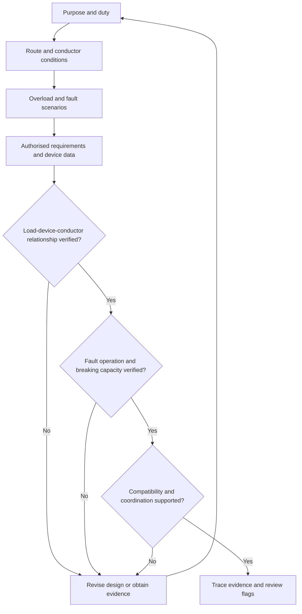
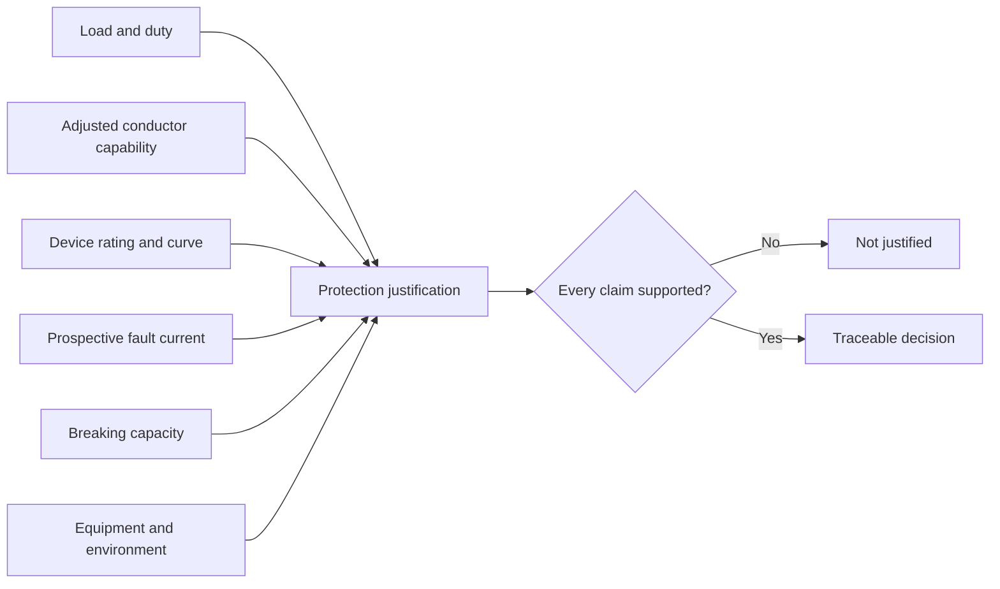
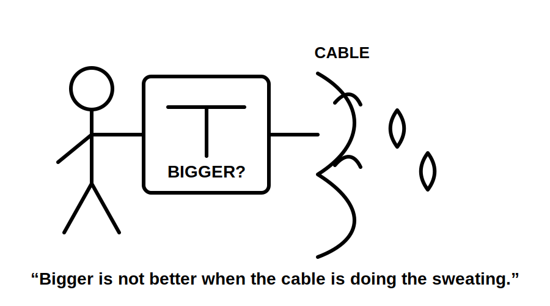
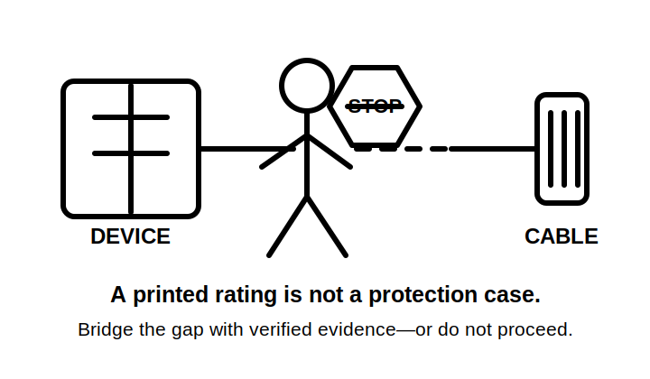

# Day 3 — Overcurrent Protection

> **Currency and safety notice:** This module teaches a reasoning method for recognising overcurrent hazards and checking the relationship among load, conductor, protective device and available fault current. It does not supply device-selection tables, breaking-capacity values, trip curves, discrimination settings, fault-level calculations or jurisdiction-specific installation rules. Verify exact ratings, clauses, limits, device data and assessment requirements against authorised current sources.

## 1. Outcome and entry check

### Learning objectives

By the end of this block, the learner should be able to:

1. define **overcurrent**, **overload current**, **short-circuit current**, **prospective fault current**, **current-carrying capacity**, **time-current characteristic** and **breaking capacity**;
2. classify an abnormal-current scenario as overload, short circuit, another fault condition or insufficient-information;
3. map the normal and abnormal current paths for a supplied scenario;
4. use the **P-R-O-T-E-C-T** workflow to produce a traceable protection justification;
5. distinguish a rating printed on a device from evidence that the device is suitable for the circuit;
6. identify missing evidence and stop rather than inventing a value, curve, fault level or coordination claim;
7. score a response against the six-category performance rubric and correct one weak category in a varied re-attempt.

### Prerequisites

- Completion of [Day 2 — Fundamental Safety Principles](./day-02-fundamental-safety-principles.md).
- Familiarity with voltage, current, resistance, power and circuit paths.
- Ability to separate an observed fact, an assumption and verified evidence.

### Entry check

Answer without looking, then rate confidence as **guessing**, **unsure**, **reasonably confident** or **certain**.

1. What distinguishes an overload path from a short-circuit path?
2. Can a conductor be at risk when the connected load appears to operate normally?
3. Does an RCD function alone normally replace overload and short-circuit protection?
4. Why is breaking capacity not the same as rated current?
5. What evidence is missing from the statement, “The load is below the breaker rating, so it is safe”?

A high-confidence answer that treats every excessive-current event as identical is a priority misconception.

## 2. Why it matters

Excess current can heat conductors, connections and equipment. The risk depends on current magnitude, duration, path, conductor capability, protective-device behaviour and the fault energy that may have to be interrupted.

A protective decision is therefore a relationship, not a single number. A defensible answer connects:

- expected current and load duty;
- conductor capability under actual installation conditions;
- protective-device rating, setting and operating characteristic;
- prospective fault current and breaking capacity;
- equipment requirements and upstream/downstream coordination.

A sustained overload may remain in the intended current path and cause cumulative heating. A short circuit follows an unintended low-impedance path and may produce a much larger current rapidly. Confusing these mechanisms leads to weak diagnosis and unsafe proposed remedies.



## 3. Core concepts and terminology

### Overcurrent

**Overcurrent** is current above the value intended for a conductor, circuit or item of equipment. It is a category that includes overload current and short-circuit current.

### Overload current

An **overload current** flows through an electrically sound, intended path but exceeds the circuit or equipment duty. Causes can include excessive connected load, abnormal duty or mechanically overloaded equipment.

### Short-circuit current

A **short-circuit current** flows through an unintended relatively low-impedance path between points at different potentials. Its magnitude depends on source conditions and total path impedance.

### Fault current

**Fault current** results from insulation failure, connection failure or another unintended conductive path. Not every fault has the same path, magnitude or protective response.

### Prospective fault current

**Prospective fault current** is the current expected at a point if the relevant fault occurred before a protective device limits or interrupts it.

### Rated current

A device's **rated current** is an assigned value under specified conditions. The printed rating does not describe the complete time-current behaviour or prove circuit suitability.

### Current-carrying capacity

A conductor's **current-carrying capacity** is the current it can continuously carry under specified conditions without exceeding its permitted temperature. Installation method, grouping, ambient conditions, thermal insulation, enclosure and conductor construction can change that capability.

### Time-current characteristic

A **time-current characteristic** describes how device operating time changes with current magnitude. Exact behaviour must come from authorised device data.

### Breaking capacity

**Breaking capacity** is the maximum prospective current a device is designed to interrupt safely under specified conditions. A suitable current rating does not compensate for inadequate breaking capacity.

### Selectivity or discrimination

**Selectivity**, also called **discrimination**, is coordination intended to have the protective device nearest a fault operate while appropriate upstream devices remain closed. It cannot be claimed from rating size alone; verified coordination data is required.

### RCD distinction

A **residual current device (RCD)** responds to current imbalance. That residual-current function is distinct from overload and short-circuit protection. A combined device must be assessed for each function separately.

### Evidence hierarchy

Use three evidence levels:

1. **Observed or supplied fact** — circuit purpose, conductor marking, installation description or identified device.
2. **Authorised technical evidence** — current standard, verified manufacturer data, approved calculation or competent test record.
3. **Assumption requiring resolution** — estimated fault level, unknown conductor route, inferred device curve or unverified installation condition.

An assumption may guide the next question. It must not be presented as a completed protection justification.

## 4. Rule-finding workflow

Use **P-R-O-T-E-C-T**.

1. **P — Purpose and duty:** identify the circuit purpose, expected load, duty, starting behaviour and foreseeable loading.
2. **R — Route and conductor:** establish conductor construction, size, installation method, grouping, ambient conditions and thermal constraints.
3. **O — Overcurrent scenarios:** separate overload, short circuit, earth fault, equipment fault and normal inrush or starting current.
4. **T — Technical sources:** locate the current authorised Wiring Rules, relevant equipment requirements, manufacturer data and applicable workplace or RTO controls.
5. **E — Evaluate relationships:** verify the applicable load–device–conductor relationship, fault operation and breaking capacity.
6. **C — Coordination and compatibility:** check equipment duty, environmental effects, upstream/downstream coordination and any combined protection functions.
7. **T — Trace and stop:** record sources, calculations, assumptions and unresolved checks; stop if evidence is insufficient.



The loop is deliberate. Changing a device rating can force reconsideration of conductor protection, equipment compatibility, fault operation and coordination.

## 5. Visual model or worked example

### Path–magnitude–time model

Classify an event using three questions:

| Question | Overload pattern | Short-circuit pattern |
|---|---|---|
| **Path** | Usually intended current path | Unintended low-impedance path |
| **Magnitude** | Above intended value; variable | Often much higher; source/path limited |
| **Time** | Heating can accumulate | Effects can develop rapidly |

This model is diagnostic, not a substitute for authorised requirements or device curves.

### Worked reasoning example

**Scenario:** A final subcircuit supplies equipment whose steady operating current is below the breaker's printed rating. The cable passes through a warm service area, shares an enclosure with loaded circuits and is partly surrounded by thermal insulation.

A weak answer is: “The load is below the breaker rating, so the circuit is protected.”

A stronger answer using **P-R-O-T-E-C-T** is:

1. record the equipment duty, starting current and abnormal operating modes;
2. establish the conductor and actual installation conditions;
3. classify overload and fault scenarios separately;
4. find the current authorised conductor and device information;
5. verify the applicable load–device–adjusted-conductor relationship;
6. verify prospective fault current, operating behaviour and breaking capacity;
7. check manufacturer requirements and upstream coordination;
8. mark unresolved values and curves `reference_check_required`.







## 6. Practical application

### Protection evidence record

Use a trainer-supplied original scenario. Do not copy standards tables into the repository.

```text
Circuit purpose and duty:
Normal operating current source:
Starting, inrush or cyclic behaviour:
Conductor identification and route:
Installation and environmental conditions:
Adjusted conductor capability source:
Overload scenarios:
Short-circuit and other fault scenarios:
Protective device identification:
Rating, setting and characteristic source:
Prospective fault-current evidence:
Breaking-capacity evidence:
Equipment requirements:
Coordination evidence:
Facts:
Assumptions requiring resolution:
Reference checks required:
Final justification:
```

### Scenario set

Apply the record to:

1. a final subcircuit with proposed additional loads;
2. a motor circuit with high starting current and possible mechanical overload;
3. a submain where available fault current and upstream coordination matter.

For each scenario, the learner must:

- classify at least one overload and one short-circuit scenario;
- sketch the intended and unintended current paths;
- separate facts, authorised evidence and unresolved assumptions;
- explain why load current alone is insufficient;
- distinguish residual-current protection from overcurrent protection;
- state a stop decision where evidence is missing.

### Six-category performance rubric

Score each category **0, 1 or 2**.

| Category | 0 — missing/unsafe | 1 — partial | 2 — defensible |
|---|---|---|---|
| Event classification | Confuses overload and fault mechanisms | Correct label with weak explanation | Correct cause, path, magnitude and timescale |
| Conductor reasoning | Ignores installation conditions | Mentions conditions without consequence | Connects actual conditions to capability evidence |
| Device reasoning | Uses printed rating alone | Names curve or capacity without source | Uses identified rating, characteristic and source |
| Fault interruption | Omits fault level or breaking capacity | Mentions one incompletely | Connects prospective fault current to interruption evidence |
| Evidence discipline | Invents or hides assumptions | Some sources recorded | Facts, sources, assumptions and gaps are traceable |
| Safety boundary | Proposes unauthorised action | Generic caution | Specific stop condition and escalation route |

A score below **9/12**, or any zero in **fault interruption**, **evidence discipline** or **safety boundary**, requires correction before progression.

### Varied re-attempt

After feedback, repeat the task using a different scenario and a different missing evidence item. The learner must improve the lowest-scoring rubric category without copying the first response.

## 7. Common errors and safety checkpoint

### Common errors

- **Selecting from load current alone:** conductor capability and fault performance remain unproven.
- **Treating every overcurrent as a short circuit:** overload may remain in an intended path.
- **Increasing the device rating after repeated operation:** this can remove conductor or equipment protection.
- **Treating the printed rating as the whole device:** curve, poles, voltage rating, breaking capacity, environment and instructions also matter.
- **Confusing RCD and overcurrent functions:** combined devices still require separate functional checks.
- **Ignoring inrush or starting current:** nuisance operation does not justify a slower or larger device without complete reassessment.
- **Assuming selectivity from rating size:** coordination requires verified data.
- **Using a remembered table value:** current authorised material and applicability must be checked.

### Safety checkpoint

Stop the assessment or proposed alteration when:

- conductor identity or installation conditions are unknown;
- the protective device cannot be positively identified;
- fault-current, breaking-capacity or operating data is unavailable;
- labels, drawings, records and observations conflict;
- overheating, arcing, damage or unauthorised alteration is indicated;
- the proposed remedy is simply a higher-rated device;
- the task exceeds the learner's authority, competence or supervision.

This module does not authorise opening energised equipment, testing fault current, changing settings, replacing devices, resetting after unexplained operation or altering a circuit. Practical work requires competent supervision and the applicable safe system of work.

## 8. Retrieval and next links

### Recall check

1. Define overcurrent, overload and short circuit.
2. What three features form the path–magnitude–time model?
3. Why can a load below a printed breaker rating still be unsafe?
4. What is prospective fault current?
5. How does breaking capacity differ from rated current?
6. State the seven P-R-O-T-E-C-T steps.
7. Why is an RCD function not a substitute for overcurrent protection?
8. What evidence is required before claiming selectivity?
9. Name three conditions that require a stop decision.
10. Which rubric categories cannot receive zero before progression?

### Applied retrieval

Without looking, draw a four-corner model labelled **load**, **conductor**, **protective device** and **fault current**. For each connection, write the evidence needed to justify it.

Then classify a new scenario using **path**, **magnitude** and **time**, and state one fact, one authorised source and one unresolved assumption.

### Self-check criteria

The response is ready for review when the learner can:

- classify abnormal-current scenarios using cause and path;
- apply P-R-O-T-E-C-T without skipping fault interruption;
- distinguish a device rating from suitability evidence;
- expose missing information rather than inventing it;
- score at least 9/12 with no critical-category zero;
- state a specific practical stop boundary.

### Related vault notes

- [[Day 02 - Fundamental Safety Principles]]
- [[Day 03 - Overcurrent Protection]]
- [[Control Switching and Protection]]
- [[Conductors and Wiring Systems]]
- [[Electrical Fundamentals]]
- [[AS-NZS-3000-2018-Index]]

### Next block

Proceed to **Day 4 — RCD Protection and Additional Protection** after completing the varied re-attempt and correcting high-confidence errors.

### References and currency notice

- AS/NZS 3000:2018 — authorised current copy required; references remain clause-level only.
- Applicable current Australian or New Zealand electrical safety legislation and regulator guidance.
- Current manufacturer data for the exact protective device.
- Current authorised conductor-selection sources and cable-manufacturer data.
- Applicable workplace, project and RTO procedures.

Exact current relationships, correction factors, operating times, fault-clearing conditions, breaking capacities, coordination claims, device characteristics and clause references remain `reference_check_required`. This original educational module is not a substitute for the Wiring Rules, device data, qualified review or supervised practical training.

<!-- sequence-navigation:start -->
### Sequence navigation

- [← Previous: Day 2 — Fundamental Safety Principles](./day-02-fundamental-safety-principles.md)
- [Four-week learning plan](../MASTER_PLAN.md)
- [Next: Day 4 — RCD Protection and Additional Protection →](./day-04-rcd-protection-and-additional-protection.md)
<!-- sequence-navigation:end -->