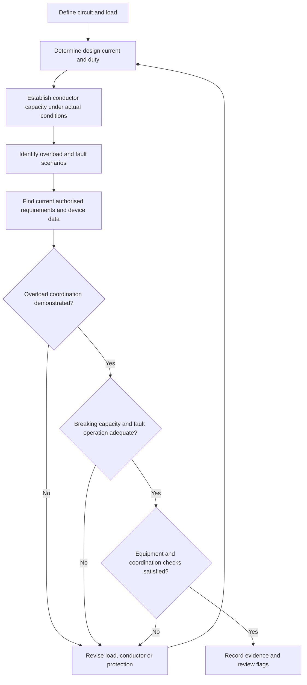
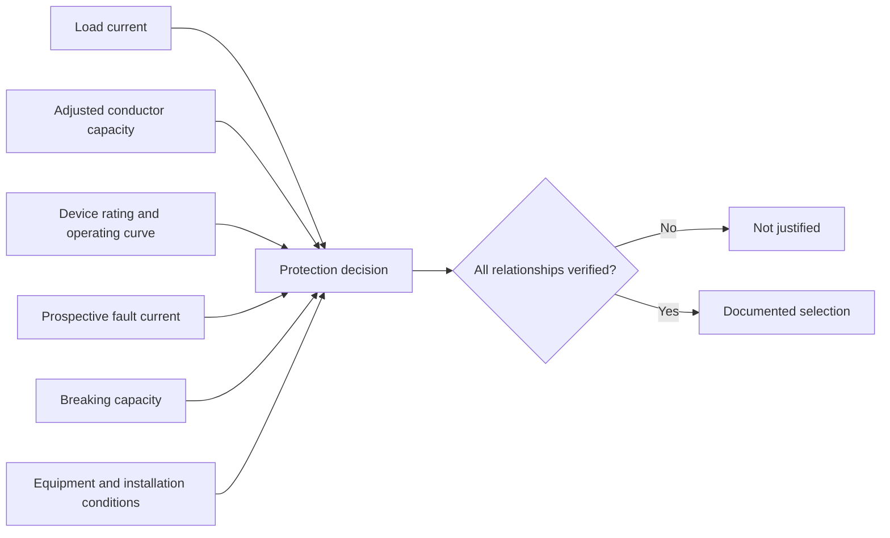

# Day 3 — Overcurrent Protection

> **Currency and safety notice:** This module teaches the reasoning used to recognise overcurrent hazards and coordinate loads, conductors and protective devices. It does not provide complete device-selection tables, breaking-capacity values, trip curves, discrimination settings, fault-level calculations or jurisdiction-specific installation rules. Verify all exact ratings, clauses, limits, device data and assessment requirements against current authorised standards, regulator guidance, manufacturer information, workplace procedures and RTO instructions.

## 1. Outcome and entry check

### Learning objectives

By the end of this block, the learner should be able to:

1. define **current**, **rated current**, **overcurrent**, **overload current**, **short-circuit current**, **fault current**, **prospective fault current** and **breaking capacity**;
2. distinguish an overload from a short circuit using the cause, current path, likely magnitude and required protective response;
3. explain why overcurrent protection must be coordinated with the conductor, connected equipment, supply conditions and installation method;
4. apply a structured workflow to identify the relevant protective requirement without copying a standards table;
5. identify the evidence needed to justify a protective-device choice;
6. recognise common unsafe assumptions, including treating an RCD as overcurrent protection or selecting a device from load current alone.

### Prerequisites

- Completion of [Day 2 — Fundamental Safety Principles](./day-02-fundamental-safety-principles.md).
- Familiarity with voltage, current, resistance, power and basic circuit paths.
- Ability to distinguish normal operation from an abnormal condition.

### Entry check

Answer without looking, then rate confidence as **guessing**, **unsure**, **reasonably confident** or **certain**.

1. What is the difference between an overload and a short circuit?
2. Can a conductor be damaged even when the connected load appears to operate normally?
3. Does an RCD normally replace a circuit breaker or fuse for overload and short-circuit protection?
4. Why must a protective device have sufficient breaking capacity?
5. What information, besides load current, affects conductor and protective-device selection?

A high-confidence answer that treats all excessive current as the same event is a priority misconception for correction.

## 2. Why it matters

Excess current produces heat. If the current, duration and current path exceed what conductors, connections or equipment can safely withstand, insulation can deteriorate, terminals can fail, equipment can be damaged and fire or arc hazards can develop.

Overcurrent protection is therefore not simply “choose the next breaker size above the load.” A defensible design or assessment answer must connect four things:

- the current expected during normal service;
- the current-carrying capability of the conductor under its actual installation conditions;
- the protective device's operating behaviour;
- the fault current the device may be required to interrupt safely.

Different abnormal conditions demand different reasoning. A modest but sustained overload can overheat a conductor over time. A short circuit can produce a much larger current almost immediately. The device must respond appropriately to both, but its exact response depends on its type, rating, curve, settings and the available fault current.


## 3. Core concepts and terminology

### Current

**Current** is the rate of flow of electric charge, measured in amperes. In design work, current is considered both as an expected operating quantity and as a possible abnormal quantity during faults or overloads.

### Rated current

A device's **rated current** is the current value assigned to it under specified conditions. The rating does not, by itself, describe every point on the device's operating curve or prove suitability for a particular conductor and installation.

### Overcurrent

**Overcurrent** is current exceeding the value intended for a conductor, circuit or item of equipment. It is an umbrella term that includes overload current and short-circuit current.

### Overload current

An **overload current** flows in an electrically sound current path but is greater than the circuit or equipment is intended to carry. Typical causes include too much connected load, a stalled or mechanically overloaded machine, or equipment operating outside its intended duty.

The important idea is that the path may still be the normal path. The problem is excessive demand or abnormal operating condition rather than direct contact between conductors at different potentials.

### Short-circuit current

A **short-circuit current** flows through an unintended path with relatively low impedance between points at different potentials. Because the path impedance may be low, the current can rise rapidly and may be many times normal operating current.

### Fault current

**Fault current** is current resulting from an insulation failure, connection failure or unintended conductive path. A fault may involve active conductors, neutral, exposed conductive parts, protective earthing conductors or other conductive paths. Not every fault has the same magnitude or protective response.

### Prospective fault current

**Prospective fault current** is the current expected to flow at a point if a fault of the relevant type occurred there, before the protective device limits or interrupts it. It depends on supply characteristics and total impedance of the fault path.

### Protective device

A **protective device** detects or responds to an abnormal electrical condition and acts to limit danger or damage. In this module, the focus is overcurrent protective devices such as circuit breakers and fuses. Their exact characteristics must be taken from authorised standards and manufacturer data.

### Circuit breaker

A **circuit breaker** is a resettable switching and protective device designed to open a circuit automatically under specified abnormal current conditions. Its behaviour is described by more than the number printed on its front.

### Fuse

A **fuse** contains an element intended to melt and interrupt the circuit when current and time exceed its designed characteristic. A fuse must be replaced after operation, and replacement type and rating are critical.

### Current-carrying capacity

A conductor's **current-carrying capacity** is the current it can carry continuously under specified conditions without exceeding its permitted temperature. It is affected by conductor size and material, insulation type, ambient temperature, grouping, enclosure, thermal insulation, installation method and other factors.

### Breaking capacity

**Breaking capacity** is the maximum prospective current a protective device is designed to interrupt safely under specified conditions. A device with inadequate breaking capacity may fail dangerously when attempting to clear a high-current fault.

### Time-current characteristic

A **time-current characteristic** describes how operating time changes with current magnitude. Generally, the greater the overcurrent, the faster a suitable device is expected to operate, but exact behaviour must be confirmed from the applicable device data.

### Selectivity and discrimination

**Selectivity**, often called **discrimination**, is coordination intended to have the protective device nearest the fault operate while appropriate upstream devices remain closed. This can reduce the extent of supply interruption. Exact coordination requires verified device data and is `reference_check_required`.

### RCD distinction

A **residual current device (RCD)** responds to an imbalance between currents in live conductors. It provides a different protective function from overload and short-circuit protection. Some combined devices contain both functions, but the residual-current function alone must not be assumed to provide overcurrent protection.

## 4. Rule-finding workflow

Use this workflow when selecting, checking or explaining overcurrent protection.

1. **Define the circuit and load.** Identify what is supplied, expected operating current, duty, starting behaviour and possible future loading.
2. **Identify the conductor.** Establish conductor material, size, insulation, installation method, grouping, ambient conditions and any thermal constraints.
3. **Identify abnormal-current scenarios.** Consider sustained overload, short circuit, earth fault, equipment fault and starting or inrush current.
4. **Locate the governing requirements.** Use the authorised Wiring Rules, relevant equipment standard, manufacturer data, regulator guidance and project or RTO requirements.
5. **Check overload coordination.** Confirm that the design current, device rating or setting and conductor capacity satisfy the applicable relationship.
6. **Check fault protection.** Confirm that the device can interrupt the prospective fault current and operate within the required conditions for the relevant fault path.
7. **Check equipment compatibility.** Confirm the device type and characteristic suit equipment starting current, duty and manufacturer requirements.
8. **Check upstream and downstream coordination.** Consider selectivity, backup protection, cascading or other documented coordination only where supported by verified data.
9. **Check environmental and enclosure effects.** Device performance may be affected by ambient temperature, enclosure conditions and grouping.
10. **Record evidence.** Document assumptions, source references, calculations, device data and unresolved reference checks.



The workflow deliberately loops back when one element changes. Increasing a breaker rating, for example, may require reassessing conductor capacity, equipment protection and fault performance rather than editing one number in isolation.

## 5. Visual model or worked example

### Overload and short-circuit comparison

| Feature | Overload | Short circuit |
|---|---|---|
| Current path | Usually the intended circuit path | Unintended low-impedance path |
| Typical cause | Excess load, stalled equipment or abnormal duty | Insulation failure, damaged conductors or conductive contact |
| Likely current | Above intended current; magnitude varies | Often much higher, limited by source and path impedance |
| Heating pattern | Can accumulate over time | Can rise extremely quickly |
| Design focus | Match load, conductor capacity and device operating characteristic | Interrupt safely and rapidly enough for the applicable fault condition |
| Evidence required | Load data, cable conditions, device rating and time-current behaviour | Prospective fault current, fault-path information, breaking capacity and operating data |

### Worked reasoning example

**Scenario:** A final subcircuit supplies equipment with a steady operating current below the number printed on the circuit breaker. The cable passes through a warm service area, shares an enclosure with other loaded circuits and is partly surrounded by thermal insulation.

A weak answer is: “The load is below the breaker rating, so the circuit is protected.”

A stronger reasoning sequence is:

1. Establish the load current and any starting, cycling or abnormal-duty current.
2. Determine the conductor's current-carrying capacity under the actual installation conditions, including all applicable correction factors.
3. Compare the design current, device rating or setting and adjusted conductor capacity using the current authorised rule.
4. Confirm the device's time-current behaviour is appropriate for both expected operation and overload protection.
5. Determine the prospective fault current at the device location and confirm adequate breaking capacity.
6. Check equipment instructions, enclosure effects and coordination with upstream protection.
7. Record any unverified table values or device characteristics as `reference_check_required`.



The diagram shows why no single number proves suitability. The decision is a relationship supported by evidence.


## 6. Practical application

### Protection-selection evidence sheet

Use a trainer-supplied original scenario. Do not copy values from a standards table into the repository.

```text
Circuit purpose:
Connected equipment and duty:
Design current and calculation source:
Starting, inrush or cyclic behaviour:
Conductor material, size and insulation:
Installation method:
Ambient, grouping and thermal conditions:
Adjusted current-carrying capacity source:
Overload scenarios considered:
Short-circuit and other fault scenarios considered:
Protective device type:
Rated current or setting:
Time-current characteristic source:
Prospective fault current source or calculation:
Breaking capacity evidence:
Equipment-manufacturer requirements:
Upstream/downstream coordination evidence:
Unresolved assumptions:
Reference checks required:
Final justification in the learner's own words:
```

### Scenario tasks

Apply the evidence sheet to these three contexts:

1. a general-purpose final subcircuit with additional loads proposed after installation;
2. a motor circuit with a high starting current and possible mechanical overload;
3. a submain where the available fault current and upstream device coordination must be considered.

For each scenario, the learner must:

- classify at least one overload scenario and one short-circuit scenario;
- identify the normal and abnormal current paths;
- list every item of evidence required before selecting a device;
- explain why load current alone is insufficient;
- identify whether separate residual-current protection is also required, without treating it as a substitute for overcurrent protection;
- mark exact table values, curves, limits and clauses as `reference_check_required` unless verified from authorised current material.

### Performance evidence

A competent response should show:

- correct distinction between overload and short circuit;
- coordination of load, conductor and protective device;
- consideration of actual cable installation conditions;
- explicit breaking-capacity and prospective-fault-current reasoning;
- use of manufacturer data where device behaviour matters;
- no unsupported claim that a larger device is automatically safer;
- no unsupported claim that an RCD replaces overcurrent protection;
- a traceable record of sources and assumptions.

## 7. Common errors and safety checkpoint

### Common errors

**Selecting from load current alone**  
The conductor may be derated by its installation conditions, and the device must also satisfy fault and breaking-capacity requirements.

**Treating all overcurrent as a short circuit**  
An overload can occur in an electrically sound path and may persist long enough to overheat conductors or equipment without an immediate high-magnitude fault.

**Increasing the breaker rating to stop nuisance operation**  
This can remove effective conductor or equipment protection. The cause of operation must be investigated before any rating or setting is changed.

**Assuming the printed rating describes the whole device**  
Device type, operating curve, poles, voltage rating, breaking capacity, environmental conditions and manufacturer instructions also matter.

**Confusing RCD and overcurrent functions**  
Residual-current protection and overcurrent protection respond to different conditions. Combined devices must be assessed by each relevant function.

**Ignoring starting or inrush current**  
A device may operate during normal equipment starting if its characteristic is unsuitable, but selecting a slower or larger device without checking conductor and fault protection is not a valid correction.

**Ignoring prospective fault current**  
A device can have an apparently suitable current rating but insufficient capacity to interrupt the fault current available at its location.

**Assuming selectivity from rating size alone**  
Coordination depends on verified operating characteristics and manufacturer information, not simply an upstream device having a larger current number.

### Safety checkpoint

Stop the design, inspection or proposed alteration when:

- conductor installation conditions are unknown;
- the protective device cannot be positively identified;
- device data, breaking capacity or fault-current information is unavailable;
- evidence conflicts with labels, drawings or previous records;
- signs of overheating, arcing, damage or unauthorised alteration are present;
- the proposed solution is merely to fit a higher-rated device;
- the task moves beyond the learner's authority, competence or supervision.

This lesson does not authorise opening energised equipment, performing fault-current tests, replacing protective devices or altering circuit protection. Practical work requires the applicable safe system of work and competent supervision.

## 8. Retrieval and next links

### Recall check

Answer from memory before reviewing the module.

1. Define overcurrent in one sentence.
2. What feature distinguishes an overload path from a short-circuit path?
3. Why can a steady load below a breaker's printed rating still be unsafe for the conductor?
4. What is prospective fault current?
5. What does breaking capacity tell you?
6. Why is a time-current characteristic relevant?
7. Name five installation conditions that can affect conductor current-carrying capacity.
8. Why is an RCD not normally a substitute for overload and short-circuit protection?
9. What evidence is needed before claiming two protective devices are selective?
10. State three stop conditions for an overcurrent-protection assessment.

### Applied retrieval

Without looking, draw a triangle labelled **load**, **conductor** and **protective device**. Add **fault current** outside the triangle. Explain how changing any one item forces the others to be checked again.

Then write a two-column comparison of overload and short circuit using:

- cause;
- current path;
- likely current magnitude;
- heating timescale;
- evidence needed;
- protective-device requirement.

### Self-check criteria

The response is ready for review when the learner can:

- classify abnormal-current scenarios correctly;
- state the protection relationship without relying on one rating;
- identify missing evidence rather than inventing it;
- explain the difference between overcurrent and residual-current protection;
- separate general principles from exact requirements needing authorised verification.

### Related vault notes

- [[Day 02 - Fundamental Safety Principles]]
- [[Day 03 - Overcurrent Protection]]
- [[Control Switching and Protection]]
- [[Conductors and Wiring Systems]]
- [[Electrical Fundamentals]]
- [[AS-NZS-3000-2018-Index]]

### Next block

Proceed to **Day 4 — RCD Protection and Additional Protection** after completing the recall check and correcting any high-confidence errors.

### References and currency notice

- AS/NZS 3000:2018 — authorised current copy required; relevant clauses remain reference-only.
- Applicable current Australian or New Zealand electrical safety legislation and regulator guidance.
- Current manufacturer data for the exact protective devices being assessed.
- Current cable-manufacturer data and authorised cable-selection sources.
- Applicable workplace, project and RTO procedures.

All exact current relationships, correction factors, operating times, breaking capacities, coordination claims, device characteristics and clause references remain `reference_check_required` until verified by a qualified reviewer against authorised current sources. This original educational module must not be used as a substitute for the Wiring Rules, device data or supervised practical training.
