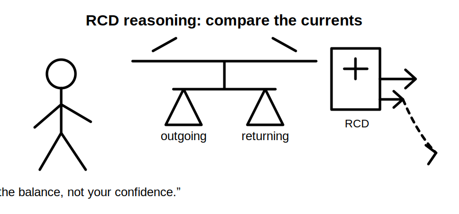
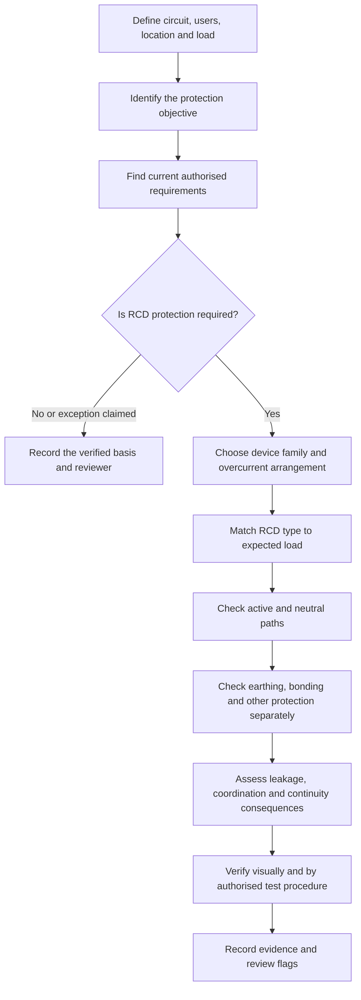
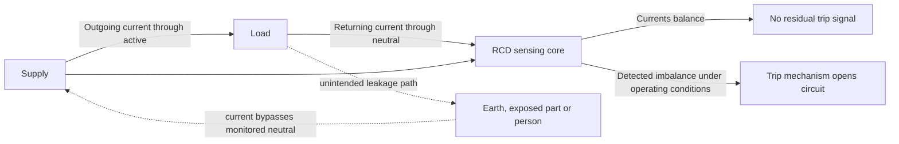
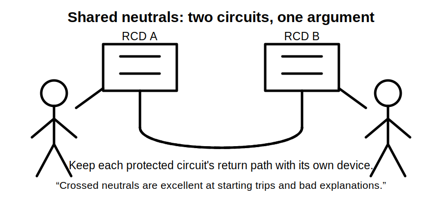

# Day 4 — RCD Protection and Additional Protection

> **Currency and safety notice:** This module teaches the purpose, operating concept, selection questions and limitations of residual current devices. It does not provide a complete installation rule, universal trip threshold, test procedure, permitted omission, circuit list or jurisdiction-specific assessment answer. Verify all exact device types, current ratings, residual-current ratings, operating times, test methods, clauses, exceptions and installation requirements against current authorised standards, regulator guidance, manufacturer instructions, workplace procedures and RTO requirements.

## Navigation

- **Previous:** [Day 3 — Overcurrent Protection](./day-03-overcurrent-protection.md)
- **Next:** Day 5 — Rest, Retrieval and Catch-Up

## 1. Outcome and entry check

### Learning objectives

By the end of this block, the learner should be able to:

1. define **residual current**, **residual current device**, **additional protection**, **earth leakage**, **protective earthing**, **rated residual operating current**, **selectivity** and **nuisance tripping**;
2. explain the normal operating principle of an RCD using current balance rather than the vague statement that it “detects earth”; 
3. distinguish residual-current protection from overload, short-circuit and fault-current protection;
4. identify the evidence required to decide whether an RCD is required and whether a selected device is suitable;
5. explain why an RCD does not make direct contact, damaged wiring or unsafe work acceptable;
6. recognise common failure modes, including shared neutrals, incorrect neutral connections, accumulated leakage and unsuitable device type;
7. apply a rule-finding workflow without reproducing standards tables or asserting unverified limits.

### Prerequisites

- Completion of [Day 3 — Overcurrent Protection](./day-03-overcurrent-protection.md).
- Ability to identify active, neutral and protective earthing conductors conceptually.
- Understanding that a protective device must match the hazard it is intended to control.

### Entry check

Answer from memory, then rate confidence as **guessing**, **unsure**, **reasonably confident** or **certain**.

1. What quantity does an RCD compare during normal operation?
2. Does an RCD normally provide overload protection?
3. Can current pass through a person without an RCD operating?
4. Why can shared neutrals create incorrect RCD operation?
5. What is the difference between protective earthing and residual-current protection?
6. Why must the exact RCD type be checked against the connected equipment?

A high-confidence claim that “an RCD prevents all electric shock” is a priority misconception.

## 2. Why it matters

An RCD is intended to reduce risk when current leaves the intended live-conductor path. It can disconnect supply when the current returning through the monitored live conductors differs sufficiently from the current leaving through them. This can provide an important additional layer of protection, especially where a fault or contact path allows current to flow through earth, exposed conductive parts or a person.

The protection is limited. An RCD cannot make an unsafe installation safe by itself. It does not normally protect a conductor from overload, may not respond to every contact scenario, depends on correct wiring and device selection, and must operate within verified conditions. It is one layer within a broader system that includes insulation, barriers, earthing, bonding, overcurrent protection, isolation, verification and safe work practices.



## 3. Core concepts and terminology

### Residual current

**Residual current** is the difference between the currents flowing through the live conductors monitored by the RCD. In a simple single-phase circuit, current leaving on the active conductor should normally return on the neutral conductor. If some current returns by another path, the monitored currents become unbalanced.

### Residual current device

A **residual current device (RCD)** is a switching device designed to open a circuit when the residual current reaches its operating conditions. The device does not need to identify the physical location of the leakage path; it responds to imbalance in the conductors it monitors.

### Current balance

**Current balance** means the vector sum of currents through the monitored live conductors is approximately zero during normal operation. Equal outgoing and returning current produces little or no residual signal. A difference indicates that some current is taking another path.

### Earth leakage

**Earth leakage** is current flowing from live parts toward earth or earthed parts through insulation, filters, capacitance, contamination, equipment construction or a fault path. Some equipment can produce normal leakage current. The combined leakage of several items may affect RCD selection and unwanted operation.

### Additional protection

**Additional protection** is a supplementary protective measure used in addition to basic protection and fault protection. It is not permission to omit insulation, barriers, earthing, automatic disconnection, safe isolation or other required measures.

### Basic protection

**Basic protection** reduces the risk of contact with live parts during normal service. Examples include insulation, barriers and enclosures. Exact definitions and accepted measures require authorised-source verification.

### Fault protection

**Fault protection** reduces danger when a fault makes an exposed conductive part live or creates another hazardous condition. Earthing, protective bonding and automatic disconnection are central concepts, but their exact requirements are outside this module and remain `reference_check_required`.

### Protective earthing

**Protective earthing** connects relevant conductive parts to the earthing system so that fault current has a defined path and protective devices can operate under the required conditions. An RCD complements but does not replace a correctly designed protective earthing system where earthing is required.

### Rated residual operating current

The **rated residual operating current** is the assigned residual-current value associated with the device's operation under specified conditions. The exact value required for a circuit or purpose must be verified from current authorised requirements and manufacturer data.

### RCD type

An **RCD type** describes the forms of residual current waveform the device is designed to detect. Modern electronic equipment can produce non-sinusoidal or direct-current components, so device type must be matched to the expected load and current authoritative requirements. This module does not prescribe a universal type.

### Combined device

A **combined device**, commonly an RCBO, contains both residual-current and overcurrent protective functions. Each function must be checked independently. The presence of an RCD function does not prove adequate overload, short-circuit or breaking-capacity performance.

### Nuisance or unwanted tripping

**Unwanted tripping** is operation when no dangerous fault requiring disconnection is present. Possible causes include accumulated normal leakage, switching transients, moisture, damaged equipment, incorrect neutral arrangements or unsuitable device selection. The term “nuisance” must not be used to dismiss a genuine fault.

### Selectivity

**Selectivity** is coordination intended to have the protective device closest to the fault operate while appropriate upstream devices remain closed. For RCDs, selectivity depends on verified device characteristics, arrangement and timing. It must not be assumed from rating labels alone.

### Functional test and instrument test

A **functional test** checks whether a device responds to its built-in test mechanism. An **instrument test** uses suitable test equipment to assess operating behaviour under controlled conditions. The built-in test button does not prove every part of the installation, and exact testing methods are deferred to Day 23 and current authorised procedures.

## 4. Rule-finding workflow

Use this workflow when deciding whether residual-current protection is required or checking whether an existing arrangement is defensible.

1. **Define the circuit.** Identify its purpose, location, connected equipment, supply arrangement, users and environmental conditions.
2. **Identify the protection objective.** Determine whether the question concerns additional protection, fault protection, fire-risk reduction, equipment requirements or another purpose.
3. **Locate the governing sources.** Check the current Wiring Rules, legislation, regulator guidance, equipment instructions, project specifications and RTO requirements.
4. **Confirm whether an RCD is required.** Verify the circuit category, location, exceptions, alteration rules and any transitional or jurisdiction-specific requirements.
5. **Select the correct device family.** Determine whether a separate RCD or combined device is appropriate, while checking overcurrent protection independently.
6. **Match the RCD type to the load.** Review connected equipment, electronic converters, variable-speed drives, inverters, chargers and manufacturer instructions.
7. **Check the monitored conductors.** Confirm all required live conductors pass through the device and that neutrals are not incorrectly shared or connected across protected groups.
8. **Check earthing and bonding separately.** Do not treat RCD installation as proof that the protective earthing system is correct.
9. **Assess leakage and coordination.** Consider accumulated leakage, unwanted operation, upstream/downstream selectivity and continuity of supply where relevant.
10. **Plan verification.** Identify the required visual checks and tests using current authorised procedures and suitable instruments.
11. **Record evidence.** Document the source, device details, circuit arrangement, test evidence, assumptions and unresolved checks.



The decision begins with the circuit and protection objective, not with a familiar device label. A technically defensible answer must show why the device is required, what hazard it addresses and what other protections remain necessary.

## 5. Visual model or worked example

### Balanced and unbalanced current



This is a conceptual model, not a wiring diagram. The key idea is that current returning outside the monitored live conductors creates an imbalance. The RCD responds to the imbalance; it does not measure whether the alternative path is safe.

### Worked reasoning example

**Scenario:** Several socket-outlet circuits share a switchboard. One circuit intermittently trips after new electronic equipment is connected. A person proposes replacing the RCD with a different unit immediately.

A weak response is: “The RCD is too sensitive.”

A stronger reasoning sequence is:

1. Treat operation as evidence requiring investigation, not an inconvenience to bypass.
2. Identify exactly which circuits and neutrals pass through the device.
3. Check for shared, crossed or incorrectly connected neutrals.
4. Inspect for moisture, insulation damage, damaged leads and faulty appliances using authorised safe procedures.
5. Review the normal leakage characteristics and manufacturer information for connected electronic equipment.
6. Confirm the installed RCD type is suitable for the expected residual-current waveform.
7. Check whether too many circuits or loads are grouped in a way that creates excessive accumulated leakage or poor continuity outcomes.
8. Verify the device and circuit using current authorised test procedures and calibrated suitable equipment.
9. Change the arrangement or device only when the cause and compliance basis are documented.



## 6. Practical application

### RCD assessment evidence sheet

Use a trainer-supplied original installation scenario.

```text
Circuit purpose:
Location and environmental conditions:
People or equipment exposed to risk:
Protection objective:
Current authorised source consulted:
Reason RCD protection is required or not required:
Any claimed exception and evidence:
Device manufacturer and model:
Separate RCD or combined device:
Overcurrent function and breaking-capacity evidence:
Rated residual operating current source:
RCD type and load-compatibility evidence:
Monitored live conductors:
Neutral arrangement:
Protective earthing and bonding checks:
Expected normal leakage sources:
Upstream/downstream coordination evidence:
Visual inspection results:
Authorised test procedure and instrument:
Recorded test results:
Unresolved assumptions:
Reference checks required:
Final justification in the learner's own words:
```

### Scenario tasks

Apply the evidence sheet to:

1. a socket-outlet final subcircuit supplying portable equipment in a general work area;
2. a circuit supplying several electronic loads with filters and possible accumulated leakage;
3. a switchboard where neutrals from two protected circuit groups may have been mixed;
4. a combined protective device where residual-current and overcurrent functions both require verification.

For each scenario, the learner must:

- identify the protection objective;
- distinguish residual-current protection from overcurrent protection;
- describe the intended outgoing and returning current paths;
- identify evidence needed to select the device type;
- identify at least three wiring or installation defects that could cause incorrect operation;
- state what remains protected by earthing, bonding, insulation and overcurrent devices;
- mark every exact requirement, value, exception and test criterion as `reference_check_required` unless verified.

### Performance evidence

A competent response should show:

- a correct current-balance explanation;
- no claim that the RCD detects every electric-shock event;
- independent checking of overcurrent protection;
- correct attention to active and neutral conductor routing;
- recognition that normal leakage can accumulate;
- device-type selection based on load evidence rather than habit;
- separation of functional checking from full verification;
- traceable source and test records.

## 7. Common errors and safety checkpoint

### Common errors

**Saying the RCD “detects current to earth”**  
This can hide the actual operating principle. The device normally detects imbalance in monitored live conductors; the missing current may be taking an earth path, a person path or another unintended route.

**Assuming an RCD prevents all electric shock**  
Some contact scenarios may not create sufficient imbalance, and the device cannot prevent the initial contact. It is additional protection, not invulnerability.

**Treating an RCD as overcurrent protection**  
A residual-current function does not normally protect against overload or short circuit. Combined devices must have both functions verified.

**Ignoring neutral separation**  
Shared or crossed neutrals can create residual current through the wrong device, unwanted tripping or failure of the intended protective arrangement.

**Replacing a tripping device without finding the cause**  
Operation may indicate damaged insulation, moisture, incorrect wiring, unsuitable loads or a genuine fault. Substitution without diagnosis can conceal danger.

**Assuming the test button proves the installation**  
The built-in mechanism provides a limited functional check. It does not replace visual inspection, instrument testing, earthing verification or other required tests.

**Selecting the same RCD type for every load**  
Electronic equipment can produce different residual-current waveforms. The exact suitable type must be supported by current requirements and manufacturer data.

**Using RCD protection to excuse live work or poor isolation**  
An RCD is not a control measure that makes unnecessary energised work acceptable.

### Safety checkpoint

Stop the task and escalate when:

- the circuit or neutral arrangement cannot be positively identified;
- conductors from different supplies or protective groups may be mixed;
- alternate supplies, generators, inverters or batteries may remain energised;
- signs of overheating, arcing, moisture, damaged insulation or unauthorised alteration are present;
- the device type, rating or manufacturer data is unavailable;
- a test would require work beyond the learner's authority, competence or supervision;
- current authorised test procedures and suitable equipment are unavailable;
- someone proposes bypassing, uprating or removing protection merely to stop tripping.

This module does not authorise live testing, opening energised equipment, disconnecting neutrals, altering switchboards or performing RCD tests without the applicable safe system of work and competent supervision.

## 8. Retrieval and next links

### Recall check

Answer from memory.

1. What does residual current represent?
2. Why is “the RCD detects earth” an incomplete explanation?
3. What is additional protection?
4. Why does an RCD not normally replace overload protection?
5. How can a shared neutral affect RCD operation?
6. Why can several healthy electronic loads contribute to unwanted operation?
7. What must be checked when selecting an RCD type?
8. What does the built-in test button fail to prove?
9. Name four protections or controls that still matter when an RCD is fitted.
10. State five stop conditions for an RCD investigation.

### Applied retrieval

Draw a simple loop showing supply, active conductor, load and neutral conductor. Add an unintended leakage path that bypasses the monitored neutral. Explain:

- what remains balanced during normal operation;
- what changes during leakage;
- what the RCD can detect;
- what it cannot determine;
- which separate protective functions still need verification.

Then compare these four devices or functions in your own words:

- RCD residual-current function;
- circuit-breaker overcurrent function;
- fuse overcurrent function;
- protective earthing system.

### Self-check criteria

The response is ready for review when the learner can:

- explain current balance without relying on slogans;
- distinguish basic, fault and additional protection conceptually;
- identify the device and wiring evidence needed before selection;
- explain why neutral arrangement matters;
- investigate unwanted operation without assuming the device is defective;
- identify exact details that require authorised-source verification.

### Related vault notes

- [[Day 03 - Overcurrent Protection]]
- [[Day 04 - RCD Protection and Additional Protection]]
- [[Control Switching and Protection]]
- [[Earthing Bonding and MEN]]
- [[Inspection Testing and Verification]]
- [[AS-NZS-3000-2018-Index]]

### Previous block

Return to [Day 3 — Overcurrent Protection](./day-03-overcurrent-protection.md) to review the distinction between residual-current and overcurrent functions.

### Next block

Proceed to **Day 5 — Rest, Retrieval and Catch-Up** after completing the recall check and correcting any high-confidence errors.

### References and currency notice

- AS/NZS 3000:2018 — authorised current copy required; relevant clauses and amendments remain reference-only.
- Current applicable Australian or New Zealand electrical safety legislation and regulator guidance.
- Current manufacturer instructions for the exact RCD, RCBO and connected equipment.
- Current authorised verification and test procedures, including instrument requirements.
- Applicable workplace, project and RTO procedures.

All exact circuit categories, exceptions, device types, residual-current ratings, operating times, test values, selectivity claims, leakage limits, installation arrangements and clause references remain `reference_check_required` until verified by a qualified reviewer against authorised current sources. This original module must not be used as a substitute for the Wiring Rules, manufacturer data or supervised practical training.

<!-- sequence-navigation:start -->
### Sequence navigation

- [← Previous: Day 3 — Overcurrent Protection](./day-03-overcurrent-protection.md)
- [Four-week learning plan](../MASTER_PLAN.md)
- [Next: Day 5 — Rest, Retrieval and Catch-Up →](./day-05-rest-retrieval-and-catch-up.md)
<!-- sequence-navigation:end -->
