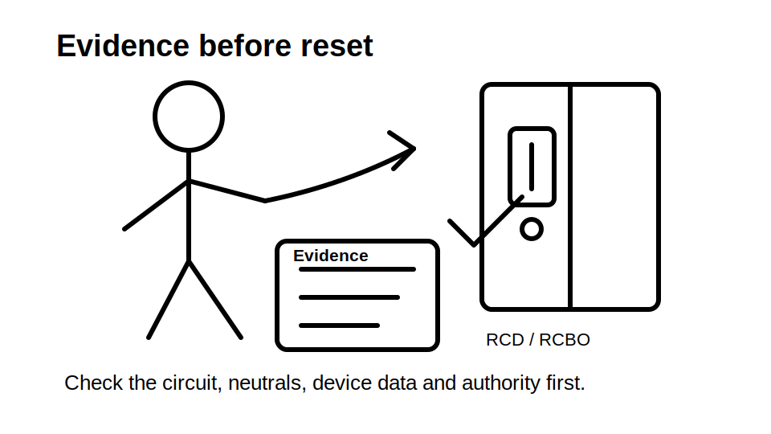
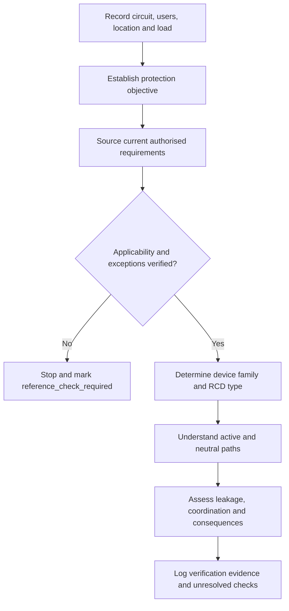
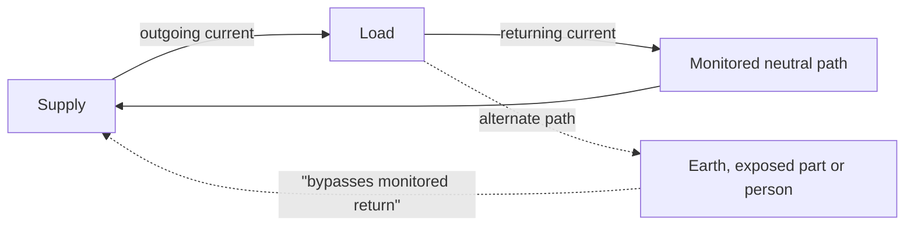

# Day 4 — RCD Protection and Additional Protection

> **Currency and safety notice:** This module teaches residual-current reasoning, evidence selection and protection boundaries. It does not provide a complete installation rule, universal device type, trip threshold, operating time, testing sequence, permitted omission, circuit list or jurisdiction-specific assessment answer. Verify exact requirements against current authorised standards, legislation, regulator guidance, manufacturer instructions, workplace procedures and RTO requirements.

## Navigation

- **Previous:** [Day 3 — Overcurrent Protection](./day-03-overcurrent-protection.md)
- **Next:** [Day 5 — Rest, Retrieval and Catch-Up](./day-05-rest-retrieval-and-catch-up.md)

## 1. Outcome and entry check

### Learning objectives

By the end of this block, the learner should be able to:

1. define residual current, RCD, additional protection, earth leakage, rated residual operating current, RCD type, selectivity and unwanted tripping;
2. explain RCD operation using current balance rather than the slogan that it “detects earth”;
3. distinguish residual-current protection from overload, short-circuit and protective-earthing functions;
4. apply the **R-E-S-I-D-U-A-L** workflow to a circuit scenario;
5. identify the evidence needed before deciding whether an RCD is required, suitable or correctly arranged;
6. diagnose at least four plausible causes of unwanted operation without assuming the device is defective;
7. state clear stop conditions and mark every unverified exact requirement `reference_check_required`;
8. complete a varied re-attempt that demonstrates transfer to a different circuit and load profile.

### Entry check

Answer from memory and rate confidence as **guessing**, **unsure**, **reasonably confident** or **certain**.

1. What currents does an RCD compare?
2. Does an RCD normally provide overload protection?
3. Can current pass through a person without an RCD operating?
4. Why can a shared neutral cause incorrect operation?
5. What is the difference between protective earthing and residual-current protection?
6. Why must device type be checked against connected equipment?

A high-confidence claim that “an RCD prevents all electric shock” is a priority misconception and must be corrected before proceeding.

## 2. Why it matters

An RCD can reduce risk when current leaves the intended monitored-conductor path. It is an important protective layer, but it is not a universal shield. Correct performance depends on the circuit arrangement, device characteristics, connected equipment, earthing and bonding, overcurrent protection, verification and safe work practices.

Assessment answers commonly fail when they jump from “RCD present” to “safe” without proving:

- why the protection is required;
- what the device actually monitors;
- whether all required live conductors pass through the correct device;
- whether neutrals remain within the correct protected group;
- whether the device type suits the load;
- what separate protective functions still require verification.



## 3. Core concepts and terminology

### Residual current

**Residual current** is the vector difference between currents flowing through the live conductors monitored by the device. In a simple single-phase example, outgoing active current and returning neutral current should normally balance. Current returning by another path creates an imbalance.

### Residual current device

A **residual current device (RCD)** is a switching device designed to open a circuit when residual current reaches its operating conditions. It responds to monitored-conductor imbalance; it does not identify the physical location, cause or safety of the alternate path.

### Current balance

**Current balance** means the vector sum of monitored live-conductor currents is approximately zero under normal conditions. Balance is the core operating model.

### Earth leakage

**Earth leakage** is current flowing from live parts toward earth or earthed parts through insulation, filters, capacitance, contamination, equipment construction or a fault path. Several individually acceptable leakage sources can accumulate across a protected group.

### Additional protection

**Additional protection** is supplementary protection used alongside basic protection and fault protection. It does not authorise omission of insulation, barriers, enclosures, earthing, bonding, automatic disconnection, isolation or safe work controls.

### Protective earthing

**Protective earthing** connects relevant conductive parts to the earthing system so a fault-current path can support operation of protective measures under required conditions. An RCD can complement earthing; it does not prove the earthing system is correct.

### Rated residual operating current

The **rated residual operating current** is the assigned residual-current value associated with device operation under specified conditions. The required value for any purpose remains `reference_check_required` until verified.

### RCD type

An **RCD type** describes the residual-current waveforms the device is designed to detect. Electronic converters, drives, inverters, chargers and filters may affect waveform and leakage behaviour. Selection must be supported by current authorised requirements and manufacturer data.

### Combined device

A combined device, commonly called an **RCBO**, incorporates residual-current and overcurrent functions. Each function must be checked independently; one label does not prove adequate overload, short-circuit, breaking-capacity or residual-current performance.

### Unwanted tripping

**Unwanted tripping** is operation where investigation does not confirm a dangerous fault requiring disconnection. Possible causes include accumulated leakage, switching transients, moisture, damaged equipment, crossed neutrals or unsuitable selection. The label must never be used to dismiss operation before evidence is gathered.

### Selectivity

**Selectivity** is coordination intended to limit operation to the protective device nearest the relevant fault while maintaining appropriate upstream continuity. For RCDs it depends on verified arrangement, characteristics and timing, not rating labels alone.

### Functional test and instrument test

A **functional test** checks response to a built-in mechanism. An **instrument test** uses suitable equipment under an authorised procedure to assess specified operating behaviour. A test button does not prove the whole installation.

### Three protection questions

Keep these questions separate:

1. **Residual-current question:** Is monitored current leaving by another path?
2. **Overcurrent question:** Are conductors and equipment protected against excessive current?
3. **Fault-path question:** Will earthing, bonding and automatic disconnection perform as required?

A defensible answer addresses all three instead of treating an RCD as a substitute for the others.

## 4. Rule-finding workflow

Use **R-E-S-I-D-U-A-L**.

1. **R — Record the circuit context.** Identify purpose, location, users, supply arrangement, connected equipment and environmental conditions.
2. **E — Establish the protection objective.** Decide whether the question concerns additional protection, fault protection, fire-risk reduction, equipment instructions or another purpose.
3. **S — Source the governing requirement.** Check current authorised standards, legislation, regulator guidance, manufacturer instructions, project requirements and RTO rules.
4. **I — Identify applicability and exceptions.** Verify circuit category, location, alteration status, transitional provisions and any claimed exception.
5. **D — Determine device family and type.** Separate residual-current requirements from overcurrent requirements and match the RCD type to load evidence.
6. **U — Understand conductor paths.** Confirm all required live conductors pass through the device and neutrals are not shared, crossed or connected between protected groups.
7. **A — Assess leakage, coordination and consequences.** Consider accumulated leakage, upstream/downstream coordination and continuity-of-supply consequences.
8. **L — Log verification and unresolved checks.** Record device data, source evidence, visual findings, authorised test evidence, assumptions and review flags.



The workflow deliberately starts with circuit context and protection objective, not a familiar device label.

### Evidence ladder

Classify every statement:

- **Observed fact:** visible label, conductor routing shown on an authorised drawing, recorded test result or confirmed circuit purpose.
- **Authorised technical evidence:** current requirement, manufacturer instruction, approved design or competent reviewer direction.
- **Unresolved assumption:** inferred circuit identity, guessed neutral grouping, presumed device suitability or unverified exception.

Do not promote an assumption to a conclusion because it appears plausible.

## 5. Visual model or worked example

### Balanced and unbalanced current



The model is conceptual, not a wiring diagram. The RCD responds to imbalance. It does not determine whether the alternate path is through a person, damaged insulation, filters, moisture or incorrect wiring.

### Worked reasoning example

**Scenario:** Several socket-outlet circuits share a switchboard. One protected group trips after new electronic equipment is connected. Someone proposes replacing the device immediately.

Apply R-E-S-I-D-U-A-L:

1. **Record:** identify affected circuits, equipment, supply arrangement and when operation occurs.
2. **Establish:** determine whether the concern is additional protection, equipment compatibility, wiring defect or accumulated leakage.
3. **Source:** obtain the current requirements, device data and equipment manufacturer information.
4. **Identify:** verify circuit category and any claimed exception rather than assuming one.
5. **Determine:** check the installed device family and type, while verifying overcurrent protection separately.
6. **Understand:** confirm active and neutral conductor grouping and look for shared or crossed neutrals.
7. **Assess:** consider moisture, damaged insulation, normal leakage accumulation, switching events and continuity consequences.
8. **Log:** record findings and only alter the arrangement when the cause and compliance basis are established by authorised people.

A weak answer says “the RCD is too sensitive.” A defensible answer identifies competing hypotheses, evidence needed to distinguish them and the safe boundary of the learner’s authority.

## 6. Practical application

### Evidence sheet

Use a trainer-supplied original scenario.

```text
Circuit purpose and location:
Users and environmental conditions:
Supply arrangement and alternate supplies:
Protection objective:
Current authorised sources consulted:
Reason RCD protection is required or not required:
Claimed exception and evidence:
Device manufacturer and model:
Separate RCD or combined device:
Independent overcurrent evidence:
Rated residual operating current source:
RCD type and load-compatibility evidence:
Monitored live conductors:
Neutral grouping and separation evidence:
Earthing and bonding evidence:
Expected leakage sources:
Coordination and continuity consequences:
Visual evidence:
Authorised test evidence:
Unresolved assumptions:
Reference checks required:
Final justification in learner's own words:
```

### Primary scenario

Assess a protected group containing socket-outlet circuits and several electronic loads. Produce:

- a current-balance explanation;
- a R-E-S-I-D-U-A-L evidence trail;
- at least four plausible causes of operation;
- the evidence needed to distinguish those causes;
- a statement of what the RCD does not prove;
- at least five stop conditions;
- all exact unverified details marked `reference_check_required`.

### Varied re-attempt

Without copying the first response, repeat the task for a different scenario:

- a combined protective device supplying a fixed electronic appliance;
- possible crossed neutrals between two protected groups;
- an alternate supply or inverter present;
- incomplete manufacturer information.

The second response must show transfer by changing the evidence priorities, hypotheses and stop conditions.

### Performance rubric

Score each category **0–2**.

| Category | 0 | 1 | 2 |
|---|---|---|---|
| Current-balance model | Incorrect or slogan only | Partly correct | Clear monitored-path explanation |
| Protection boundaries | Treats RCD as universal | Some distinctions | Separates residual, overcurrent and fault-path functions |
| Source use | No traceable source | Source named but applicability weak | Current source, applicability and exception basis recorded |
| Device and load evidence | Assumed from label | Some checks | Device family, type and load compatibility justified |
| Conductor-path reasoning | Ignores neutrals | Mentions grouping | Active/neutral paths and cross-connection risks explained |
| Safety and uncertainty | Unsafe action or false certainty | Some cautions | Stop conditions, authority boundary and unresolved checks explicit |

A result below **10/12**, or any zero in **current-balance model**, **protection boundaries** or **safety and uncertainty**, requires correction and a varied re-attempt. This is an educational rubric, not an official RTO pass mark.

## 7. Common errors and safety checkpoint

### Common errors

**“The RCD detects current to earth.”**  
This hides the actual operating principle. The device detects imbalance in monitored live conductors.

**“An RCD prevents electric shock.”**  
It may reduce consequences in some scenarios but cannot prevent initial contact or guarantee operation for every current path.

**“The RCBO label proves all protection is suitable.”**  
Residual-current and overcurrent functions require separate evidence.

**“The device is nuisance tripping.”**  
Operation is evidence to investigate, not justification to bypass, uprate or replace protection without diagnosis.

**Ignoring neutral boundaries.**  
Shared or crossed neutrals can cause incorrect operation and invalidate the intended arrangement.

**Treating the test button as full verification.**  
The built-in test does not prove conductor routing, earthing, insulation condition, operating performance or every installation requirement.

**Using one RCD type by habit.**  
Load waveform and manufacturer information can materially affect suitability.

### Safety checkpoint

Stop and escalate when:

- circuit identity or neutral grouping cannot be positively established;
- conductors from different supplies or protected groups may be mixed;
- generators, inverters, batteries or other alternate supplies may remain energised;
- overheating, arcing, moisture, damaged insulation or unauthorised alteration is evident;
- device data or connected-equipment instructions are unavailable;
- an exact requirement, exception, rating or test criterion cannot be verified;
- suitable authorised test procedures, instruments, supervision or authority are absent;
- someone proposes bypassing, uprating, removing or repeatedly resetting protection merely to restore supply.

This module does not authorise live testing, opening energised equipment, disconnecting neutrals, altering switchboards, resetting repeatedly, replacing devices or conducting RCD tests without the applicable safe system of work and competent supervision.

## 8. Retrieval and next links

### Recall check

1. What does residual current represent?
2. Why is “the RCD detects earth” incomplete?
3. What is additional protection?
4. Why does an RCD not normally replace overcurrent protection?
5. How can a shared neutral affect operation?
6. Why can healthy electronic loads contribute to accumulated leakage?
7. What evidence is needed to select an RCD type?
8. What does a built-in test button fail to prove?
9. Expand R-E-S-I-D-U-A-L from memory.
10. State five stop conditions.

### Applied retrieval

Draw a current-path model for normal operation and one alternate return path. Then explain:

- which conductors are monitored;
- what changes when current bypasses the monitored return;
- what the RCD can detect;
- what it cannot determine;
- what overcurrent, earthing, bonding, insulation and safe-isolation functions still require separate verification.

### Retrieval spacing

- **After 24 hours:** reproduce R-E-S-I-D-U-A-L and the three protection questions without notes.
- **After 7 days:** analyse a new unwanted-operation scenario using the evidence ladder.
- **Before Day 23:** revisit the distinction between a functional test and authorised verification.

### Self-check criteria

The response is ready for review when the learner can:

- explain current balance without slogans;
- separate residual-current, overcurrent and fault-path questions;
- identify source, device, load and conductor-path evidence;
- investigate operation without assuming device failure;
- state authority boundaries and stop conditions;
- distinguish verified facts from assumptions;
- complete the varied re-attempt without copying the first answer.

### Related vault notes

- [[Day 03 - Overcurrent Protection]]
- [[Day 04 - RCD Protection and Additional Protection]]
- [[Control Switching and Protection]]
- [[Earthing Bonding and MEN]]
- [[Inspection Testing and Verification]]
- [[AS-NZS-3000-2018-Index]]

### References and currency notice

- AS/NZS 3000:2018 — authorised current copy required; relevant clauses and amendments remain reference-only.
- Current applicable Australian or New Zealand electrical safety legislation and regulator guidance.
- Current manufacturer instructions for the exact RCD, RCBO and connected equipment.
- Current authorised verification and test procedures, including instrument requirements.
- Applicable workplace, project and RTO procedures.

All exact circuit categories, exceptions, device types, residual-current ratings, operating times, test values, selectivity claims, leakage limits, installation arrangements and clause references remain `reference_check_required` until verified by a qualified reviewer. This original module is not a substitute for the Wiring Rules, manufacturer data or supervised practical training.

<!-- sequence-navigation:start -->
### Sequence navigation

- [← Previous: Day 3 — Overcurrent Protection](./day-03-overcurrent-protection.md)
- [Four-week learning plan](../MASTER_PLAN.md)
- [Next: Day 5 — Rest, Retrieval and Catch-Up →](./day-05-rest-retrieval-and-catch-up.md)
<!-- sequence-navigation:end -->
