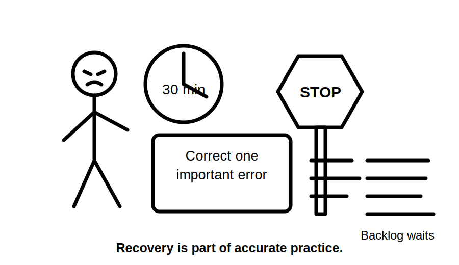
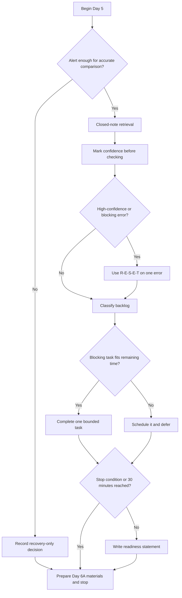

# Day 5 — Rest, Retrieval and Catch-Up

> **Purpose notice:** This is a planned recovery and consolidation block. It introduces no new electrical theory. Technical corrections retain the review and source-verification status of the module from which they came.

## Navigation

- **Previous:** [Day 4 — RCD Protection and Additional Protection](./day-04-rcd-protection-and-additional-protection.md)
- **Next:** [Day 6A — Earthing Terminology and Component Roles](./day-06a-earthing-terminology-and-component-roles.md)

## 1. Outcome and entry check

### Observable learning objectives

By the end of this block, the learner can:

1. produce six core ideas from Days 1–4 before reopening notes;
2. rate confidence separately from correctness;
3. classify unfinished work as **blocking**, **beneficial** or **defer** and justify the classification;
4. repair one high-priority error by identifying the faulty reasoning, checking the governing source pathway and answering a changed scenario;
5. apply the **R-E-S-E-T** workflow and stop within the 30-minute ceiling;
6. write an evidence-based readiness statement for Day 6A.

### Entry check

Before opening earlier modules, answer yes or no:

- Can I explain why source applicability matters as much as finding a source?
- Can I distinguish hazard, exposure pathway and consequence?
- Can I distinguish overload from short circuit?
- Can I explain what an RCD compares without describing it as overload protection?
- Am I alert enough to compare an answer accurately?

When the final answer is **no**, complete only the two-minute setup in Beat 8 and stop. Recovery is the correct outcome.

## 2. Why it matters

A learner can spend time without producing reliable learning. Tired rereading often creates recognition—“this looks familiar”—without proving that an explanation can be recalled, checked or applied. In safety-related study, rehearsing a confident misconception is worse than leaving a minor omission unresolved.

This block protects three resources:

- **attention**, by capping the session;
- **accuracy**, by correcting one important error properly;
- **progression**, by identifying the exact prerequisite needed for the next block.



*Instructional caption: The backlog does not become urgent merely because it is visible. Stop before fatigue turns study into error practice.*

## 3. Core concepts and terminology

- **Deliberate recovery:** a planned reduction in cognitive load so later study can be accurate. It is an active plan, not avoidance.
- **Retrieval practice:** producing an answer before checking notes.
- **Recognition:** familiarity when the answer is visible. Recognition is weaker evidence than recall or application.
- **Confidence calibration:** comparing how certain an answer felt with whether it was correct and well supported.
- **High-confidence error:** an incorrect answer believed to be reliable. It receives priority because it is likely to recur unchecked.
- **Error mechanism:** the reasoning pattern that created the wrong answer, such as conflating two protective functions or assuming a rule applies without checking scope.
- **Blocking task:** unfinished work required to understand or safely enter the next module.
- **Beneficial task:** useful practice that improves fluency but does not block progression.
- **Defer task:** work that is optional, too large for the time box or unlikely to improve readiness today.
- **Stop condition:** a pre-decided signal that further study is no longer trustworthy.
- **Readiness evidence:** an observable result supporting progression, not merely a feeling of preparedness.

## 4. Rule-finding workflow

Use **R-E-S-E-T** whenever recall reveals an uncertain or incorrect technical answer:

1. **R — Retrieve first.** Write the answer before consulting material.
2. **E — Estimate confidence.** Mark guessing, unsure, reasonably confident or certain.
3. **S — Select one priority.** Choose the highest-confidence safety misconception or the prerequisite blocking Day 6A.
4. **E — Examine evidence.** Return to the exact module section and follow its authorised-source pathway where an exact rule, value, exception or procedure is involved.
5. **T — Transfer and terminate.** Answer one changed scenario, record the next review date and stop at the time limit.

The workflow deliberately excludes broad standards browsing, copying clause text and reorganising notes for appearance. Those activities can consume the rest period without proving corrected reasoning.

## 5. Visual model or worked example



### Worked example

A learner confidently states that an RCD protects a conductor against overload and also has three pages of optional notes to reorganise.

- The RCD misconception is selected before the note backlog because it is high-confidence and functionally important.
- The learner checks Day 4, identifies the error mechanism—conflating residual-current and overcurrent functions—and writes a concise correction.
- The transfer question changes the scenario: “Which protection question is unanswered if the residual-current device is suitable but conductor overload protection has not been evaluated?”
- Optional note reorganisation is classified **defer**.
- The learner stops at 30 minutes even if other tasks remain.

## 6. Practical application

### Thirty-minute R-E-S-E-T protocol

**Minutes 0–2 — state check**

Record energy, concentration, any existing stop condition and the decision: recovery only or retrieval plus limited catch-up.

**Minutes 2–12 — closed-note retrieval**

Answer without notes:

1. What makes a source applicable, not merely authoritative?
2. Distinguish hazard, exposure pathway and consequence.
3. Distinguish overload from short circuit.
4. Why is breaking capacity a separate consideration from current rating?
5. What does an RCD compare?
6. Why does an RCD not ordinarily replace overcurrent protection?

Rate confidence before checking.

**Minutes 12–20 — one error repair**

Use this record:

```text
Original answer:
Confidence before checking:
Correct / incomplete / incorrect:
Error mechanism:
Corrected explanation in my own words:
Module section checked:
Authorised source still required: yes / no
Changed scenario and answer:
Next retrieval date:
```

**Minutes 20–27 — catch-up triage**

Classify each unfinished item as blocking, beneficial or defer. Complete at most one blocking task that can finish cleanly within the remaining time.

**Minutes 27–30 — readiness statement**

```text
Evidence I retained:
Error I repaired:
Unresolved blocking prerequisite:
Support needed for Day 6A:
Ready: yes / yes with support / not yet
Stop time:
```

### Performance rubric

A satisfactory Day 5 record demonstrates all five:

- recall occurred before checking;
- confidence was recorded before correctness was known;
- one priority was justified rather than chosen by convenience;
- correction addressed the reasoning error and included a changed scenario;
- the learner stopped at or before the ceiling.

Missing any item triggers a short re-attempt on a different question at the next suitable study session, not an extension of today’s block.

## 7. Common errors and safety checkpoint

### Common errors

- **Rereading first:** converts retrieval into recognition.
- **Clearing the whole backlog:** defeats recovery and encourages shallow completion.
- **Replacing words without repairing reasoning:** leaves the misconception available for reuse.
- **Treating confidence as evidence:** certainty does not establish correctness or applicability.
- **Choosing the easiest task:** convenience is not the same as prerequisite value.
- **Adding new electrical theory:** this block consolidates Days 1–4 only.
- **Ignoring the timer:** the stopping rule is part of the task, not an optional productivity suggestion.

### Safety checkpoint

Stop immediately when:

- concentration is too poor to compare answers reliably;
- guesses are being recorded as facts;
- a correction requires an unavailable authorised source;
- study drifts toward unsupervised practical electrical activity;
- distress, headache, marked fatigue or repeated loss of place appears;
- 30 minutes has elapsed.

This module authorises no testing, resetting, disconnection, alteration, energisation or other practical electrical work.

## 8. Retrieval and next links

### Exit retrieval

Without notes, answer:

1. What is the difference between recognition and retrieval?
2. Why is confidence recorded before checking?
3. What makes a task blocking?
4. State the five R-E-S-E-T steps.
5. Why must the changed scenario differ from the corrected example?
6. Name four stop conditions.

### Day 6A readiness

Proceed when the learner can:

- explain that active, neutral and protective earthing conductors have distinct conceptual roles;
- state that coordinated protection cannot be reduced to one device;
- identify when an exact claim must return to an authorised source;
- begin without an unresolved high-confidence misconception from Days 1–4.

A learner marked **yes with support** may proceed with the error log and prerequisite notes available. A learner marked **not yet** schedules one specific correction rather than repeating every prior module.

### Related vault notes

- [[Day 04 - RCD Protection and Additional Protection]]
- [[Day 05 - Rest Retrieval and Catch-Up]]
- [[Day 06A - Earthing Terminology and Component Roles]]
- [[Learning Design]]
- [[Electrical Fundamentals]]
- [[Control Switching and Protection]]

### References and currency notice

- [Learning Design](../../../LEARNING_DESIGN.md)
- [Content, Standards and Copyright Policy](../../../CONTENT_AND_COPYRIGHT.md)
- Days 1–4 modules and their authorised-source notices

This is original learning guidance. Technical corrections inherit the unresolved `review-required` or `reference_check_required` status of their source modules. The Day 5 study method itself is not `technically-reviewed` and does not substitute for RTO, workplace or qualified-supervisor requirements.

<!-- sequence-navigation:start -->
### Sequence navigation

- [← Previous: Day 4 — RCD Protection and Additional Protection](./day-04-rcd-protection-and-additional-protection.md)
- [Four-week learning plan](../MASTER_PLAN.md)
- [Next: Day 6A — Earthing Terminology and Component Roles →](./day-06a-earthing-terminology-and-component-roles.md)
<!-- sequence-navigation:end -->