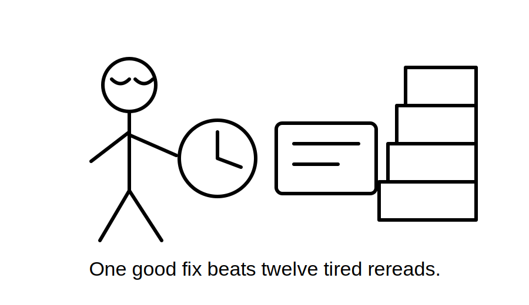
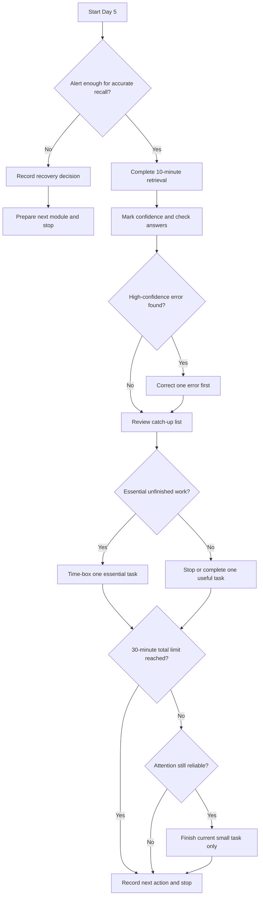
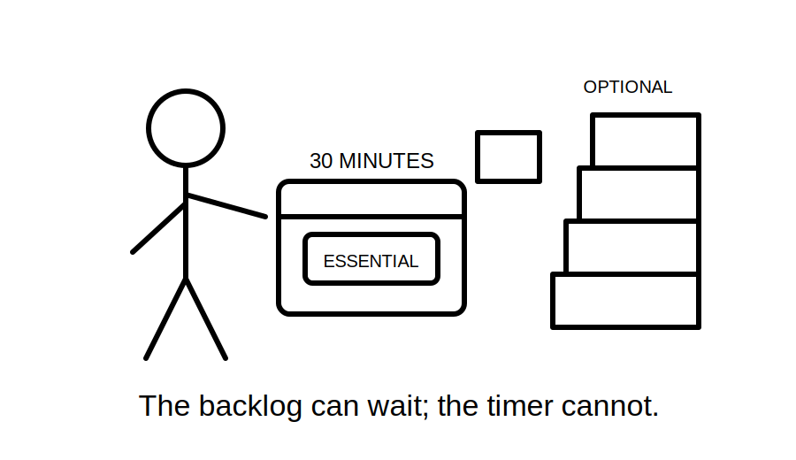

# Day 5 — Rest, Retrieval and Catch-Up

> **Purpose notice:** This is a planned recovery and consolidation block. It introduces no new electrical rules. It uses retrieval, error correction and a readiness check to strengthen Days 1–4 while protecting the learner from low-quality study caused by fatigue. Any technical answer corrected during this block still inherits the review status and source requirements of its original module.

## Navigation

- **Previous:** [Day 4 — RCD Protection and Additional Protection](./day-04-rcd-protection-and-additional-protection.md)
- **Next:** [Day 6A — Earthing Terminology and Component Roles](./day-06a-earthing-terminology-and-component-roles.md)

## 1. Outcome and entry check

### Learning objectives

By the end of this block, the learner should be able to:

1. retrieve the central ideas from Days 1–4 without rereading first;
2. classify missed work as **essential**, **useful** or **defer**;
3. identify and correct one high-confidence error from the learner's error log;
4. distinguish productive retrieval from passive recognition;
5. apply a maximum 30-minute catch-up limit and stop when fatigue makes further study unreliable;
6. produce a short readiness statement for the next block on earthing terminology.

### Prerequisites

- Completion or attempted completion of Days 1–4.
- Access to the learner's notes, confidence ratings and error log.
- A timer.

### Entry check

Before opening any prior module, answer **yes** or **no**:

1. Can I explain why finding the governing source is part of the answer, not an afterthought?
2. Can I name at least four layers of electrical risk control from memory?
3. Can I distinguish overload from short circuit?
4. Can I explain what an RCD compares during normal operation?
5. Am I alert enough to complete a short retrieval task accurately?

If question 5 is **no**, skip catch-up work. Record that recovery is the correct action and proceed only to the two-minute next-day setup in Beat 8.

## 2. Why it matters

A rest day is not lost learning time. Consolidation depends on recalling, correcting and organising prior learning, not continuously adding new material. When a learner is tired, rereading can create a false sense of familiarity while leaving retrieval weak. That is especially risky when the learner feels certain about an incorrect safety concept.

This block therefore prioritises three things:

- **recovery**, so the next technical session begins with usable attention;
- **retrieval**, so the learner tests what can be produced without prompts;
- **targeted correction**, so one important misconception is repaired rather than several topics being skimmed.



## 3. Core concepts and terminology

### Deliberate recovery

**Deliberate recovery** is planned reduction of cognitive effort so attention and accuracy can recover. It is not avoidance. The learner records what remains unfinished and returns to it at a defined later point.

### Retrieval practice

**Retrieval practice** means producing an answer from memory before checking notes. Its value comes from attempting recall, detecting gaps and then correcting them.

### Recognition

**Recognition** is the feeling that material looks familiar when seen again. Recognition is weaker evidence of readiness than being able to explain or apply the idea without prompts.

### Spaced retrieval

**Spaced retrieval** is recall performed after time has passed rather than immediately after study. The delay makes the learner reconstruct the answer and reveals whether the learning is durable.

### Error log

An **error log** is a short record of an incorrect or incomplete answer, the misconception behind it, the corrected explanation, the source used for correction and the next review date.

### High-confidence error

A **high-confidence error** occurs when the learner is wrong while believing the answer is reliable. It deserves priority because it may be repeated quickly and without further checking.

### Catch-up triage

**Catch-up triage** is the process of deciding what must be addressed now, what would be useful if time remains and what should be deliberately deferred.

Use these categories:

- **Essential:** a missed prerequisite, safety misconception or unfinished task needed for the next block.
- **Useful:** worthwhile practice that strengthens fluency but is not blocking progression.
- **Defer:** optional expansion, repeated rereading or work that cannot be completed accurately within the time limit.

### Stop condition

A **stop condition** is a pre-decided signal that study quality is too low to continue. Examples include repeatedly rereading the same line, guessing without checking, irritability, headache, heavy fatigue or loss of concentration.

### Readiness statement

A **readiness statement** is a brief evidence-based judgement about whether the learner can begin the next block, what prerequisite is still weak and what support is needed.

## 4. Rule-finding workflow

There is no new standards search in this block. Instead, use a **source-return workflow** whenever a retrieved technical answer is uncertain or incorrect.

1. **Attempt from memory.** Write the answer before opening notes.
2. **Mark confidence.** Use guessing, unsure, reasonably confident or certain.
3. **Check the original module.** Return to the exact section where the concept was taught.
4. **Follow its source notice.** If the answer depends on an exact rule, value, exception or procedure, consult the authorised source identified by that module.
5. **Record the misconception.** State what reasoning produced the wrong answer.
6. **Write a corrected explanation.** Use original wording and keep it short enough to retrieve later.
7. **Create one fresh test.** Change the scenario or question so the learner must apply the corrected idea.
8. **Schedule review.** Revisit the item in a later retrieval session.

Do not use the rest day to search broadly through standards or copy clauses into notes. The aim is to reconnect a specific error to its governing source and then test the corrected understanding.

## 5. Visual model or worked example

### Recovery and catch-up decision workflow



The workflow prevents two common failures: treating tired rereading as productive study and turning a rest day into an unbounded attempt to erase the entire backlog.

### Worked example

**Situation:** A learner missed the final RCD practice task and also has several optional notes to reorganise. During retrieval, the learner confidently writes that an RCD normally protects a conductor from overload.

**Correct triage:**

1. The high-confidence RCD error becomes the first priority.
2. The learner checks Day 4 and rewrites the distinction between residual-current and overcurrent functions.
3. The learner answers one fresh comparison question without notes.
4. The missed RCD task is classified **essential** only if it is needed to demonstrate the corrected distinction; otherwise it is scheduled later.
5. Reorganising optional notes is classified **defer**.
6. The session stops at 30 minutes even if the backlog remains.

## 6. Practical application

### Thirty-minute consolidation protocol

Use this sequence. Stop earlier when a stop condition appears.

#### Minute 0–2: state check

Record:

```text
Energy: low / workable / strong
Concentration: poor / workable / strong
Any stop condition already present: yes / no
Decision: recovery only / retrieval and limited catch-up
```

#### Minute 2–12: closed-note retrieval

Answer from memory:

1. What makes a source authoritative for an electrical rule or procedure?
2. Name four layers of protection or control discussed in Day 2.
3. Distinguish overload from short circuit in one sentence each.
4. Why must breaking capacity be checked separately from current rating?
5. What does an RCD compare?
6. Why does an RCD not normally replace overcurrent protection?
7. Give one example of a high-confidence error that would require immediate correction.
8. What exact details from Days 1–4 remain subject to authorised-source verification?

Rate confidence before checking.

#### Minute 12–18: error review

Compare answers with the relevant modules. Select **one** error using this priority order:

1. high-confidence safety misconception;
2. weak prerequisite for Day 6A;
3. repeated error;
4. incomplete but otherwise sound explanation;
5. low-confidence minor omission.

Complete this record:

```text
Original answer:
Confidence:
Why it was wrong or incomplete:
Corrected explanation:
Module or authorised source checked:
Fresh retrieval question:
Next review date:
```

#### Minute 18–28: one catch-up task

Choose only one:

- finish one essential missed question;
- redraw one key diagram from memory;
- create one comparison card;
- correct one earlier explanation;
- prepare the prerequisite vocabulary list for Day 6A.

Do not begin a task that cannot be left in a clear state when the timer ends.

#### Minute 28–30: readiness note

Write:

```text
Strongest retained idea:
Most important corrected error:
Unfinished essential task:
What I need before Day 6A:
Ready for Day 6A: yes / yes with support / not yet
```



## 7. Common errors and safety checkpoint

### Common errors

**Rereading before attempting recall**  
This turns the task into recognition. Attempt the answer first, then check.

**Trying to clear the whole backlog**  
A rest day has a recovery purpose. Select one essential task and schedule the remainder.

**Correcting wording without correcting reasoning**  
Record why the wrong answer seemed plausible, then test the corrected idea in a new scenario.

**Ignoring confidence**  
A confident wrong answer is usually more urgent than an unsure omission.

**Adding new technical topics**  
New content defeats the purpose of the block. Day 5 consolidates Days 1–4 and prepares for Day 6A.

**Treating fatigue as a discipline failure**  
Continuing inaccurate study can reinforce errors. Stopping under a defined condition is correct execution of the plan.

**Copying exact rules into the error log**  
The log should contain an original explanation and a reference back to the authorised source, not a substitute for it.

### Safety checkpoint

Stop catch-up work when:

- concentration is too poor to compare an answer accurately;
- the learner repeatedly guesses and records guesses as facts;
- a technical correction requires an authorised source that is unavailable;
- the learner is tempted to practise an electrical procedure without required supervision, authority or safe conditions;
- a 30-minute total has elapsed;
- the next action cannot be completed without starting a larger technical task.

This block authorises no practical electrical work. Any practical procedure remains governed by its original module, workplace controls, supervision requirements and current authorised sources.

## 8. Retrieval and next links

### Final recall check

Answer without notes:

1. What is the difference between retrieval and recognition?
2. Why are high-confidence errors prioritised?
3. What makes unfinished work essential rather than merely useful?
4. What is the maximum Day 5 catch-up period?
5. Name four stop conditions.
6. What should a corrected error-log entry contain?
7. Why should new technical theory not be added today?
8. What evidence supports readiness for Day 6A?

### Day 6A readiness check

The learner is ready to begin the next block when they can:

- distinguish active, neutral and protective earthing conductors conceptually without claiming that their functions are interchangeable;
- explain that protection depends on coordinated layers rather than a single device;
- identify when an exact technical claim must return to an authorised source;
- begin the next session without an unresolved high-confidence misconception from Days 1–4.

A learner marked **yes with support** may proceed with their error log and prerequisite notes open. A learner marked **not yet** should schedule one specific prerequisite correction rather than repeating all four modules.

### Related vault notes

- [[Day 04 - RCD Protection and Additional Protection]]
- [[Day 05 - Rest Retrieval and Catch-Up]]
- [[Day 06A - Earthing Terminology and Component Roles]]
- [[Learning Design]]
- [[Electrical Fundamentals]]
- [[Control Switching and Protection]]

### Previous block

Return to [Day 4 — RCD Protection and Additional Protection](./day-04-rcd-protection-and-additional-protection.md) when the retrieval check reveals uncertainty about current balance, additional protection or the limits of an RCD.

### Next block

Proceed to [Day 6A — Earthing Terminology and Component Roles](./day-06a-earthing-terminology-and-component-roles.md) after recording the readiness statement and stopping the Day 5 session.

### References and currency notice

- [Learning Design](../../../LEARNING_DESIGN.md) — repository guidance on retrieval, spacing, confidence calibration and error-driven remediation.
- [Content, Standards and Copyright Policy](../../../CONTENT_AND_COPYRIGHT.md) — source handling and original-content requirements.
- Days 1–4 modules and their listed authorised sources.

This module contains original study guidance and no copied standards content. Technical corrections made during the session retain the `review-required` or `reference_check_required` status of their source modules until reviewed against current authorised material.
