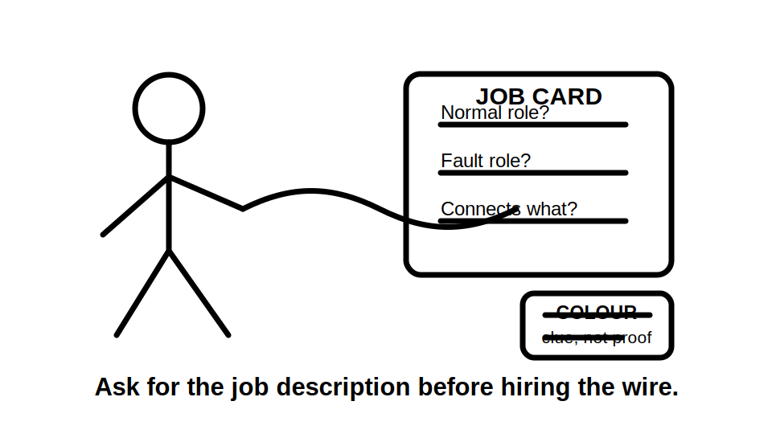
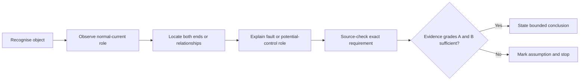
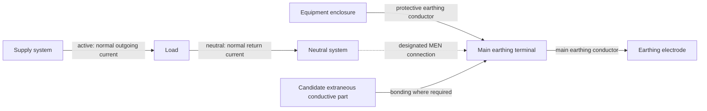

# Day 6A — Earthing Terminology and Component Roles

> **Source and safety notice:** This module teaches an original method for classifying earthing-system components by function and relationship. It does not authorise electrical work and does not replace current authorised standards, legislation, regulator guidance, network rules, manufacturer instructions, workplace procedures or RTO requirements. Exact definitions, conductor identification, sizes, connection points, bonding requirements, exceptions and MEN arrangements remain `reference_check_required`. This module is not `technically-reviewed`.

## Navigation

- **Previous:** [Day 5 — Rest, Retrieval and Catch-Up](./day-05-rest-retrieval-and-catch-up.md)
- **Next:** [Day 6B — MEN Fault-Current Path](./day-06b-men-fault-current-path.md)

## 1. Outcome and entry check

### Learning objectives

By the end of this block, the learner should be able to:

1. distinguish active, neutral and protective earthing conductors by function rather than colour alone;
2. explain the separate roles of a protective earthing conductor, main earthing conductor, earthing electrode, main earthing terminal and MEN connection;
3. distinguish exposed conductive parts from extraneous conductive parts using evidence about equipment membership and introduced potential;
4. explain the purpose of equipotential bonding without assuming that every metal item requires bonding;
5. classify at least eight items in a conceptual installation with no critical role error;
6. produce a five-part component explanation containing name, normal role, fault or potential-control role, connection relationship and source-check boundary;
7. identify high-confidence misconceptions and correct them using a changed scenario rather than copying a label.

### Entry check

Answer without notes and record confidence as **guessing**, **unsure**, **reasonably confident** or **certain**:

1. Which conductors normally form the load-current path?
2. Is a protective earthing conductor intended to carry normal load current?
3. Does the existence of an MEN connection make neutral and protective earth interchangeable?
4. Is every metal object an exposed conductive part?
5. Can colour alone prove a conductor's function and correct termination?

A high-confidence error is a priority remediation item. Do not continue by memorising the corrected word; record the failed distinction and test it again in Beat 6.

## 2. Why it matters

Earthing questions are often answered with familiar labels that are attached to the wrong job. The resulting errors are not merely vocabulary errors. They can corrupt later reasoning about fault paths, protective-device operation, bonding, inspection and verification.

Typical unsafe shortcuts include:

- treating neutral and protective earth as interchangeable because they have a designated relationship somewhere in the system;
- treating the earthing electrode as the complete intended metallic fault-return path;
- calling all accessible metalwork an exposed conductive part;
- assuming every metallic service must be bonded without establishing whether it introduces another potential;
- describing every green/yellow conductor as performing the same connection role;
- assuming a neutral-to-earth link may be added wherever it appears convenient.

A capstone-quality answer must do more than name an item. It must explain what the item normally does, what it does during a fault or potential-difference condition, what it connects, and which exact requirement still needs authorised verification.



## 3. Core concepts and terminology

The definitions below are working learning definitions. Exact standards wording, classifications and application boundaries must be checked against current authorised sources.

### Normal current path

- **Active conductor:** the conductor on the outgoing side of the normal load-current path. It is maintained at a voltage relative to earth or neutral during normal operation.
- **Neutral conductor:** the conductor associated with the neutral point of the supply and normally used as the return side of the load-current path. It can carry current and must not be treated as automatically safe.

### Protective connections

- **Protective earthing conductor:** connects exposed conductive equipment parts and other required protective-earthing points to the installation earthing system. It is not intended to be the normal load-current return conductor.
- **Main earthing terminal:** the principal point in the learning model where protective-earthing and required bonding connections are brought together. Exact terminology, construction and permitted connections require source checking.
- **Main earthing conductor:** connects the main earthing terminal to the earthing electrode. It is not another name for a final-subcircuit protective earthing conductor.
- **Earthing electrode:** a conductive part in effective contact with the mass of earth and connected to the installation earthing system. It has a distinct role and is not, by itself, the complete intended metallic return path for every active-to-enclosure fault in an MEN arrangement.
- **MEN connection:** the designated intentional connection between the neutral system and installation earthing system in the applicable supply arrangement. It does not create general permission to connect neutral and earth at arbitrary points.

### Conductive-part classifications

- **Exposed conductive part:** conductive equipment metalwork that is not intended to be live during normal service but may become live following failure of basic insulation or another internal protective measure.
- **Extraneous conductive part:** conductive material outside the normal electrical current path that may introduce another potential, commonly earth potential, into an installation area.
- **Equipotential bonding:** intentional connection of qualifying conductive parts to reduce dangerous potential differences where the authorised requirements call for it.

### Supporting terms

- **Normal-current role:** what an item does while the installation is operating without a fault.
- **Fault role:** what an item contributes after an unintended conductive connection or insulation failure.
- **Potential-control role:** how an item or bonding connection affects voltage differences between simultaneously accessible parts.
- **Connection relationship:** the two points, systems or parts joined by a conductor, terminal or intentional link.
- **Evidence boundary:** the point at which the learner must stop relying on the conceptual model and consult a current authorised source.

### Evidence grades

Use three evidence grades during classification:

| Grade | Meaning | Permitted conclusion |
|---|---|---|
| **A — stated or observed fact** | Information explicitly provided by the scenario, drawing or authorised inspection record | May be used as a premise |
| **B — authorised technical evidence** | Current applicable source, traceable reference and confirmed context | May support an exact conclusion within its scope |
| **C — assumption or memory** | Unverified colour, habit, resemblance, recollection or incomplete context | Must not be presented as an exact requirement |

A technically familiar label supported only by Grade C evidence remains unverified.

## 4. Rule-finding workflow

Use the **R-O-L-E-S** workflow whenever an earthing term appears in an assessment question, drawing or inspection record.

### R — Recognise the physical object

Identify what is actually present before naming its role:

- circuit conductor;
- protective conductor;
- terminal or bar;
- intentional link;
- electrode;
- equipment enclosure;
- metallic service or structural item.

Do not begin with the vague label “earth.”

### O — Observe the normal-current role

Ask whether the item is intended to carry normal load current.

- If yes, investigate active or neutral function.
- If no, investigate protective, bonding, structural or no assigned electrical role.

### L — Locate both ends or relationships

State what the item connects. Examples in the conceptual model include:

- equipment enclosure to earthing system;
- main earthing terminal to electrode;
- qualifying external conductive part to earthing system;
- neutral system to earthing system at the designated point.

### E — Explain the fault or potential-control role

State what changes when a fault or dangerous potential difference occurs. Avoid claiming a protective outcome unless the complete path, applicable protective measure and source evidence have been established.

### S — Source-check the exact requirement

Search the authorised source in layers:

1. definitions and scope;
2. general earthing and bonding requirements;
3. identification, termination and continuity requirements;
4. installation- or location-specific requirements;
5. associated notes, diagrams, exceptions and called-up documents;
6. network, regulator, manufacturer, workplace and RTO requirements relevant to the scenario.

Record the evidence using this compact template:

```text
Object or item:
Working classification:
Normal-current role:
Fault or potential-control role:
Connection relationship:
Evidence grade:
Authorised source, edition and amendment:
Applicable reference and exception:
Unresolved assumption:
Qualified confirmation required: yes / no
```



The stop branch is part of competent reasoning, not an incomplete answer.

## 5. Visual model or worked example

### Component relationship map



Read the map by job, not by colour:

- active and neutral belong to the normal operating-current path;
- the protective earthing conductor connects equipment metalwork to the earthing system;
- the main earthing conductor connects the main earthing terminal to the electrode;
- the MEN connection establishes the designated neutral-to-earth relationship for the applicable arrangement;
- bonding connects a qualifying extraneous conductive part only where required.

The map is conceptual. It does not specify conductor sizes, physical switchboard layout, permitted MEN locations, test methods or every supply arrangement.

### Worked example

A fictional fixed appliance has an accessible metal enclosure and is supplied by active, neutral and protective earthing conductors. A metallic water service enters the building nearby.

Apply R-O-L-E-S:

1. **Recognise:** identify three circuit conductors, equipment metalwork and a metallic service.
2. **Observe:** active and neutral have normal-current roles; the protective earthing conductor does not have the normal return role.
3. **Locate:** the protective earthing conductor connects the enclosure to the earthing system. The metallic service is assessed separately.
4. **Explain:** the enclosure is a candidate exposed conductive part; the service is a candidate extraneous conductive part only if it can introduce another potential.
5. **Source-check:** verify equipment classification, bonding applicability, connection details and every exact requirement.

The words **candidate** and **only if** prevent the common error of converting incomplete facts into final classifications.

## 6. Practical application

### Round 1 — supported classification

For each item below, complete the five-part response: **name, normal role, fault or potential-control role, relationship, source check**.

1. incoming active conductor;
2. incoming neutral conductor;
3. main earthing terminal;
4. designated neutral-to-earth link;
5. conductor from the main earthing terminal to an electrode;
6. final-subcircuit protective earthing conductor;
7. accessible metal enclosure of a Class I learning example;
8. metallic service entering the building;
9. isolated decorative metal shelf with no evidence of another potential.

### Round 2 — evidence audit

Add an evidence grade to every conclusion. Circle any conclusion that depends on:

- conductor colour alone;
- a guessed connection point;
- the word “metal” without classification evidence;
- an assumed supply arrangement;
- a remembered rule without edition, scope or exception checking.

Rewrite each circled conclusion as a bounded statement or source-check requirement.

### Round 3 — changed-scenario transfer

Repeat the classification after the scenario changes:

- the installation includes an inverter or generator;
- a separate building is supplied;
- the function of one conductor is not traceable from the drawing;
- the metallic service includes an insulating section;
- a second neutral-to-earth connection appears on an incomplete sketch.

The learner is not expected to invent the correct field arrangement. Credit is awarded for identifying which earlier conclusion no longer transfers, explaining why, and naming the authorised evidence needed.

### Performance rubric

Score each category from **0 to 2**:

| Category | 0 | 1 | 2 |
|---|---|---|---|
| Component identification | labels are vague or swapped | most labels correct | all critical roles correctly distinguished |
| Normal-current reasoning | neutral and earth confused | partial distinction | current-carrying roles clearly explained |
| Fault or potential role | outcome asserted without path | partial explanation | bounded role explained without overclaiming |
| Relationship tracing | connection endpoints missing | some endpoints identified | each item related to adjacent components |
| Evidence discipline | assumptions presented as rules | some checks identified | evidence graded and exact claims bounded |
| Safety communication | practical action implied | warning present but incomplete | explicit stop conditions and authority boundary stated |

A critical neutral/protective-earth role swap, arbitrary MEN connection claim or unsupported bonding instruction prevents readiness regardless of total score.

## 7. Common errors and safety checkpoint

### Common errors and correction prompts

- **“Neutral and earth are the same.”** Correct by stating each normal-current role and connection relationship.
- **“Neutral is always zero volts and safe.”** Correct by separating system designation from a verified safe state.
- **“The electrode alone clears the fault.”** Correct by withholding the protection conclusion until the complete metallic path is traced in Day 6B.
- **“Every metal item is exposed conductive metalwork.”** Correct by asking whether it is part of electrical equipment and could become live after an internal fault.
- **“Every metallic service must be bonded.”** Correct by establishing whether it introduces a potential and then checking the applicable authorised requirement.
- **“A neutral-to-earth link may be copied at each switchboard.”** Correct by identifying the supply arrangement and designated permitted point from authorised sources.
- **“Colour proves function.”** Correct by distinguishing identification evidence from proof of connection, continuity, polarity and function.

### Safety checkpoint

This module authorises no practical electrical work. Do not:

- remove covers or open electrical equipment;
- disconnect a neutral, MEN connection, protective earthing conductor, bonding conductor or main earthing conductor;
- perform live or improvised testing;
- alter an installation to observe protective-device operation;
- rely on the conceptual diagrams as field connection instructions.

Stop and seek qualified review when:

- the supply arrangement or conductor function is unclear;
- an alternate supply, separate building or stored-energy system is involved;
- a neutral-to-earth connection location is uncertain;
- conductive-part classification cannot be established;
- an exact size, location, connection, bonding, electrode or test requirement is needed;
- the current authorised source or required supervision is unavailable.

## 8. Retrieval and next links

### Closed-note recall

1. Which conductors normally form the operating-current path?
2. Why is neutral not interchangeable with protective earth?
3. What does a protective earthing conductor connect?
4. What does the main earthing conductor connect?
5. What is the conceptual role of the earthing electrode?
6. What is the conceptual role of the MEN connection?
7. How does an exposed conductive part differ from an extraneous conductive part?
8. Why is “it is metal” insufficient bonding evidence?
9. What are the five steps of R-O-L-E-S?
10. What makes Grade C evidence unsuitable for an exact technical conclusion?

### Retrieval drawing

From memory, draw and label:

- supply system;
- load;
- neutral system;
- equipment enclosure;
- main earthing terminal;
- earthing electrode;
- possible extraneous conductive part;
- active, neutral, protective earthing and main earthing conductors;
- designated MEN connection;
- bonding connection where required.

Then explain each line using the five-part response pattern. Record any high-confidence role swap in the error log and re-attempt using a different layout.

### Readiness for Day 6B

The learner is ready when they can:

- classify at least eight items with no critical neutral/protective-earth swap;
- distinguish protective earthing, main earthing, bonding and MEN connection roles;
- explain exposed and extraneous conductive parts without relying on “metal” alone;
- apply R-O-L-E-S to a changed scenario and identify assumptions;
- redraw the component map and state which exact matters remain source-dependent.

### Related vault notes

- [[Day 05 - Rest Retrieval and Catch-Up]]
- [[Day 06A - Earthing Terminology and Component Roles]]
- [[Day 06B - MEN Fault-Current Path]]
- [[Earthing Bonding and MEN]]
- [[Electrical Fundamentals]]
- [[Control Switching and Protection]]
- [[Safety and Electrical Risk]]
- [[AS-NZS-3000-2018-Index]]

### References and currency notice

- AS/NZS 3000:2018 — current authorised copy and applicable amendments required; exact definitions, arrangements, identification, bonding, electrode, MEN and conductor requirements remain to be inserted after qualified source checking.
- Applicable current legislation, regulator guidance, network service rules, manufacturer instructions, workplace procedures and RTO requirements.
- [Learning Design](../../../LEARNING_DESIGN.md)
- [Content, Standards and Copyright Policy](../../../CONTENT_AND_COPYRIGHT.md)

This module contains original explanations, workflow, scenarios, rubric and diagrams. It does not reproduce a standards table, figure, clause sequence or field procedure. Qualified technical review remains required.

<!-- sequence-navigation:start -->
### Sequence navigation

- [← Previous: Day 5 — Rest, Retrieval and Catch-Up](./day-05-rest-retrieval-and-catch-up.md)
- [Four-week learning plan](../MASTER_PLAN.md)
- [Next: Day 6B — MEN Fault-Current Path →](./day-06b-men-fault-current-path.md)
<!-- sequence-navigation:end -->