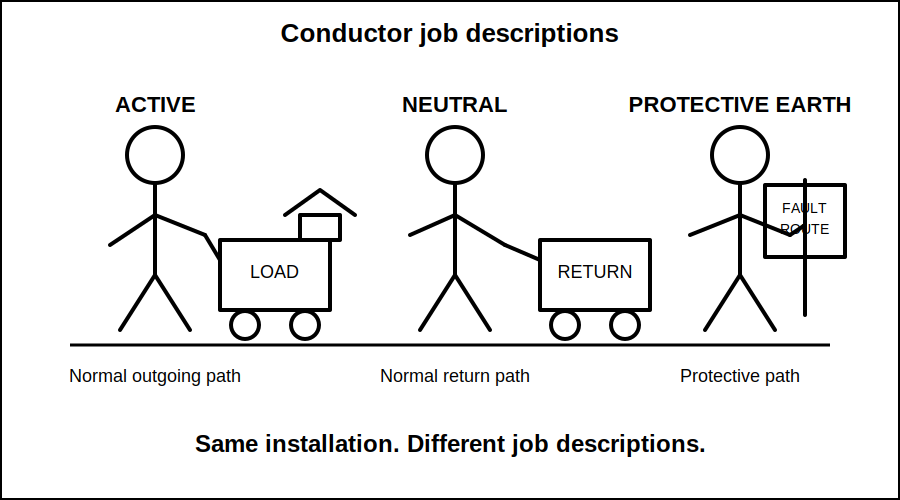
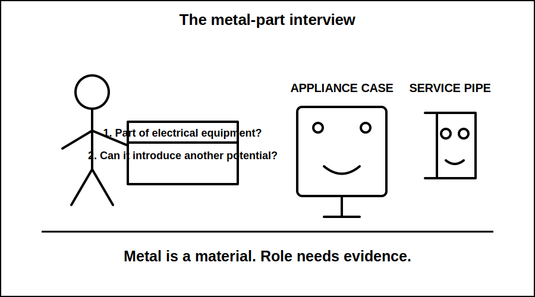
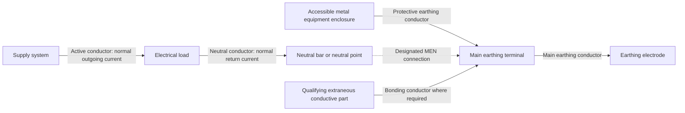
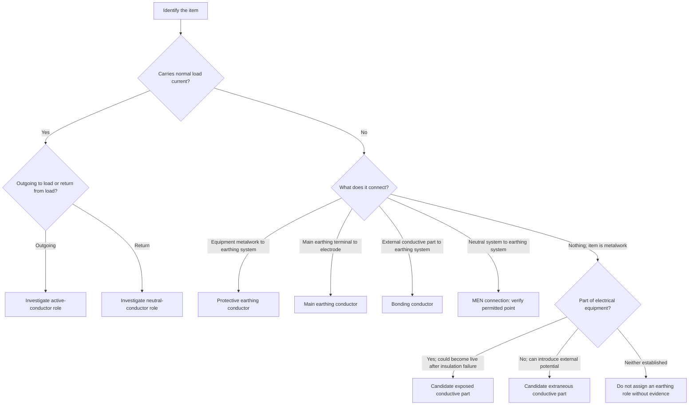

# Day 6A — Earthing Terminology and Component Roles

> **Source and safety notice:** This module teaches an original conceptual model for recognising earthing-system components and explaining their roles. It does not authorise electrical work and does not replace current authorised standards, legislation, regulator guidance, network rules, manufacturer instructions, workplace procedures or RTO requirements. Exact definitions, conductor identification, sizing, connection points, bonding requirements, exceptions and MEN arrangements remain `reference_check_required`. This module is not `technically-reviewed`.

## Navigation

- **Previous:** [Day 5 — Rest, Retrieval and Catch-Up](./day-05-rest-retrieval-and-catch-up.md)
- **Next:** Day 6B — MEN Fault-Current Path

## 1. Outcome and entry check

### Learning objectives

By the end of this block, the learner should be able to:

1. distinguish an active conductor, neutral conductor and protective earthing conductor by function rather than colour alone;
2. explain the separate roles of the protective earthing conductor, main earthing conductor, earthing electrode, main earthing terminal and MEN connection;
3. distinguish an exposed conductive part from an extraneous conductive part using evidence about what the item belongs to and what potential it may introduce;
4. describe the purpose of equipotential bonding without claiming that every metal item must automatically be bonded;
5. classify at least eight items in a conceptual installation diagram with no more than one role error;
6. identify which claims require return to a current authorised source before they can be used in design, installation, inspection or assessment.

### Prerequisites

Before starting, the learner should be able to:

- explain that protection uses coordinated layers rather than one device;
- distinguish normal current from fault current;
- explain that an RCD and an overcurrent protective device perform different functions;
- recognise when an exact technical claim must be checked against an authorised source.

### Entry check

Answer without notes:

1. Does a neutral conductor normally carry current during normal operation?
2. Is a protective earthing conductor intended to carry normal load current?
3. Is the soil alone normally treated as the complete metallic fault-current return path in an MEN installation?
4. Is every metal object in a building automatically an exposed conductive part?
5. Can conductor colour alone prove a conductor's function and correct connection?

Record confidence for each answer. A high-confidence error should be entered in the learner's error log before continuing.

## 2. Why it matters

Earthing questions are often failed because the learner remembers labels but cannot explain the job performed by each component. That creates several dangerous reasoning errors:

- treating neutral and protective earth as interchangeable because both are associated with the grounded side of the supply system;
- assuming an earthing electrode alone provides the intended low-impedance fault-return path;
- confusing equipment metalwork with metallic services entering a building;
- assuming every metal item requires bonding without checking whether it can introduce a different potential;
- adding or moving a neutral-to-earth connection without verifying the permitted arrangement;
- selecting, identifying or terminating a conductor based only on appearance.

A capstone-quality answer should name the component, state its normal role, state its role under fault conditions, show how it relates to adjacent components and identify the governing source that must be checked for exact requirements.



## 3. Core concepts and terminology

The definitions below are working learning definitions. Exact standards wording and application boundaries must be checked against the current authorised source.

### Active conductor

An **active conductor** is a conductor that is maintained at a voltage relative to earth or neutral during normal operation and forms the outgoing side of the normal load-current path.

For reasoning purposes:

- it supplies the load;
- it carries normal operating current when the circuit is in use;
- contact with it can create electric-shock and fault hazards;
- switching, isolation, protection and identification requirements must be checked in the authorised source.

### Neutral conductor

A **neutral conductor** is connected to the neutral point of the supply system and normally forms the return side of the load-current path.

Important consequences:

- it can carry normal load current;
- it must not be treated as automatically safe or at zero voltage;
- it is not a substitute for a protective earthing conductor;
- its relationship to earth is controlled by the system arrangement and designated connection points.

### Protective earthing conductor

A **protective earthing conductor** connects exposed conductive parts and other required protective-earthing points to the installation earthing system.

Its intended role is protective rather than functional:

- it is not intended to carry normal load current;
- under a fault, it provides a conductive path that allows protective measures to operate;
- it may carry fault current and small leakage or protective-conductor currents;
- its continuity, size, identification, routing and termination require authorised-source verification.

### Earthing system

The **earthing system** is the coordinated set of conductors, terminals, connections, electrodes and bonding arrangements used to establish protective connections and manage voltage differences under normal and fault conditions.

It is not one wire and not one rod. Treat it as a system of components with different jobs.

### Main earthing terminal

The **main earthing terminal**, often represented in a learning diagram as the main earth bar or principal earthing connection point, is the central point at which the installation's protective earthing and required bonding connections are brought together.

The exact construction, location, accessibility and permitted connections must be checked in the authorised source.

### Main earthing conductor

The **main earthing conductor** connects the main earthing terminal to the earthing electrode.

Do not confuse it with:

- a final-subcircuit protective earthing conductor, which connects equipment to the earthing system;
- a bonding conductor, which connects a qualifying conductive part to reduce potential difference;
- the MEN connection, which intentionally connects the neutral system and earthing system at a designated point.

### Earthing electrode

An **earthing electrode** is a conductive part in effective contact with the mass of earth and connected to the installation earthing system.

Its role must be understood without a common shortcut: the electrode is not, by itself, the complete intended low-impedance metallic path for clearing every active-to-enclosure fault in an MEN system. The full fault path is developed in Day 6B.

Electrode type, installation, location, protection, connection and performance requirements remain `reference_check_required`.

### MEN connection

The **multiple earthed neutral connection**, commonly shortened to **MEN connection**, is an intentional connection between the neutral system and the installation earthing system at a designated main point in the relevant supply arrangement.

Its conceptual purpose is to place the protective earthing system into a defined relationship with the supply neutral so that an earth fault can return through a conductive path to the source and cause the required protective response.

Do not infer from this definition that neutral and earth may be joined wherever convenient. Exact permitted connection points, separate-building arrangements, alternate supplies, generating systems and exceptions require current authorised-source verification.

### Exposed conductive part

An **exposed conductive part** is conductive equipment metalwork that is not intended to be live in normal service but could become live if basic insulation or another internal protective measure fails.

A typical learning example is the accessible metal enclosure of Class I electrical equipment. The exact classification depends on the equipment and construction, not on the fact that the object is merely metal.

### Extraneous conductive part

An **extraneous conductive part** is a conductive part that is not part of the electrical installation's normal current path but can introduce an external potential, commonly earth potential, into the installation area.

Possible examples may include metallic services or structural elements, but the learner must assess the actual installation. A metal item is not automatically extraneous merely because it is large, fixed or accessible.

### Equipotential bonding

**Equipotential bonding** is the intentional connection of qualifying conductive parts so that dangerous voltage differences between simultaneously accessible parts are limited under relevant conditions.

Bonding does not mean connecting every metal object. The learner must identify:

1. what the conductive part is;
2. whether it can introduce a potential;
3. whether the current authorised requirements require bonding;
4. where and how the bonding connection must be made.

### Fault current

**Fault current** is current flowing because of an unintended conductive connection or insulation failure. In this topic, the key case is current flowing from an active conductor to exposed conductive metalwork and then through the protective fault path.

### Touch voltage

**Touch voltage** is the voltage that may appear between conductive parts that a person could touch at the same time. Earthing and bonding measures aim to limit the magnitude or duration of dangerous touch voltage, but exact performance criteria require authorised-source verification.



## 4. Rule-finding workflow

Use the following workflow whenever an earthing term appears in a question, drawing, inspection or calculation.

### Step 1 — Identify the object precisely

Do not begin with “it is an earth.” Record what is physically present:

- conductor;
- terminal or bar;
- intentional link;
- equipment enclosure;
- service pipe;
- structural metal;
- electrode;
- protective device.

### Step 2 — Ask whether it carries normal load current

- If **yes**, investigate whether it is an active or neutral circuit conductor.
- If **no**, continue to its protective or structural role.

This question prevents the common error of treating neutral and protective earth as interchangeable.

### Step 3 — Identify the protective relationship

Ask what the item connects:

- equipment enclosure to earthing system → protective earthing conductor;
- main earthing terminal to electrode → main earthing conductor;
- qualifying external conductive part to earthing system → bonding conductor;
- neutral system to earthing system at a designated point → MEN connection.

### Step 4 — Classify conductive parts

For accessible metalwork, ask:

1. Is it part of electrical equipment?
2. Could it become live because of an internal electrical fault?
3. Is it external to the electrical equipment but capable of introducing another potential?

The answers distinguish exposed conductive parts from extraneous conductive parts.

### Step 5 — Search the authorised source in layers

Use this order:

1. definitions;
2. general earthing and bonding requirements;
3. conductor identification and termination requirements;
4. requirements for the installation type or location;
5. diagrams, notes and exceptions associated with the applicable clauses;
6. other standards, network rules, regulator guidance or manufacturer instructions specifically called up by the scenario.

Useful search phrases include:

- protective earthing conductor;
- main earthing conductor;
- earthing electrode;
- main earthing terminal;
- equipotential bonding;
- exposed conductive part;
- extraneous conductive part;
- MEN connection;
- neutral-earth connection;
- separate building or alternate supply.

### Step 6 — Record the evidence

For every exact claim, record:

```text
Item or term:
Working classification:
Normal-current role:
Fault or protective role:
Authorised source:
Edition and amendment:
Clause, table or figure:
Relevant note or exception:
Reviewer or trainer confirmation required: yes / no
```

A confident answer without traceable source evidence is still unverified.

## 5. Visual model or worked example

### Relationship map



Read the map by role:

- active and neutral belong to the normal operating-current path;
- the protective earthing conductor connects equipment metalwork to the earthing system;
- the main earthing conductor connects the main earthing terminal to the electrode;
- the MEN connection creates the designated neutral-to-earth relationship for the supply arrangement;
- bonding connects a qualifying extraneous conductive part where required.

The diagram is conceptual. It does not specify conductor sizes, physical switchboard construction, connection order, number of terminals, permitted MEN locations or every supply arrangement.

### Classification decision workflow



The word **candidate** is deliberate. Final classification and the required treatment depend on the actual equipment, installation and authorised requirements.

### Worked example

A metal-cased fixed appliance is supplied by active, neutral and protective earthing conductors. A metallic water service enters the building nearby.

Correct role analysis:

1. The active and neutral conductors form the normal operating-current path.
2. The protective earthing conductor connects the appliance's accessible conductive enclosure to the earthing system.
3. The appliance enclosure is a candidate exposed conductive part because it belongs to electrical equipment and could become live after an internal fault.
4. The metallic water service is assessed separately as a possible extraneous conductive part because it may introduce earth potential.
5. The water service is not classified or bonded merely because it is metal; the applicable bonding requirement must be verified.
6. The main earthing conductor and electrode perform different roles from the appliance protective earthing conductor.
7. The MEN connection is not an appliance connection. It belongs to the installation's designated neutral-to-earth arrangement.

## 6. Practical application

### Paper-based installation classification exercise

Do not open equipment or a switchboard for this exercise. Use the conceptual list below.

A small installation contains:

1. an incoming active conductor;
2. an incoming neutral conductor;
3. a neutral bar;
4. a main earthing terminal;
5. an intentional neutral-to-earth link at the designated main point;
6. a conductor from the main earthing terminal to an electrode;
7. a final-subcircuit protective earthing conductor;
8. the accessible metal enclosure of a fixed appliance;
9. a metallic service entering the building;
10. an isolated decorative metal shelf with no electrical connection and no evidence that it introduces another potential.

Complete this table:

| Item | Component or part classification | Carries normal load current? | Protective or fault role | Exact source check needed |
|---|---|---:|---|---|
| Incoming active |  |  |  |  |
| Incoming neutral |  |  |  |  |
| Neutral bar |  |  |  |  |
| Main earthing terminal |  |  |  |  |
| Neutral-to-earth link |  |  |  |  |
| Conductor to electrode |  |  |  |  |
| Final-subcircuit earth conductor |  |  |  |  |
| Appliance enclosure |  |  |  |  |
| Metallic service |  |  |  |  |
| Decorative metal shelf |  |  |  |  |

### Model reasoning guide

Use the following reasoning, not just a one-word label:

- **Incoming active:** normal outgoing current path; exact identification, protection and isolation requirements require source checking.
- **Incoming neutral:** normal return-current path; not interchangeable with protective earth.
- **Neutral bar:** termination and distribution point for neutral conductors; exact arrangement requires verification.
- **Main earthing terminal:** principal protective-earthing connection point in the learning model; exact construction and connections require verification.
- **Neutral-to-earth link:** candidate MEN connection only if it is at the designated permitted point for the supply arrangement.
- **Conductor to electrode:** main earthing conductor in the conceptual arrangement.
- **Final-subcircuit earth conductor:** protective earthing conductor connecting equipment to the earthing system.
- **Appliance enclosure:** candidate exposed conductive part, depending on equipment construction.
- **Metallic service:** candidate extraneous conductive part only if it can introduce another potential and meets the applicable definition.
- **Decorative shelf:** do not invent an earthing or bonding role without evidence.

### Capstone response pattern

For any component-identification question, answer in five parts:

1. **Name it.** State the most likely technical term.
2. **Normal role.** State whether it carries normal load current.
3. **Fault role.** State what it does if an active-to-metal fault occurs.
4. **Relationship.** State what it connects to adjacent components.
5. **Verification.** State which exact rule, exception, size, location or test must be checked.

This pattern separates technical understanding from unsupported memory.

## 7. Common errors and safety checkpoint

### Common errors

**“Neutral and earth are the same because they are connected somewhere.”**  
They have different normal functions. Neutral normally carries load current. Protective earth is a protective path and is not intended as the normal return conductor.

**“Neutral is always zero volts and safe to touch.”**  
Neutral can carry current and can develop voltage relative to local earth. Treat it as a conductor requiring correct isolation, identification and verification.

**“The earth electrode alone clears an equipment fault.”**  
This omits the coordinated metallic fault path and the MEN relationship. Day 6B develops the full current path.

**“Every metal item is exposed conductive metalwork.”**  
Exposed conductive parts belong to electrical equipment and can become live after an internal fault. Other metal may be extraneous, isolated, structural or irrelevant to the protective measure.

**“Every metal pipe must be bonded because it is metal.”**  
Bonding decisions require classification and the applicable authorised rule. Material alone is not enough.

**“A neutral-to-earth connection can be copied at every switchboard.”**  
Do not assume this. The permitted MEN location and any special arrangements require exact authorised-source verification.

**“The conductor colour proves the conductor is correctly connected.”**  
Identification assists recognition but does not prove function, continuity, polarity or termination. Verification uses the required inspection and test process.

**“Main earthing conductor and protective earthing conductor are two names for the same wire.”**  
They perform related but distinct connection roles within the earthing system.

### Safety checkpoint

This module authorises no practical electrical work. Do not:

- remove a switchboard cover;
- disconnect a neutral, MEN connection, protective earthing conductor, bonding conductor or main earthing conductor;
- perform live testing;
- use an improvised continuity or fault-current test;
- alter an installation to see whether a protective device operates;
- rely on this conceptual diagram for field connection details.

Any inspection or testing activity must follow current authorised procedures, legal authority, supervision requirements, safe-isolation controls and the exact instrument instructions.

Stop and seek qualified review when:

- the supply arrangement is unclear;
- an alternate supply, generator, inverter, battery system or separate building is involved;
- the location of a neutral-to-earth connection is uncertain;
- the classification of conductive metalwork cannot be established;
- an exact conductor size, connection method, electrode requirement, bonding requirement or test criterion is needed;
- the authorised current source is unavailable.

## 8. Retrieval and next links

### Closed-note recall

Answer without notes:

1. Which conductors normally form the operating-current path?
2. Why is neutral not interchangeable with protective earth?
3. What does a protective earthing conductor connect?
4. What does the main earthing conductor connect?
5. What is the conceptual purpose of the earthing electrode?
6. What is the conceptual purpose of the MEN connection?
7. How does an exposed conductive part differ from an extraneous conductive part?
8. Why is “it is metal” not enough to require bonding?
9. Why can conductor colour not prove correct function?
10. Name three exact matters that remain `reference_check_required`.

### Retrieval drawing

From memory, draw six labelled boxes:

- load;
- neutral point or bar;
- equipment enclosure;
- main earthing terminal;
- earthing electrode;
- possible extraneous conductive part.

Then add and label:

- active conductor;
- neutral conductor;
- protective earthing conductor;
- main earthing conductor;
- MEN connection;
- bonding conductor where required.

Check the drawing against the relationship map. Record any swapped role in the error log.

### Readiness for Day 6B

The learner is ready for Day 6B when they can:

- explain active, neutral and protective-earth roles without using colour as the main evidence;
- distinguish the protective earthing conductor from the main earthing conductor;
- identify the MEN connection as a designated system connection rather than a general permission to join neutral and earth;
- classify exposed and extraneous conductive parts using the two-question evidence model;
- redraw the relationship map with no critical connection-role error.

### Related vault notes

- [[Day 05 - Rest Retrieval and Catch-Up]]
- [[Day 06A - Earthing Terminology and Component Roles]]
- [[Earthing Bonding and MEN]]
- [[Electrical Fundamentals]]
- [[Control Switching and Protection]]
- [[Safety and Electrical Risk]]
- [[AS-NZS-3000-2018-Index]]

### Previous block

Return to [Day 5 — Rest, Retrieval and Catch-Up](./day-05-rest-retrieval-and-catch-up.md) when fatigue, unresolved high-confidence errors or weak prerequisite recall make technical study unreliable.

### Next block

Proceed to **Day 6B — MEN Fault-Current Path** after the learner can label the component roles without treating neutral, protective earth, the main earthing conductor, the electrode and the MEN connection as interchangeable.

### References and currency notice

- AS/NZS 3000:2018 — current authorised copy and applicable amendments required; exact definition, clause, conductor, bonding, electrode and MEN references remain to be inserted after source checking.
- Applicable current legislation, regulator guidance, network service rules and RTO procedures.
- [Learning Design](../../../LEARNING_DESIGN.md) — retrieval, error correction and application guidance.
- [Content, Standards and Copyright Policy](../../../CONTENT_AND_COPYRIGHT.md) — original-content and source-handling requirements.

This module contains original explanations, scenarios and diagrams. It does not reproduce a standards table, figure or clause sequence. A qualified reviewer must verify the technical interpretation and add traceable references before the status can move beyond `review-required`.

<!-- sequence-navigation:start -->
### Sequence navigation

- [← Previous: Day 5 — Rest, Retrieval and Catch-Up](./day-05-rest-retrieval-and-catch-up.md)
- [Four-week learning plan](../MASTER_PLAN.md)
- [Next: Day 6B — MEN Fault-Current Path →](./day-06b-men-fault-current-path.md)
<!-- sequence-navigation:end -->
