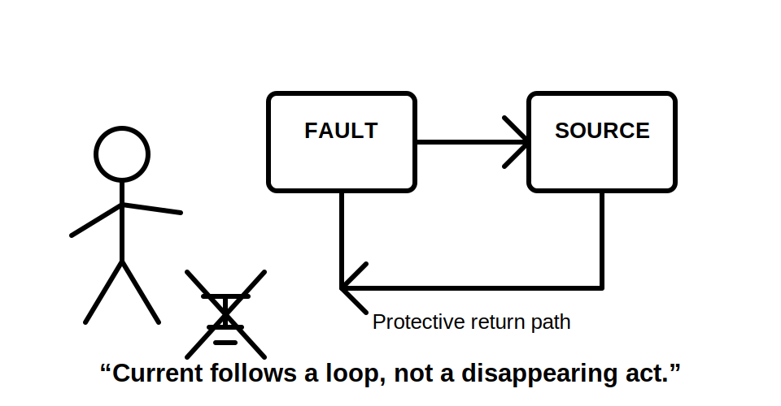
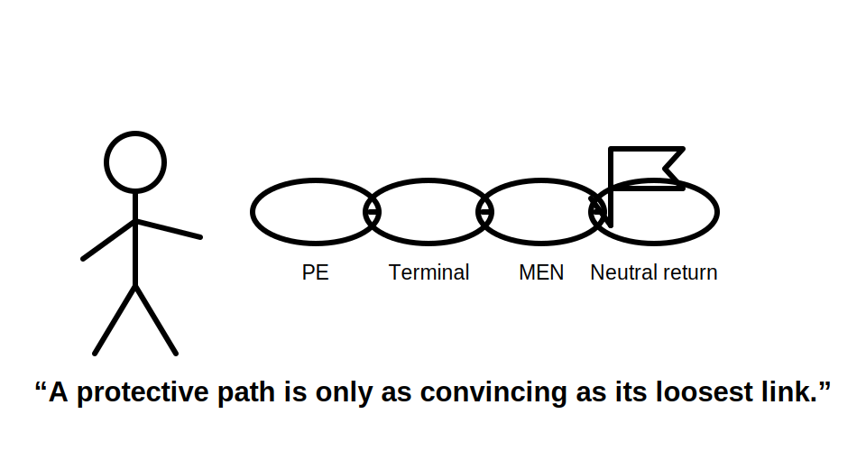
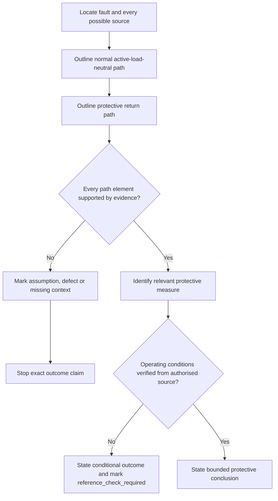
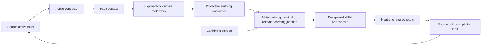
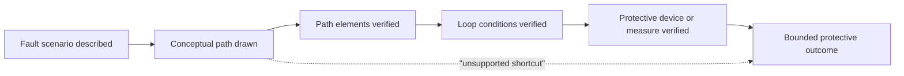
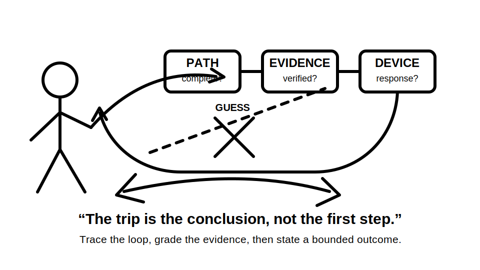

# Day 6B — MEN Fault-Current Path

> **Source and safety notice:** This module teaches an original conceptual method for tracing an active-to-exposed-conductive-part fault in a typical MEN arrangement. It is a paper-based reasoning activity, not a field procedure, and does not authorise electrical work. Exact connection points, permitted arrangements, conductor requirements, protective-device operating conditions, disconnection times, touch-voltage limits, test methods, alternate-supply conditions and clause references remain `reference_check_required`. This module is not `technically-reviewed`.

## Navigation

- **Previous:** [Day 6A — Earthing Terminology and Component Roles](./day-06a-earthing-terminology-and-component-roles.md)
- **Next:** [Day 6C — Earthing and MEN Fault Scenarios](./day-06c-earthing-and-men-fault-scenarios.md)

## 1. Outcome and entry check

### Learning objectives

By the end of this block, the learner should be able to:

1. draw the normal active–load–neutral path and the protective fault-current path as two separate loops;
2. trace a conceptual active-to-exposed-conductive-part fault through at least seven correctly ordered path elements back to the source;
3. explain the distinct roles of exposed metalwork, protective earthing conductor, main earthing terminal, designated MEN connection, neutral return and source;
4. explain the qualitative relationship between loop impedance, fault-current magnitude and protective-device response without inventing values;
5. distinguish a **described path**, a **verified path** and a **verified protective outcome**;
6. classify evidence as stated fact, authorised technical evidence or unresolved assumption;
7. identify at least five interruption, high-impedance or supply-context risks that can invalidate a simple MEN sketch;
8. produce a bounded conclusion that states what is known, what is expected and what remains `reference_check_required`;
9. score at least 10 out of 12 on the performance rubric with no critical neutral/protective-earth role swap.

### Entry check

Answer without notes and record confidence as **guessing**, **unsure**, **reasonably confident** or **certain**:

1. Which conductors normally carry load current?
2. Is the protective earthing conductor intended to be the normal load-current return?
3. What designated relationship connects the installation earthing system to the neutral system in the applicable MEN arrangement?
4. Does the earthing electrode alone explain the complete intended metallic return path for an equipment fault?
5. Why is the statement “a breaker trips because there is a fault” incomplete?
6. What additional source or supply information would make a typical MEN sketch unsafe to apply without checking?

Record every high-confidence error in the error log. Do not merely copy the corrected statement: identify the failed distinction and retest it in Beat 6.

## 2. Why it matters

A learner can memorise the letters **MEN** yet still fail to explain how protection works. The important question is not merely whether equipment is described as earthed. The question is whether an unintended active-to-metal fault has a complete and sufficiently effective return path, whether the relevant protective measure has been correctly identified, and whether the conditions for the expected protective response have been verified.

Unsafe shortcuts include:

- “the current goes into the ground and disappears”;
- “the electrode clears the fault by itself”;
- “neutral and protective earth are interchangeable”;
- “any neutral-to-earth link completes the path”;
- “the breaker must trip because a fault exists”;
- “an RCD makes protective-earthing continuity irrelevant”;
- “the path is proven because a green/yellow conductor can be seen”;
- “the standard household sketch also applies unchanged to generators, inverters, batteries or multiple supplies.”

A capstone-quality answer separates three claims:

1. **Path description:** the conceptual route current could take.
2. **Path verification:** evidence that the required conductors, connections and source relationships are present and effective.
3. **Protective outcome:** evidence that the relevant protective device or measure will respond within the applicable requirements.

Skipping from Claim 1 to Claim 3 is an evidence gap.



## 3. Core concepts and terminology

The following are working learning definitions. Exact standards terminology, arrangement details and application boundaries require checking against current authorised sources.

### Normal load-current path

The **normal load-current path** is the intended operating circuit: source active conductor → load → neutral conductor → source neutral point. The protective earthing conductor is not the normal return conductor.

### Earth fault

An **earth fault** in this module is an unintended conductive connection between an active conductor and exposed conductive metalwork associated with the protective earthing system.

### Protective fault-current path

The **protective fault-current path** is the complete conductive route available to fault current. In the conceptual learning model it includes:

1. the source active point;
2. the active conductor to the fault location;
3. the fault contact and exposed conductive metalwork;
4. the protective earthing conductor;
5. the main earthing terminal or relevant earthing junction;
6. the designated MEN relationship for the applicable arrangement;
7. the neutral/source return path;
8. the source point or winding that completes the loop.

The actual arrangement can differ. A conceptual diagram must not be treated as proof of the real installation.

### Fault-loop impedance

**Fault-loop impedance** is the total opposition to current around the complete fault loop. It includes conductor resistance, connection resistance and other impedance associated with the source and return path. For the same driving conditions, greater loop impedance generally means less fault current.

This qualitative relationship does not provide a calculation method, acceptance value or operating-time rule. Those details remain `reference_check_required`.

### Automatic disconnection of supply

**Automatic disconnection of supply** is the protective outcome in which a protective device interrupts the supply when the applicable fault conditions satisfy its verified operating requirements. The expected device and its required response depend on the circuit, protective arrangement, fault type and current authorised requirements.

### Touch voltage

**Touch voltage** is the voltage that may exist between simultaneously accessible conductive parts during a fault. The protective objective is to manage the magnitude and duration of dangerous exposure through the applicable protective measures. Exact limits and durations remain `reference_check_required`.

### Continuity and path effectiveness

**Continuity** means an unbroken conductive path. **Path effectiveness** is broader: it considers whether the complete route and its connections are suitable for the protective outcome being claimed. A conductor may appear physically present while continuity or effective connection is lost through a loose terminal, corrosion, damage, omission, incorrect termination or an unrepresented source arrangement.

### Evidence grades

Use three evidence grades while answering fault-path questions:

| Grade | Meaning | Permitted conclusion |
|---|---|---|
| **A — stated or observed fact** | Information explicitly supplied by the scenario, drawing or authorised record | May be used as a premise within the stated scenario |
| **B — authorised technical evidence** | Current applicable source, traceable reference and confirmed context | May support an exact conclusion within its scope |
| **C — assumption or memory** | Unverified recollection, typical sketch, colour, habit or incomplete context | Must not be presented as an exact requirement or proven outcome |

A technically familiar statement supported only by Grade C evidence remains unverified.



## 4. Rule-finding workflow

Use the **L-O-O-P-S** workflow for every MEN fault-current question.

### L — Locate the fault and all energy sources

Identify:

- the active conductor involved;
- the fault location;
- the exposed conductive part;
- the stated supply source;
- any alternate, stored-energy, remote or multiple source that may change the model.

If the source arrangement is incomplete, stop the exact conclusion and record the missing evidence.

### O — Outline the normal current path

Draw the normal source-active-load-neutral-source path first. This prevents neutral and protective earth from being treated as interchangeable.

### O — Outline the protective return path

Starting at the faulted metalwork, trace every return-path element without skipping:

- protective earthing connection;
- installation earthing junction;
- designated MEN relationship;
- neutral or source return;
- source point completing the loop.

Mark any element that is only assumed.

### P — Prove path quality and protective relevance

Ask:

- Is each path element supported by Grade A or B evidence?
- Is any connection missing, open, loose, damaged, high resistance or incorrectly located?
- Is the identified protective device relevant to this fault type?
- Does an RCD, overcurrent device or other measure have a separate evidence requirement?
- Has a typical drawing been applied outside its stated supply context?

Do not claim device operation merely because the loop can be drawn.

### S — Source-check and state a bounded conclusion

Verify from current authorised sources:

- the applicable supply and MEN arrangement;
- permitted connection locations;
- conductor and termination requirements;
- relevant protective device or measure;
- required operating conditions and response;
- test, inspection and documentation requirements;
- exceptions and alternate-supply provisions.

Use this response template:

```text
Fault described:
Normal current path:
Protective return path:
Grade A facts:
Grade B authorised evidence:
Grade C assumptions or missing context:
Expected protective outcome, stated conditionally:
Exact requirements still reference_check_required:
Stop or escalation condition:
```



The two stop branches are competent conclusions. They prevent an unsupported jump from a familiar diagram to a safety-critical claim.

## 5. Visual model or worked example

### Conceptual fault-current loop



Read the model as a complete loop, not as current draining away:

- current leaves the source on the active path;
- the fault transfers current to exposed metalwork;
- the protective earthing path carries fault current toward the installation earthing junction;
- the designated MEN relationship connects the protective return model to the source return model for the applicable arrangement;
- the neutral/source route completes the loop;
- the electrode contributes to the earthing arrangement but is not shown as the sole metallic return path.

The diagram is a teaching model. It does not specify the exact physical switchboard layout, every permitted supply arrangement, conductor sizes, connection positions, testing method or protective-device performance.

### Evidence-to-outcome ladder



The dashed shortcut is the common error. A drawn path is not, by itself, proof of continuity, acceptable impedance or protective-device operation.



### Worked reasoning example

Scenario: a fictional Class I appliance is supplied by active, neutral and protective earthing conductors. The active conductor is described as contacting the appliance enclosure. The scenario states that the normal installation supply is present but gives no test results or device operating data.

Apply L-O-O-P-S:

1. **Locate:** identify the active-to-enclosure fault and the stated source. Mark alternate supplies as unknown unless expressly excluded.
2. **Outline normal path:** source active → appliance load → neutral → source.
3. **Outline protective path:** enclosure → protective earthing conductor → installation earthing junction → designated MEN relationship → source return.
4. **Prove:** treat the drawn connections as scenario facts only. Continuity, path impedance and device performance remain unverified.
5. **Source-check:** state that the expected protective response depends on the applicable arrangement, complete effective path and verified device conditions.

A bounded conclusion is:

> The scenario describes a conceptual metallic fault-current loop through the protective earthing system and designated MEN relationship back to the source. A protective response may be expected only if the actual path and the applicable device operating conditions are verified. Exact arrangement, values, times and test criteria remain `reference_check_required`.

Do not invent a current value, test result or disconnection time.

## 6. Practical application

### Round 1 — supported loop trace

On paper, draw a fictional installation containing:

- source active and neutral;
- final-subcircuit active, neutral and protective earthing conductors;
- a metal-cased Class I learning example;
- main earthing terminal or relevant earthing junction;
- designated MEN connection;
- main earthing conductor and electrode;
- an overcurrent protective device;
- an RCD only where the scenario states one is present.

Complete these tasks:

1. highlight the normal active-load-neutral route;
2. draw the active-to-enclosure fault;
3. trace the protective loop back to the source;
4. label every path element by role;
5. grade each label or connection as A, B or C evidence;
6. state a conditional protective outcome.

### Round 2 — worked-example fading

Repeat the exercise with these prompts removed:

- the location of the MEN relationship;
- the source point completing the loop;
- the identity of the relevant protective device;
- the distinction between stated and verified path conditions.

The learner must restore each missing reasoning step and identify which one cannot be proven from the scenario alone.

### Round 3 — defect injection

Repeat the trace after introducing one defect or uncertainty:

- open protective earthing conductor;
- loose or high-resistance earthing connection;
- damaged enclosure connection;
- misplaced neutral-to-earth link;
- high-resistance fault contact;
- source arrangement not shown completely;
- inverter, generator, battery system or separate building added to the scenario;
- visible conductor present but continuity evidence absent.

Record:

```text
Defect or uncertainty:
Path segment affected:
Evidence grade before the change:
Evidence grade after the change:
Likely effect on the conceptual loop:
Protective outcome that can no longer be claimed:
Authorised evidence required:
Stop or escalation condition:
```

### Round 4 — changed-scenario transfer

Use a fresh scenario in which:

- the equipment is supplied from a different board;
- an alternate source may operate;
- the drawing contains a second neutral-to-earth connection;
- an RCD is present but protective-earthing continuity is uncertain.

Do not design or repair the arrangement. Identify which conclusion from the original scenario no longer transfers, why it fails, and what current authorised evidence is required.

### Performance rubric

Score each category from **0 to 2**:

| Category | 0 | 1 | 2 |
|---|---|---|---|
| Normal-path distinction | neutral and protective earth confused | distinction stated but incomplete | complete active-load-neutral path drawn separately |
| Fault-loop trace | source or major path element omitted | loop mostly complete | complete ordered loop with component roles |
| Impedance reasoning | device operation asserted automatically | qualitative relationship partly stated | bounded impedance–current–response relationship explained |
| Evidence discipline | assumptions presented as facts | some checks identified | all material claims graded and bounded |
| Transfer and exceptions | typical sketch applied universally | one changed condition recognised | multiple supply/context changes correctly trigger source checking |
| Safety communication | practical action implied | warning present but incomplete | explicit authority boundary and stop conditions stated |

A critical neutral/protective-earth role swap, arbitrary MEN-link claim or unqualified instruction to operate, test, disconnect, reset or energise means the block is not yet passed regardless of the numerical score.

This is a paper-based reasoning exercise only. Do not recreate a fault or investigate energised equipment.

## 7. Common errors and safety checkpoint

### Common errors

- drawing the fault current as disappearing into soil;
- omitting the source point that completes the loop;
- treating the neutral conductor as the equipment protective earthing conductor;
- treating the protective earthing conductor as a normal load-current return;
- assuming any neutral-to-earth connection is acceptable;
- claiming device operation without verified path and operating conditions;
- assuming an RCD removes the need for protective-earthing continuity;
- treating visual presence as proof of continuity or effective connection;
- confusing the main earthing conductor with every protective earthing conductor;
- applying one typical MEN sketch to generators, inverters, batteries, separate buildings or multiple supplies;
- presenting a conceptual diagram as an installation drawing or field-testing procedure.

### Safety checkpoint

Stop the analysis and seek qualified guidance when:

- the supply arrangement cannot be identified confidently;
- an alternate, stored-energy, remote or multiple source may energise the installation;
- the designated MEN connection location or integrity is uncertain;
- exposed conductive parts may be live;
- isolation, proving de-energised or instrument requirements are unresolved;
- the proposed conclusion depends on an unverified clause, limit, time, test value or manufacturer condition;
- the scenario requires opening equipment, moving conductors, resetting a device or recreating a fault;
- the learner cannot distinguish a conceptual trace from evidence about the actual installation.

Never use this module as a live testing, fault creation, isolation, switching, repair or commissioning instruction. Those activities require current authorised procedures, suitable equipment, verified competency, task authority, supervision and jurisdiction-specific controls.

## 8. Retrieval and next links

### Closed-note retrieval

1. Draw the normal current path and protective fault-current path separately.
2. Trace the complete conceptual loop for an active-to-metal fault.
3. Explain why the source must appear in the loop.
4. Explain the role of the designated MEN relationship without saying neutral and protective earth are interchangeable.
5. Explain the qualitative impedance–fault-current–device-response relationship.
6. Distinguish a described path, verified path and verified protective outcome.
7. Name the three evidence grades and the conclusion each allows.
8. Identify five defects or context changes that can invalidate a simple loop claim.
9. Explain why an RCD does not make protective-earthing continuity irrelevant.
10. State which exact matters remain `reference_check_required`.

### One-minute explanation

Explain the fault loop aloud using this order:

> source → active path → faulted metalwork → protective earthing path → installation earthing junction → designated MEN relationship → source return → conditional protective response.

Then add the sentence:

> A complete drawing is not proof of an effective path or compliant device response.

### Varied re-attempt

Redo the analysis with a changed supply context or a missing path element. Credit is awarded for identifying what no longer transfers and stopping the unsupported conclusion, not for guessing the field arrangement.

### Readiness check

Proceed when the learner can:

- draw both paths independently;
- label every component by role;
- explain the qualitative impedance relationship without inventing values;
- grade the available evidence;
- score at least 10 out of 12 with no critical error;
- state a bounded conclusion and at least three stop conditions.

### Related vault notes

- [[Day 06A - Earthing Terminology and Component Roles]]
- [[Day 06B - MEN Fault-Current Path]]
- [[Day 06C - Earthing and MEN Fault Scenarios]]
- [[Earthing Bonding and MEN]]
- [[Day 03 - Overcurrent Protection]]
- [[Day 04 - RCD Protection and Additional Protection]]
- [[Inspection Testing and Verification]]
- [[AS-NZS-3000-2018-Index]]

### Previous block

Return to [Day 6A — Earthing Terminology and Component Roles](./day-06a-earthing-terminology-and-component-roles.md) if component names, normal roles or connection relationships are being confused.

### Next block

Proceed to [Day 6C — Earthing and MEN Fault Scenarios](./day-06c-earthing-and-men-fault-scenarios.md) to diagnose missing, misplaced and ineffective protective connections using varied paper scenarios.

### References and currency notice

- AS/NZS 3000:2018 — current authorised copy and applicable amendments required; exact clauses, arrangements, conductor requirements, fault-loop methods, operating times, test criteria and exceptions remain to be verified.
- Current applicable legislation, regulator guidance, network service rules, manufacturer instructions, workplace procedures and RTO requirements.
- [Learning Design](../../../LEARNING_DESIGN.md)
- [Content, Standards and Copyright Policy](../../../CONTENT_AND_COPYRIGHT.md)

This module uses original wording, diagrams, workflows, scenarios and assessment tasks organised around learner reasoning rather than the Standard's clause sequence. It does not reproduce standards wording, tables or figures. A qualified reviewer must verify the technical interpretation before the status can move beyond `review-required`.

<!-- sequence-navigation:start -->
### Sequence navigation

- [← Previous: Day 6A — Earthing Terminology and Component Roles](./day-06a-earthing-terminology-and-component-roles.md)
- [Four-week learning plan](../MASTER_PLAN.md)
- [Next: Day 6C — Earthing and MEN Fault Scenarios →](./day-06c-earthing-and-men-fault-scenarios.md)
<!-- sequence-navigation:end -->
