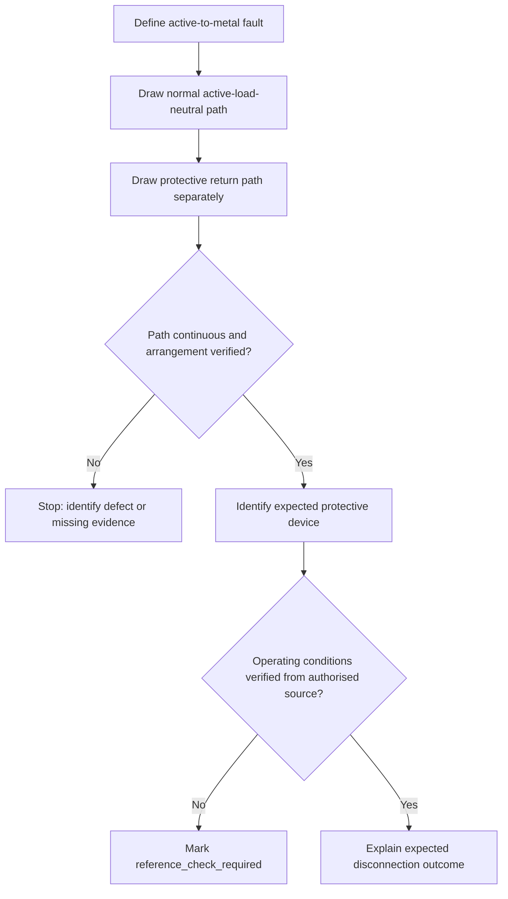
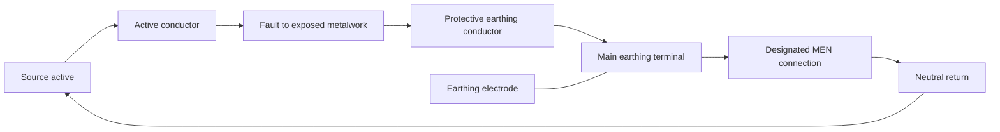

# Day 6B — MEN Fault-Current Path

> **Source and safety notice:** This module teaches an original conceptual method for tracing an active-to-exposed-conductive-part fault in a typical MEN arrangement. It is not a field procedure and does not authorise electrical work. Exact connection points, permitted arrangements, conductor requirements, protective-device operating conditions, disconnection times, touch-voltage limits, test methods, alternate-supply conditions and clause references remain `reference_check_required`. This module is not `technically-reviewed`.

## Navigation

- **Previous:** [Day 6A — Earthing Terminology and Component Roles](./day-06a-earthing-terminology-and-component-roles.md)
- **Next:** Day 6C — Earthing and MEN Fault Scenarios

## 1. Outcome and entry check

### Learning objectives

By the end of this block, the learner should be able to:

1. trace the conceptual fault-current path from an active conductor touching exposed conductive metalwork back to the source;
2. distinguish the normal load-current path from the protective fault-current path;
3. explain the role of the protective earthing conductor, main earthing terminal, MEN connection, neutral conductor and source in the return path;
4. explain why fault-path impedance affects fault-current magnitude and protective-device response;
5. identify at least four interruptions or high-impedance points that could make automatic disconnection unreliable;
6. state which exact claims require verification against current authorised sources.

### Entry check

Answer without notes:

1. Which conductors normally carry load current?
2. Is the protective earthing conductor intended to carry normal load current?
3. What designated connection relates the installation earthing system to neutral in an MEN arrangement?
4. Does the earthing electrode alone form the complete intended metallic return path for an equipment fault?
5. Why must a protective device receive sufficient fault current to operate as required?

Record confidence. Add any high-confidence error to the error log before continuing.

## 2. Why it matters

A learner can memorise the letters “MEN” yet still fail to explain how protection works. The practical question is not merely whether equipment is earthed. It is whether an unintended active-to-metal fault has a continuous, sufficiently effective return path that supports the required protective response.

Poor reasoning can lead to unsafe claims such as:

- “the current goes into the ground and disappears”;
- “the earth electrode clears the fault by itself”;
- “neutral and earth are the same conductor”;
- “a breaker will trip because a fault exists, regardless of path impedance”;
- “an RCD makes protective-earthing continuity irrelevant.”

A defensible capstone answer traces the path component by component, distinguishes normal and fault conditions, identifies the expected protective outcome, and marks every exact performance requirement for source verification.


## 3. Core concepts and terminology

### Normal load-current path

The **normal load-current path** is the intended operating circuit: source active conductor → load → neutral conductor → source neutral point. The protective earthing conductor is not the normal return conductor.

### Earth fault

An **earth fault** in this module means an unintended conductive connection between an active conductor and exposed conductive metalwork connected to the protective earthing system.

### Protective fault-current path

The **protective fault-current path** is the conductive route available to fault current. Conceptually, it includes:

1. the active conductor from the source to the fault;
2. the fault contact to exposed conductive metalwork;
3. the protective earthing conductor;
4. the main earthing terminal;
5. the designated MEN connection;
6. the neutral return path to the source;
7. the source winding or source point that completes the loop.

The precise arrangement varies and must be checked for the actual installation.

### Fault-loop impedance

**Fault-loop impedance** is the total opposition to fault current around the complete loop. It includes conductor resistance, connection resistance and other impedance in the source and return path. Greater impedance generally means lower fault current for the same driving voltage.

This is a relationship, not a complete calculation rule. Exact methods, values and acceptance criteria remain `reference_check_required`.

### Automatic disconnection of supply

**Automatic disconnection of supply** is the protective outcome in which a protective device interrupts the supply when fault conditions satisfy its operating requirements. The relevant device may depend on the installation and fault type. Exact device selection and operating-time requirements must be verified.

### Touch voltage

**Touch voltage** is the voltage that may exist between simultaneously accessible conductive parts during a fault. The protective objective is to limit dangerous exposure by controlling the path and duration of the fault condition. Exact limits and durations remain `reference_check_required`.

### Continuity

**Continuity** means an unbroken conductive path. A conductor can appear present while continuity is lost through a loose terminal, corrosion, mechanical damage, an omitted link or an incorrect connection.


## 4. Rule-finding workflow

Use this workflow for any MEN fault-path question.

1. **Define the fault.** Identify the active conductor, fault location and exposed conductive part.
2. **Separate operating and fault paths.** Draw the normal active-load-neutral path first, then draw the protective path separately.
3. **Trace without skipping components.** Follow metalwork → protective earthing conductor → main earthing terminal → designated MEN connection → neutral/source return.
4. **Identify the protective device.** Determine which device is expected to respond and what evidence governs that expectation.
5. **Inspect path quality.** Look for missing conductors, loose or corroded joints, incorrect terminations, parallel paths, misplaced neutral-earth links and supply-specific complications.
6. **Return to authorised sources.** Verify the exact arrangement, conductor requirements, device characteristics, disconnection requirements, testing method and exceptions.
7. **Record evidence.** Note source edition, amendment, clause or table, scenario assumptions and reviewer confirmation.



The workflow prevents a common error: jumping straight from “fault” to “breaker trips” without proving the path or the device conditions.

## 5. Visual model or worked example

### Conceptual fault loop



Read the diagram as a loop, not a drain:

- current leaves the source on the active path;
- the fault transfers current to exposed metalwork;
- the protective earthing path carries fault current to the main earthing terminal;
- the MEN connection relates that path to the neutral return;
- the neutral/source path completes the loop;
- the electrode contributes to the earthing arrangement but is not shown as the sole metallic return path.

### Worked reasoning example

Scenario: an active conductor contacts the metal enclosure of correctly earthed Class I equipment.

A strong response is:

1. identify the enclosure as an exposed conductive part;
2. trace fault current through the equipment protective earthing conductor;
3. continue through the installation earthing connection to the main earthing terminal;
4. pass through the designated MEN relationship to the neutral return and source;
5. explain that total loop impedance influences fault-current magnitude;
6. state that the relevant protective device must operate within verified requirements;
7. mark exact values, times and clauses `reference_check_required`.

Do not invent a current value or disconnection time when the source data has not been verified.

## 6. Practical application

### Paper fault-path audit

Draw a conceptual installation containing:

- source active and neutral;
- final subcircuit active, neutral and protective earth;
- a metal-cased appliance;
- main earthing terminal;
- MEN connection;
- main earthing conductor and electrode;
- overcurrent protective device;
- RCD where the scenario states one is present.

Then complete three passes:

**Pass 1 — normal operation:** highlight only the active-load-neutral route.

**Pass 2 — active-to-enclosure fault:** trace the protective metallic loop back to the source.

**Pass 3 — defect injection:** repeat after introducing one defect:

- open protective earthing conductor;
- loose main earthing terminal connection;
- high-resistance fault contact;
- incorrect neutral-earth link location;
- alternate source not represented in the original drawing.

For each defect, record:

```text
Fault introduced:
Path segment affected:
Likely protective consequence:
Potential touch-risk consequence:
Evidence required before concluding:
Stop or escalation condition:
```

This is a reasoning exercise only. Do not reproduce the scenario on energised equipment.

## 7. Common errors and safety checkpoint

### Common errors

- drawing the fault current as disappearing into soil;
- omitting the source from the loop;
- using the neutral conductor as if it were the equipment protective earthing conductor;
- assuming any neutral-earth connection is acceptable;
- assuming device operation without considering loop impedance;
- assuming an RCD removes the need for protective-earthing continuity;
- treating an intact-looking conductor as proof of continuity;
- applying a typical MEN sketch to generators, inverters, batteries, separate buildings or multiple supplies without checking their specific arrangements.

### Safety checkpoint

Stop and seek qualified guidance when:

- the supply arrangement cannot be identified confidently;
- an alternate or multiple source may energise the installation;
- the MEN connection location or integrity is uncertain;
- exposed conductive parts may be live;
- isolation, proving de-energised or test-instrument requirements are unresolved;
- a proposed conclusion depends on an unverified clause, limit, time or test value.

Never use this learning diagram as a live testing instruction. Testing and fault finding require current authorised procedures, suitable instruments, competency, isolation controls and jurisdiction-specific requirements.

## 8. Retrieval and next links

Answer without notes:

1. Trace the complete conceptual fault-current loop for an active-to-metal fault.
2. Why is the protective earthing conductor not the normal neutral return?
3. What role does the MEN connection perform in the conceptual loop?
4. Why can high loop impedance delay or prevent the expected overcurrent-device response?
5. Why is the earthing electrode not a complete explanation of the return path?
6. Name four defects that can impair the protective path.
7. Which exact details remain `reference_check_required`?

### Readiness check

Proceed when the learner can draw the loop from memory, label every component by role, explain the impedance–fault-current–device relationship without inventing values, and identify at least four defect points.

### Related vault notes

- [[Day 06A - Earthing Terminology and Component Roles]]
- [[Day 06B - MEN Fault-Current Path]]
- [[Earthing Bonding and MEN]]
- [[Day 03 - Overcurrent Protection]]
- [[Day 04 - RCD Protection and Additional Protection]]
- [[Inspection Testing and Verification]]
- [[AS-NZS-3000-2018-Index]]

### Previous block

Return to [Day 6A — Earthing Terminology and Component Roles](./day-06a-earthing-terminology-and-component-roles.md) if component names or roles are being confused.

### Next block

Proceed to **Day 6C — Earthing and MEN Fault Scenarios** to diagnose missing, misplaced and ineffective protective connections.

### References and currency notice

- AS/NZS 3000:2018 — current authorised copy and applicable amendments required; exact clauses, arrangements, conductor requirements, fault-loop methods, operating times, test criteria and exceptions remain to be verified.
- Current applicable legislation, regulator guidance, network service rules, manufacturer instructions and RTO procedures.
- [Learning Design](../../../LEARNING_DESIGN.md)
- [Content, Standards and Copyright Policy](../../../CONTENT_AND_COPYRIGHT.md)

This module contains original explanation, diagrams and scenarios. It does not reproduce standards wording, tables or figures. A qualified reviewer must verify the technical interpretation before the status can move beyond `review-required`.