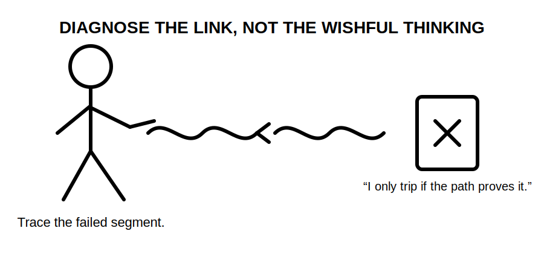
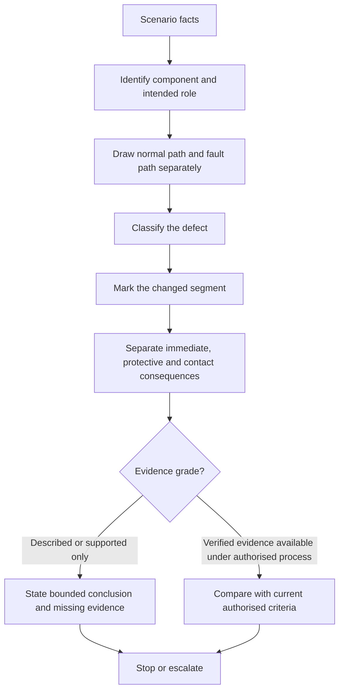
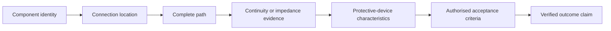

# Day 6C — Earthing and MEN Fault Scenarios

> **Source and safety notice:** This module teaches paper-based diagnosis of conceptual earthing and MEN fault scenarios. It is not a live testing, isolation, repair or commissioning procedure. Exact MEN arrangements, connection locations, conductor requirements, test methods, expected readings, device operating conditions, disconnection times, touch-voltage criteria, alternate-supply requirements, exceptions and clause references remain `reference_check_required`. This module is not `technically-reviewed` and grants no practical authority.

## Navigation

- **Previous:** [Day 6B — MEN Fault-Current Path](./day-06b-men-fault-current-path.md)
- **Next:** [Day 7 — Week 1 Consolidation and Competency Check](./day-07-week-1-consolidation-and-competency-check.md)

## 1. Outcome and entry check

### Learning objectives

By the end of this block, the learner should be able to:

1. classify a described defect as open, high-resistance, misplaced, unidentified or supply-context dependent;
2. redraw the normal-current path and the fault-current path without treating them as the same path;
3. identify the exact path segment changed by the defect;
4. separate the immediate electrical consequence, protective consequence and possible human-contact consequence;
5. grade a conclusion as **described**, **supported** or **verified**, and explain why a stronger grade is not yet justified;
6. identify the evidence required before claiming a protective device will operate as required;
7. compare at least four MEN-related scenarios without treating neutral, protective earth, bonding and the earthing electrode as interchangeable;
8. state a safe stop or escalation condition for every scenario; and
9. mark exact technical claims that require checking against current authorised sources.

### Entry check

Answer without notes:

1. Trace the conceptual active-to-enclosure fault loop from source and back to source.
2. What is the difference between an open conductor and a high-resistance connection?
3. Why is visual presence not proof of electrical continuity?
4. Why can a misplaced neutral-earth connection alter current paths even when equipment appears to operate?
5. Why must alternate or multiple supplies be identified before applying a familiar MEN sketch?

Record both the answer and confidence. A confident wrong answer is a priority error-log item because it can produce unsafe certainty.

## 2. Why it matters

Many protective-path defects are hidden during normal operation. Equipment may still function while a protective earthing conductor is open, a connection is deteriorated or an unintended neutral-earth connection changes current distribution. An alternate source may also invalidate an assumed isolation or fault-loop model.

A defensible assessment response must therefore do more than name a defect. It must explain:

1. what changed;
2. where the path changed;
3. what can and cannot be inferred;
4. which protective outcome remains uncertain;
5. what evidence is missing; and
6. when work must stop and be escalated.



*Caption: Trace the failed relationship before predicting the protective outcome.*

## 3. Core concepts and terminology

### Defect

A **defect** is a condition that prevents a component or arrangement from performing its intended role. In this module, a defect may affect continuity, impedance, connection location, conductor identity or source configuration.

### Open circuit

An **open circuit** is a broken conductive path. In a protective earthing path, an open connection can interrupt the intended metallic return loop.

### High-resistance connection

A **high-resistance connection** is not fully open, but opposes current more than intended. It may arise from looseness, corrosion, damage or poor contact. Its effect cannot be quantified without verified evidence.

### Misplaced connection

A **misplaced connection** is a connection shown or made at an incorrect or unverified location. A misplaced neutral-earth connection may create unintended parallel current paths and invalidate assumptions used for protection or testing.

### Unidentified conductor or component

An **unidentified conductor or component** is one whose role has not been established from reliable evidence. Colour, position or familiarity alone does not prove function.

### Parallel path

A **parallel path** is an additional conductive route between two points. Current may divide among available paths according to their impedances. A conceptual diagram can show that an unintended route may exist, but not how much current it carries without further evidence.

### Supply context

**Supply context** means the complete source arrangement relevant to the installation, including utility supply, generators, inverters, batteries, transfer equipment and separate-building supplies. An omitted source can invalidate both isolation and fault-path assumptions.

### Consequence layers

- **Immediate electrical consequence:** what changes in the circuit or conductive path.
- **Protective consequence:** what becomes uncertain about limiting fault magnitude or duration.
- **Possible contact consequence:** how a person could be exposed to an unintended potential difference.

### Claim grades

- **Described:** follows directly from the scenario statement.
- **Supported:** follows from the scenario plus a complete conceptual path and identified assumptions.
- **Verified:** requires authorised inspection, testing, source confirmation and acceptance criteria. This module does not produce verified installation claims.

## 4. Rule-finding workflow

Use the **D-I-A-G-N-O-S-E** workflow:

1. **D — Describe the given facts.** Separate stated facts from assumptions and missing information.
2. **I — Identify the component and intended role.** Do not infer function from colour or location alone.
3. **A — Analyse normal and fault paths separately.** Complete each loop back to its source.
4. **G — Grade the defect.** Classify it as open, high-resistance, misplaced, unidentified or context-dependent.
5. **N — Note the changed segment.** Mark exactly where continuity, impedance, identity or topology changes.
6. **O — Outline consequences in layers.** Separate immediate, protective and possible contact consequences.
7. **S — Seek evidence and sources.** Identify the arrangement, continuity, source, device and authorised requirement evidence needed.
8. **E — End at the authority boundary.** State the bounded conclusion, review flag and stop condition.



The diagram shows that a path explanation precedes a protective-device claim. It also prevents a paper scenario from being mislabelled as a verified installation result.

## 5. Visual model or worked example

### Evidence-to-conclusion ladder



Each rung is necessary for a verified protective-outcome claim. Missing lower-rung evidence cannot be replaced by confidence or familiarity.

### Worked example: open protective earthing conductor

Scenario: an active conductor contacts a metal enclosure, but the protective earthing conductor between the enclosure and the installation earthing system is described as open.

1. **Given fact:** the conductor is described as open.
2. **Intended role:** provide part of the intended metallic fault-current return path.
3. **Path change:** the intended loop is interrupted at the stated conductor.
4. **Immediate consequence:** the enclosure may remain connected to the active conductor through the fault.
5. **Protective consequence:** sufficient current for the expected overcurrent-device response cannot be assumed.
6. **Possible contact consequence:** a person touching the enclosure and another conductive reference may form part of an unintended path.
7. **Claim grade:** supported conceptual conclusion, not a verified installation finding.
8. **Evidence needed:** verified source arrangement, conductor identity, authorised continuity evidence, device data and current acceptance criteria.
9. **Stop condition:** do not energise, touch, test or repair from this paper exercise; escalate under approved procedures.

No exact current, voltage, operating time or test value is asserted.

### Comparison set

| Scenario | Changed relationship | Defensible conceptual conclusion | Evidence still required |
|---|---|---|---|
| Open protective earthing conductor | Intended metallic return path interrupted | Expected automatic disconnection cannot be assumed | Identity, continuity, arrangement, device and criteria evidence |
| Loose or deteriorated protective connection | Path impedance may be higher or unstable | Fault current and device response may differ from expectation | Approved inspection/test method, readings and limits |
| Misplaced neutral-earth connection | Unintended parallel path may exist | Normal or fault current may use unintended conductive routes | Permitted topology, connection locations and source context |
| Unrepresented generator or inverter | Original source model is incomplete | Isolation and fault-path assumptions may be invalid | Complete source topology, switching and neutral treatment |

This is an original reasoning table, not a reproduced standards table.

## 6. Practical application

### Four-scenario diagnostic set

For each fictional paper scenario, complete this record:

```text
Stated facts:
Assumptions:
Missing information:
Component and intended role:
Normal-current path:
Fault-current path before defect:
Fault-current path after defect:
Defect classification:
Changed segment:
Immediate electrical consequence:
Protective consequence:
Possible contact consequence:
Current claim grade:
Evidence required to strengthen the claim:
Authorised source to check:
Stop or escalation condition:
Confidence:
```

Use these scenarios:

1. protective earthing conductor described as disconnected at equipment;
2. main earthing terminal connection described as loose and corroded;
3. neutral-earth connection shown at an uncertain downstream point; and
4. inverter supply added without an updated source diagram.

### Worked-example fading

- **Round 1:** complete the record with the worked example visible.
- **Round 2:** use only the D-I-A-G-N-O-S-E headings.
- **Round 3:** diagnose a changed scenario from a blank page within eight minutes.

A reviewer must challenge any use of **will trip**, **safe**, **compliant**, **isolated**, **correct** or **verified** unless the evidence chain and authority are explicit.

### Assessment rubric — 12 points

Score each category 0, 1 or 2:

1. component role identified accurately;
2. normal and fault paths traced completely;
3. defect and changed segment classified correctly;
4. consequence layers separated;
5. evidence and claim grade controlled; and
6. stop condition and source boundary stated.

A safety-critical error—such as recommending energisation, live investigation or repair from the paper scenario—requires remediation regardless of total score.

### Varied re-attempt

Change one condition in the weakest scenario: add a second source, make conductor identity uncertain, move the apparent connection point or remove device data. Re-answer without copying the first response and explain which conclusion changed.

## 7. Common errors and safety checkpoint

### Common errors

- saying fault current “goes to ground” without completing the loop;
- treating a loose connection as equivalent to a sound connection;
- assuming an RCD makes an open protective earthing conductor acceptable;
- treating neutral, protective earth, bonding and the electrode as interchangeable;
- assuming any neutral-earth connection improves safety;
- concluding that normal equipment operation proves the protective path is effective;
- ignoring generators, inverters, batteries or separate supplies;
- converting a conceptual diagnosis into a live test or repair instruction;
- inventing exact values, times or clauses from memory; and
- using **verified** when only scenario facts and a conceptual model are available.

### Safety checkpoint

Stop and obtain qualified guidance when:

- exposed conductive parts may be energised;
- the supply arrangement or all energising sources are not known;
- the MEN connection location or conductor identity is uncertain;
- isolation and proving de-energised requirements are unresolved;
- a live test appears necessary;
- damaged, loose, overheated or corroded connections are suspected; or
- the conclusion depends on an unverified clause, value, method or acceptance limit.

This module authorises no switching, opening, isolation, fault creation, testing, resetting, disconnection, reconnection, alteration, repair, energisation, commissioning or verification.

## 8. Retrieval and next links

Answer without notes:

1. Name the eight D-I-A-G-N-O-S-E steps.
2. Distinguish open, high-resistance, misplaced, unidentified and context-dependent defects.
3. Why must normal-current and fault-current paths be drawn separately?
4. What is the difference between an immediate, protective and possible contact consequence?
5. What separates a supported claim from a verified claim?
6. Why can normal equipment operation coexist with a defective protective path?
7. How can an omitted alternate source invalidate the diagnosis?
8. Name three words that should trigger an evidence check.
9. State three stop conditions.

### Readiness check

Proceed when the learner can diagnose four varied scenarios from a blank page, complete both current paths, identify the changed segment, separate consequence layers, control the claim grade, identify missing evidence and state a safe stop condition without inventing values.

### Related vault notes

- [[Day 06A - Earthing Terminology and Component Roles]]
- [[Day 06B - MEN Fault-Current Path]]
- [[Day 06C - Earthing and MEN Fault Scenarios]]
- [[Earthing Bonding and MEN]]
- [[Day 03 - Overcurrent Protection]]
- [[Day 04 - RCD Protection and Additional Protection]]
- [[Fault Finding and Commissioning]]
- [[Inspection Testing and Verification]]
- [[AS-NZS-3000-2018-Index]]

### Previous block

Return to [Day 6B — MEN Fault-Current Path](./day-06b-men-fault-current-path.md) if the complete conceptual loop cannot be drawn accurately.

### Next block

Proceed to [Day 7 — Week 1 Consolidation and Competency Check](./day-07-week-1-consolidation-and-competency-check.md) to retrieve and apply source navigation, safety, protection, RCD and earthing concepts as an integrated set.

### References and currency notice

- AS/NZS 3000:2018 — current authorised copy and applicable amendments required; exact clauses, arrangements, conductor requirements, connection locations, testing methods, device behaviour, acceptance criteria and exceptions remain to be verified.
- Current applicable legislation, regulator guidance, network service rules, manufacturer instructions and RTO procedures.
- [Learning Design](../../../LEARNING_DESIGN.md)
- [Content, Standards and Copyright Policy](../../../CONTENT_AND_COPYRIGHT.md)

This module contains original organisation, explanation, diagrams, scenarios and assessment prompts. It does not reproduce standards wording, tables or figures. A suitably qualified reviewer must verify the technical interpretation before the status can move beyond `review-required`.

<!-- sequence-navigation:start -->
### Sequence navigation

- [← Previous: Day 6B — MEN Fault-Current Path](./day-06b-men-fault-current-path.md)
- [Four-week learning plan](../MASTER_PLAN.md)
- [Next: Day 7 — Week 1 Consolidation and Competency Check →](./day-07-week-1-consolidation-and-competency-check.md)
<!-- sequence-navigation:end -->