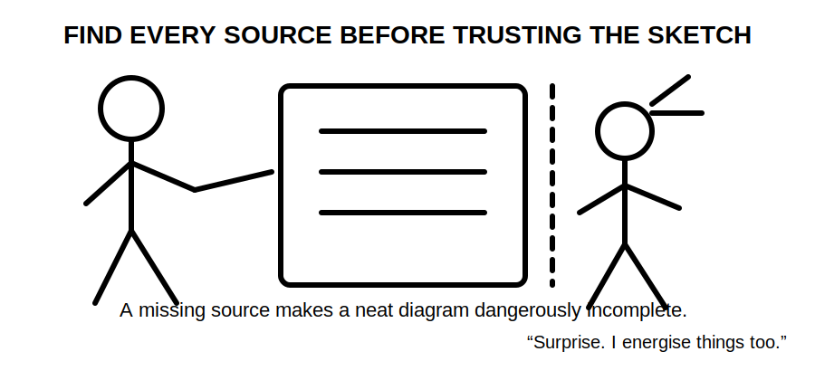
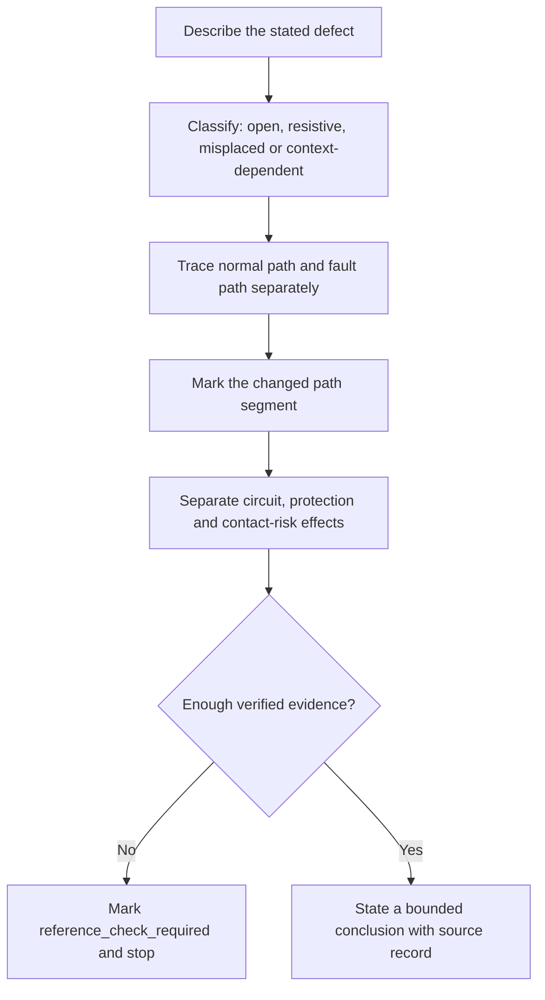
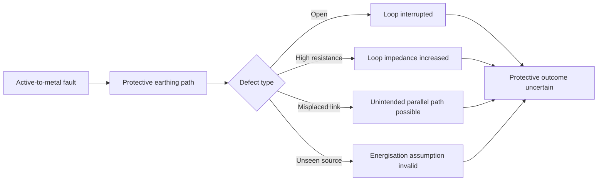

# Day 6C — Earthing and MEN Fault Scenarios

> **Source and safety notice:** This module teaches paper-based diagnosis of conceptual earthing and MEN fault scenarios. It is not a live testing, isolation, repair or commissioning procedure. Exact MEN arrangements, connection locations, conductor requirements, test methods, expected readings, device operating conditions, disconnection times, touch-voltage criteria, alternate-supply requirements, exceptions and clause references remain `reference_check_required`. This module is not `technically-reviewed`.

## Navigation

- **Previous:** [Day 6B — MEN Fault-Current Path](./day-06b-men-fault-current-path.md)
- **Next:** Day 7 — Week 1 Consolidation and Competency Check

## 1. Outcome and entry check

### Learning objectives

By the end of this block, the learner should be able to:

1. classify a described defect as missing, open, loose, high-resistance, misplaced or supply-context dependent;
2. trace how that defect changes the conceptual fault-current path;
3. distinguish the immediate electrical consequence from the protective consequence and the possible human-contact consequence;
4. identify the evidence needed before concluding that a protective device will operate as required;
5. compare at least four MEN-related scenarios without treating neutral, protective earth, bonding and the earthing electrode as interchangeable;
6. state a safe stop or escalation condition for every scenario;
7. mark exact technical claims that require checking against current authorised sources.

### Entry check

Answer without notes:

1. Trace the conceptual active-to-enclosure fault loop from source and back to source.
2. What is the difference between an open conductor and a high-resistance connection?
3. Why is visual presence not proof of electrical continuity?
4. Why can a misplaced neutral-earth connection alter current paths even when equipment appears to operate?
5. Why must alternate or multiple supplies be identified before applying a familiar MEN sketch?

Record confidence. Any confident wrong answer goes into the error log before continuing.

## 2. Why it matters

Many dangerous defects do not announce themselves during normal operation. A metal-cased appliance may still run while its protective earthing path is ineffective. A loose connection may carry too little current during a fault to produce the expected protective response. A misplaced neutral-earth connection may create unintended parallel paths. An alternate source may keep part of an installation energised after an assumed supply path is opened.

The assessment skill is therefore not merely naming the defect. A defensible response must explain:

1. what changed;
2. which path segment is affected;
3. what may happen during a fault;
4. which protective outcome is uncertain;
5. what evidence is missing;
6. when to stop and escalate.


## 3. Core concepts and terminology

### Defect

A **defect** is a condition that prevents a component or arrangement from performing its intended role. In this module, a defect may affect continuity, impedance, connection location, conductor identity or source configuration.

### Open circuit

An **open circuit** is a broken conductive path. In a protective earthing path, an open connection can prevent substantial fault current from returning through the intended metallic loop.

### High-resistance connection

A **high-resistance connection** is not fully open, but it opposes current more than intended. It may arise from looseness, corrosion, damage or poor contact. The resulting fault current may be lower than expected, and the connection may heat.

### Misplaced connection

A **misplaced connection** is a connection made at the wrong point or in an arrangement where it is not permitted. A misplaced neutral-earth connection can create unintended current paths and undermine assumptions used for protection and testing.

### Parallel path

A **parallel path** is an additional conductive route between two points. Current divides among available paths according to their impedances. An unintended parallel path can place normal current on conductive parts or conductors not intended to carry it.

### Supply context

**Supply context** means the complete source arrangement relevant to the installation, including utility supply, generators, inverters, batteries, transfer equipment and separate-building supplies. A familiar diagram is unsafe if it omits an energising source.

### Protective consequence

A **protective consequence** is the effect a defect has on the ability of protection to limit fault duration or hazardous touch conditions. It is separate from the immediate fault itself.



## 4. Rule-finding workflow

Use the **D-P-E-S** workflow: **Defect, Path, Evidence, Stop**.

1. **Defect — describe only what is given.** State the failed or uncertain component and classify the defect. Do not invent measurements.
2. **Path — redraw the affected loop.** Trace normal current first, then the fault-current path. Mark where continuity is lost, impedance is increased or a new parallel path appears.
3. **Effect — separate consequences.** Record the immediate circuit effect, expected protective effect and possible contact-risk effect.
4. **Evidence — identify what would prove the conclusion.** Examples include verified arrangement, continuity evidence, conductor identity, source configuration, protective-device data and authorised acceptance criteria.
5. **Source — check the governing requirement.** Use the current authorised standard, amendments, regulator or network rules, manufacturer instructions and approved RTO procedures.
6. **Stop — state the limit of the answer.** Escalate when the installation arrangement, energisation state, supply source, connection location or required procedure is uncertain.



This workflow prevents two weak answers: “the breaker trips” without proving why, and “it is unsafe” without identifying the failed relationship.

## 5. Visual model or worked example

### Scenario comparison model



### Worked reasoning example: open protective earthing conductor

Scenario: an active conductor contacts a metal enclosure, but the protective earthing conductor between the enclosure and the installation earthing system is open.

A strong response is:

1. **Defect:** the protective earthing conductor has lost continuity.
2. **Path change:** the intended metallic return loop is interrupted at that conductor.
3. **Immediate consequence:** the enclosure can become connected to active potential through the fault.
4. **Protective consequence:** sufficient fault current for the expected overcurrent-device response cannot be assumed.
5. **Contact-risk consequence:** a person touching the enclosure and another conductive reference may become part of an unintended path.
6. **Evidence needed:** verified isolation state, conductor identification, approved continuity test procedure, suitable instrument, device data and authorised acceptance criteria.
7. **Stop condition:** do not energise, touch, test or repair based on this paper exercise; isolate and escalate under approved procedures.

No exact current, voltage, time or test value is asserted because those details are not verified here.

### Four-scenario comparison

| Scenario | Path change | Defensible conceptual conclusion | Evidence still required |
|---|---|---|---|
| Open protective earthing conductor | Intended metallic return path interrupted | Expected automatic disconnection cannot be assumed | Continuity evidence, arrangement, device and authorised criteria |
| Loose or corroded protective connection | Loop impedance may increase and heating may occur | Fault current and device response may differ from expectation | Approved inspection/test method, readings and limits |
| Misplaced neutral-earth connection | Unintended parallel current path may exist | Normal current may flow on unintended conductive routes | Exact permitted arrangement, connection locations and source context |
| Unrepresented generator or inverter | Original source and return model is incomplete | Isolation and fault-path assumptions may be invalid | Source topology, switching, neutral treatment and manufacturer/network requirements |

The table is an original reasoning aid, not a standards table.

## 6. Practical application

### Fault-scenario cards

Create four paper cards. On each card, draw a simple installation and introduce one defect:

1. protective earthing conductor disconnected at equipment;
2. loose main earthing terminal connection;
3. neutral-earth connection shown at an uncertain downstream point;
4. inverter or generator added without updating the source diagram.

For each card, complete this record:

```text
Stated defect:
Defect classification:
Normal current path:
Fault-current path before defect:
Fault-current path after defect:
Immediate circuit consequence:
Protective consequence:
Possible contact-risk consequence:
Evidence required:
Authorised source to check:
Stop or escalation condition:
Confidence:
```

Then swap cards with another learner or review them after a ten-minute delay. The reviewer must challenge any conclusion containing “will trip”, “safe”, “compliant” or “isolated” unless the evidence chain is explicit.

### Assessment response frame

Use this order in a written or oral response:

> The stated defect is ____. It changes the protective path by ____. Therefore ____ cannot be assumed. The main risk is ____. I would need ____ evidence and the current authorised requirement before concluding ____. I would stop and escalate if ____.

This frame rewards process, safety and source awareness rather than unsupported certainty.

## 7. Common errors and safety checkpoint

### Common errors

- saying the fault current “goes to ground” without completing the loop;
- treating a loose connection as equivalent to a sound connection because continuity may still appear intermittently;
- assuming an RCD makes an open protective earthing conductor acceptable;
- treating neutral and protective earth as interchangeable because they are related at a designated point;
- assuming any neutral-earth link improves safety;
- concluding that normal equipment operation proves the protective path is effective;
- ignoring generators, inverters, batteries or separate supplies;
- recommending a test without stating isolation, competency, instrument and approved-procedure requirements;
- inventing exact values, times or clauses from memory.

### Safety checkpoint

Stop and obtain qualified guidance when:

- exposed conductive parts may be energised;
- the supply arrangement or all energising sources are not known;
- the MEN connection location or conductor identity is uncertain;
- isolation and proving de-energised requirements are unresolved;
- a live test appears necessary;
- damaged, loose, overheated or corroded connections are suspected;
- the conclusion depends on an unverified clause, value, test method or acceptance limit.

A paper diagnosis is not permission to interact with an installation. Electrical testing, isolation, repair and verification require competency, suitable equipment, current authorised procedures and jurisdiction-specific controls.

## 8. Retrieval and next links

Answer without notes:

1. What four defect categories were used in this module?
2. Apply D-P-E-S to an open protective earthing conductor.
3. Why can a high-resistance connection be dangerous even if the circuit is not fully open?
4. How can a misplaced neutral-earth connection create an unintended parallel path?
5. Why does normal equipment operation not prove the protective system is sound?
6. What additional questions arise when a generator or inverter is present?
7. Which words in an assessment answer should trigger an evidence check?
8. Name three conditions that require stopping and escalating.

### Readiness check

Proceed when the learner can diagnose four scenarios from a blank page, trace the changed path in each, separate circuit/protection/contact-risk consequences, identify missing evidence and state a safe stop condition without inventing values.

### Related vault notes

- [[Day 06A - Earthing Terminology and Component Roles]]
- [[Day 06B - MEN Fault-Current Path]]
- [[Day 06C - Earthing and MEN Fault Scenarios]]
- [[Earthing Bonding and MEN]]
- [[Day 03 - Overcurrent Protection]]
- [[Day 04 - RCD Protection and Additional Protection]]
- [[Fault Finding and Commissioning]]
- [[Inspection Testing and Verification]]
- [[AS-NZS-3000-2018-Index]]

### Previous block

Return to [Day 6B — MEN Fault-Current Path](./day-06b-men-fault-current-path.md) if the complete conceptual loop cannot be drawn accurately.

### Next block

Proceed to **Day 7 — Week 1 Consolidation and Competency Check** to retrieve and apply navigation, safety, protection, RCD and earthing concepts as an integrated set.

### References and currency notice

- AS/NZS 3000:2018 — current authorised copy and applicable amendments required; exact clauses, arrangements, conductor requirements, connection locations, testing methods, device behaviour, acceptance criteria and exceptions remain to be verified.
- Current applicable legislation, regulator guidance, network service rules, manufacturer instructions and RTO procedures.
- [Learning Design](../../../LEARNING_DESIGN.md)
- [Content, Standards and Copyright Policy](../../../CONTENT_AND_COPYRIGHT.md)

This module contains original organisation, explanation, diagrams, scenarios and assessment prompts. It does not reproduce standards wording, tables or figures. A suitably qualified reviewer must verify the technical interpretation before the status can move beyond `review-required`.
