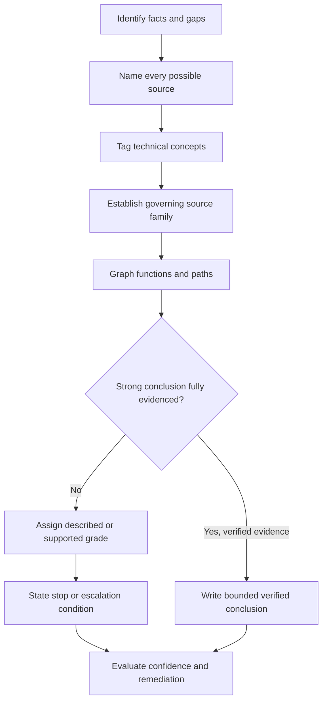

# Day 7 — Week 1 Consolidation and Competency Check

> **Source, assessment and safety notice:** This is an original study-readiness check, not an official RTO assessment, licence examination, safe-work method or field procedure. It integrates Week 1 reasoning without asserting exact clause numbers, limits, device settings, test values, operating times or jurisdiction-specific pass criteria. Those details remain `reference_check_required`. This module is not `technically-reviewed`.

## Navigation

- **Previous:** [Day 6C — Earthing and MEN Fault Scenarios](./day-06c-earthing-and-men-fault-scenarios.md)
- **Next:** [Day 8 — Maximum Demand](./day-08-maximum-demand.md)

## 1. Outcome and entry check

### Observable learning objectives

By the end of this block, the learner should be able to:

1. reconstruct the Week 1 reasoning models from memory and explain how they connect;
2. classify an unfamiliar paper scenario by hazard, possible supply, fault category, protective function and evidence need;
3. distinguish overload, short circuit and residual current without treating them as interchangeable;
4. trace normal load current and an active-to-exposed-conductive-part fault path as separate complete loops;
5. diagnose an open, high-resistance, misplaced or supply-context-dependent protective-path defect without inventing measurements;
6. produce a traceable evidence chain separating stated facts, assumptions, inferences, missing evidence and stop conditions;
7. explain one response aloud, then identify and repair at least one high-confidence misconception;
8. achieve the study-readiness gate or select a specific remediation action using the scored rubric.

### Entry check — eight minutes, closed note

On blank paper, answer:

1. What makes an answer traceable rather than merely plausible?
2. Name four energy-source categories or task-boundary concerns that may alter a safety decision.
3. Distinguish overload, short circuit and residual current.
4. What does an RCD compare, and what does its presence not prove?
5. Trace a conceptual active-to-metal fault loop back to the source.
6. Name four protective-path defect categories from Day 6C.
7. Which conclusion words should trigger an immediate evidence challenge?
8. What condition should cause you to stop rather than continue reasoning toward a practical action?

Record confidence beside each answer: **guessing**, **unsure**, **reasonably confident** or **certain**. Do not correct answers yet. A confident error receives priority because it is more likely to survive into assessment or workplace reasoning.

## 2. Why it matters

Capstone questions rarely isolate one topic. A single scenario may require source navigation, hazard recognition, possible-supply identification, protective-function comparison, fault-path tracing and a bounded conclusion.

A learner can recognise each definition and still fail to combine them. This checkpoint therefore tests **transfer**: applying the same relationships to changed equipment and incomplete evidence rather than reproducing familiar wording.

The target habit is **bounded certainty**. A strong response is decisive about supported reasoning and explicit about every unverified fact, value, arrangement, procedure or conclusion.


## 3. Core concepts and terminology

- **Consolidation:** strengthening and connecting learning so it can be retrieved and applied later.
- **Retrieval:** producing knowledge from memory before reviewing notes.
- **Transfer:** applying a concept in a different context while preserving the underlying relationship.
- **Evidence chain:** a traceable connection from scenario facts through source selection and reasoning to a bounded conclusion.
- **Misconception:** an incorrect mental model, not merely a forgotten term.
- **Confidence calibration:** comparing felt certainty with the quality of supporting evidence.
- **Competency evidence:** observable performance showing a capability. Here it is educational evidence only, not an official competence declaration.
- **Critical error:** an error that creates an unsafe claim, omits a possible source, merges incompatible technical concepts or grants practical authority without evidence.
- **Study-readiness gate:** an internal rule for choosing whether to proceed, remediate or recover. It is not an RTO pass criterion.

### Claim grades

Use three claim grades throughout the checkpoint:

1. **Described:** the scenario states it, but it has not been independently verified.
2. **Supported:** the reasoning is consistent with stated facts and identified sources, but exact technical requirements remain unchecked.
3. **Verified:** current authorised evidence supports the exact claim and a competent person has applied the required process.

This paper exercise can normally produce described or supported claims only.

## 4. Rule-finding workflow

Use **I-N-T-E-G-R-A-T-E** for each integrated question:

1. **I — Identify facts and gaps.** Separate stated facts, assumptions, inferences and missing information.
2. **N — Name every possible source.** Include normal, alternate, stored, induced, control and mechanical energy where relevant.
3. **T — Tag the technical concepts.** Identify protection, earthing, MEN, current-path and source-navigation issues.
4. **E — Establish the governing source family.** Distinguish standards, legislation, regulator or network rules, manufacturer instructions, workplace procedures and RTO directions.
5. **G — Graph functions and paths.** Draw normal current and fault current separately; state each component’s intended role.
6. **R — Require evidence for strong claims.** Challenge words such as **safe**, **isolated**, **compliant**, **continuous** and **will operate**.
7. **A — Assign claim grades.** Mark each important statement described, supported or verified.
8. **T — Terminate at the boundary.** State stop and escalation conditions when evidence, authority or conditions are incomplete.
9. **E — Evaluate confidence and remediation.** Compare confidence with evidence, score the response and select the next learning action.



The workflow prevents a common failure: jumping from a remembered device name to a confident conclusion without establishing source context, current path, protective function or evidence quality.

## 5. Visual model or worked example

### Relationship model

```mermaid
flowchart LR
    N["Navigate authorised sources"] --> S["Set safety and supply boundary"]
    S --> P["Separate protective functions"]
    P --> C["Classify conductors and components"]
    C --> F["Trace normal and fault paths"]
    F --> D["Diagnose changed path or missing evidence"]
    D --> E["Grade and explain the conclusion"]
    E --> R["Retrieve later and repair misconceptions"]
```



The arrows show reasoning dependencies, not a universal field procedure.

### Worked example

**Scenario:** A small workshop distribution board supplies a metal-cased bench appliance. Notes report repeated protective-device operation. Residual-current protection is present. Protective-earthing continuity has not been verified. A portable inverter is available, but the drawing does not show whether it can energise the same installation.

A defensible response is:

1. **Facts:** repeated operation is reported; an RCD is present; earthing evidence is absent; inverter relationship is unknown.
2. **Safety boundary:** do not assume one source, de-energised equipment, effective earthing or permission to test.
3. **Classification:** repeated operation alone does not distinguish overload, short circuit or residual-current imbalance.
4. **Source plan:** locate current authorised installation, device, manufacturer, workplace and RTO requirements without inventing clause numbers.
5. **Path model:** draw active-load-neutral separately from a possible active-metal-protective-earthing-source loop.
6. **Protection relationship:** an RCD does not prove overcurrent protection, protective-earthing continuity or isolation.
7. **Claim grades:** device operation is described; cause and protective outcome are unverified.
8. **Conclusion:** no cause, compliance state, device response or practical action can be asserted. Stop and escalate until every source and the approved verification boundary are established.

### Faded transfer example

**Changed scenario:** Replace the inverter with a battery system whose operating mode and isolation relationship are not shown. The protective device has not operated, but the metal enclosure is reported to give a “tingle.”

Complete only these prompts:

- facts versus reported symptoms;
- possible supplies and stored energy;
- concepts requiring classification;
- normal and possible fault paths;
- evidence required before any protective-device claim;
- stop and escalation statement.

Do not copy the worked response. The changed supply and symptom require fresh reasoning.

## 6. Practical application

Complete the following in 80–95 minutes.

### Part A — retrieval map, 12 minutes

For source navigation, safety reasoning, overcurrent protection, RCD protection and earthing/MEN reasoning, record:

- purpose;
- two essential terms;
- one common misconception;
- one authorised-source check.

### Part B — source-navigation plan, 12 minutes

For the workshop scenario, record formal search terms, likely source families, headings or index terms, context-changing exceptions and the evidence record to retain. Do not invent clause numbers.

### Part C — integrated response, 25 minutes

Produce:

- fact/assumption/gap table;
- safety and possible-supply boundary;
- fault-category comparison;
- protective-function comparison;
- normal-current diagram;
- possible fault-current diagram;
- changed-path analysis for an open or high-resistance protective connection;
- evidence challenge for **safe**, **isolated**, **compliant**, **continuous** and **will operate**;
- claim grades;
- bounded conclusion and escalation condition.

### Part D — oral defence, 10 minutes

Explain the response without reading it. Then answer:

- Which statement is fact?
- Which is inference?
- Which exact claim needs an authorised source?
- Which action would be unsafe without approved procedures and competence?
- Which conclusion changed when the alternate supply was introduced?

### Part E — scored readiness rubric, 16 minutes

Score each category **0, 1 or 2**.

| Category | 2 — defensible | 1 — partial | 0 — critical weakness |
|---|---|---|---|
| Source navigation | Correct source families, search path and unresolved checks | Source family named but context or traceability incomplete | Memory or copied wording treated as proof |
| Safety boundary | All plausible sources, competence limits and stops explicit | Main hazard found but one boundary weak | Safe work or isolation assumed |
| Terminology | Fault categories and conductors remain distinct | One relationship blurred | Terms merged or misused |
| Protection relationship | Functions and limitations correctly separated | Devices named but limits weak | One device claimed to replace all protection |
| Current paths | Normal and fault loops complete and separate | One link missing | Path ends at soil or device operation assumed |
| Evidence chain | Facts, grades, gaps and conclusion traceable | Plausible but missing an explicit grade or gap | Strong claim made without evidence |
| Transfer | Changed scenario re-analysed from first principles | Some copied reasoning remains | Original answer reused despite changed facts |
| Safety communication | Stop and escalation wording is clear | Boundary implied but not explicit | Practical authority granted |

**Maximum: 16 points.** This score is an educational readiness tool, not an official assessment result.

- **Stop and remediate:** any category scores 0, any possible supply is omitted, or any high-confidence safety misconception appears.
- **Targeted remediation:** no zero, but total is below 14 or any category remains partial. Review the smallest prerequisite and retry a fresh scenario.
- **Proceed to Day 8:** at least 14/16, no zero, all safety-critical categories score 2, and exact technical claims are returned to authorised sources.


## 7. Common errors and safety checkpoint

### Common errors

- rereading before closed-note retrieval;
- treating source navigation as clause-number recall;
- assuming non-operation proves de-energisation;
- omitting alternate, stored or control energy;
- merging overload, short circuit and residual current;
- claiming an RCD replaces overcurrent protection, earthing, isolation or verification;
- treating earth, neutral, bonding and MEN connection as interchangeable;
- ending a fault path at soil rather than the source;
- assuming visible conductors or normal operation prove continuity;
- claiming a device **will operate** without path, source and device evidence;
- memorising replacement wording without repairing the misconception.

### Safety checkpoint

This block is paper-based and grants no authority to interact with an installation.

Stop and obtain qualified guidance when equipment state is uncertain; any possible energy source is unresolved; isolation, proving de-energised, test equipment or competence requirements are unclear; damage, overheating or unexpected operation is suspected; a live test, reset, repair, alteration or energisation would be required; or the conclusion depends on an unverified clause, value, procedure, arrangement or acceptance criterion.

Use current authorised standards, legislation, regulator and network requirements, manufacturer instructions, workplace procedures and approved RTO processes. Preserve evidence and escalate rather than converting a study answer into a field action.

## 8. Retrieval and next links

### Final retrieval — closed note

1. State the nine I-N-T-E-G-R-A-T-E steps.
2. Distinguish described, supported and verified claims.
3. Explain why transfer is more demanding than recognition.
4. Distinguish overload, short circuit and residual current.
5. Compare overcurrent and residual-current protection roles and limitations.
6. Trace normal and active-to-metal fault-current loops.
7. Explain how an open and a high-resistance protective connection alter reasoning.
8. Explain why alternate supplies change isolation and fault-path conclusions.
9. Name the strong conclusion words that demand evidence.
10. State the readiness conditions for proceed, remediation and stop.

### Error-log closeout

```text
Original answer:
Confidence before checking:
Misconception or missing relationship:
Corrected explanation in my own words:
Module or authorised source checked:
Fresh transfer question:
Result on fresh question:
Next review date:
```

Clear an error only after successful retrieval and application in a fresh context.

### Related vault notes

- [[Day 01 - Exam Orientation and Wiring Rules Navigation]]
- [[Day 02 - Fundamental Safety Principles]]
- [[Day 03 - Overcurrent Protection]]
- [[Day 04 - RCD Protection and Additional Protection]]
- [[Day 05 - Rest Retrieval and Catch-Up]]
- [[Day 06A - Earthing Terminology and Component Roles]]
- [[Day 06B - MEN Fault-Current Path]]
- [[Day 06C - Earthing and MEN Fault Scenarios]]
- [[Day 07 - Week 1 Consolidation and Competency Check]]
- [[Day 08 - Maximum Demand]]
- [[Four-Week Capstone Learning Plan]]
- [[Safety and Electrical Risk]]
- [[Control Switching and Protection]]
- [[Earthing Bonding and MEN]]
- [[Learning and Memory System]]

### References and currency notice

- AS/NZS 3000:2018 — current authorised copy and applicable amendments required.
- Current applicable legislation, regulator guidance, network service rules, manufacturer instructions, workplace procedures and RTO assessment directions.
- [Learning Design](../../../LEARNING_DESIGN.md)
- [Content, Standards and Copyright Policy](../../../CONTENT_AND_COPYRIGHT.md)

Exact clauses, definitions, protective-device conditions, MEN arrangements, test procedures, limits, operating times, acceptance criteria and jurisdiction-specific assessment requirements remain `reference_check_required`. The organisation, diagrams, scenario facts, rubric and prompts are original educational content. A suitably qualified reviewer must verify technical interpretation before the status can move beyond `review-required`.

<!-- sequence-navigation:start -->
### Sequence navigation

- [← Previous: Day 6C — Earthing and MEN Fault Scenarios](./day-06c-earthing-and-men-fault-scenarios.md)
- [Four-week learning plan](../MASTER_PLAN.md)
- [Next: Day 8 — Maximum Demand →](./day-08-maximum-demand.md)
<!-- sequence-navigation:end -->