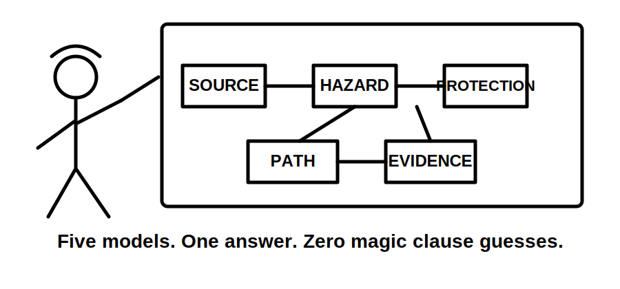
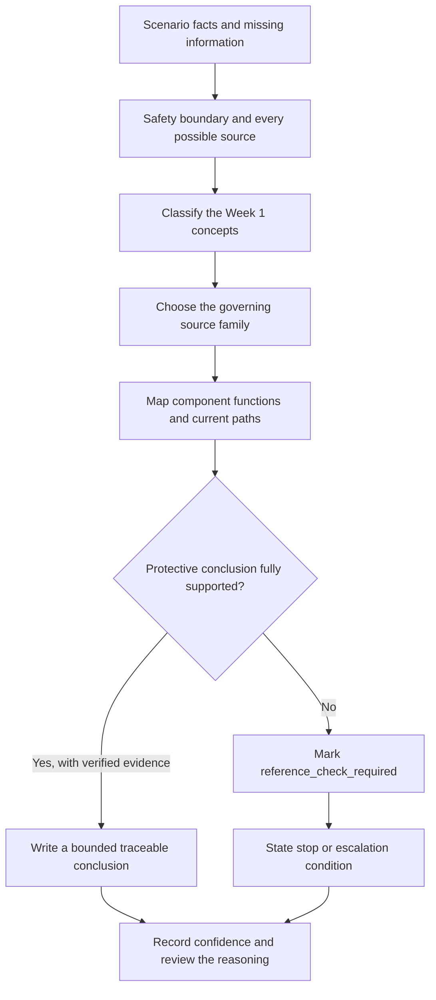
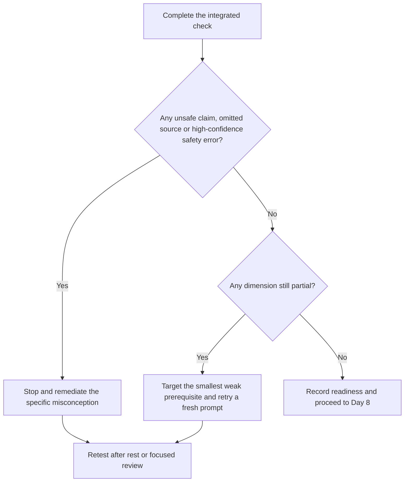
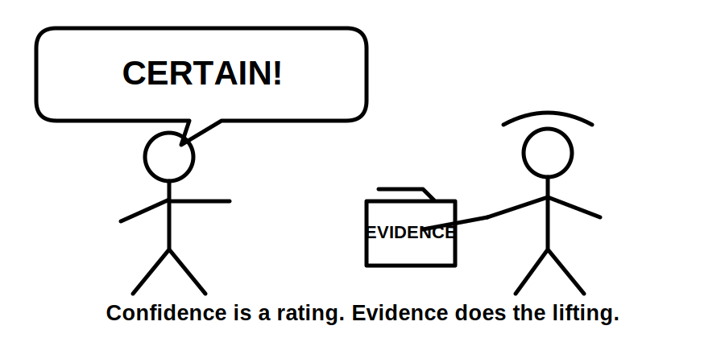

# Day 7 — Week 1 Consolidation and Competency Check

> **Source, assessment and safety notice:** This is an original study-readiness check, not an official RTO assessment, licence examination, safe-work method or field procedure. It integrates Week 1 reasoning without asserting exact clause numbers, limits, device settings, test values, operating times or jurisdiction-specific pass criteria. Those details remain `reference_check_required`. This module is not `technically-reviewed`.

## Navigation

- **Previous:** [Day 6C — Earthing and MEN Fault Scenarios](./day-06c-earthing-and-men-fault-scenarios.md)
- **Next scheduled block:** [Day 8 — Maximum Demand](../MASTER_PLAN.md#week-2--circuit-design-cables-and-switchboards)

## 1. Outcome and entry check

### Learning objectives

By the end of this block, the learner should be able to:

1. retrieve and explain the five Week 1 reasoning models—source navigation, safety control, overcurrent protection, residual-current protection and the MEN fault-current path—without copying module wording;
2. classify an original scenario into the correct technical concepts and governing source families within a timed paper exercise;
3. distinguish overload, short circuit and residual current, then state which protective function each condition calls into question;
4. trace normal load current and an active-to-exposed-conductive-part fault path as separate complete loops;
5. diagnose an open, high-resistance, misplaced or supply-context-dependent protective-path defect without inventing measurements;
6. produce an evidence chain that separates what is stated, what is inferred, what must be verified and when work must stop;
7. identify at least one high-confidence misconception and write a fresh retrieval prompt that tests the corrected reasoning;
8. use the readiness rubric to choose one defensible next action: proceed, targeted remediation or stop and recover.

### Entry check — eight minutes, closed note

On blank paper, write one sentence or sketch for each prompt:

1. What makes a technical answer traceable rather than merely plausible?
2. Name four energy-source categories or task-boundary concerns that may change a safety decision.
3. Distinguish overload from short circuit.
4. What does a residual-current device compare?
5. Why does residual-current protection not replace overcurrent protection or protective earthing?
6. Trace the conceptual active-to-metal fault loop back to its source.
7. Name four defect categories used in Day 6C.
8. Which words should trigger an immediate evidence check before you claim a result?

Record confidence beside every answer: **guessing**, **unsure**, **reasonably confident** or **certain**. Do not correct answers yet. A confident error is more important than an uncertain omission because it can survive into an assessment or workplace decision.

## 2. Why it matters

Week 1 topics are not independent facts. A capstone-style scenario may require the learner to recognise a hazard, identify all possible supplies, locate the governing requirement, distinguish protective functions, trace a fault-current path and state what evidence is missing—all in one response.

A learner can recall each definition and still fail when the concepts must be combined. Consolidation therefore tests **transfer**: using learned reasoning in a different scenario rather than recognising familiar wording.

The central assessment habit is bounded certainty. A strong response can be decisive about the reasoning while remaining explicit about facts, values, arrangements and procedures that have not been verified.



## 3. Core concepts and terminology

### Consolidation

**Consolidation** is the process of strengthening and connecting learning so it can be retrieved and applied later. In this block, consolidation means linking the Week 1 models into one evidence-based response.

### Retrieval

**Retrieval** means producing information from memory before looking at notes. It reveals what the learner can actually access under pressure, rather than what looks familiar when reread.

### Transfer

**Transfer** is the ability to apply a concept in a new context. The integrated scenario changes the equipment and evidence while preserving the underlying protection and fault-path relationships.

### Evidence chain

An **evidence chain** connects the scenario facts, technical concepts, governing source, reasoning steps and bounded conclusion. A missing link makes the conclusion weaker even when the final sentence sounds correct.

### Misconception

A **misconception** is an incorrect mental model, not merely a forgotten word. Examples include treating an RCD as complete protection, assuming normal operation proves earthing continuity or assuming a protective device operates simply because a fault exists.

### Confidence calibration

**Confidence calibration** is the comparison between how certain the learner felt and how well the reasoning was supported. High confidence with weak evidence requires priority remediation.

### Competency evidence

**Competency evidence** is observable performance that shows a capability. In this study module it includes correct classification, safe process, complete path tracing, appropriate source selection, explicit uncertainty and a clear explanation. It is not an official declaration of trade competence.

### Study-readiness gate

A **study-readiness gate** is an internal decision rule for choosing the next learning action. It does not replace an RTO rubric or jurisdiction-specific assessment requirement.

## 4. Rule-finding workflow

Use the **Week 1 evidence loop** for each integrated question:

1. **State the scenario facts.** Separate provided facts from assumptions and missing information.
2. **Set the safety boundary.** Identify hazards, possible energy sources, competence limits and immediate stop conditions.
3. **Classify the technical issue.** Select the relevant Week 1 concepts: navigation, overcurrent, residual current, earthing, MEN relationships or fault-path defect.
4. **Choose the governing source family.** Distinguish the current authorised standard, legislation, regulator or network rules, manufacturer instructions, workplace procedures and RTO directions.
5. **Map functions and paths.** State what each component is intended to do; draw normal current and fault current separately where relevant.
6. **Challenge the protective claim.** Ask what must be true before saying a device will operate, a condition is compliant, or an installation is safe or isolated.
7. **Record evidence and flags.** Cite the source location when verified; otherwise mark the claim `reference_check_required`.
8. **Conclude and stop.** Give a bounded conclusion and an escalation condition when evidence, authority or conditions are incomplete.



The workflow prevents a common failure pattern: jumping from one remembered device name to a confident conclusion without establishing the safety boundary, current path or source evidence.

## 5. Visual model or worked example

### Week 1 relationship model

```mermaid
flowchart LR
    N["Navigate the authorised source"] --> S["Define hazard, sources and stop conditions"]
    S --> P["Distinguish protective functions"]
    P --> C["Identify conductors and component roles"]
    C --> F["Trace normal and fault-current paths"]
    F --> D["Diagnose the changed path or missing evidence"]
    D --> E["Explain a bounded conclusion"]
    E --> R["Retrieve later and correct misconceptions"]
```



The arrows show dependency, not a universal field sequence. Source navigation supports the safety and technical reasoning; component roles support path tracing; path tracing supports diagnosis; and every conclusion returns to evidence and later retrieval.

### Worked paper example

**Scenario:** A small workshop distribution board supplies a metal-cased bench appliance. The notes say the circuit protective device has operated repeatedly. Residual-current protection is present. The protective-earthing path has not been verified. A portable inverter is available on site, but the drawing does not show whether it can energise the same installation.

A defensible Week 1 response is:

1. **Facts:** repeated operation is reported; residual-current protection exists; protective-earthing evidence is absent; the inverter relationship is unknown.
2. **Safety boundary:** do not assume a single source, de-energised equipment, sound protective earthing or permission to test. The possible inverter supply and equipment state require clarification under approved procedures.
3. **Classification:** repeated operation alone does not identify overload, short circuit or residual-current imbalance. Each is a different condition and may involve different protective functions.
4. **Source plan:** verify the installation arrangement and applicable requirements using current authorised standards and amendments, regulator or network material where applicable, manufacturer data for the exact devices and equipment, workplace procedures and RTO instructions.
5. **Path model:** draw the normal active-load-neutral path separately from a possible active-to-metal fault path through the protective earthing system and back to the source.
6. **Protection relationship:** an RCD does not prove the conductor is protected against overload or short circuit, and its presence does not prove protective-earthing continuity. The expected operation of any device depends on verified conditions and characteristics.
7. **Evidence gap:** the fault type, conductor condition, protective-device data, earthing continuity, source topology and approved inspection or test evidence are unknown.
8. **Conclusion:** no single cause, device response, compliance state or safe work action can be asserted from the notes. Stop and escalate until every source and the approved verification boundary are established.

This example deliberately contains no exact test procedure, acceptance value or device operating claim.

## 6. Practical application

### Seventy-five to ninety minute competency check

Complete the following on paper or in a private study note. Keep the technical sections closed-note until the review stage.

#### Part A — retrieval map, 12 minutes

Draw five labelled boxes:

- source navigation;
- safety reasoning;
- overcurrent protection;
- residual-current protection;
- earthing and MEN fault-path reasoning.

In each box, write the purpose, two essential terms, one common misconception and one item that requires authorised-source verification.

#### Part B — timed source-navigation plan, 12 minutes

Using the workshop scenario, write a search plan without copying standards text:

1. scenario terms to translate into formal technical concepts;
2. likely source families;
3. headings, definitions, index terms or cross-references to inspect;
4. context and exceptions that could change the answer;
5. evidence record to retain.

This is a navigation exercise. Do not invent a clause number from memory.

#### Part C — integrated reasoning response, 25 minutes

Answer these prompts:

1. List the stated facts, assumptions and missing information in separate groups.
2. Identify the safety boundary, possible sources and stop conditions.
3. Explain why repeated protective-device operation does not identify one fault category.
4. Compare the roles of overcurrent protection and residual-current protection.
5. Draw the normal current path.
6. Draw a possible active-to-exposed-conductive-part fault-current path.
7. Show how an open or high-resistance protective connection would change the reasoning.
8. Explain why the inverter must be included in the source model before isolation or fault-path conclusions are made.
9. List the evidence required before using the words **safe**, **isolated**, **compliant** or **will operate**.
10. Write a bounded conclusion and escalation statement.

#### Part D — explanation and challenge, 10 minutes

Explain the response aloud or in writing without reading it. Then challenge it with four questions:

- Which statement is a fact?
- Which statement is an inference?
- Which exact claim still needs an authorised source?
- Which action would be unsafe without approved procedures and competence?

#### Part E — rubric and remediation, 16 minutes

Rate each dimension as **defensible**, **partial** or **unsafe/unsupported**:

| Dimension | Defensible evidence | Partial evidence | Unsafe or unsupported evidence |
|---|---|---|---|
| Source navigation | Correct source family, search path and unresolved checks are recorded | Likely source named but context or traceability is incomplete | A remembered clause or copied wording is treated as proof |
| Safety boundary | Possible sources, competence limits and stop conditions are explicit | Main hazard identified but one boundary or source is omitted | Work, testing or isolation is assumed safe without verification |
| Terminology | Overload, short circuit, residual current, neutral and protective earth are kept distinct | Mostly correct but one relationship is blurred | Terms are treated as interchangeable |
| Protection relationship | Each protective function and its limits are explained | Devices are named but coordination or limits are weak | One device is claimed to replace all other protection |
| Fault-path reasoning | Normal and fault paths are complete and separated | General direction is correct but one link is missing | Fault current is said to disappear into earth or device operation is assumed |
| Evidence and conclusion | Facts, inferences, flags and stop condition form a traceable chain | Conclusion is plausible but evidence gaps are not explicit | Safe, compliant, isolated or certain operation is claimed without evidence |

Use these study-readiness rules:

- **Stop and remediate:** any unsafe/unsupported rating, any omitted possible supply, or any high-confidence safety misconception.
- **Targeted remediation:** no unsafe rating, but one or more dimensions remain partial. Review only the smallest relevant Week 1 explanation, then answer a fresh scenario.
- **Proceed to Day 8:** every dimension is defensible from memory and exact technical claims are correctly returned to authorised sources. This is a study decision, not an official pass result.





## 7. Common errors and safety checkpoint

### Common errors

- rereading every module before attempting closed-note retrieval;
- treating source navigation as a memory test for clause numbers;
- describing equipment as safe because it is not operating;
- identifying only the normal supply and ignoring alternate, stored or control energy;
- treating overload, short circuit and residual current as the same fault;
- claiming an RCD replaces overcurrent protection, earthing, isolation or verification;
- using **earth**, **neutral**, **bonding** and **MEN connection** as interchangeable labels;
- drawing a fault path that ends at soil instead of returning to the source;
- assuming visible conductors or normal equipment operation prove continuity;
- saying a protective device **will operate** without establishing the path, impedance, device characteristics and applicable requirements;
- inventing test values, limits, operating times, clause numbers or RTO pass marks;
- correcting an answer by memorising replacement wording without repairing the misconception.

### Safety checkpoint

This block is paper-based. It does not authorise interaction with an installation.

Stop and obtain qualified guidance when:

- any equipment may be energised or its state is uncertain;
- all normal, alternate, stored, induced, control or mechanical energy sources have not been identified;
- isolation, proving de-energised, test equipment or competency requirements are unresolved;
- exposed conductive parts, damaged conductors, loose connections, overheating or unexpected operation are suspected;
- a live test, repair, alteration or energisation would be required;
- the conclusion depends on an unverified clause, value, procedure, arrangement or acceptance criterion.

Use current authorised standards, legislation, regulator and network requirements, manufacturer instructions, workplace procedures and approved RTO processes. The safest answer may be to stop, preserve the evidence and escalate.

## 8. Retrieval and next links

### Final retrieval — closed note

1. What are the eight steps in the Week 1 evidence loop?
2. Why is transfer more demanding than recognition?
3. What is the difference between an evidence chain and a plausible answer?
4. Distinguish overload, short circuit and residual current.
5. State one function and one limitation of overcurrent protection.
6. State one function and one limitation of residual-current protection.
7. Why can normal equipment operation coexist with an ineffective protective-earthing path?
8. Trace a conceptual active-to-metal fault loop back to the source.
9. Compare an open protective connection with a high-resistance protective connection.
10. Why can a misplaced neutral-earth connection change current paths?
11. What must be clarified when an inverter, generator or battery may energise an installation?
12. Which four conclusion words should trigger an evidence challenge?
13. What makes a high-confidence error a priority?
14. What conditions require targeted remediation rather than proceeding?

### Error-log closeout

For the most important error, record:

```text
Original answer:
Confidence before checking:
Misconception or missing relationship:
Corrected explanation in my own words:
Module or authorised source checked:
Fresh retrieval question:
Result on fresh question:
Next review date:
```

Do not clear the error because the corrected answer looks familiar. Clear it only after successful retrieval and application in a fresh context.

### Related vault notes

- [[Day 01 - Exam Orientation and Wiring Rules Navigation]]
- [[Day 02 - Fundamental Safety Principles]]
- [[Day 03 - Overcurrent Protection]]
- [[Day 04 - RCD Protection and Additional Protection]]
- [[Day 05 - Rest Retrieval and Catch-Up]]
- [[Day 06A - Earthing Terminology and Component Roles]]
- [[Day 06B - MEN Fault-Current Path]]
- [[Day 06C - Earthing and MEN Fault Scenarios]]
- [[Day 07 - Week 1 Consolidation and Competency Check]]
- [[Four-Week Capstone Learning Plan]]
- [[Safety and Electrical Risk]]
- [[Control Switching and Protection]]
- [[Earthing Bonding and MEN]]
- [[Learning and Memory System]]
- [[AS-NZS-3000-2018-Index]]

### Previous block

Return to [Day 6C — Earthing and MEN Fault Scenarios](./day-06c-earthing-and-men-fault-scenarios.md) when fault-path diagnosis or evidence boundaries are not yet defensible.

### Next block

Proceed to [Day 8 — Maximum Demand](../MASTER_PLAN.md#week-2--circuit-design-cables-and-switchboards) only after the study-readiness gate is satisfied. Day 8 begins the Week 2 design sequence.

### References and currency notice

- AS/NZS 3000:2018 — current authorised copy and applicable amendments required; exact clauses, definitions, circuit requirements, protective-device conditions, MEN arrangements, testing requirements, limits and exceptions remain `reference_check_required`.
- Current applicable legislation, regulator guidance, network service rules, manufacturer instructions, workplace procedures and RTO assessment directions.
- [Learning Design](../../../LEARNING_DESIGN.md)
- [Content, Standards and Copyright Policy](../../../CONTENT_AND_COPYRIGHT.md)
- Week 1 modules and their listed references.

This module contains original organisation, diagrams, scenario facts, rubric language and assessment prompts. It does not reproduce standards wording, tables or figures. A suitably qualified reviewer must verify the technical interpretation against current authorised sources before the status can move beyond `review-required`.