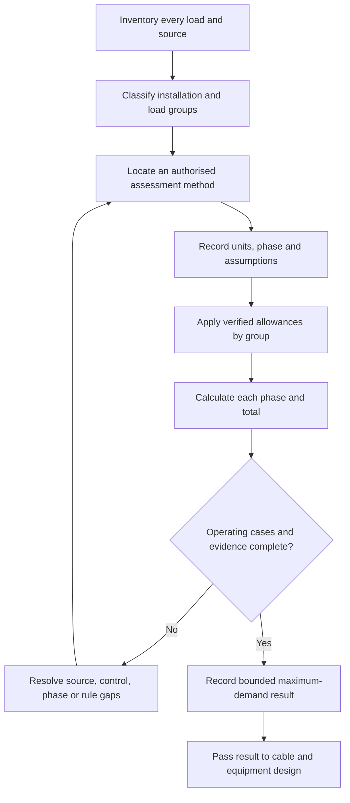
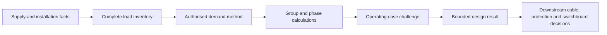
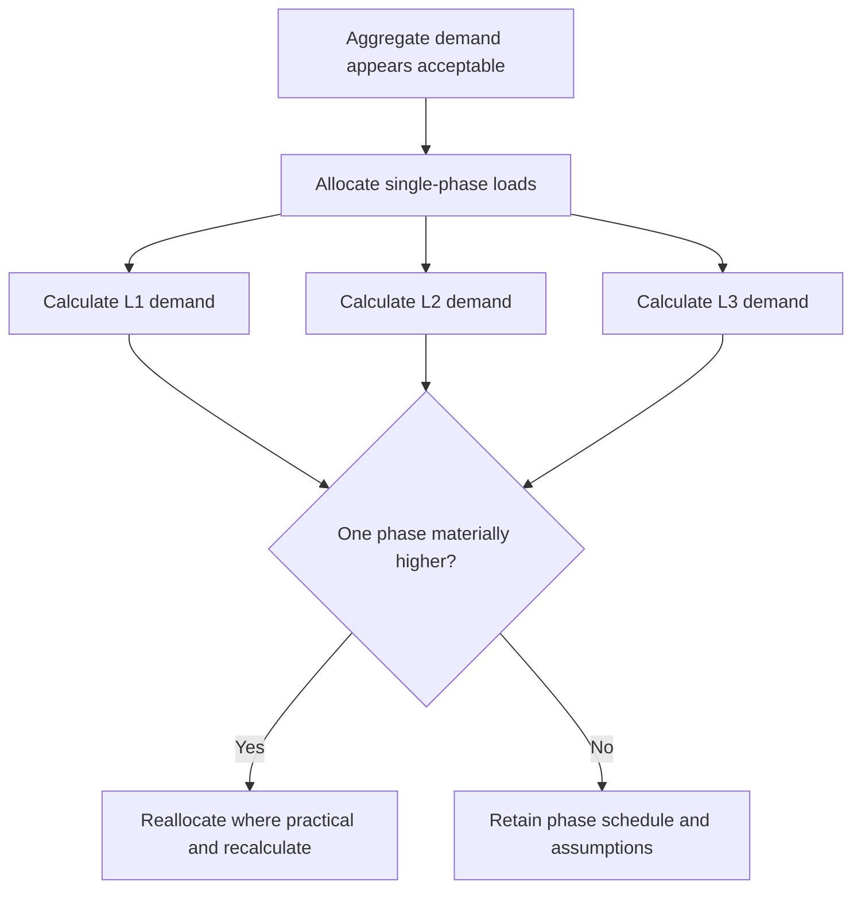

# Day 8 — Maximum Demand

> **Source, design and safety notice:** This module teaches an original maximum-demand reasoning workflow. It does not reproduce standards tables, demand-factor datasets, clause wording, network rules or jurisdiction-specific calculation methods. Every allowance, factor, exception and final design conclusion must be checked against current authorised standards, applicable amendments, legislation, regulator and network requirements, manufacturer instructions, workplace procedures and RTO directions. The worked figures below are fictional training assumptions, not compliance values. This module is not `technically-reviewed`.

## Navigation

- **Previous:** [Day 7 — Week 1 Consolidation and Competency Check](./day-07-week-1-consolidation-and-competency-check.md)
- **Next scheduled block:** [Day 9 — Complete Cable-Selection Workflow](../MASTER_PLAN.md#week-2--circuit-design-cables-and-switchboards)

## 1. Outcome and entry check

### Learning objectives

By the end of this block, the learner should be able to:

1. explain maximum demand as a design estimate of the greatest load expected under the applicable assessment method, rather than the sum of every nameplate rating;
2. distinguish connected load, maximum demand, demand allowance, diversity, coincidence and spare capacity;
3. build a complete load inventory with units, phase allocation, operating mode and source assumptions recorded;
4. choose an authorised maximum-demand method appropriate to the installation and identify when another source family may govern;
5. convert between current, real power and apparent power only when the required voltage, phase and power-factor assumptions are known;
6. apply a documented training-only demand method to an original scenario without presenting the factors as standards data;
7. test the result against phase balance, unusual operating combinations, alternate supplies and future-load assumptions;
8. state a bounded design conclusion that separates calculated evidence from unresolved requirements.

### Entry check — six minutes, closed note

Write a brief answer for each prompt:

1. Why is adding every connected load normally not the same as assessing maximum demand?
2. What information is missing when a load is listed only as “12 kW”?
3. What is the difference between a diversified estimate and an arbitrary discount?
4. Why can a total three-phase demand hide an overloaded phase?
5. What source information must be clarified when batteries, inverters, generators or controlled loads are present?
6. Which parts of a maximum-demand answer must return to an authorised source?

Record confidence beside each answer. Do not correct it until after Beat 5.

## 2. Why it matters

Maximum demand sits near the start of the design chain. It can influence the supply arrangement, consumer mains, submains, main switch selection, protective-device coordination, switchboard capacity, phase allocation and later voltage-drop work.

An estimate that is too low can create overheating, nuisance operation, unacceptable performance or inadequate capacity. An estimate that is unnecessarily high can drive larger equipment, higher cost and poor use of available capacity. The design task is therefore not “make the number small” or “add everything”; it is to apply the permitted method to a complete, realistic load model and preserve the evidence.

Maximum demand is also a boundary problem. The calculation cannot be defended until the installation type, supply characteristics, load categories, operating combinations, phase arrangement, source topology and governing method have been identified.


## 3. Core concepts and terminology

### Connected load

**Connected load** is the combined rating of equipment or load points connected, or intended to be connected, within the defined scope. It is an inventory quantity. It does not by itself establish the greatest expected simultaneous demand.

### Maximum demand

**Maximum demand** is the greatest demand assessed for the installation or part of the installation using an applicable, authorised method and stated assumptions. It is a design input, not a permanent measurement of what every future operating condition will be.

### Demand allowance

A **demand allowance** is the contribution assigned to a load or load group under the selected method. It may depend on load type, quantity, rating, control arrangement, installation type or other conditions. Exact allowances remain `reference_check_required`.

### Diversity and coincidence

**Diversity** describes the reduction that may occur because individual maximum loads do not necessarily occur at the same time.

**Coincidence** describes the extent to which loads operate together. Diversity must be justified by the authorised method or defensible operating evidence; it is not permission to apply an unsupported percentage.

### Continuous, intermittent and controlled operation

- **Continuous operation** means a load may operate for an extended period relevant to the design.
- **Intermittent operation** means operation occurs in cycles or limited periods.
- **Controlled operation** means an interlock, energy-management system, timer, demand controller or other arrangement limits simultaneous operation.

A control assumption counts only when the arrangement is reliable, documented and permitted to support the design conclusion.

### Existing measured demand

Measured data may inform some design methods, but its usefulness depends on representativeness, measurement period, seasonal conditions, occupancy, future loads, data quality and the applicable rule. A convenient historical peak is not automatically an authorised maximum-demand result.

### Spare or future capacity

**Spare capacity** is a deliberate design allowance beyond the assessed present demand. It must not be hidden inside an unexplained factor. Record present assessed demand and additional design margin separately.

### Phase balance

**Phase balance** is the distribution of single-phase loads across a multiphase supply. A reasonable total demand can still produce an unacceptable demand on one phase if large loads are unevenly allocated.

### Real and apparent power

- **Real power** is commonly expressed in watts or kilowatts.
- **Apparent power** is commonly expressed in volt-amperes or kilovolt-amperes.
- **Power factor** relates real power to apparent power for relevant AC loads.

Do not convert a power rating to current until the rating basis, voltage, phase arrangement and any relevant power-factor or efficiency assumptions are known.

## 4. Rule-finding workflow

Use the **I-M-A-G-E** workflow:

1. **Inventory the scope.** List every load, rating basis, quantity, phase, supply source and relevant operating characteristic. Separate existing, proposed and future loads.
2. **Match the governing method.** Identify the installation type and locate the permitted assessment path in current authorised material. Check definitions, table notes, exceptions and cross-references rather than lifting one factor in isolation.
3. **Apply units and assumptions.** Convert ratings consistently, state voltage and phase assumptions, and document every demand allowance. Never mix amperes, kilowatts and kilovolt-amperes without an explicit conversion basis.
4. **Group and calculate.** Calculate each load group, then each phase or supply section as required. Keep connected load, assessed demand and spare capacity as separate columns.
5. **Evaluate the result.** Check phase balance, realistic simultaneous operation, controlled-load dependencies, alternate supplies, unusual loads, existing capacity and evidence gaps before using the result downstream.



### Source-navigation checklist

Before accepting a demand factor or method, record:

- source title, edition and amendment status;
- installation category and scope;
- load category and rating basis;
- table heading, notes, definitions and relevant cross-references;
- conditions or exceptions that change the method;
- treatment of multiple supplies, generation, storage or controlled loads;
- network-service or jurisdiction-specific requirements;
- manufacturer data used for unusual equipment;
- who checked the result and when.

A copied number without its category, units, notes and conditions is not traceable evidence.

## 5. Visual model or worked example

### Evidence stack



Each layer depends on the previous layer. A neat calculation cannot repair an incomplete inventory or an inapplicable method.

### Worked training example — fictional allowances

**Scenario:** A small three-phase training workshop has the following proposed loads:

| Load group | Connected rating | Phase arrangement | Training-only demand assumption |
|---|---:|---|---|
| General lighting | 4.8 kW | single-phase loads distributed across three phases | 100% |
| General socket-outlets | 18 kW equivalent inventory | distributed across three phases | 40% |
| Fixed heater | 6 kW | three-phase | 100% |
| Air compressor | 7.5 kW input | three-phase motor | 100% |
| Two small process machines | 10 kW combined input | one on L1, one on L2 | 60% combined |
| Future allowance | 3 kW | not yet allocated | add separately after assessed present demand |

These percentages are invented solely to demonstrate the workflow. They must not be used for real design.

#### Step 1 — calculate group contributions

- Lighting: `4.8 × 1.00 = 4.8 kW`
- Socket-outlets: `18 × 0.40 = 7.2 kW`
- Heater: `6 × 1.00 = 6.0 kW`
- Compressor: `7.5 × 1.00 = 7.5 kW`
- Process machines: `10 × 0.60 = 6.0 kW`

Assessed present training demand:

`4.8 + 7.2 + 6.0 + 7.5 + 6.0 = 31.5 kW`

Recorded future allowance:

`3.0 kW`

Training design total before any current conversion:

`31.5 + 3.0 = 34.5 kW`

#### Step 2 — challenge the result

The arithmetic alone is incomplete. Before converting the result to a design current, the learner must clarify:

1. whether each rating is input power, output power, apparent power or current;
2. the nominal voltage and supply arrangement;
3. the applicable power-factor and efficiency data;
4. whether the fictional allowances resemble any authorised method—they must not be assumed to;
5. whether the heater and compressor can operate together;
6. whether the process machines create phase imbalance;
7. whether the future load should be allocated to a specific phase;
8. whether starting, cyclic or harmonic characteristics affect another design check;
9. whether any inverter, generator, battery or energy-management system changes the source or operating cases;
10. whether network or service rules impose another assessment path.

#### Step 3 — phase review

Create a second table assigning each single-phase contribution to L1, L2 or L3. Add the balanced three-phase loads to every phase according to the verified calculation basis. Compare phase demands rather than relying only on the aggregate total.



The defensible output is not merely “34.5 kW”. It is a traceable workbook containing the inventory, source method, assumptions, group calculations, phase schedule, unresolved checks and design margin.

## 6. Practical application

### Original scenario — mixed-use training tenancy

A proposed tenancy contains:

- general lighting;
- general socket-outlets;
- a commercial kitchen area;
- two split-system air conditioners;
- a small water heater;
- one three-phase appliance;
- an EV charging point controlled by an energy-management system;
- rooftop solar and a battery inverter;
- two spare ways marked for future use.

No demand factors, phase schedule, control specification or supply capacity are supplied.

Complete the following paper-based task:

#### Part A — inventory

Create one row per load and record:

- description and quantity;
- rating and rating basis;
- single-phase or three-phase connection;
- proposed phase;
- continuous, intermittent or controlled operation;
- normal source and any alternate source;
- manufacturer information still required;
- present or future status.

#### Part B — source plan

Without inventing clauses, list the authorised sources required to determine:

1. the applicable maximum-demand method;
2. treatment of each load category;
3. any conditions attached to energy management;
4. the effect of generation and storage on the installation model;
5. network or service limitations;
6. the evidence required for the existing or proposed supply capacity.

#### Part C — calculation framework

Build a blank calculation table with these columns:

| Load group | Connected load | Verified method reference | Demand allowance | Assessed demand | Phase allocation | Evidence or flag |
|---|---:|---|---:|---:|---|---|

Do not insert a demand factor until it is verified. Use `reference_check_required` in the allowance column where the source remains unresolved.

#### Part D — operating-case challenge

Write at least four operating cases, including:

- a normal high-demand period;
- EV charging while major tenancy loads operate;
- battery or inverter mode relevant to the installation;
- failure or bypass of the assumed demand-control arrangement.

For each case, state whether it changes the maximum-demand calculation, another design check, or both. Do not assume the answer without the authorised method and system details.

#### Part E — bounded conclusion

Use this structure:

```text
The connected-load inventory currently totals:
The applicable maximum-demand method is:
The assessed demand is:
The highest phase demand is:
The separate future allowance is:
The result can support the next design step only if:
The unresolved evidence is:
Stop or escalate when:
```

## 7. Common errors and safety checkpoint

### Common errors

- adding every nameplate rating and calling the result maximum demand without checking the permitted method;
- applying one remembered percentage to the whole installation;
- copying a factor without its heading, units, notes, conditions or installation category;
- omitting small loads, controlled loads, future loads or alternate-source equipment from the inventory;
- treating connected load, maximum demand and spare capacity as interchangeable;
- mixing kilowatts, kilovolt-amperes and amperes without a stated conversion basis;
- assuming a motor output rating is the same as electrical input demand;
- using a three-phase total without checking each phase;
- counting solar generation as guaranteed reduction in demand without verifying the applicable method and operating case;
- assuming an energy-management system always limits demand without evidence of its design, settings, failure mode and acceptance;
- relying on a short measurement period that does not represent the proposed installation;
- rounding early or hiding an unexplained contingency inside a demand factor;
- carrying an unverified result directly into cable, protection or switchboard selection.

### Safety checkpoint

This is a paper-based design exercise. It does not authorise access to switchboards, live measurement, alteration, energisation or verification work.

Stop and obtain qualified guidance when:

- the installation scope or supply arrangement is uncertain;
- existing equipment may be energised or access would expose electrical hazards;
- load ratings, source topology, phase allocation or control behaviour cannot be established safely from approved records;
- the calculation depends on an unverified demand table, factor, exception or network requirement;
- measured data would require work outside approved procedures, competence or test-equipment requirements;
- generation, storage, alternate supply or embedded control creates an operating case that has not been assessed;
- the result is being used to declare an installation safe, compliant or adequate without completed downstream design and verification.

Maximum demand is one design input. It does not by itself prove conductor capacity, voltage drop, fault protection, switchboard suitability, supply adequacy or compliance.


## 8. Retrieval and next links

### Final retrieval — closed note

1. Define connected load and maximum demand without using the words interchangeably.
2. Why is diversity not an arbitrary discount?
3. State the five steps in the I-M-A-G-E workflow.
4. What information is required before converting kilowatts to current?
5. Why must maximum demand be reviewed by phase?
6. How should spare capacity be recorded?
7. When can measured demand be misleading?
8. Why can controlled EV charging require a failure-case review?
9. Why should solar generation not automatically be subtracted from demand?
10. What evidence must accompany a copied demand factor?
11. Name three downstream decisions influenced by maximum demand.
12. Which conclusions remain unsafe after maximum demand has been calculated?
13. What must be clarified for batteries, generators or inverters?
14. Write one bounded maximum-demand conclusion.

### Error-log closeout

For the most important error, record:

```text
Original answer:
Confidence before checking:
Missing fact, unit or source condition:
Corrected reasoning:
Authorised source location to verify:
Fresh scenario:
Result on fresh scenario:
Next review date:
```

Clear the error only after successful retrieval and application with a different load schedule.

### Related vault notes

- [[Day 07 - Week 1 Consolidation and Competency Check]]
- [[Day 08 - Maximum Demand]]
- [[Day 09 - Complete Cable-Selection Workflow]]
- [[Four-Week Capstone Learning Plan]]
- [[Wiring Rules and Design]]
- [[Control Switching and Protection]]
- [[Alternative Supplies and Generation]]
- [[Learning and Memory System]]
- [[AS-NZS-3000-2018-Index]]

### Previous block

Return to [Day 7 — Week 1 Consolidation and Competency Check](./day-07-week-1-consolidation-and-competency-check.md) when the Week 1 evidence chain or readiness gate is not yet defensible.

### Next block

Proceed to [Day 9 — Complete Cable-Selection Workflow](../MASTER_PLAN.md#week-2--circuit-design-cables-and-switchboards) after the learner can produce a traceable load inventory, source plan, group calculation and phase review without inventing demand factors.

### References and currency notice

- AS/NZS 3000:2018 — current authorised copy and applicable amendments required; exact maximum-demand methods, load categories, tables, factors, exceptions, calculation requirements and supply arrangements remain `reference_check_required`.
- Current applicable legislation, regulator guidance, network service rules, manufacturer instructions, workplace procedures and RTO assessment directions.
- [Learning Design](../../../LEARNING_DESIGN.md)
- [Content, Standards and Copyright Policy](../../../CONTENT_AND_COPYRIGHT.md)
- Day 7 and the relevant design, protection and supply notes.

This module contains original organisation, diagrams, fictional values, scenario facts and assessment prompts. It does not reproduce standards wording, demand tables, figures or official datasets. A suitably qualified reviewer must verify the technical interpretation against current authorised sources before the status can move beyond `review-required`.
