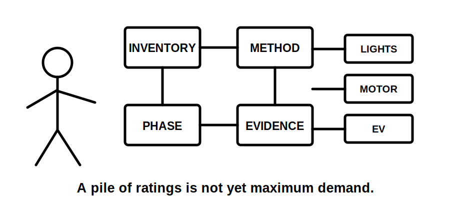
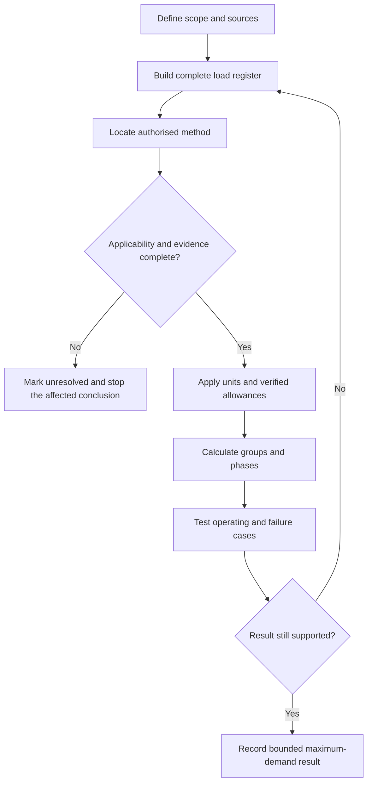
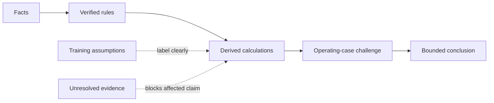
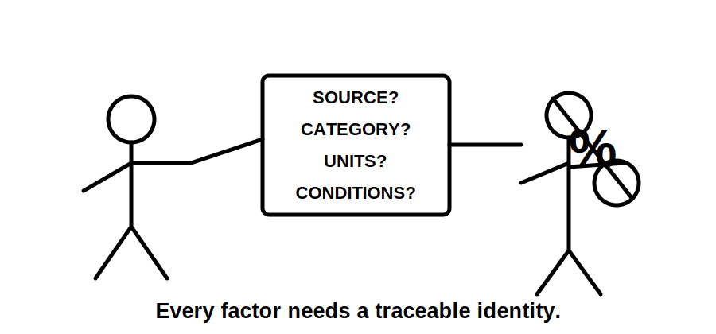

# Day 8 — Maximum Demand

> **Source, design and safety notice:** This module teaches an original evidence-led maximum-demand workflow. It does not reproduce standards tables, demand-factor datasets, clause wording, network rules or jurisdiction-specific calculation methods. Every allowance, factor, exception and final design conclusion must be checked against current authorised sources. Fictional values below demonstrate reasoning only. This module is not `technically-reviewed` and grants no practical authority.

## Navigation

- **Previous:** [Day 7 — Week 1 Consolidation and Competency Check](./day-07-week-1-consolidation-and-competency-check.md)
- **Next:** [Day 9 — Complete Cable-Selection Workflow](./day-09-complete-cable-selection-workflow.md)

## 1. Outcome and entry check

### Observable learning objectives

By the end of this block, the learner can:

1. distinguish connected load, assessed maximum demand, demand allowance, diversity, coincidence and spare capacity;
2. build a load register that records quantity, rating basis, units, phase, source, operating mode and evidence gaps;
3. select an authorised method only after confirming installation scope, load category and source applicability;
4. classify every input as **fact**, **verified rule**, **derived value**, **training assumption** or **unresolved evidence**;
5. perform unit conversions only when voltage, phase arrangement, rating basis, power factor and efficiency assumptions are known;
6. calculate a fictional group contribution and preserve the calculation trail;
7. test an aggregate result against phase allocation, credible operating combinations, controls, alternate supplies and future loads;
8. write a bounded conclusion that states what the result supports, what it does not prove and what must be checked next.

### Entry check — six minutes, closed note

Answer briefly and mark confidence as guessing, unsure, reasonably confident or certain:

1. Why is connected load not automatically maximum demand?
2. What information is missing from the statement “the load is 12 kW”?
3. What makes diversity defensible rather than arbitrary?
4. Why can an acceptable three-phase total still conceal a design problem?
5. What evidence is required before relying on a demand-control system?
6. Which parts of a maximum-demand result remain `reference_check_required`?

Do not correct answers until Beat 5. High-confidence errors must enter the error log.

## 2. Why it matters

Maximum demand is an early design input. It can influence supply capacity, consumer mains, submains, protective-device selection, switchboard capacity, phase allocation and later voltage-drop work.

Underestimation can contribute to overheating, nuisance operation, inadequate capacity or poor performance. Unnecessary overestimation can drive avoidable equipment size and cost. The aim is neither “add everything” nor “make the number smaller”; it is to create a complete load model, apply an authorised method and preserve the evidence chain.

A maximum-demand result is only as defensible as its weakest upstream input. Neat arithmetic cannot repair an incomplete load register, an inapplicable factor or an unsupported control assumption.

## 3. Core concepts and terminology

### Connected load

The combined rating of equipment or load points within the defined scope. It is an inventory quantity, not proof of simultaneous demand.

### Maximum demand

The greatest demand assessed for an installation or section using an applicable authorised method and stated assumptions. It is a design estimate, not a guarantee of every future operating condition.

### Demand allowance

The contribution assigned to a load or load group by the selected method. Exact allowances, factors and exceptions remain `reference_check_required`.

### Diversity and coincidence

**Diversity** recognises that individual maximum loads may not occur together. **Coincidence** describes how much they overlap in time. Neither term permits an unsupported percentage reduction.

### Continuous, intermittent and controlled operation

- **Continuous:** may operate for an extended design-relevant period.
- **Intermittent:** operates in cycles or limited periods.
- **Controlled:** simultaneous operation is limited by an interlock, controller, timer or energy-management function.

A control assumption is usable only when its function, settings, reliability, failure behaviour and acceptance are evidenced.

### Real power, apparent power and rating basis

**Real power** is commonly expressed in watts or kilowatts. **Apparent power** is commonly expressed in volt-amperes or kilovolt-amperes. **Power factor** relates real and apparent power for relevant AC loads. A motor output rating is not automatically electrical input demand.

### Spare capacity

A deliberate design margin beyond assessed present demand. Record it separately rather than hiding it inside a factor.

### Phase balance

The distribution of single-phase loads across a multiphase supply. Aggregate demand can appear acceptable while one phase carries a materially higher demand.

### Evidence grades

- **Described:** supplied by the scenario but not independently confirmed.
- **Supported:** backed by traceable records or an identified authorised source.
- **Verified:** checked by a competent person through the required process.

Do not upgrade a claim merely because the calculation is internally consistent.

## 4. Rule-finding workflow

Use the **D-E-M-A-N-D** workflow:

1. **Define the boundary.** State the installation or section, normal and alternate sources, existing/proposed/future scope and supply arrangement.
2. **Enumerate every load.** Record quantity, rating, rating basis, units, phase, operating mode, source and evidence status.
3. **Match the method.** Locate the authorised method for the installation and load category; inspect definitions, notes, exceptions and cross-references.
4. **Apply units and allowances.** Convert only from known inputs. Keep connected load, assessed contribution and spare capacity separate.
5. **Navigate operating cases.** Test phase allocation, credible simultaneous operation, control failure, alternate-source modes and unusual loads.
6. **Document the bounded result.** Record calculations, source references, unresolved evidence, downstream dependencies and stop conditions.

The loop matters: a changed operating case may require the inventory, method or assumptions to be reopened rather than merely adjusting the final number.

### Source-navigation record

For each allowance or method, capture:

- source title, edition and amendment status;
- installation and load category;
- units, headings, definitions, notes and exceptions;
- alternate-supply, generation, storage or control conditions;
- network, regulator or jurisdiction-specific requirements;
- who checked it and when.

A copied number without its conditions is not traceable evidence.

## 5. Visual model or worked example

### Evidence ledger

Facts and verified rules may support a derived value. Training assumptions must remain labelled. Unresolved evidence blocks the affected conclusion rather than being silently guessed.

### Worked example — fictional training allowances

A fictional three-phase workshop has these load groups:

| Load group | Connected rating | Arrangement | Fictional contribution |
|---|---:|---|---:|
| Lighting | 4.8 kW | single-phase, distributed | 4.8 kW |
| Socket-outlet inventory | 18 kW | single-phase, distributed | 7.2 kW |
| Heater | 6 kW | three-phase | 6.0 kW |
| Compressor input | 7.5 kW | three-phase | 7.5 kW |
| Process machines | 10 kW | two single-phase machines | 6.0 kW |

Present fictional assessed demand: `4.8 + 7.2 + 6.0 + 7.5 + 6.0 = 31.5 kW`.

A separate fictional future allowance of `3.0 kW` produces a training design total of `34.5 kW` before any current conversion.

These values are invented. They are not standards data and must not be used for real design.

Before using the total, the learner must resolve:

- whether ratings are input power, output power, apparent power or current;
- voltage, phase arrangement, power factor and efficiency where relevant;
- actual authorised demand method;
- phase allocation of single-phase loads;
- whether controls limit simultaneous operation and what happens if they fail;
- whether generation, storage or alternate supplies change operating cases;
- whether network or service rules impose another method.

### Worked-example fading

Recalculate the scenario after these changes, without copying the completed steps:

- one process machine moves from L2 to L3;
- the EV load is added but its demand-control specification is missing;
- the future allowance becomes phase-specific;
- the compressor rating is discovered to be shaft output rather than electrical input.

For each change, identify which register fields, assumptions, calculations and conclusions must reopen.

## 6. Practical application

### Mixed-use tenancy task

A proposed tenancy includes lighting, socket-outlets, commercial-kitchen equipment, two air conditioners, a water heater, one three-phase appliance, controlled EV charging, rooftop solar, battery storage and two future spare ways. Demand factors, phase schedule, control specification and supply capacity are absent.

Complete these paper-based outputs:

1. **Load register:** one row per load with quantity, rating basis, units, phase, operating mode, source, present/future status and evidence grade.
2. **Source plan:** list the authorised sources required for the installation category, each load category, control arrangement, generation/storage treatment and network conditions.
3. **Calculation frame:** use columns for connected load, verified method reference, allowance, assessed demand, phase and evidence flag. Enter `reference_check_required` where unresolved.
4. **Operating cases:** test normal high demand, EV charging with major loads, alternate-source operation and demand-control failure or bypass.
5. **Bounded conclusion:** state current result, highest phase, separate future allowance, unresolved evidence, downstream uses and stop conditions.

### Assessment rubric — 12 points

Score 0, 1 or 2 in each category:

| Category | 0 | 1 | 2 |
|---|---|---|---|
| Scope and sources | unclear | partial | complete and bounded |
| Load register | material omissions | mostly complete | complete and traceable |
| Method selection | guessed | source named | applicability evidenced |
| Units and calculations | unsafe/inconsistent | minor errors | correct and auditable |
| Operating cases | ignored | limited | phase, control and source cases tested |
| Conclusion | overclaims | partly bounded | limits and next checks explicit |

A score does not override a critical error. Unsupported demand factors, unsafe unit conversion, omitted major loads or an unbounded compliance claim require correction and a fresh scenario.

## 7. Common errors and safety checkpoint

### Common errors

- treating connected load and maximum demand as synonyms;
- applying a remembered percentage to the whole installation;
- copying a factor without headings, units, notes or conditions;
- omitting controlled, future or alternate-source loads;
- mixing kW, kVA and A without a conversion basis;
- treating motor output as electrical input;
- relying on an aggregate total without checking phases;
- subtracting solar generation as guaranteed demand reduction;
- assuming a controller always works without failure-case evidence;
- hiding spare capacity inside an unexplained factor;
- carrying an unresolved result directly into cable or switchboard selection.

### Safety checkpoint

This is a paper-based design exercise. It does not authorise switchboard access, live measurement, isolation, testing, alteration, energisation, commissioning, certification or verification.

Stop and obtain qualified guidance when:

- scope, supply arrangement or source topology is uncertain;
- information cannot be obtained safely from approved records;
- a factor, exception, network rule or control assumption is unverified;
- measured data would require work outside approved competence or procedure;
- generation, storage or alternate supply introduces an unassessed mode;
- the result is being used to declare an installation safe, compliant or adequate.

Maximum demand does not by itself prove conductor capacity, voltage drop, fault protection, switchboard suitability, supply adequacy or compliance.

## 8. Retrieval and next links

### Closed-note retrieval

1. Define connected load and maximum demand.
2. State the six D-E-M-A-N-D steps.
3. Explain why diversity is not an arbitrary discount.
4. List the inputs required before converting power to current.
5. Explain why phase review is required.
6. State how spare capacity should be recorded.
7. Give two reasons measured demand may be unrepresentative.
8. Explain why control failure must be considered.
9. Explain why solar generation cannot automatically be subtracted.
10. Write one bounded maximum-demand conclusion.

### Varied re-attempt

Use a new fictional scenario containing a single-phase heat pump, a three-phase machine, battery storage and a controlled EV charger. Build the register and evidence ledger from a blank page. Do not reuse the workshop totals or allowances.

### Error-log closeout

Record the original answer, confidence, misconception, missing evidence, corrected reasoning, source location, fresh scenario result and next review date. Clear an error only after correct retrieval and application in a changed context.

### Related vault notes

- [[Day 07 - Week 1 Consolidation and Competency Check]]
- [[Day 08 - Maximum Demand]]
- [[Day 09 - Complete Cable-Selection Workflow]]
- [[Four-Week Capstone Learning Plan]]
- [[Wiring Rules and Design]]
- [[Alternative Supplies and Generation]]
- [[Learning and Memory System]]

### References and currency notice

- AS/NZS 3000:2018 — current authorised copy and applicable amendments required; exact methods, categories, allowances, tables, exceptions and supply arrangements remain `reference_check_required`.
- Current legislation, regulator guidance, network service rules, manufacturer instructions, workplace procedures and RTO directions.
- [Learning Design](../../../LEARNING_DESIGN.md)
- [Content, Standards and Copyright Policy](../../../CONTENT_AND_COPYRIGHT.md)

This module contains original organisation, diagrams, fictional values, scenarios and assessment prompts. It does not reproduce standards wording, demand tables, figures or official datasets. A suitably qualified reviewer must verify the technical interpretation before the status can move beyond `review-required`.

<!-- sequence-navigation:start -->
### Sequence navigation

- [← Previous: Day 7 — Week 1 Consolidation and Competency Check](./day-07-week-1-consolidation-and-competency-check.md)
- [Four-week learning plan](../MASTER_PLAN.md)
- [Next: Day 9 — Complete Cable-Selection Workflow →](./day-09-complete-cable-selection-workflow.md)
<!-- sequence-navigation:end -->