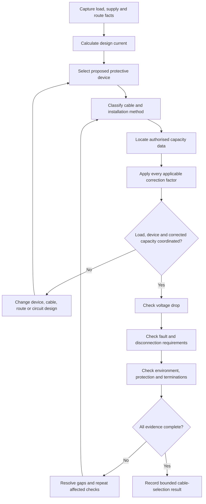
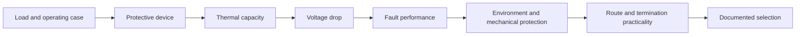

# Day 9 — Complete Cable-Selection Workflow

> **Source, design and safety notice:** This module teaches an original cable-selection reasoning workflow. It does not reproduce standards tables, current-carrying-capacity datasets, correction-factor tables, voltage-drop tables, clause wording or manufacturer data. Every conductor size, installation method, protective-device relationship, temperature limit, grouping factor, voltage-drop limit, fault condition and final design conclusion must be checked against current authorised standards, applicable amendments, legislation, regulator and network requirements, manufacturer instructions, workplace procedures and RTO directions. All numerical values below are fictional teaching inputs. This module is not `technically-reviewed`.

## Navigation

- **Previous:** [Day 8 — Maximum Demand](./day-08-maximum-demand.md)
- **Next scheduled block:** [Day 10 — Installation Conditions and Derating](../MASTER_PLAN.md#week-2--circuit-design-cables-and-switchboards)

## 1. Outcome and entry check

### Learning objectives

By the end of this block, the learner should be able to:

1. explain why cable selection is a coordinated design process rather than a single table lookup;
2. distinguish design current, protective-device rating or setting, tabulated current-carrying capacity and corrected current-carrying capacity;
3. identify the complete circuit facts required before selecting a wiring system and conductor;
4. locate the authorised source path for installation method, conductor construction, current-carrying capacity and correction factors;
5. test the fundamental coordination relationship between load, protective device and conductor without treating it as the only design check;
6. screen the selected cable for voltage drop, fault protection, thermal effects, mechanical protection, environmental suitability and termination constraints;
7. document assumptions, unresolved evidence and iteration decisions in a traceable cable schedule;
8. state a bounded conclusion that does not claim compliance before every required check is complete.

### Entry check — seven minutes, closed note

Answer each prompt in one or two sentences:

1. Why can two circuits with the same design current require different cable sizes?
2. What is the difference between a cable's tabulated capacity and its capacity after applicable correction factors?
3. Why is selecting a protective device before understanding the load and cable route risky?
4. What information about a cable route can change the applicable installation method?
5. Why does passing a current-carrying-capacity check not prove acceptable voltage drop?
6. What fault-related evidence may still be required after overload coordination appears satisfactory?
7. Which parts of a cable-selection answer must be verified in authorised sources?

Record confidence beside each answer. Revisit the high-confidence errors first.

## 2. Why it matters

A conductor that appears adequate by nominal size can still be unsuitable because of installation method, ambient temperature, thermal insulation, grouping, conductor material, insulation temperature rating, termination limits, voltage drop, fault energy, mechanical exposure, harmonics, neutral loading or source characteristics.

The opposite error also matters. Selecting an unnecessarily large cable without understanding the governing constraint can create avoidable cost, difficult terminations, larger containment, poor maintainability and no improvement to the actual limiting condition.

A defensible design therefore preserves the whole evidence chain:

**load model → design current → protective device → wiring system and route → corrected capacity → voltage drop → fault and disconnection checks → installation and termination suitability → documented conclusion**


## 3. Core concepts and terminology

### Design current

**Design current** is the current the circuit is intended to carry under the applicable load assessment and operating case. It must be derived from a traceable load model with voltage, phase, power factor, efficiency, duty and control assumptions stated where relevant.

### Protective-device rating or setting

The **protective-device rating or setting** is the relevant current characteristic assigned to the circuit protection. The device type, curve, adjustable settings, ambient conditions, breaking capacity and manufacturer instructions may matter. A nominal number alone is not a complete protective-device specification.

### Tabulated current-carrying capacity

**Tabulated current-carrying capacity** is a value obtained from the applicable authorised source for a defined cable construction, conductor material, insulation type, installation method, number of loaded conductors and reference conditions.

It is not automatically the allowable capacity for the actual installation.

### Correction factors and corrected capacity

**Correction factors** adjust the tabulated value for installation conditions that differ from the reference conditions. Depending on the circuit, relevant factors may include ambient temperature, grouping, thermal insulation, enclosure conditions, soil or burial conditions and other source-defined influences.

The **corrected current-carrying capacity** is the capacity after every applicable factor has been applied using the authorised method. Exact factors and combination rules remain `reference_check_required`.

### Installation method

The **installation method** describes how and where the cable is installed in a way that determines heat dissipation and the applicable source data. Examples may involve unenclosed wiring, conduit, trunking, cable tray, thermal insulation, underground routes or combinations of methods.

A route containing several methods is normally governed by the most limiting relevant section unless an authorised alternative analysis applies.

### Loaded conductors and neutral effects

The number of **loaded conductors** affects heat generation and source selection. Neutral current cannot be assumed negligible. Unbalanced loads, nonlinear equipment, harmonics and shared-neutral arrangements may require specific treatment.

### Voltage drop

**Voltage drop** is the reduction in voltage along a circuit caused by conductor impedance and load current. It is a separate design check. A thermally adequate conductor may still produce unacceptable equipment performance or exceed an applicable installation limit.

### Fault protection and thermal withstand

A selected conductor must also be compatible with the protective arrangement under fault conditions. This may require checking fault-current path, automatic disconnection conditions, protective-device operating behaviour, conductor thermal withstand and the prospective fault current at relevant points.

### Mechanical and environmental suitability

Cable selection includes more than conductor cross-sectional area. The wiring system must suit exposure to impact, moisture, heat, chemicals, sunlight, vermin, vibration, movement, fire conditions and the installation environment identified by the design.

### Termination constraints

The selected cable must be compatible with equipment terminals, conductor material, lug or gland requirements, bending radius, enclosure space and manufacturer limits. A larger conductor is not useful if it cannot be safely terminated in the selected equipment.

## 4. Rule-finding workflow

Use the **C-A-B-L-E** workflow:

1. **Capture the circuit.** Define load, supply, phases, duty, source, route, environment, length, control arrangement, future allowance and fault context.
2. **Assign current and protection.** Calculate the design current and identify a proposed protective device whose type, rating or setting and characteristics are suitable for the load and source.
3. **Build the installation model.** Select the wiring-system family, cable construction, conductor material, insulation, number of loaded conductors and every route segment or adverse condition.
4. **Locate and correct capacity.** Use current authorised sources to find the applicable tabulated capacity and correction factors, then determine the corrected capacity with the calculation fully recorded.
5. **Evaluate every remaining constraint.** Check coordination, voltage drop, fault protection, thermal withstand, mechanical and environmental suitability, terminals, future conditions and evidence gaps. Iterate when any check fails.



### Circuit fact sheet

Before opening a cable table, record:

- circuit purpose and load type;
- maximum-demand or equipment-current basis;
- nominal voltage and phase arrangement;
- power factor, efficiency, starting or cyclic characteristics where relevant;
- normal and alternate supply cases;
- proposed protective-device type and setting basis;
- route length and each installation segment;
- cable construction, conductor material and insulation family;
- number of loaded conductors and neutral assumptions;
- ambient temperature and local heat sources;
- grouping with other circuits;
- thermal-insulation contact or enclosure details;
- underground, outdoor, wet, corrosive, hazardous or mechanically exposed conditions;
- equipment terminal and manufacturer constraints;
- future load or route changes;
- prospective fault-current and earthing information still required.

If these facts are missing, mark them as evidence gaps rather than inventing favourable assumptions.

### Coordination relationship

A common design relationship is expressed conceptually as:

```text
design current ≤ protective-device rating or setting ≤ corrected conductor capacity
```

This is a necessary coordination screen for many circuits, but it is not a complete cable-selection proof. Exact definitions, device conventions, exceptions and additional protective conditions remain `reference_check_required`.

## 5. Visual model or worked example

### Constraint stack



The final cable is governed by the strongest applicable constraint, not necessarily the first one calculated.

### Worked training example — fictional values

**Scenario:** A fictional three-phase workshop circuit supplies a fixed item of equipment. The training fact sheet states:

- calculated design current: `32 A`;
- proposed protective-device rating: `40 A`;
- cable route: part on tray, part in conduit through a warmer service space;
- fictional tabulated cable capacity for the selected construction and method: `52 A`;
- fictional combined correction-factor product: `0.78`;
- route length: `42 m`;
- fault and terminal data: not yet supplied.

These figures are invented for process practice and must not be used for real design.

#### Step 1 — calculate corrected capacity

```text
corrected capacity = tabulated capacity × combined correction factor
                   = 52 A × 0.78
                   = 40.56 A
```

#### Step 2 — apply the coordination screen

```text
32 A ≤ 40 A ≤ 40.56 A
```

The screen narrowly passes using the fictional inputs.

#### Step 3 — challenge the apparent pass

The selection is not complete because:

1. the installation method and factor combination have not been verified in authorised sources;
2. the margin between device rating and corrected capacity is very small;
3. the warm service-space segment may not be the only limiting section;
4. voltage drop has not been calculated;
5. starting current or cyclic duty may affect device selection or performance;
6. prospective fault current and disconnection evidence are absent;
7. conductor thermal withstand under fault conditions has not been checked;
8. equipment terminal capacity and conductor-size range are unknown;
9. future grouping or additional heat sources have not been considered;
10. an alternate supply could change fault conditions.

#### Step 4 — iterate deliberately

Possible design responses include:

- verify the route and correction factors;
- increase conductor size;
- reduce the protective-device rating if suitable for the load and starting characteristics;
- alter the route or separate grouped circuits;
- reduce the warm-section exposure;
- obtain manufacturer and fault data;
- recalculate voltage drop and fault performance.

The correct response cannot be chosen from the fictional arithmetic alone.


## 6. Practical application

### Original scenario — mixed-use tenancy submain

A proposed submain supplies a small tenancy containing lighting, socket-outlets, air conditioning, a water heater and controlled EV charging. Day 8 has produced a provisional maximum-demand result, but the following details remain incomplete:

- the route passes through a ceiling space, a section near thermal insulation and a shared service riser;
- several existing circuits occupy the riser;
- the submain length is known only approximately;
- the switchboard terminal range is not documented;
- solar and battery equipment may support some operating modes;
- prospective fault-current data at the origin and destination are absent;
- future tenancy equipment is uncertain.

Complete the following paper-based task.

### Part A — circuit definition

Create a fact sheet that separates:

- confirmed facts;
- provisional design assumptions;
- information requiring site inspection;
- information requiring manufacturer data;
- information requiring authorised standards or network sources.

### Part B — source-navigation plan

Without copying tables, identify the source path needed to determine:

1. the applicable cable and installation-method category;
2. the number of loaded conductors;
3. correction factors for every relevant route condition;
4. how factors are combined;
5. the coordination requirements for the protective device and conductor;
6. voltage-drop requirements and calculation data;
7. fault protection and thermal-withstand requirements;
8. environmental, mechanical and termination requirements;
9. treatment of alternate supplies and changed fault levels.

### Part C — candidate comparison

Prepare a comparison sheet for at least two candidate cable or route options. Include:

| Evidence field | Candidate A | Candidate B |
|---|---|---|
| Cable construction | | |
| Installation method | | |
| Tabulated capacity source | | |
| Applicable factors | | |
| Corrected capacity | | |
| Proposed protective device | | |
| Voltage-drop result | | |
| Fault-check status | | |
| Environmental suitability | | |
| Termination suitability | | |
| Unresolved evidence | | |
| Design consequence | | |

Do not fill source-derived values from memory. Mark them `reference_check_required` until checked.

### Part D — bounded conclusion

Write a conclusion in this form:

> Candidate ___ is provisionally preferred because ___. The load-to-device-to-conductor coordination is [established/not yet established] using ___. Voltage drop is [checked/pending]. Fault protection and thermal withstand are [checked/pending]. Route, environmental and termination constraints are [resolved/unresolved]. The design must not be released until ___ is verified against current authorised sources and manufacturer information.

## 7. Common errors and safety checkpoint

### Common errors

- Selecting cable size from load current alone.
- Treating nominal cable size as proof of capacity.
- Using a tabulated value without confirming cable type and installation method.
- Applying one correction factor while overlooking another route condition.
- Combining factors using an unverified method.
- Ignoring the most restrictive short section of a route.
- Assuming the neutral is never loaded.
- Treating a protective-device ampere rating as its complete characteristic.
- Passing thermal capacity and skipping voltage drop.
- Passing overload coordination and skipping fault protection.
- Assuming a larger cable automatically fits terminals and containment.
- Using solar generation to reduce conductor requirements without an authorised operating-case analysis.
- Reporting a cable as compliant while source or site facts remain missing.

### Safety checkpoint

Stop the design exercise and escalate when:

- the supply arrangement or source topology is unclear;
- the load current or duty cannot be established;
- the cable route cannot be inspected or reliably described;
- thermal insulation, grouping or environmental conditions are unknown;
- protective-device characteristics or settings are unavailable;
- fault-current, earthing or disconnection evidence is required but absent;
- manufacturer terminal or cable requirements are unavailable;
- an alternate source changes fault or isolation conditions;
- a proposed conclusion depends on remembered table values or guessed factors;
- the work would require unsafe access, live investigation or action beyond the learner's competence and authorisation.

This module is a paper-based design activity. It does not authorise live work, inspection inside energised equipment, testing, alteration or installation.

## 8. Retrieval and next links

### Closed-note retrieval

1. State the five stages of **C-A-B-L-E**.
2. Distinguish design current, protective-device rating, tabulated capacity and corrected capacity.
3. Write the conceptual coordination relationship and explain why it is incomplete by itself.
4. List six route or environmental facts that may change cable selection.
5. Explain why the most restrictive route segment matters.
6. Name four checks required after thermal coordination appears to pass.
7. Explain why neutral loading requires evidence rather than assumption.
8. State three reasons a larger conductor may still be unsuitable.
9. Describe what must be recorded in a bounded cable-selection conclusion.
10. Identify every source-derived claim in your answer that remains `reference_check_required`.

### Practice activity — fade the worked example

Complete three versions:

1. **Guided:** repeat the fictional worked example with all steps visible.
2. **Partially faded:** use new fictional values with only the C-A-B-L-E headings supplied.
3. **Independent:** construct a full candidate comparison for the mixed-use tenancy submain, leaving all unverified source data explicitly blank.

Add each error to the learning log under one of these labels:

- incomplete circuit facts;
- incorrect source path;
- current or unit error;
- installation-method error;
- correction-factor error;
- coordination error;
- omitted voltage-drop check;
- omitted fault check;
- unsafe or overconfident conclusion.

### Readiness for Day 10

Proceed when you can build the full workflow without jumping directly from design current to conductor size. Day 10 will isolate installation conditions and derating so the correction stage can be practised in greater depth.

### Related topics

- [Day 8 — Maximum Demand](./day-08-maximum-demand.md)
- [Day 10 — Installation Conditions and Derating](../MASTER_PLAN.md#week-2--circuit-design-cables-and-switchboards)
- [[Wiring Rules and Design]]
- [[Control Switching and Protection]]
- [[Safety and Electrical Risk]]

## References and currency notice

- AS/NZS 3000:2018, current authorised copy and applicable amendments required.
- AS/NZS 3008.1.1, current authorised edition and applicable amendments required.
- Current applicable legislation, regulator guidance, network service rules, manufacturer instructions, workplace procedures and RTO assessment directions.
- [Learning Design](../../../LEARNING_DESIGN.md)
- [Content, Standards and Copyright Policy](../../../CONTENT_AND_COPYRIGHT.md)

Exact cable-selection requirements, definitions, installation methods, current-carrying-capacity values, correction factors, factor-combination rules, protective-device characteristics, voltage-drop criteria, fault-loop and disconnection requirements, thermal-withstand methods, mechanical protection, environmental suitability, neutral treatment, alternate-supply treatment and jurisdiction-specific acceptance criteria remain `reference_check_required`. This module is not `technically-reviewed`.

<!-- sequence-navigation:start -->
### Sequence navigation

- [← Previous: Day 8 — Maximum Demand](./day-08-maximum-demand.md)
- [Four-week learning plan](../MASTER_PLAN.md)
- [Next: Day 10 — Installation Conditions and Derating →](./day-10-installation-conditions-and-derating.md)
<!-- sequence-navigation:end -->
