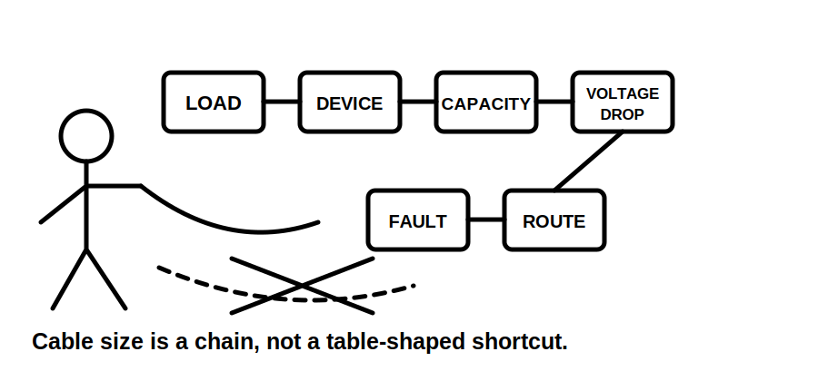
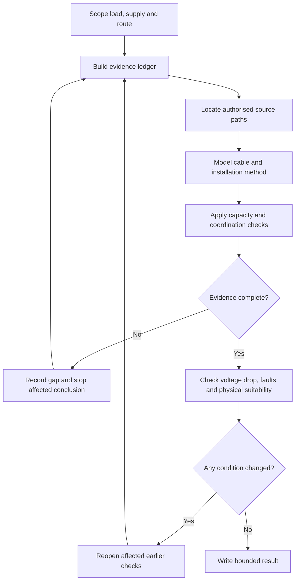
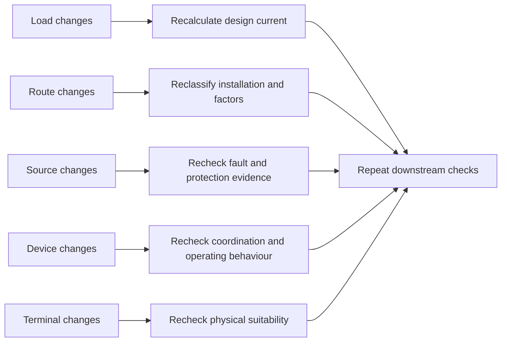
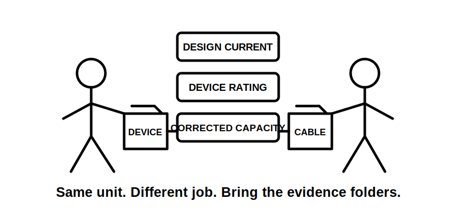

# Day 9 — Complete Cable-Selection Workflow

> **Source, design and safety notice:** This module teaches an original evidence-led cable-selection workflow. It does not reproduce standards tables, current-carrying-capacity datasets, correction-factor tables, voltage-drop tables, clause wording or manufacturer data. Every installation classification, conductor capacity, correction factor, protective-device characteristic, voltage-drop criterion, fault condition, termination limit and final design conclusion must be checked against current authorised sources. All numerical values are fictional teaching inputs. This module is not `technically-reviewed` and grants no authority to design, approve, install, alter, energise or certify electrical work.

## Navigation

- **Previous:** [Day 8 — Maximum Demand](./day-08-maximum-demand.md)
- **Next:** [Day 10 — Installation Conditions and Derating](./day-10-installation-conditions-and-derating.md)

## 1. Outcome and entry check

### Observable learning objectives

By the end of this block, the learner can:

1. build a circuit fact sheet that separates verified facts, derived values, assumptions and unresolved evidence;
2. distinguish design current, protective-device rating or setting, tabulated capacity and corrected capacity;
3. trace each source-dependent design input to an authorised reference path;
4. apply the conceptual load–device–conductor coordination screen without treating it as complete proof;
5. identify the governing route segment and explain why it controls the thermal model;
6. reopen affected checks when load, route, source, device or installation conditions change;
7. compare two candidate cable or route options using the same evidence fields;
8. write a bounded conclusion that states what is established, what remains unresolved and what must stop release.

### Entry check — seven minutes, closed note

Answer in one or two sentences:

1. Why can two circuits with the same design current require different cable selections?
2. What is the difference between tabulated and corrected current-carrying capacity?
3. Why is a protective-device ampere value not a complete device specification?
4. What route facts can change the installation classification?
5. Why does passing thermal coordination not establish acceptable voltage drop?
6. What fault-related evidence may still be required?
7. Which claims must remain `reference_check_required`?

Mark each response **confident**, **uncertain** or **guess**. Correct confident errors first.

## 2. Why it matters

Cable selection is a coordinated decision, not a size lookup. A conductor can appear thermally adequate and still be unsuitable because of voltage drop, fault performance, neutral loading, installation conditions, environmental exposure, mechanical risk, terminal limits or an alternate supply.

The opposite mistake also matters. Oversizing without identifying the governing constraint can increase cost, containment difficulty and termination risk without resolving the actual problem.

A defensible answer preserves this evidence chain:

**load model → design current → proposed protection → route and wiring system → corrected capacity → voltage drop → fault checks → physical suitability → bounded conclusion**



## 3. Core concepts and terminology

- **Design current:** the current derived for the applicable load and operating case.
- **Protective-device rating or setting:** the relevant current characteristic of the proposed protective device; type, curve, settings and source suitability may also matter.
- **Tabulated capacity:** a source value for a defined cable and reference installation condition.
- **Correction factor:** a source-defined adjustment for conditions that differ from the reference condition.
- **Corrected capacity:** the capacity after all applicable factors are applied using the authorised method.
- **Installation method:** the classified physical arrangement governing heat dissipation and applicable source data.
- **Governing segment:** the route section that imposes the most restrictive applicable condition unless an authorised alternative applies.
- **Loaded conductor:** a conductor carrying current under the operating case; neutral loading must be evidenced, not assumed away.
- **Voltage drop:** reduction in voltage along a circuit caused by conductor impedance and load current.
- **Fault performance:** the behaviour of the circuit and protection under credible fault conditions, including path, magnitude, operating behaviour and thermal effects.
- **Reopening trigger:** new or changed evidence requiring earlier design checks to be repeated.
- **Bounded conclusion:** a conclusion limited to what the evidence actually establishes.

### Evidence grades

Use three grades consistently:

1. **Described** — the arrangement or value is stated in the scenario.
2. **Supported** — the claim is traceable to supplied evidence or an authorised source path.
3. **Verified** — all required inputs and criteria have been checked by an appropriately qualified person using current authorised material.

Automated learning content may support described or supported reasoning. It must not claim verified compliance.

## 4. Rule-finding workflow

Use the **S-E-L-E-C-T** workflow:

1. **S — Scope the circuit.** Define load, supply, duty, phases, route, length, environment, controls, source cases and design boundary.
2. **E — Establish the evidence ledger.** Separate verified facts, derived values, training assumptions and unresolved inputs.
3. **L — Locate the source path.** Identify where installation classification, capacities, factors, device characteristics, voltage-drop data and fault criteria must be checked.
4. **E — Evaluate candidate coordination.** Apply the conceptual load–device–conductor screen and record the exact evidence used.
5. **C — Check every remaining constraint.** Review voltage drop, fault performance, neutral effects, environment, mechanical protection, containment and terminals.
6. **T — Track changes and state the boundary.** Reopen affected checks when conditions change and write only the conclusion the evidence supports.



The diagram shows that unresolved evidence is not filled with favourable assumptions. It sends the learner back to the evidence ledger or stops the affected conclusion.

### Conceptual coordination screen

```text
design current ≤ protective-device rating or setting ≤ corrected conductor capacity
```

This is a useful screen, not a complete proof. Exact definitions, conventions, exceptions and additional protective conditions remain `reference_check_required`.

### Reopening map



A design record is therefore a chain of dependent claims, not a set of isolated calculations.

## 5. Visual model or worked example

### Fictional worked example

A three-phase workshop circuit has these training inputs:

- design current: `32 A`;
- proposed protective-device rating: `40 A`;
- fictional tabulated capacity: `52 A`;
- fictional combined factor: `0.78`;
- route: tray plus conduit through a warmer service space;
- voltage-drop, fault and terminal evidence: missing.

```text
fictional corrected capacity = 52 A × 0.78 = 40.56 A
```

```text
32 A ≤ 40 A ≤ 40.56 A
```

The conceptual screen passes narrowly, but the design is not complete. The installation classification and factor combination are unverified, margin is small, voltage drop is pending, fault evidence is absent and terminal suitability is unknown.

The correct conclusion is:

> The candidate is provisionally thermally coordinated using fictional inputs. Cable suitability and compliance are not established. Release is blocked pending authorised verification of the installation classification, factors, voltage drop, fault performance and terminal constraints.



## 6. Practical application

### Mixed-use tenancy submain

A proposed submain supplies lighting, socket-outlets, air conditioning, water heating and controlled EV charging. The route includes a ceiling space, thermal-insulation contact and a shared service riser. Length is approximate, terminal range is undocumented, fault data is absent and solar-plus-battery equipment may support some operating modes.

Complete four outputs:

1. **Evidence ledger:** classify each input as verified fact, derived value, training assumption or unresolved evidence.
2. **Source-navigation plan:** identify the authorised source path for installation method, loaded conductors, correction factors, coordination, voltage drop, fault performance and terminal constraints.
3. **Candidate comparison:** compare at least two cable or route options using identical evidence fields.
4. **Bounded conclusion:** identify the preferred provisional option, unresolved blockers and checks reopened by alternate-supply operation.

### Candidate comparison fields

| Evidence field | Candidate A | Candidate B |
|---|---|---|
| Cable construction | | |
| Installation method and governing segment | | |
| Source path | | |
| Applicable correction conditions | | |
| Corrected-capacity status | | |
| Proposed protective device | | |
| Voltage-drop status | | |
| Fault-check status | | |
| Environmental and mechanical suitability | | |
| Termination suitability | | |
| Unresolved evidence | | |
| Bounded conclusion | | |

Do not enter source-derived values from memory.

### Assessment rubric — 12 points

Score each category `0`, `1` or `2`:

1. circuit scope and operating cases;
2. evidence classification;
3. source-path accuracy;
4. coordination reasoning;
5. remaining-constraint coverage;
6. bounded conclusion and reopening logic.

**Critical errors override the score:** invented source data, omission of a material route condition, treating thermal coordination as compliance, or authorising practical work beyond competence.

## 7. Common errors and safety checkpoint

### Common errors

- selecting size from load current alone;
- using a table before defining the cable and route;
- overlooking a restrictive short route segment;
- combining factors without an authorised method;
- ignoring neutral or harmonic effects;
- treating a device ampere rating as its complete characteristic;
- skipping voltage drop after thermal coordination passes;
- skipping fault performance after overload coordination passes;
- assuming a larger conductor fits terminals and containment;
- using alternate generation to reduce requirements without operating-case analysis;
- reporting compliance while evidence remains unresolved.

### Stop and escalation conditions

Stop the exercise and escalate when the source topology, load basis, route, installation conditions, device characteristics, fault evidence or terminal limits cannot be established. Also stop when continuing would require live access, switching, isolation, testing, alteration or work beyond the learner's competence and authority.

This is a paper-based learning activity. It authorises no field action.

## 8. Retrieval and next links

### Closed-note retrieval

1. State the six stages of **S-E-L-E-C-T**.
2. Distinguish the four current and capacity terms.
3. Explain why the coordination inequality is incomplete.
4. Name four reopening triggers.
5. Explain the governing-segment concept.
6. State the three evidence grades.
7. Name four checks after thermal coordination.
8. Write a bounded conclusion for an unresolved candidate.

### Worked-example fading

1. **Guided:** repeat the fictional workshop example with all prompts visible.
2. **Partially faded:** use changed fictional values with only S-E-L-E-C-T headings supplied.
3. **Independent:** compare two tenancy-submain candidates and identify every blocker without using remembered source values.

### Readiness gate

Proceed to Day 10 when the learner can build the evidence chain without jumping from design current directly to conductor size and can identify which earlier checks reopen after a route change.

### Related topics

- [Day 8 — Maximum Demand](./day-08-maximum-demand.md)
- [Day 10 — Installation Conditions and Derating](./day-10-installation-conditions-and-derating.md)
- [[Wiring Rules and Design]]
- [[Control Switching and Protection]]
- [[Safety and Electrical Risk]]

## References and currency notice

- AS/NZS 3000:2018, current authorised copy and applicable amendments required.
- AS/NZS 3008.1.1, current authorised edition and applicable amendments required.
- Current legislation, regulator guidance, network service rules, manufacturer instructions, workplace procedures and RTO assessment directions.
- [Learning Design](../../../LEARNING_DESIGN.md)
- [Content, Standards and Copyright Policy](../../../CONTENT_AND_COPYRIGHT.md)

Exact cable-selection requirements, classifications, capacities, factors, device characteristics, voltage-drop criteria, fault requirements, terminal limits and jurisdiction-specific acceptance criteria remain `reference_check_required`. This module is not `technically-reviewed`.

<!-- sequence-navigation:start -->
### Sequence navigation

- [← Previous: Day 8 — Maximum Demand](./day-08-maximum-demand.md)
- [Four-week learning plan](../MASTER_PLAN.md)
- [Next: Day 10 — Installation Conditions and Derating →](./day-10-installation-conditions-and-derating.md)
<!-- sequence-navigation:end -->