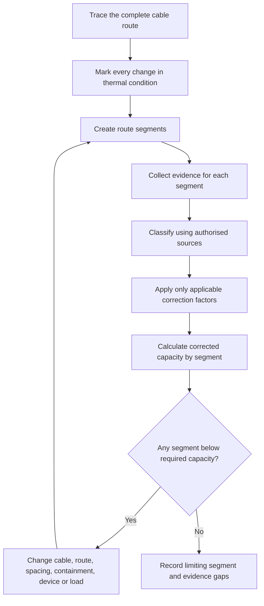
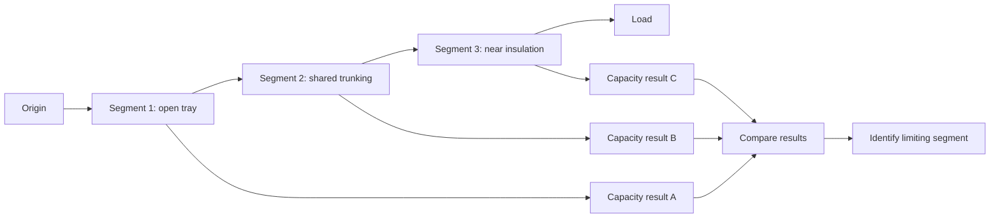

# Day 10 — Installation Conditions and Derating

> **Source, design and safety notice:** This module teaches an original method for identifying installation conditions and reasoning about derating. It does not reproduce standards tables, correction-factor datasets, cable ratings, clause wording or manufacturer data. Exact installation classifications, reference conditions, factors, factor-combination methods, exceptions and final conductor selections must be checked against current authorised standards, amendments, legislation, regulator and network requirements, manufacturer instructions, workplace procedures and RTO directions. All values below are fictional teaching inputs. This module is not `technically-reviewed`.

## Navigation

- **Previous:** [Day 9 — Complete Cable-Selection Workflow](./day-09-complete-cable-selection-workflow.md)
- **Next scheduled block:** [Day 11 — Voltage Drop](../MASTER_PLAN.md#week-2--circuit-design-cables-and-switchboards)

## 1. Outcome and entry check

### Learning objectives

By the end of this block, the learner should be able to:

1. explain why heat dissipation is central to current-carrying capacity;
2. identify route conditions that may require derating or a different installation classification;
3. divide a route into thermally meaningful segments rather than describing it with one vague label;
4. distinguish reference conditions, correction factors and corrected current-carrying capacity;
5. identify the potentially limiting route segment without assuming all adverse conditions occur together;
6. document evidence for ambient temperature, grouping, thermal insulation, enclosure and underground conditions;
7. challenge optimistic assumptions and iterate the route, cable or circuit design;
8. state a bounded result that separates verified data from `reference_check_required` claims.

### Entry check — six minutes, closed note

1. Why can the same cable carry different current in open air and inside thermal insulation?
2. What is the risk of applying a correction factor without confirming its reference conditions?
3. Why should a mixed route be divided into segments?
4. Does the smallest correction factor always govern the whole route? Explain.
5. What evidence would you seek before deciding how many circuits are grouped?
6. Why can a short adverse section still control the design?

Mark confidence beside each answer and prioritise confident errors.

## 2. Why it matters

A cable produces heat when carrying current. Its permissible loading depends on how effectively that heat can leave the conductor and insulation without exceeding applicable thermal limits. Installation conditions can trap heat, add external heat or cause neighbouring circuits to heat one another.

The common failure is not arithmetic. It is modelling the route incorrectly: overlooking insulation, assuming an enclosure is ventilated, counting the wrong grouped circuits, using an irrelevant ambient temperature or applying a factor from the wrong cable and installation family.

A defensible design preserves this chain:

**physical route → thermal segments → authorised classification → applicable factors → corrected capacity → limiting segment → design response**


## 3. Core concepts and terminology

### Reference conditions

**Reference conditions** are the defined circumstances under which authorised current-carrying-capacity data applies. A tabulated value has meaning only when its cable construction, installation method, loaded conductors and environmental assumptions match the source definition.

### Derating and correction factors

**Derating** is the reduction in usable current-carrying capacity caused by installation conditions less favourable than the reference conditions. A **correction factor** is a source-defined multiplier used in the authorised method.

Conceptually:

```text
corrected capacity = tabulated capacity × applicable correction factors
```

The exact factors, sequence, interaction rules and exceptions remain `reference_check_required`.

### Ambient temperature

Ambient temperature is the temperature surrounding the cable under the relevant operating condition. Local plant, roof spaces, sunlight, process heat and seasonal extremes may be more important than a general weather figure.

### Grouping

Grouping occurs when loaded circuits are close enough for their heat to interact. The evidence model may need cable spacing, arrangement, containment, circuit loading, duty and whether circuits are genuinely loaded at the same time.

### Thermal insulation

Thermal insulation can obstruct heat loss. The installation must be classified from the actual contact, coverage, length, cable arrangement and construction—not from a generic statement that insulation exists nearby.

### Enclosures and containment

Conduit, trunking, duct, tray and other containment affect heat dissipation differently. Fill, ventilation, material, spacing, other heat sources and changes along the route may all matter.

### Underground conditions

Underground cable performance may depend on soil thermal properties, burial arrangement, depth, spacing, ducts, moisture, other services and long-term environmental conditions. Exact design data must come from authorised sources and project evidence.

### Limiting segment

The **limiting segment** is the route section that imposes the strongest applicable thermal constraint after correct classification and calculation. It is identified by evidence, not by selecting whichever factor looks smallest in isolation.

## 4. Rule-finding workflow

Use the **H-E-A-T** workflow:

1. **H — Hunt for heat conditions.** Walk the route on paper or site evidence and identify every place heat generation or heat removal changes.
2. **E — Establish segments and evidence.** Divide the route into meaningful sections and record confirmed facts, assumptions and missing evidence.
3. **A — Apply authorised classifications and factors.** Use current sources to classify each segment and obtain only the factors that genuinely apply.
4. **T — Test the limiting result and redesign.** Compare corrected capacities, identify the limiting segment, then change cable, route, spacing, containment, protection or load where required.



### Route-segment record

For each segment, record:

- start and end points;
- cable construction and conductor arrangement;
- installation method and containment;
- number of loaded conductors;
- ambient and local heat sources;
- grouping, spacing and likely simultaneous loading;
- contact with or enclosure by thermal insulation;
- underground or external conditions;
- source reference used;
- applicable factor and reason;
- evidence status: confirmed, assumed or missing;
- corrected capacity and whether the segment limits the route.

Do not combine conditions merely because they appear somewhere on the same project. First determine whether they act on the same route segment and operating case.

## 5. Visual model or worked example

### Segment-first model



### Worked training example — fictional values

A fictional cable has a tabulated capacity of `61 A` under the selected reference method. The route is divided into three segments:

| Segment | Fictional conditions | Fictional combined factor | Fictional corrected capacity |
|---|---|---:|---:|
| A | Open tray, no identified adverse condition | `1.00` | `61.0 A` |
| B | Shared containment with other loaded circuits | `0.82` | `50.0 A` |
| C | Short section affected by thermal insulation | `0.74` | `45.1 A` |

These numbers are invented and must not be used for real design.

The fictional circuit requires a corrected capacity above a proposed `48 A` protective-device setting. Segment C fails the screen, even though Segments A and B pass.

A weak response is: “multiply every factor together for the entire route.” That may create an unsupported result because the grouping and insulation conditions occur in different segments. A defensible response is to calculate each segment using the applicable source method, identify Segment C as the provisional limiter, and then test design alternatives.

Possible iterations include:

- reroute the cable away from insulation;
- use an authorised installation treatment for the affected section;
- increase conductor size;
- alter containment or circuit spacing;
- revise the protective-device setting if load and protection requirements permit;
- obtain better evidence if the insulation contact is uncertain.


## 6. Practical application

### Original scenario — ceiling, riser and plant-room route

A submain leaves a switchboard, crosses an accessible ceiling on tray, enters a shared service riser and passes through a warm plant-room wall near thermal insulation before reaching a distribution board.

Known information:

- several circuits share part of the riser;
- some existing circuits have intermittent duty;
- the ceiling insulation layout is shown only on an old drawing;
- plant-room temperature varies with equipment operation;
- cable spacing changes at bends and supports;
- the final penetration detail is not confirmed.

Complete a paper-based design review.

### Part A — build the condition map

Divide the route into segments and label each as:

- thermally ordinary based on confirmed evidence;
- potentially adverse;
- evidence incomplete;
- requiring authorised-source classification.

### Part B — evidence plan

For each potentially adverse segment, state whether evidence should come from:

- site inspection or photographs;
- current drawings or cable schedules;
- load and operating records;
- manufacturer information;
- authorised standards;
- regulator, network or workplace requirements.

### Part C — calculation structure

Without inserting real standards data, prepare a worksheet containing:

```text
segment
installation classification
source reference
base tabulated capacity
applicable factors
corrected capacity
required capacity
pass / fail / unresolved
```

### Part D — bounded conclusion

Write a conclusion that identifies:

1. the provisional limiting segment;
2. the evidence that supports that view;
3. unresolved assumptions;
4. the design changes available if the segment fails;
5. why compliance cannot yet be claimed.

## 7. Common errors and safety checkpoint

### Common errors

- choosing factors before defining the cable and installation method;
- treating the whole route as one condition;
- multiplying unrelated segment factors together;
- assuming all nearby circuits are equally loaded without evidence;
- using room temperature when the cable experiences a hotter local condition;
- relying on outdated drawings for insulation or grouping;
- ignoring a short adverse section;
- assuming a larger cable automatically solves termination or containment constraints;
- reporting a corrected capacity without its source and assumptions;
- carrying a derating result forward after the route changes without recalculation.

### Safety checkpoint

Stop and escalate when:

- the actual route cannot be established;
- cable construction or loaded-conductor arrangement is unknown;
- insulation contact, grouping or environmental conditions are materially uncertain;
- authorised source data is unavailable;
- manufacturer limitations conflict with the proposed design;
- the calculation depends on invented or copied values;
- site verification would require work beyond competence or safe access arrangements.

A precise-looking calculation based on uncertain conditions is not reliable evidence.

## 8. Retrieval and next links

### Closed-note retrieval

1. Define reference conditions, correction factor and limiting segment.
2. Explain the H-E-A-T workflow.
3. List five route conditions that may affect heat dissipation.
4. Explain why route segmentation matters.
5. Describe two ways grouping evidence can be wrong.
6. Explain why the smallest visible factor may not govern the whole route.
7. State three design responses to a failing segment.
8. Write one bounded conclusion sentence containing an explicit evidence gap.

### Applied practice

Redraw a real or fictional route as at least three thermal segments. For each segment, list the evidence required before any factor can be selected. Do not use numerical standards data.

### Readiness check

Proceed when you can:

- map a route into defensible thermal segments;
- state why each condition may or may not apply;
- keep source data separate from assumptions;
- identify the provisional limiting segment;
- propose an iteration without claiming unverified compliance.

Return to Day 9 if the wider cable-selection chain is unclear.

### Vault and sequence links

- [[Day 09 - Complete Cable-Selection Workflow]]
- [[Day 10 - Installation Conditions and Derating]]
- [[Wiring Rules and Design]]
- [[Control Switching and Protection]]
- **Next:** [Day 11 — Voltage Drop](../MASTER_PLAN.md#week-2--circuit-design-cables-and-switchboards)

## References and review boundary

- AS/NZS 3000:2018, current authorised copy and applicable amendments required.
- AS/NZS 3008.1.1, current authorised edition and applicable amendments required.
- Current legislation, regulator guidance, network service rules, manufacturer instructions, workplace procedures and RTO directions.
- [Learning Design](../../../LEARNING_DESIGN.md)
- [Content, Standards and Copyright Policy](../../../CONTENT_AND_COPYRIGHT.md)

Exact cable classifications, installation methods, reference conditions, current-carrying-capacity values, ambient-temperature treatment, grouping rules, thermal-insulation treatment, enclosure and underground factors, combination methods, exceptions and acceptance criteria remain `reference_check_required`. No standards table, correction-factor dataset, copied figure or authoritative field value is reproduced here.

<!-- sequence-navigation:start -->
### Sequence navigation

- [← Previous: Day 9 — Complete Cable-Selection Workflow](./day-09-complete-cable-selection-workflow.md)
- [Four-week learning plan](../MASTER_PLAN.md)
- [Next: Day 11 — Voltage Drop →](./day-11-voltage-drop.md)
<!-- sequence-navigation:end -->
