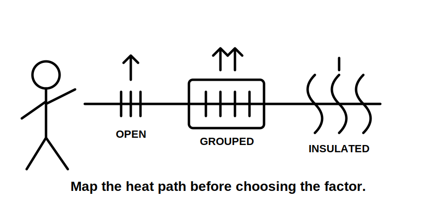
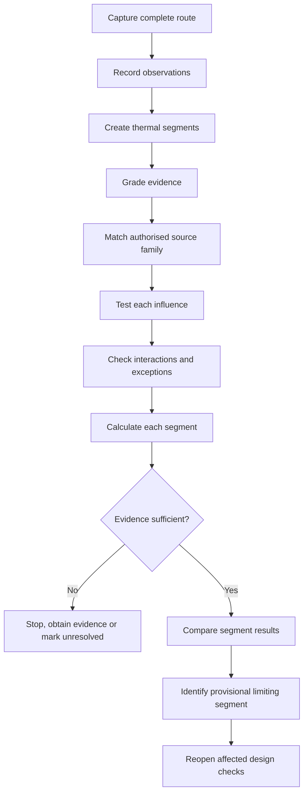
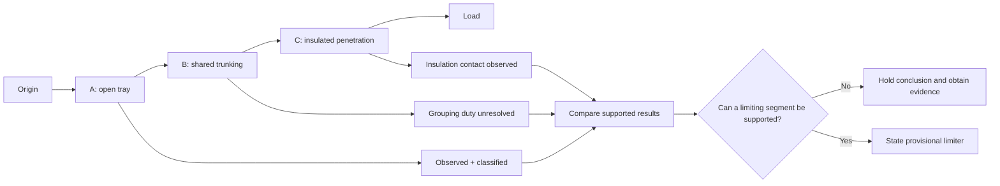
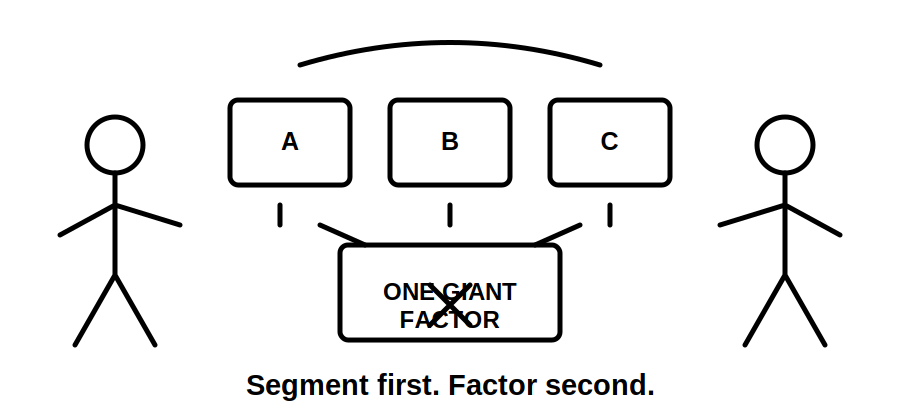

# Day 10 — Installation Conditions and Derating

> **Source, design and safety notice:** This module teaches an original evidence-led method for analysing installation conditions. It does not reproduce standards tables, correction-factor datasets, cable ratings, clause wording or manufacturer data. Exact classifications, reference conditions, factors, combination methods, exceptions and final design decisions must be checked against current authorised standards, amendments, legislation, regulator and network requirements, manufacturer instructions, workplace procedures and RTO directions. All numerical values are fictional teaching inputs. This module is not `technically-reviewed` and grants no practical authority.

## Navigation

- **Previous:** [Day 9 — Complete Cable-Selection Workflow](./day-09-complete-cable-selection-workflow.md)
- **Next:** [Day 11 — Voltage Drop](./day-11-voltage-drop.md)

## 1. Outcome and entry check

### Learning objectives

By the end of this block, the learner should be able to:

1. explain, in thermal terms, why one cable can have different usable capacities in different installations;
2. divide a mixed route into defensible thermal segments using stated evidence;
3. distinguish observed conditions, authorised classifications, source values and calculated results;
4. identify which route conditions require source checking before a factor is selected;
5. calculate a fictional corrected capacity while preserving units, provenance and assumptions;
6. identify a provisional limiting segment without multiplying unrelated conditions together;
7. reopen affected design steps when the route, loading, containment, spacing or environmental evidence changes;
8. produce a bounded conclusion graded as **described**, **supported** or **verified**.

### Entry check — six minutes, closed note

1. Why can thermal insulation change a cable’s usable current-carrying capacity?
2. What is the difference between a physical observation and an installation classification?
3. Why should a mixed route be divided into segments?
4. Why might multiplying every adverse factor found on a project be wrong?
5. What evidence is needed before deciding that circuits are thermally grouped?
6. What downstream design decisions may need to be reopened after a route change?

Mark each answer **confident**, **uncertain** or **guess**. Correct confident errors first.

## 2. Why it matters

Cable capacity is not a property of conductor size alone. Heat produced by current must leave the conductor and insulation without exceeding the applicable thermal limits. Surrounding temperature, grouping, insulation, containment, underground conditions and local heat sources can change that heat-transfer path.

The high-risk error is usually not multiplication. It is an unsupported model: an unverified route, an assumed installation method, a grouping count copied from a drawing, or factors taken from reference conditions that do not match the cable and installation.

A defensible chain is:

**physical evidence → route segments → authorised classification → applicable source data → corrected capacity → limiting segment → design response → reopened checks**



## 3. Core concepts and terminology

### Current-carrying capacity

**Current-carrying capacity** is the current a conductor can carry continuously under defined conditions without exceeding the applicable temperature limit. It is condition-dependent, not universal.

### Reference conditions

**Reference conditions** are the circumstances attached to authorised capacity data. The data is meaningful only when the cable construction, installation method, loaded conductors and environmental assumptions match the source definition.

### Derating and correction factor

**Derating** is a reduction in usable capacity caused by conditions less favourable than the reference conditions. A **correction factor** is a source-defined multiplier used within an authorised method.

Conceptually only:

```text
corrected capacity = source capacity × applicable source-defined factors
```

The exact factors, order, interaction rules and exceptions remain `reference_check_required`.

### Thermal segment

A **thermal segment** is a route section with materially similar heat-transfer conditions. A new segment begins when containment, spacing, insulation contact, ambient conditions, burial arrangement, local heat source or another relevant condition changes.

### Ambient temperature

**Ambient temperature** is the temperature surrounding the cable for the relevant operating case. A general room or weather temperature may not represent a roof space, plant room, sun-exposed enclosure or process area.

### Grouping

**Grouping** describes loaded circuits close enough for their heat to interact under the applicable source method. Physical proximity alone does not prove the relevant grouped-circuit count; spacing, arrangement, duty, containment and simultaneous loading may matter.

### Limiting segment

The **limiting segment** is the route section that imposes the strongest correctly established design constraint. It is found by comparing supported segment results, not by selecting the smallest isolated factor.

### Evidence and claim grades

Use these evidence grades:

- **Observed:** directly supported by current site evidence, drawings, schedules or reliable records.
- **Classified:** mapped to an authorised source definition, with applicability recorded.
- **Calculated:** derived from verified inputs using the applicable method.
- **Unresolved:** missing, conflicting or stale evidence prevents reliance.

Use these claim grades:

- **Described:** the physical condition or possible influence is stated.
- **Supported:** the condition and provisional consequence are backed by traceable evidence.
- **Verified:** all applicable source requirements and inputs have been checked by an authorised competent reviewer. Automated content must not use this grade as a technical approval.

## 4. Rule-finding workflow

Use **C-O-N-D-I-T-I-O-N-S**:

1. **C — Capture the complete route.** Mark origin, destination, cable type and every change in environment or containment.
2. **O — Observe without classifying prematurely.** Record what is visible or documented before assigning a standards category.
3. **N — Name thermal segments.** Split the route wherever heat-transfer conditions materially change.
4. **D — Document evidence status.** Mark each input observed, assumed, stale, conflicting or missing.
5. **I — Identify the authorised source family.** Confirm cable construction, installation family, loaded conductors and reference conditions.
6. **T — Test each influence separately.** Consider ambient temperature, grouping, insulation, enclosure, underground conditions and local heat.
7. **I — Inspect interactions and exceptions.** Check whether factors combine, replace one another or require a different source method.
8. **O — Obtain source values with provenance.** Record source, edition, table or method location without reproducing protected content.
9. **N — Normalise units and calculate by segment.** Keep fictional training arithmetic separate from real design data.
10. **S — Select the provisional limiter and reopen the design.** State unresolved evidence and repeat affected load, protection, voltage-drop, fault, termination and route checks after any change.



The decision gate prevents precise arithmetic from disguising weak route evidence.

### Segment evidence record

For each segment, record:

- boundaries and length basis;
- cable construction and conductor arrangement;
- containment or installation observation;
- ambient and local heat evidence;
- grouping, spacing, duty and simultaneous-loading evidence;
- insulation contact or enclosure evidence;
- underground or external conditions;
- authorised source and applicability reason;
- source value or factor reference;
- evidence grade;
- calculated result;
- unresolved dependencies;
- whether the segment is provisionally limiting.

## 5. Visual model or worked example

### Segment and evidence model



A segment with the most adverse-looking condition does not automatically govern if its classification or source inputs are unresolved.

### Fictional worked example

A fictional cable has a source capacity of `64 A`. These invented factors are used only to practise process:

| Segment | Evidence status | Fictional applicable factor | Fictional result |
|---|---|---:|---:|
| A — ventilated tray | observed and classified | `1.00` | `64.0 A` |
| B — shared containment | grouping duty unresolved | `0.80` | provisional only: `51.2 A` |
| C — insulated penetration | observed and classified | `0.72` | `46.1 A` |

A proposed fictional requirement is `48 A`.

- Segment A passes the training screen.
- Segment C does not pass the training screen and is the provisional limiter.
- Segment B cannot support a final comparison because its grouped-circuit duty evidence is unresolved.

The correct conclusion is not “Segment C proves the design fails.” It is:

> On the fictional inputs, Segment C is the provisional limiting segment and falls below the fictional requirement. Segment B remains unresolved because simultaneous-loading evidence is missing. The route or conductor proposal must be revised, and all affected design checks repeated before any compliance conclusion.

### Worked-example fading

Repeat the example in three stages:

1. remove the evidence grades and restore them;
2. remove one factor and identify which source checks are needed before using it;
3. change Segment C from full insulation contact to an unverified drawing note and rewrite the conclusion without treating the factor as established.



## 6. Practical application

### Scenario — ceiling, riser and plant-room route

A submain crosses a ceiling on tray, enters a shared riser, passes through a warm plant-room wall near insulation and terminates at a distribution board.

Known evidence:

- a current photograph confirms the ceiling tray;
- an old drawing shows insulation near the penetration;
- several circuits share the riser, but their duty records are incomplete;
- plant-room temperature varies with equipment operation;
- spacing changes at bends;
- the final penetration construction is not confirmed.

### Task A — build the condition map

Create at least four segments. For every condition, label it:

- observed;
- source-classified;
- assumed;
- stale;
- conflicting; or
- missing.

### Task B — build the source plan

For each segment, identify the evidence source required: current inspection record, drawing, schedule, operating record, manufacturer information, authorised standard, regulator or network rule.

### Task C — produce the calculation skeleton

```text
segment and boundaries
observed condition
source classification
source and applicability
base capacity
applicable factor(s)
unit check
corrected result
evidence grade
pass / fail / unresolved
reopened downstream checks
```

Do not insert real standards data.

### Task D — changed-condition transfer

The route is changed so the cable leaves the shared riser but now enters a sealed external enclosure exposed to sunlight.

State:

1. which previous assumptions become obsolete;
2. what new evidence is required;
3. which calculations must be repeated;
4. which later cable-selection checks must be reopened;
5. why the earlier limiting-segment conclusion cannot simply be carried forward.

### Assessment rubric — 12 points

Score `0`, `1` or `2` for each category:

1. route segmentation;
2. observation versus classification;
3. evidence provenance;
4. factor applicability and interaction control;
5. limiting-segment reasoning;
6. bounded conclusion and reopening logic.

**Readiness guide:**

- `10–12`: proceed to Day 11, while retaining all technical-review flags;
- `7–9`: correct the weakest two categories and re-attempt the changed condition;
- `0–6`: return to Day 9 and rebuild the cable-selection evidence chain.

A critical error overrides the score: invented source data, combining unrelated segment factors, treating stale evidence as verified, or claiming compliance from the training exercise.

## 7. Common errors and safety checkpoint

### Common errors

- treating conductor size as having one universal capacity;
- classifying before documenting physical evidence;
- describing an entire mixed route with one installation method;
- multiplying factors that apply to different segments;
- overlooking source reference conditions;
- assuming every nearby circuit is simultaneously loaded;
- using room temperature for a hotter local environment;
- trusting old drawings for insulation or containment;
- ignoring a short adverse section;
- changing conductor size without reopening terminals, containment, protection, voltage drop and fault checks;
- presenting an unresolved calculation as verified.

### Safety and authority checkpoint

Stop and escalate when:

- the actual route or cable construction cannot be established;
- safe access or inspection is outside the learner’s authority or competence;
- grouping, insulation, ambient or underground conditions are materially uncertain;
- source data or applicability cannot be verified;
- manufacturer information conflicts with the proposed design;
- the method depends on invented, copied or stale technical values;
- an alteration would require switching, isolation, testing, opening equipment or field work not authorised for the learner.

This module authorises no inspection requiring unsafe access, switching, isolation, opening, testing, alteration, installation, energisation, commissioning or certification.

## 8. Retrieval and next links

### Closed-note retrieval

1. Define current-carrying capacity, reference conditions, correction factor, thermal segment and limiting segment.
2. Reproduce the C-O-N-D-I-T-I-O-N-S workflow.
3. Explain the difference between observed, classified, calculated and unresolved evidence.
4. Give two examples of factors that may apply to different segments rather than combine.
5. Explain why a short adverse segment can control the route.
6. State four triggers that require recalculation.
7. Write a supported but not verified conclusion.
8. Name one critical error that overrides a high rubric score.

### Retrieval transfer

Without notes, sketch a four-segment route containing tray, shared containment, a warm area and an insulated penetration. Add one evidence gap and show where the workflow stops.

### Readiness check

Proceed when you can:

- segment a route from evidence rather than labels;
- trace every classification and source input;
- keep unrelated segment conditions separate;
- identify a provisional limiter without overclaiming;
- reopen affected design checks after a change;
- respect the technical-review and practical-authority boundaries.

### Vault and sequence links

- [[Day 09 - Complete Cable-Selection Workflow]]
- [[Day 10 - Installation Conditions and Derating]]
- [[Day 11 - Voltage Drop]]
- [[Wiring Rules and Design]]
- [[Control Switching and Protection]]

## References and review boundary

- AS/NZS 3000:2018, current authorised copy and applicable amendments required.
- AS/NZS 3008.1.1, current authorised edition and applicable amendments required.
- Current legislation, regulator guidance, network service rules, manufacturer instructions, workplace procedures and RTO directions.
- [Learning Design](../../../LEARNING_DESIGN.md)
- [Content, Standards and Copyright Policy](../../../CONTENT_AND_COPYRIGHT.md)

Exact classifications, installation methods, reference conditions, capacity data, ambient-temperature treatment, grouping rules, thermal-insulation treatment, enclosure and underground factors, combination methods, exceptions and acceptance criteria remain `reference_check_required`. The workflows, evidence grades, fictional examples and rubric are original educational models.

<!-- sequence-navigation:start -->
### Sequence navigation

- [← Previous: Day 9 — Complete Cable-Selection Workflow](./day-09-complete-cable-selection-workflow.md)
- [Four-week learning plan](../MASTER_PLAN.md)
- [Next: Day 11 — Voltage Drop →](./day-11-voltage-drop.md)
<!-- sequence-navigation:end -->