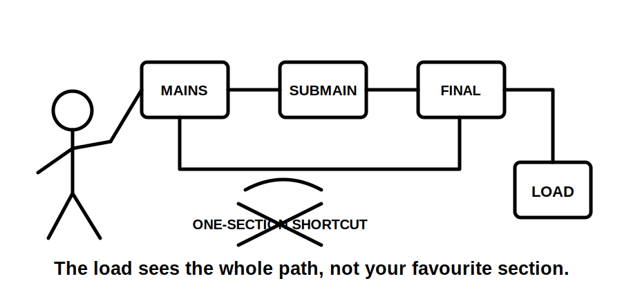
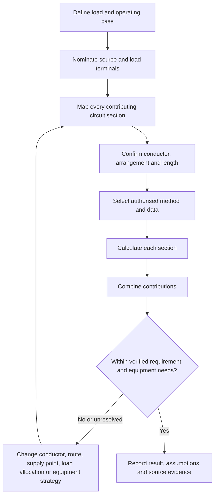
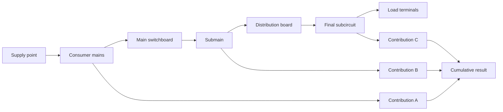
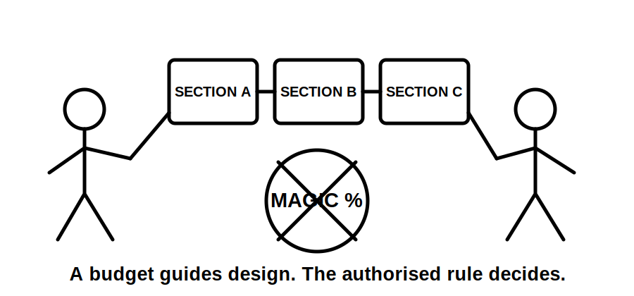

# Day 11 — Voltage Drop

> **Source, design and safety notice:** This module teaches an original evidence workflow for voltage-drop reasoning. It does not reproduce standards tables, conductor datasets, clause wording, official limits or manufacturer calculations. Exact maximum permitted voltage drop, conductor parameters, formula conventions, phase arrangements, power-factor treatment, temperature assumptions, load profiles, motor-starting requirements and acceptance criteria must be checked against current authorised standards, amendments, legislation, regulator and network requirements, manufacturer instructions, workplace procedures and RTO directions. All numerical values below are fictional teaching inputs. This module is not `technically-reviewed`.

## Navigation

- **Previous:** [Day 10 — Installation Conditions and Derating](./day-10-installation-conditions-and-derating.md)
- **Next scheduled block:** [Day 12 — Rest, Calculation Correction and Catch-Up](../MASTER_PLAN.md#week-2--circuit-design-cables-and-switchboards)

## 1. Outcome and entry check

### Learning objectives

By the end of this block, the learner should be able to:

1. explain voltage drop as a difference between source voltage and voltage available at a load under stated operating conditions;
2. distinguish voltage drop from supply variation, undervoltage faults and conductor current-carrying capacity;
3. identify the complete current path and relevant route length before selecting a calculation method;
4. separate upstream, submain and final-subcircuit contributions;
5. use a source-controlled calculation structure without treating remembered constants as authoritative;
6. explain why load current, conductor impedance, route length, phase arrangement and operating condition affect the result;
7. test design alternatives when a provisional result is excessive;
8. state a bounded conclusion that records assumptions, source references and unresolved evidence.

### Entry check — six minutes, closed note

1. Why can a thermally adequate cable still produce an unacceptable voltage at the load?
2. Which current should be used: connected load, maximum demand, protective-device rating or another defined operating current?
3. Why is one-way route length not always the same as the electrical path length used by a method?
4. What upstream circuit sections may contribute to voltage drop at a final load?
5. Why can motor starting require a different operating case from steady running?
6. What evidence would make a voltage-drop result defensible?

Mark confidence beside each answer. Treat a confident unsupported formula as a priority error.

## 2. Why it matters

Equipment is designed to operate within a suitable voltage range. Excessive voltage drop can cause poor starting, reduced torque, dim lighting, malfunction, nuisance behaviour, excessive current in some loads or failure to meet design and compliance requirements.

The common error is to reduce the task to one formula. A defensible result depends on a chain of evidence:

**load and operating case → supply point → complete circuit path → conductor and arrangement → authorised method and data → section results → cumulative result → equipment and compliance check**

Voltage drop is related to cable selection, but it is not the same check as current-carrying capacity. A conductor may pass thermal coordination and still fail the voltage-performance requirement.



## 3. Core concepts and terminology

### Voltage at the source and load

**Source voltage** is the voltage at the nominated supply point for the calculation. **Load voltage** is the voltage predicted or measured at the equipment terminals under a stated operating condition.

Conceptually:

```text
voltage drop = source voltage − load voltage
```

The source point, operating condition and applicable acceptance rule must be defined. A result without those boundaries is incomplete.

### Circuit-section contribution

A load may be supplied through several sections, such as consumer mains, a submain and a final subcircuit. Each relevant section contributes to the cumulative result.

Conceptually:

```text
total voltage drop = contribution of section 1 + section 2 + ... + section n
```

Whether contributions may be combined directly, and which method applies, remains `reference_check_required`.

### Design current and operating current

The relevant current depends on the calculation purpose and authorised method. It may not equal connected load, maximum demand or protective-device rating. Continuous operation, intermittent duty, simultaneous loads, motor starting and control states may require separate cases.

### Conductor impedance

A conductor opposes current through resistance and reactance. The applicable model may depend on conductor material, cross-sectional area, temperature, arrangement, frequency, route and source data.

Do not substitute a remembered millivolt-per-ampere-metre value, resistance constant or reactance assumption without verifying that it applies to the selected conductor and method.

### Route length and current path

**Physical route length** describes the installed path. **Calculation length** is the length required by the authorised method. The treatment of outgoing and return paths differs with circuit arrangement and source convention.

### Percentage voltage drop

A result may be expressed as volts or as a percentage of a defined nominal or reference voltage.

Conceptually:

```text
percentage voltage drop = voltage drop ÷ reference voltage × 100
```

The correct reference voltage and rounding method remain source-dependent.

### Steady-state and transient cases

A **steady-state** case represents ongoing operation. A **transient** case may represent motor starting, transformer energisation or another short-duration event. Equipment performance may require both to be considered even where compliance calculations focus on a defined steady condition.

### Voltage-drop budget

A **voltage-drop budget** is a design allocation across circuit sections. It is not an automatic standards rule. It is a planning tool that must remain consistent with the authorised total requirement and the actual installation.

## 4. Rule-finding workflow

Use the **D-R-O-P** workflow:

1. **D — Define the duty and destination.** Identify the load, operating case, equipment requirement, source point and destination terminals.
2. **R — Reconstruct the route.** Map every relevant circuit section, conductor arrangement, length, joint, phase and neutral path.
3. **O — Obtain authorised method and inputs.** Select current source material, conductor data, formula conventions, voltage reference and applicable limit.
4. **P — Prove the cumulative result and iterate.** Calculate by section, combine using the authorised method, challenge assumptions and redesign where required.



### Voltage-drop evidence record

For each calculation, record:

- load description and operating case;
- source point and destination terminals;
- nominal or reference voltage;
- circuit arrangement and phase allocation;
- each contributing circuit section;
- conductor material, size, construction and loaded conductors;
- route and calculation lengths;
- current used and why it applies;
- resistance, reactance or tabulated source data;
- conductor-temperature assumption where relevant;
- power factor or load characteristic where relevant;
- formula or table source and edition;
- section result and cumulative result;
- equipment-specific voltage requirement;
- compliance requirement and jurisdiction;
- evidence status: confirmed, assumed or missing.

A neat answer with an unidentified current or unknown route is not a complete design result.

## 5. Visual model or worked example

### Upstream-to-load model



### Worked training example — fictional values

A fictional single operating case has three contributing sections. The values and method below are invented solely to demonstrate structure.

| Section | Fictional current | Fictional length | Fictional source factor | Fictional contribution |
|---|---:|---:|---:|---:|
| Consumer mains | `36 A` | `18 m` | `0.62 mV/A/m` | `0.40 V` |
| Submain | `28 A` | `31 m` | `0.91 mV/A/m` | `0.79 V` |
| Final subcircuit | `12 A` | `24 m` | `2.80 mV/A/m` | `0.81 V` |

Fictional cumulative result:

```text
0.40 V + 0.79 V + 0.81 V = 2.00 V
```

These numbers are not standards data and must not be used for design.

The important reasoning is not the arithmetic. It is that:

- each section uses a current appropriate to its operating case;
- upstream contributions are not ignored;
- source data is tied to the conductor and arrangement;
- the result is compared with both an authorised requirement and equipment needs;
- assumptions are visible and can be challenged.

A weak answer calculates only the final subcircuit because it is closest to the load. A stronger answer reconstructs the entire contributing path and states whether upstream values are verified, allocated or unresolved.



## 6. Practical application

### Original scenario — workshop compressor and lighting extension

A workshop distribution board supplies an existing lighting circuit and a proposed compressor in a detached work area. The supply path includes existing consumer mains, an existing submain and a proposed final subcircuit.

Known information:

- the compressor has separate starting and running data, but the manufacturer document is not yet confirmed current;
- the proposed route is longer than the drawing suggests because it follows structural supports;
- the submain conductor size is recorded, but conductor material and installation temperature are not confirmed;
- existing lighting complaints occur when another machine starts;
- the upstream maximum-demand assessment was prepared before the compressor was proposed;
- the final load terminals are remote from the distribution board.

Complete a paper-based design review.

### Part A — define cases

Prepare at least two operating cases:

1. compressor running with representative concurrent workshop loads;
2. compressor starting with the relevant equipment and supply assumptions.

State what current belongs to each section in each case and why.

### Part B — map the path

Draw the complete source-to-load path. For every section, record:

- physical route;
- calculation length required by the source method;
- conductor and circuit arrangement;
- current used;
- verified and missing evidence.

### Part C — calculation worksheet

Without inserting real standards data, prepare this structure:

```text
operating case
source point
load terminals
section
current and basis
conductor and arrangement
physical length
calculation length
source data reference
section voltage drop
cumulative voltage drop
equipment requirement
compliance requirement
pass / fail / unresolved
```

### Part D — design responses

For a provisional excessive result, compare at least four responses:

- increase conductor size;
- shorten or reroute the circuit;
- relocate a distribution point;
- redistribute loads or phases where applicable;
- revise the equipment or starting method using manufacturer guidance;
- separate sensitive loads;
- improve upstream supply arrangements through authorised design review.

Do not assume that increasing the final-subcircuit conductor solves an upstream limitation.

### Part E — bounded conclusion

Write a conclusion that states:

1. which operating case is provisionally limiting;
2. the cumulative path included;
3. the assumptions that materially affect the result;
4. the source information still required;
5. the design changes available;
6. why compliance or equipment performance cannot yet be claimed.

## 7. Common errors and safety checkpoint

### Common errors

- calculating only the final subcircuit and ignoring upstream contributions;
- using protective-device rating automatically as the load current;
- using connected load where a different operating case is required;
- confusing physical one-way length with the source method's calculation length;
- using a factor for the wrong conductor material, phase arrangement or temperature;
- ignoring reactance or power factor where the authorised method requires them;
- applying one steady-state result to motor starting;
- treating an internally allocated voltage-drop budget as an official rule;
- comparing percentage drop with the wrong reference voltage;
- rounding intermediate values so aggressively that the conclusion changes;
- redesigning a conductor without rechecking current-carrying capacity, protection, fault performance and termination constraints;
- reporting a pass without identifying the source edition and assumptions.

### Safety checkpoint

Stop and escalate when:

- the source point or complete supply path is unknown;
- conductor identity, circuit arrangement or route length cannot be established;
- the load current or duty is unsupported;
- manufacturer voltage or starting requirements are unavailable;
- the calculation depends on remembered constants or unverified copied data;
- supply variation, poor connections, neutral problems or another fault may be causing low voltage;
- measurements or site access would require work beyond competence, authorisation or safe isolation procedures;
- the proposed fix may affect protection, fault-loop performance, equipment ratings or network requirements.

Voltage drop is a design calculation. It must not be used to dismiss evidence of a loose connection, damaged conductor, neutral fault or unsafe supply condition.

## 8. Retrieval and next links

### Closed-note retrieval

1. Define voltage drop, source voltage and load voltage.
2. Explain the D-R-O-P workflow.
3. List six inputs that can materially change a voltage-drop result.
4. Explain why upstream contributions matter.
5. Distinguish physical route length from calculation length.
6. Explain why current-carrying capacity and voltage drop are separate checks.
7. State two reasons a starting case may differ from a running case.
8. Write one bounded conclusion containing an explicit evidence gap.

### Applied practice

Choose a fictional load supplied through a submain and final subcircuit. Draw the complete path, create two operating cases and build the evidence worksheet. Use symbols or placeholders rather than real standards constants.

### Readiness check

Proceed when you can:

- define the source and destination for the calculation;
- map every contributing circuit section;
- select an operating current only after stating its basis;
- keep source data separate from assumptions;
- calculate and combine section contributions using a verified method;
- propose design iterations without claiming unverified compliance.

Return to Day 8 if the load model is unclear, Day 9 if the wider cable-selection workflow is unclear, or Day 10 if the route and installation conditions are not established.

### Vault and sequence links

- [[Day 08 - Maximum Demand]]
- [[Day 09 - Complete Cable-Selection Workflow]]
- [[Day 10 - Installation Conditions and Derating]]
- [[Day 11 - Voltage Drop]]
- [[Day 12 - Rest Calculation Correction and Catch-Up]]
- [[Wiring Rules and Design]]
- [[Control Switching and Protection]]

## References and currency notice

- AS/NZS 3000:2018, current authorised copy and applicable amendments required.
- Current authorised AS/NZS 3008 series material applicable to the conductor and installation.
- Current manufacturer data for the connected equipment, including operating-voltage and starting requirements where relevant.
- Current legislation, regulator guidance, network service rules, workplace procedures and RTO assessment directions.
- [Learning Design](../../../LEARNING_DESIGN.md)
- [Content, Standards and Copyright Policy](../../../CONTENT_AND_COPYRIGHT.md)

Exact voltage-drop limits, allocation rules, formulae, conductor impedance data, phase and neutral treatment, temperature corrections, power-factor methods, motor-starting criteria, rounding conventions, measurement procedures and jurisdiction-specific acceptance criteria remain `reference_check_required`. No copied standards table, dataset, figure or clause wording is included. This module must remain `review-required` until checked by a suitably qualified reviewer against current authorised sources.