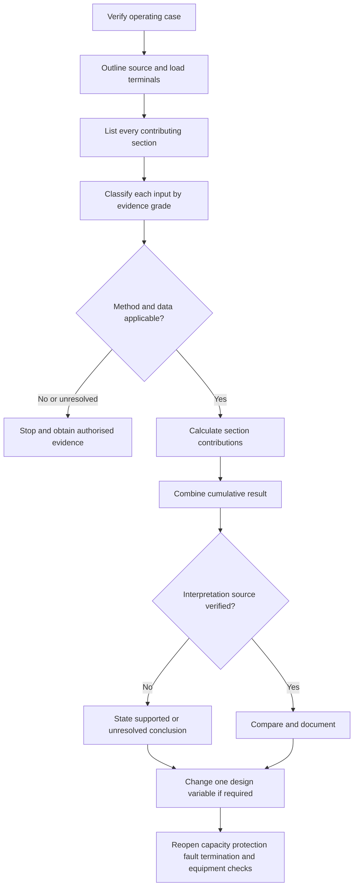
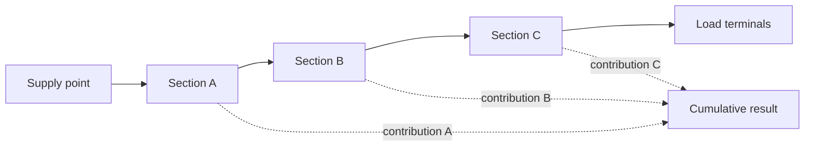

# Day 11 — Voltage Drop

> **Source, design and safety notice:** This module teaches an original evidence workflow for voltage-drop reasoning. It does not reproduce standards tables, conductor datasets, clause wording, official limits or manufacturer calculations. Exact permitted voltage drop, conductor parameters, formula conventions, phase arrangements, power-factor treatment, temperature assumptions, load profiles, motor-starting requirements and acceptance criteria must be checked against current authorised sources. All numerical values below are fictional teaching inputs. This module is not `technically-reviewed` and grants no authority to perform electrical work.

## Navigation

- **Previous:** [Day 10 — Installation Conditions and Derating](./day-10-installation-conditions-and-derating.md)
- **Next:** [Day 12 — Rest, Calculation Correction and Catch-Up](./day-12-rest-calculation-correction-and-catch-up.md)

## 1. Outcome and entry check

### Observable learning objectives

By the end of this block, the learner can:

1. define voltage drop using nominated source and load terminals and a stated operating case;
2. distinguish voltage drop from supply variation, undervoltage caused by a fault, and conductor current-carrying capacity;
3. draw the complete contributing path and identify upstream, submain and final-subcircuit sections;
4. classify each input as **observed**, **verified**, **derived**, **assumed** or **missing**;
5. select a calculation method only after confirming its source, applicability and units;
6. calculate fictional section contributions and a cumulative result without presenting training data as authoritative;
7. reopen affected design checks when current, length, conductor, route, source or load duty changes;
8. produce a bounded conclusion graded as **described**, **supported** or **verified**.

### Entry check — six minutes, closed note

1. Why can a thermally adequate cable still produce unsuitable voltage at the load?
2. Which current belongs in a calculation, and what evidence establishes it?
3. Why may physical route length differ from calculation length?
4. Which upstream sections may contribute at a remote load?
5. Why can starting and running require different cases?
6. What evidence separates a calculation from a defensible design conclusion?

Mark confidence beside every answer. A confident answer based on a remembered constant is a priority correction.

## 2. Why it matters

Equipment performance depends on voltage available at its terminals under the relevant operating condition. Excessive drop may contribute to poor starting, reduced torque, dim lighting, control malfunction or failure to meet verified design requirements.

The assessment skill is not formula recall. It is maintaining a traceable chain:

**operating case → calculation boundary → complete path → applicable data → section results → cumulative result → interpretation → reopened design checks**

Voltage drop is one design gate. It does not replace current-carrying-capacity, protection, fault-performance, termination, equipment or supply-quality checks.


## 3. Core concepts and terminology

### Voltage drop

**Voltage drop** is the difference between voltage at a nominated source point and voltage at nominated load terminals under a stated operating condition.

```text
voltage drop = source voltage − load voltage
```

This relationship describes the concept. It is not, by itself, a complete design method.

### Calculation boundary

The **calculation boundary** identifies the exact start and finish points. A result is ambiguous when the source point, load terminals or upstream contribution is omitted.

### Circuit-section contribution

A supply path may contain consumer mains, submains and a final subcircuit. Each relevant section can contribute to the cumulative result.

```text
cumulative result = section A + section B + ... + section n
```

How contributions are determined and combined remains source-dependent.

### Operating case

An **operating case** is a defined combination of load state, simultaneity, duty and supply condition. Running, starting, intermittent and abnormal scenarios must not be merged without evidence.

### Conductor impedance

**Impedance** is opposition to alternating current and may include resistance and reactance. Applicable values depend on conductor, arrangement, temperature, frequency and source method.

### Physical route length and calculation length

**Physical route length** describes the installed route. **Calculation length** is the length convention required by the verified method. They are not automatically interchangeable.

### Evidence grades

- **Observed:** directly provided by a drawing, schedule, label or scenario.
- **Verified:** checked against an identified current authorised source.
- **Derived:** calculated from verified or clearly stated inputs.
- **Assumed:** provisional and explicitly labelled.
- **Missing:** necessary evidence is unavailable; the conclusion remains unresolved.

### Claim grades

- **Described:** the path or issue is explained, but evidence is incomplete.
- **Supported:** the method and principal inputs are identified, but a material verification remains outstanding.
- **Verified:** every material input, method, boundary and acceptance source has been checked by an authorised competent person.

Automated learning content cannot assign the verified grade to safety-critical compliance conclusions.

## 4. Rule-finding workflow

Use the **V-O-L-T-A-G-E** workflow:

1. **V — Verify the operating case.** Define running, starting or other duty and identify the current basis.
2. **O — Outline the calculation boundary.** Nominate source and load terminals.
3. **L — List every contributing section.** Include upstream sections rather than calculating only the final cable.
4. **T — Tie inputs to evidence.** Record conductor, arrangement, length, temperature, power factor and source status.
5. **A — Apply an authorised method.** Check edition, applicability, units, length convention and rounding.
6. **G — Gather and combine section results.** Keep section arithmetic visible and preserve precision until the final step.
7. **E — Evaluate, iterate and reopen.** Compare only with verified criteria, test design alternatives and reopen every affected design gate.



The diagram separates calculation from interpretation. A numerical answer does not become a compliance conclusion until the applicable boundary, method, inputs and acceptance source are verified.

### Evidence record

Record:

- operating case and current basis;
- source and destination terminals;
- every contributing section;
- physical and calculation length;
- conductor material, size, construction and arrangement;
- relevant temperature, power-factor or duty assumptions;
- method, edition and data source;
- units and conversion steps;
- section and cumulative results;
- equipment requirement and acceptance source;
- evidence grade for every material input;
- reopened design checks after any change.

## 5. Visual model or worked example

### Complete-path model



The model shows why a final-subcircuit-only calculation can understate the complete source-to-load result.

### Fictional worked example

The following values are invented solely to practise structure.

| Section | Fictional current | Fictional length | Fictional factor | Fictional contribution |
|---|---:|---:|---:|---:|
| A | `30 A` | `20 m` | `0.50 mV/A/m` | `0.30 V` |
| B | `24 A` | `25 m` | `0.80 mV/A/m` | `0.48 V` |
| C | `10 A` | `30 m` | `2.40 mV/A/m` | `0.72 V` |

```text
fictional cumulative result = 0.30 V + 0.48 V + 0.72 V = 1.50 V
```

No pass/fail conclusion follows. The learner must still establish whether the factors, current bases, length convention, calculation boundary, equipment requirement and acceptance source apply.

### Worked-example fading

1. **Fully guided:** classify every input and reproduce the section arithmetic.
2. **Partly faded:** choose the operating current and length convention from supplied evidence.
3. **Mostly faded:** reconstruct the complete path and identify missing evidence.
4. **Independent transfer:** solve a changed scenario and explain which downstream checks reopen.


## 6. Practical application

### Scenario — workshop compressor and lighting extension

A detached workshop is supplied through existing consumer mains and a submain. A proposed compressor will be connected by a new final subcircuit. Starting data is available only from an undated document, the route is longer than the concept drawing, conductor material for the submain is unconfirmed, and lights reportedly dim when another machine starts.

Complete a paper-based review only.

### Task A — establish cases

Create separate running and starting cases. For each section, identify the current basis and evidence grade.

### Task B — reconstruct the path

Draw the full source-to-load path. Record physical length, calculation length, conductor evidence and every missing input.

### Task C — controlled calculation

Use symbols or fictional factors rather than standards values. Show:

```text
case → boundary → section → current basis → conductor data source
→ length convention → section result → cumulative result → claim grade
```

### Task D — changed-condition transfer

The proposed final route becomes longer and passes through a different installation environment. Explain, without selecting real values:

1. which voltage-drop inputs change;
2. whether the governing section may change;
3. which Day 10 installation classifications require reopening;
4. which capacity, protection, fault, termination and equipment checks must be revisited;
5. why changing only the final conductor may not resolve an upstream limitation.

### Task E — bounded conclusion

Write a conclusion containing:

- the provisionally limiting operating case;
- the complete path included;
- evidence grades for material inputs;
- missing authorised sources;
- available design iterations;
- a described or supported claim grade;
- a clear statement that compliance is not established.

### Assessment rubric — 12 points

Score each category `0`, `1` or `2`:

| Category | 0 | 1 | 2 |
|---|---|---|---|
| Boundary | unclear | partial | exact source and load terminals |
| Operating cases | merged or unsupported | partly separated | clearly separated with current basis |
| Path | final section only | most sections | every contributing section |
| Evidence | assumptions hidden | mixed | every material input graded |
| Method and arithmetic | unsupported | mostly traceable | source-controlled and unit-consistent |
| Conclusion and reopening | overclaims | partly bounded | correctly graded and reopens all affected checks |

**Readiness guide:** `10–12` with no critical error supports progression; `7–9` requires targeted correction; `0–6` requires rework from the workflow.

**Critical errors override the score:** using remembered authoritative constants, omitting a material upstream section, confusing physical and calculation length, hiding a missing input, claiming compliance without a verified source, or recommending field work beyond authority.

## 7. Common errors and safety checkpoint

### Common errors

- calculating only the final subcircuit;
- using protective-device rating automatically as load current;
- combining starting and running cases;
- using one-way physical length in an unverified convention;
- using conductor data for the wrong material or arrangement;
- treating a design budget as an official limit;
- rounding intermediate values until the conclusion changes;
- changing conductor size without reopening other design gates;
- treating calculated low voltage as proof of a fault cause;
- reporting a pass without an identified acceptance source.

### Safety checkpoint

Stop and escalate when:

- the complete supply path or source point is unknown;
- conductor identity, arrangement or length cannot be established;
- load current or duty is unsupported;
- manufacturer operating or starting requirements are unavailable;
- the method depends on remembered or copied data;
- poor connections, neutral faults, damaged conductors or supply variation may be involved;
- measurement or access would exceed competence, authorisation or safe-isolation boundaries;
- a proposed change may alter protection, fault performance, equipment ratings or network requirements.

Voltage-drop calculation must not be used to dismiss evidence of an unsafe connection or supply fault.

## 8. Retrieval and next links

### Closed-note retrieval

1. Define voltage drop and calculation boundary.
2. Recite the V-O-L-T-A-G-E workflow.
3. Distinguish physical route length from calculation length.
4. Name the five evidence grades.
5. Explain why upstream contributions matter.
6. Explain why starting and running may require separate cases.
7. List the design checks reopened by a conductor or route change.
8. Write a supported conclusion with one explicit evidence gap.

### Correction and re-attempt

Select the two lowest rubric categories. Correct only those categories, then repeat the changed-condition transfer with a different fictional load. Do not reread the entire module unless the workflow itself is unclear.

### Readiness check

Proceed when you can map the complete path, grade every material input, apply a source-controlled method, preserve units, state a bounded claim and reopen affected design checks without claiming technical approval.

Return to Day 8 if the load model is unclear, Day 9 if the wider selection workflow is unclear, or Day 10 if installation conditions are unresolved.

### Vault and sequence links

- [[Day 08 - Maximum Demand]]
- [[Day 09 - Complete Cable-Selection Workflow]]
- [[Day 10 - Installation Conditions and Derating]]
- [[Day 11 - Voltage Drop]]
- [[Day 12 - Rest Calculation Correction and Catch-Up]]
- [[Wiring Rules and Design]]
- [[Control Switching and Protection]]

## References and currency notice

- AS/NZS 3000:2018, current authorised copy and applicable amendments required.
- Current authorised AS/NZS 3008 series material applicable to the conductor and installation.
- Current equipment-manufacturer voltage and starting requirements.
- Current legislation, regulator guidance, network service rules, workplace procedures and RTO assessment directions.
- [Learning Design](../../../LEARNING_DESIGN.md)
- [Content, Standards and Copyright Policy](../../../CONTENT_AND_COPYRIGHT.md)

Exact limits, allocation rules, formulae, conductor data, phase and neutral treatment, temperature assumptions, power-factor methods, motor-starting criteria, rounding conventions, measurement procedures and jurisdiction-specific acceptance criteria remain `reference_check_required`. No copied standards table, dataset, figure or clause wording is included.

<!-- sequence-navigation:start -->
### Sequence navigation

- [← Previous: Day 10 — Installation Conditions and Derating](./day-10-installation-conditions-and-derating.md)
- [Four-week learning plan](../MASTER_PLAN.md)
- [Next: Day 12 — Rest, Calculation Correction and Catch-Up →](./day-12-rest-calculation-correction-and-catch-up.md)
<!-- sequence-navigation:end -->
