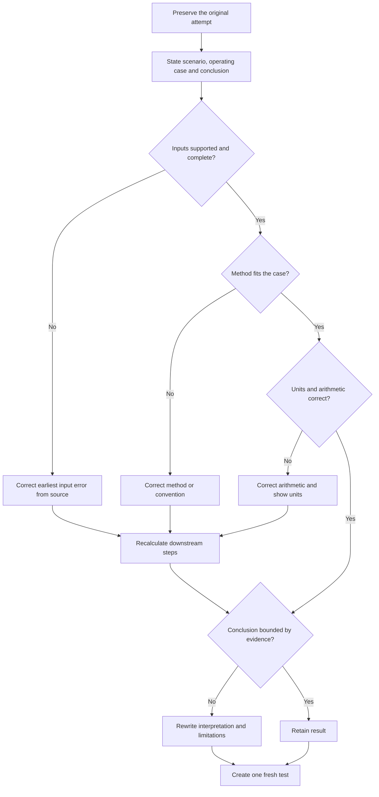
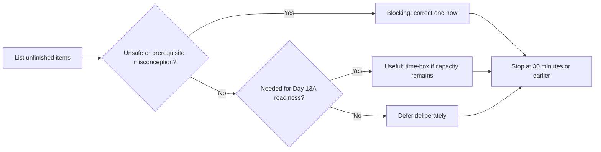

# Day 12 — Rest, Calculation Correction and Catch-Up

> **Purpose notice:** This is a planned recovery and consolidation block. It introduces no new electrical design rule, value, table or field procedure. It strengthens the reasoning used in Days 8–11 through closed-note retrieval, calculation-audit practice and one targeted correction. Any technical claim checked during this block retains the source and review status of its original module.

## Navigation

- **Previous:** [Day 11 — Voltage Drop](./day-11-voltage-drop.md)
- **Next planned block:** Day 13A — Switching, Isolation and Main Switches

## 1. Outcome and entry check

### Learning objectives

By the end of this block, the learner should be able to:

1. retrieve the design sequence connecting maximum demand, cable selection, derating and voltage drop;
2. audit a calculation by separating inputs, source-controlled data, method, arithmetic and conclusion;
3. identify the earliest reasoning error rather than merely correcting the final number;
4. correct one high-priority calculation or assumption error from Days 8–11;
5. classify unfinished work as **blocking**, **useful** or **defer**;
6. apply a maximum 30-minute catch-up limit and stop earlier when concentration is unreliable;
7. write an evidence-based readiness statement for Day 13A.

### Prerequisites

- Attempted completion of Days 8–11.
- Access to the learner's worksheets, confidence ratings and error log.
- A timer, blank paper and calculator for arithmetic checking only.
- Access to the original modules and any authorised sources previously used.

### Entry check

Before opening notes, answer **yes** or **no**:

1. Can I explain why maximum demand is not simply the connected-load total?
2. Can I state why cable selection is a chain of checks rather than a single ampacity lookup?
3. Can I explain why an adverse route segment may govern the whole cable decision?
4. Can I explain why voltage drop must include every contributing section?
5. Am I alert enough to compare calculations carefully rather than guess?

If question 5 is **no**, complete only the two-minute setup in Beat 8 and stop. Recovery is the correct action.

## 2. Why it matters

Calculation practice can create false confidence when the learner repeats arithmetic without checking the decision model behind it. A neat final answer may still be unsafe or indefensible because the wrong load case, route segment, correction factor, current basis, conductor data or circuit endpoint was used.

Day 12 therefore prioritises:

- **recovery**, so calculation accuracy is not degraded by fatigue;
- **retrieval**, so the learner reconstructs the workflow rather than recognises it on a page;
- **audit**, so assumptions and evidence are checked before arithmetic;
- **targeted correction**, so one important reasoning fault is repaired completely;
- **bounded catch-up**, so a rest block does not become another full technical session.


## 3. Core concepts and terminology

### Calculation audit

A **calculation audit** is a structured check of the reasoning chain that produced a result. It examines:

1. the scenario and operating case;
2. the stated and missing inputs;
3. source-controlled values and methods;
4. unit consistency;
5. arithmetic;
6. the interpretation and conclusion.

### Earliest error

The **earliest error** is the first incorrect or unsupported step in the chain. Later arithmetic may be internally correct while still producing an invalid result. Correction begins at the earliest error.

### Input error

An **input error** uses an incorrect, unsupported, incomplete or mismatched value, such as the wrong current basis, route length, phase arrangement or installation condition.

### Method error

A **method error** applies the wrong workflow, convention or formula to the operating case. A method remembered correctly can still be wrong for the scenario.

### Arithmetic error

An **arithmetic error** occurs after suitable inputs and method have been selected. It includes calculator entry, unit conversion, sign, rounding and transcription errors.

### Interpretation error

An **interpretation error** occurs when a numerical result is turned into a claim that the evidence does not support, such as treating a provisional teaching result as proof of compliance.

### Blocking work

**Blocking work** is an unresolved prerequisite, high-confidence design misconception or missing correction that would undermine the next block. It receives priority over cosmetic note improvement or additional practice.

### Readiness statement

A **readiness statement** records what was retrieved reliably, what was corrected, what remains unresolved and whether the learner can proceed safely to the next topic.

## 4. Source-return and correction workflow

Day 12 introduces no new rule search. Use the **C-H-E-C-K** workflow whenever an answer or calculation is uncertain:

1. **C — Capture the attempt.** Preserve the original work before changing it.
2. **H — Highlight the earliest unsupported step.** Mark the first input, method, arithmetic or interpretation problem.
3. **E — Establish the governing evidence.** Return to the original module and, where required, the authorised source it identifies.
4. **C — Correct and recalculate.** Change only what the evidence supports, show units and retain a clear audit trail.
5. **K — Keep a fresh test.** Create one varied question that tests the corrected reasoning without copying the original problem.

For each correction, record:

```text
Original scenario and result:
Confidence before checking:
Earliest error category: input / method / arithmetic / interpretation
Why the step was unsupported or incorrect:
Module or authorised source checked:
Corrected reasoning:
Corrected result, if applicable:
Bounded conclusion:
Fresh retrieval test:
Next review date:
```

Do not search broadly for convenient values or copy standards tables into the worksheet. Return to the exact evidence gap identified by the audit.

## 5. Visual model and worked example

### Calculation correction decision model



### Catch-up triage model



### Fictional worked correction

**Original attempt:** A learner calculates a final voltage-drop value using only the final subcircuit. The arithmetic is correct and the learner marks the answer **certain**.

**Audit:**

1. The scenario asks for performance from the supply point to the equipment.
2. The earliest error is not arithmetic. It is an **input and path-definition error** because upstream sections were omitted.
3. Day 11 is checked to restore the complete-path model and source requirements.
4. The learner redraws the path, identifies each contributing section and leaves any unavailable conductor data explicitly unresolved.
5. The result is recalculated only after the missing sections and authorised inputs are established.
6. The conclusion is rewritten as provisional until all source-controlled data and acceptance criteria are verified.
7. A fresh question changes the equipment and route but again requires reconstruction of the complete path.

The correction repairs the model that produced the answer, not only the number written at the bottom.

## 6. Practical application

### Thirty-minute Week 2 consolidation protocol

Stop earlier when a stop condition appears.

#### Minute 0–2: capacity check

Record:

```text
Energy: low / workable / strong
Concentration: poor / workable / strong
Current stop condition: yes / no
Decision: recovery only / retrieval and limited correction
```

#### Minute 2–12: closed-note retrieval

Answer without notes and rate confidence:

1. What is the difference between connected load and maximum demand?
2. What evidence chain links design current, protective device and conductor capacity?
3. Why must a route be divided into installation-condition segments?
4. What makes one segment limiting?
5. Why is voltage-drop performance separate from thermal capacity?
6. What sections may contribute to the voltage-drop result?
7. Name four categories in a calculation audit.
8. Why must a technically neat answer remain bounded when source evidence is incomplete?

#### Minute 12–20: calculation audit

Select one previous worksheet from Days 8–11. Do not choose the longest worksheet; choose the one with the highest risk of misunderstood reasoning.

Audit in this order:

1. operating case and endpoints;
2. input source and units;
3. method and conventions;
4. arithmetic and transcription;
5. conclusion and unresolved evidence.

Mark the earliest issue. Correct only one complete chain.

#### Minute 20–28: one targeted catch-up task

Choose one:

- repair one high-confidence design misconception;
- complete one missing source trail for a previous answer;
- redraw the Day 8–11 design chain from memory;
- correct one calculation and create a varied retest;
- prepare a one-page comparison of **switching**, **isolation** and **emergency action** using headings only, without adding technical claims before Day 13A.

Do not reorganise all notes, repeat every calculation or start Day 13A technical content.

#### Minute 28–30: readiness note

```text
Strongest retained design idea:
Earliest error corrected:
Evidence used:
Unresolved blocking item:
Deferred work:
Ready for Day 13A: yes / yes with support / not yet
```


## 7. Common errors and safety checkpoint

### Common errors

**Checking arithmetic first**  
A correct calculator sequence cannot rescue unsuitable inputs or method. Start with the scenario and earliest unsupported step.

**Replacing the whole worksheet**  
Preserve the original attempt so the misconception remains visible and the correction can be audited.

**Using convenient online values**  
Values and conventions must return to the authorised source identified by the original module.

**Treating fictional teaching data as field data**  
Worked values in Days 8–11 illustrate reasoning only. They are not compliance inputs.

**Correcting several incomplete chains**  
One complete correction is more useful than four partially reviewed worksheets.

**Turning Day 12 into another technical day**  
The block consolidates prior reasoning and protects recovery. It does not begin switching or isolation theory.

**Equating confidence with validity**  
High confidence increases the urgency of checking; it does not strengthen unsupported evidence.

### Safety and study checkpoint

Stop when:

- concentration is too poor to compare assumptions, units or source evidence;
- repeated calculator entries are being made without understanding the method;
- the required authorised source is unavailable;
- the learner is tempted to invent, infer or reuse a value outside its stated context;
- a correction would require unsupervised electrical work, testing or access beyond competence and authority;
- the 30-minute total has elapsed;
- the current correction cannot be left with a clear next action.

This module authorises no electrical design approval, installation, testing or field procedure. Technical work remains governed by current authorised standards, legislation, regulator guidance, manufacturer instructions, workplace procedures, supervision and RTO requirements.

## 8. Retrieval and next links

### Final recall check

Answer without notes:

1. What is the purpose of a calculation audit?
2. Why is the earliest error more important than the final wrong number?
3. Distinguish input, method, arithmetic and interpretation errors.
4. What does each letter in **C-H-E-C-K** represent?
5. What makes unfinished work blocking?
6. What is the maximum Day 12 catch-up period?
7. Why must the original attempt be preserved?
8. What evidence supports readiness for Day 13A?

### Day 13A readiness check

Proceed when the learner can:

- reconstruct the sequence from load assessment through cable capacity, route conditions and voltage performance;
- expose assumptions and missing evidence before calculating;
- correct one previous error at the reasoning level;
- distinguish a provisional teaching conclusion from a verified compliance claim;
- begin the next block without an unresolved high-confidence misconception from Days 8–11.

A learner marked **yes with support** may proceed with the corrected worksheet and error log available. A learner marked **not yet** should schedule one specific blocking correction rather than repeating the entire week.

### Related learning

- [Day 8 — Maximum Demand](./day-08-maximum-demand.md)
- [Day 9 — Complete Cable-Selection Workflow](./day-09-complete-cable-selection-workflow.md)
- [Day 10 — Installation Conditions and Derating](./day-10-installation-conditions-and-derating.md)
- [Day 11 — Voltage Drop](./day-11-voltage-drop.md)
- [[Learning and Memory System](../../../knowledge-base/Learning%20and%20Memory%20System.md)]
- [[Wiring Rules and Design](../../../knowledge-base/Wiring%20Rules%20and%20Design.md)]

## References and currency notice

- [Learning Design](../../../LEARNING_DESIGN.md)
- [Content, Standards and Copyright Policy](../../../CONTENT_AND_COPYRIGHT.md)
- Days 8–11 and the current authorised sources identified by those modules.
- Current applicable legislation, regulator guidance, network service rules, manufacturer instructions, workplace procedures and RTO assessment directions.

This module contains original recovery, retrieval and correction activities. It reproduces no standards wording, tables, figures, official calculation factors or acceptance limits. Any exact technical claim encountered during correction remains subject to the source and technical-review status of its original module.

<!-- sequence-navigation:start -->
### Sequence navigation

- [← Previous: Day 11 — Voltage Drop](./day-11-voltage-drop.md)
- [Four-week learning plan](../MASTER_PLAN.md)
- [Next: Day 13A — Switching, Isolation and Main Switches →](./day-13a-switching-isolation-and-main-switches.md)
<!-- sequence-navigation:end -->
