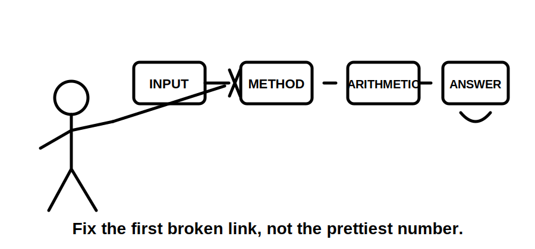
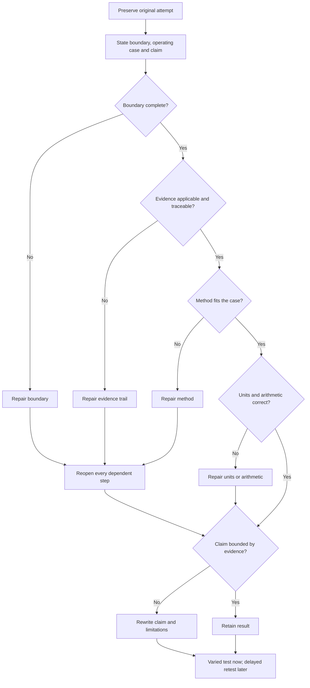
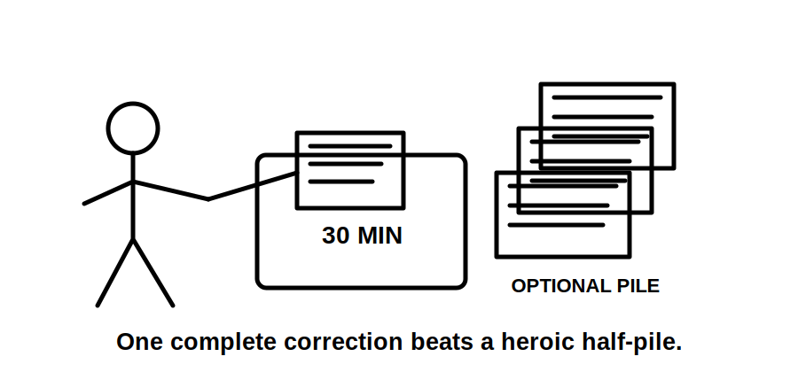

# Day 12 — Rest, Calculation Correction and Catch-Up

> **Purpose notice:** This is a deliberate recovery and consolidation block. It introduces no new electrical rule, value, table or field procedure. It revisits reasoning from Days 8–11, whose technical claims remain `review-required` and `reference_check_required`. This page grants no authority to design, approve, install, isolate, test or energise electrical work.

## Navigation

- **Previous:** [Day 11 — Voltage Drop](./day-11-voltage-drop.md)
- **Next:** [Day 13A — Switching, Isolation and Main Switches](./day-13a-switching-isolation-and-main-switches.md)

## 1. Outcome and entry check

### Observable objectives

By the end of this block, the learner can:

1. reconstruct, without notes, the dependency chain from maximum demand to cable selection, installation conditions and voltage-drop interpretation;
2. classify an error as **boundary**, **evidence**, **method**, **unit/arithmetic** or **claim** error;
3. locate the earliest unsupported step in one prior attempt;
4. repair one complete reasoning chain while preserving the original attempt and its evidence trail;
5. create and answer one varied retrieval question that tests the repaired idea;
6. triage unfinished work as **blocking**, **beneficial** or **defer**;
7. stop at 30 minutes, or earlier when a stop condition appears; and
8. produce a readiness decision supported by observable evidence.

### Entry check

Before opening notes, answer **yes**, **partly** or **no**:

1. Can I explain why connected load and maximum demand are different concepts?
2. Can I state why cable selection is a chain of dependent checks?
3. Can I explain why one adverse route segment may govern a cable decision?
4. Can I identify the full calculation boundary for voltage drop?
5. Am I alert enough to compare assumptions, units and evidence accurately?

If item 5 is **no**, complete only the two-minute recovery setup in Beat 8 and stop. Recovery is successful completion for today.

## 2. Why it matters

Repeating arithmetic can strengthen the wrong model. A polished result may still be indefensible because the learner used the wrong operating case, omitted part of the circuit boundary, selected unsupported source data, combined factors incorrectly or made a stronger claim than the evidence allows.

This block therefore prioritises:

- **recovery** before accuracy deteriorates;
- **retrieval** rather than passive rereading;
- **causal correction** rather than replacing the final number;
- **confidence calibration** so certainty is compared with evidence quality;
- **bounded catch-up** so a rest block does not become another full technical session; and
- **spaced rechecking** so the correction is tested again after a delay.



## 3. Core concepts and terminology

### Calculation audit

A **calculation audit** is a structured review of the scenario, boundary, inputs, evidence, method, units, arithmetic and conclusion that produced a result.

### Earliest error

The **earliest error** is the first incorrect, incomplete or unsupported step. Every dependent step after it must be reopened, even when its arithmetic is internally correct.

### Error categories

- **Boundary error:** the wrong source, load, operating state, route section or endpoint was included or omitted.
- **Evidence error:** an input, factor, method or criterion lacks an applicable authorised source.
- **Method error:** the selected workflow, convention or relationship does not fit the stated case.
- **Unit/arithmetic error:** units, conversion, calculator entry, transcription or rounding are wrong after the earlier reasoning is sound.
- **Claim error:** the conclusion exceeds the evidence, such as calling a fictional or provisional result compliant.

### Confidence calibration

**Confidence calibration** compares how certain the learner felt before checking with the quality of the evidence found afterward. A high-confidence error becomes a priority misconception because it is less likely to self-correct.

### Blocking, beneficial and defer

- **Blocking:** an unresolved misconception or missing prerequisite that would undermine the next block.
- **Beneficial:** useful consolidation that may be completed only if time and concentration remain.
- **Defer:** work that can be deliberately scheduled later without weakening next-block readiness.

### Readiness evidence

A **readiness statement** identifies what was retrieved, what was repaired, what remains unresolved and why proceeding is or is not justified. Feeling ready is not evidence by itself.

## 4. Rule-finding workflow

Day 12 adds no new technical rule search. Use **R-E-P-A-I-R** to return only to the exact evidence gap exposed by the audit:

1. **R — Retain the original attempt.** Do not erase the evidence of the misconception.
2. **E — Establish the boundary and operating case.** State source, endpoint, route, load state and intended conclusion.
3. **P — Pinpoint the earliest unsupported step.** Classify it as boundary, evidence, method, unit/arithmetic or claim.
4. **A — Access the governing evidence.** Return to the original module and its identified authorised source; do not use convenient substitute values.
5. **I — Implement the smallest complete repair.** Correct the earliest error and reopen every dependent step.
6. **R — Retest after variation and delay.** Create one changed-context question now and schedule a brief closed-note retest within 48–72 hours.

Use this audit record:

```text
Original scenario and conclusion:
Confidence before checking: low / medium / high
Boundary and operating case:
Earliest error category:
Why it was unsupported or incorrect:
Module or authorised source checked:
Dependent steps reopened:
Corrected reasoning:
Bounded conclusion:
Varied retrieval question:
Delayed retest date:
```

Do not reproduce standards tables, figures, systematic clause wording, official values or assessment material in the correction record.

## 5. Visual model or worked example

### Earliest-error and reopening model



The diagram enforces causal correction. It prevents the learner from polishing a later step while leaving an earlier unsupported assumption intact.

### Fictional worked correction

A learner calculates voltage drop for a supply-to-equipment question but includes only the final subcircuit. The calculator work is correct and confidence is high.

1. **Retain:** preserve the worksheet and confidence rating.
2. **Establish:** the requested boundary is supply point to equipment.
3. **Pinpoint:** the earliest error is a boundary error; upstream contributing sections were omitted.
4. **Access:** return to Day 11 and the authorised sources it identifies. Leave unavailable conductor data unresolved.
5. **Implement:** redraw the complete path and reopen all dependent calculations and claims.
6. **Retest:** change the route and equipment in a fresh fictional scenario, then repeat a short closed-note boundary check two days later.

The correction is successful even when no final numerical answer can be produced because missing authorised data was correctly exposed rather than invented.

## 6. Practical application

### Thirty-minute consolidation protocol

#### Minute 0–2 — capacity and stop check

Record energy, concentration and whether recovery-only completion is required.

#### Minute 2–10 — closed-note retrieval

Draw the Week 2 dependency chain and answer:

1. Where does maximum-demand reasoning feed into cable selection?
2. Why can installation conditions change a previously plausible conductor choice?
3. Why is voltage-drop performance separate from current-carrying capacity?
4. What changes must reopen downstream design checks?
5. Which claim grades from Days 8–11 distinguish explanation from verified acceptance?

Mark each response **secure**, **partial** or **missing** before opening notes.

#### Minute 10–22 — one complete R-E-P-A-I-R cycle

Choose the highest-consequence or highest-confidence error from Days 8–11. Complete one repair record. Do not select several worksheets.

#### Minute 22–27 — varied application

Change one material scenario feature, such as operating case, route segment, circuit boundary or source availability. Predict which steps must reopen before solving anything.

#### Minute 27–30 — readiness and spacing

Write:

```text
Secure retrieval:
Partial or missing retrieval:
Earliest error repaired:
Evidence used:
Blocking item remaining:
Deferred item:
Delayed retest date:
Ready for Day 13A: yes / yes with support / not yet
Reason:
```



### Performance rubric — 12 points

Score each category 0, 1 or 2:

| Category | 0 | 1 | 2 |
|---|---|---|---|
| Retrieval | dependency chain missing | partly reconstructed | complete and ordered |
| Error diagnosis | final symptom only | category identified | earliest causal error justified |
| Evidence control | unsupported substitute used | source named but applicability unclear | applicable evidence traced or gap declared |
| Reopening logic | dependent steps left closed | some dependencies reopened | all affected steps reopened |
| Transfer | repeated original question | changed detail with prompts | varied case solved independently |
| Recovery discipline | limits ignored | stopped with prompting | respected time and fatigue limits |

**Readiness guide:** 10–12 and no critical error = ready; 7–9 = ready with targeted support; 0–6 = repair one blocking misconception before progressing.

**Critical errors override the score:** inventing technical values, treating fictional data as field evidence, concealing missing evidence, making an unverified compliance claim, or continuing when fatigue makes comparison unreliable.

## 7. Common errors and safety checkpoint

### Common errors

- **Checking arithmetic first:** begin with boundary and evidence.
- **Replacing the worksheet:** preserve the original attempt so the causal error remains visible.
- **Correcting several chains:** complete one repair rather than starting many.
- **Using convenient online values:** return to the source identified by the original module.
- **Treating confidence as validity:** confidence determines checking priority, not truth.
- **Turning recovery into another technical day:** stop at the time limit and introduce no Day 13A theory.
- **Passing because the score is high:** critical errors and unresolved blockers override totals.

### Stop conditions

Stop immediately when:

- concentration is too poor to compare assumptions, evidence or units;
- repeated calculator entries replace reasoning;
- an authorised source needed for correction is unavailable;
- a value or requirement would have to be guessed;
- the task would require unsupervised electrical work, testing or access beyond competence and authority;
- the 30-minute limit has elapsed; or
- the correction cannot be left with a clear, bounded next action.

This educational block is not a field procedure and does not certify competence or technical compliance.

## 8. Retrieval and next links

### Exit retrieval

Without notes:

1. State the six R-E-P-A-I-R steps.
2. Distinguish boundary, evidence, method, unit/arithmetic and claim errors.
3. Explain why the earliest error forces later steps to reopen.
4. State the three catch-up categories.
5. Name the critical errors that override the rubric score.
6. Explain why a missing final number can still represent a successful correction.
7. State the maximum session duration and two earlier stop conditions.
8. Give the date of the delayed retest.

### Next-block readiness

Proceed to Day 13A when the learner can reconstruct the Week 2 chain, expose assumptions before calculation, repair one causal error, bound the conclusion and identify no unresolved high-confidence misconception that blocks new learning.

A learner marked **yes with support** may proceed with the corrected worksheet and error log available. A learner marked **not yet** schedules one specific repair rather than repeating all of Week 2.

### Related learning

- [Day 8 — Maximum Demand](./day-08-maximum-demand.md)
- [Day 9 — Complete Cable-Selection Workflow](./day-09-complete-cable-selection-workflow.md)
- [Day 10 — Installation Conditions and Derating](./day-10-installation-conditions-and-derating.md)
- [Day 11 — Voltage Drop](./day-11-voltage-drop.md)
- [Day 13A — Switching, Isolation and Main Switches](./day-13a-switching-isolation-and-main-switches.md)
- [Learning Design](../../../LEARNING_DESIGN.md)
- [Content, Standards and Copyright Policy](../../../CONTENT_AND_COPYRIGHT.md)

## References and currency notice

This module contains original recovery, retrieval, audit and correction activities. It reproduces no standards wording, tables, figures, official calculation factors, limits or assessment criteria. Any technical claim revisited from Days 8–11 inherits that module's source, currency and technical-review status and must be checked against current authorised material before practical use.

<!-- sequence-navigation:start -->
### Sequence navigation

- [← Previous: Day 11 — Voltage Drop](./day-11-voltage-drop.md)
- [Four-week learning plan](../MASTER_PLAN.md)
- [Next: Day 13A — Switching, Isolation and Main Switches →](./day-13a-switching-isolation-and-main-switches.md)
<!-- sequence-navigation:end -->